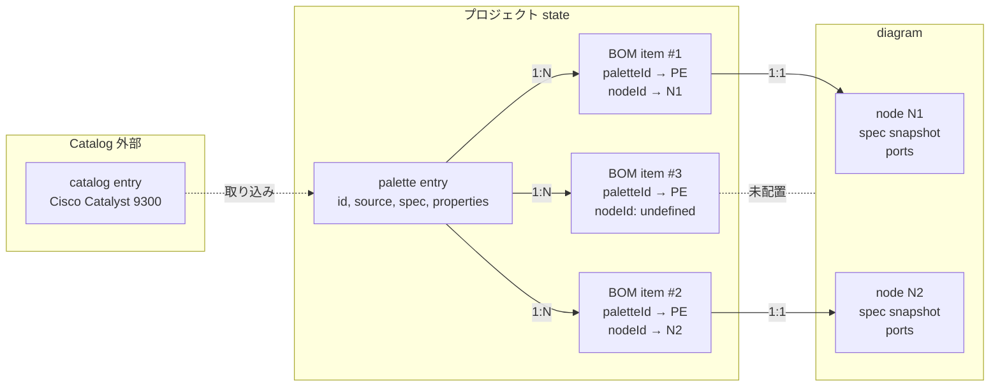
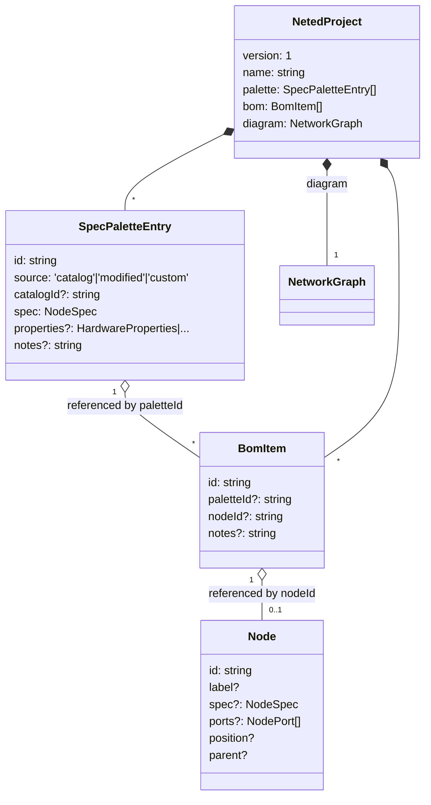

## BOM モデル

「カタログから取ってきた製品定義」「プロジェクトで実際に使う台数」「ダイヤグラム上のノード」を **三角形の関係** で扱う仕組み。Figma のコンポーネント / インスタンスのアナロジーで考えると分かりやすい。

メンタルモデルは「**Palette**」「**BOM**」「**ノード**」の三つで成り立ちます。

- **Palette（Spec Palette）** — このプロジェクトで使える製品の **定義** リスト。Cisco Catalyst 9300、Aruba 6300M、… のような **モデル単位**。Figma で言うところの "コンポーネント"。
- **BOM** — Palette のエントリを「N 台使う」という **インスタンス** 行。Catalyst 9300 ×3、6300M ×1、…。**台数管理の master**（Bill of Materials）。
- **ノード** — ダイヤグラム上の図形。`NetworkGraph.nodes` の各エントリ。位置・接続・ラベルを持つ。

三者の関係は次のような **対応**：

- Palette 1 つ ↔ BOM 複数（1 製品が何台あってもよい）
- BOM 1 つ ↔ ノード **0 or 1**（未配置 BOM は `nodeId: undefined`、配置済みは ID 参照）
- ノード ↔ Palette は BOM **経由のみ**（直接参照は持たない）

この三角形の中で「ノードを作ってから Palette に紐付ける」「Palette から先に台数登録して後でダイヤグラムに置く」「ダイヤグラム上のノードと Palette を後から bind し直す」のどの導線でも整合するように、BOM が **間の anchor** として機能している。

## 関係図



- `B3` のような **未配置 BOM** は「数量だけ計上したいが配置はまだ」のために存在する。`placeNodeForBom(bomId)` でダイヤグラム右端に node を作って bind する。
- `N1` / `N2` の `spec` は Palette からの **コピー（snapshot）**。Palette を編集すると bind 済みノードに **propagation** で反映される（後述）。

## UI 導線

入口は 3 ページに分かれているが、最終的に三角形のどれかが繋がる。

```mermaid
flowchart LR
  subgraph S[Specs ページ]
    SP[Palette CRUD<br/>カタログ取り込み<br/>カスタム追加]
  end
  subgraph BO[BOM ページ]
    BL["BOM 行 list<br/>qty 増減 = 行追加/削除"]
    BP["未配置 BOM の<br/>"配置" ボタン"]
  end
  subgraph DG[Diagram]
    DN[ノード詳細パネル]
    DC["canvas 上で<br/>node delete"]
  end

  SP --> BL
  BP -- placeNodeForBom --> DG
  DN -- bindNodeToPalette --> S
  DC -- removeNodeBomItems --> BL
```

- **Specs ページ** — Palette のみ管理。catalog から取り込んで Palette に追加、または custom で手書き。
- **BOM ページ** — 各 Palette エントリに対して BOM 行を増減（= 台数）。未配置の行に「配置」ボタンで diagram にノードを生成。
- **Diagram** — 既存のノードに対して詳細パネルで Palette を当てる（`bindNodeToPalette`）。ノード削除時は `removeNodeBomItems` で対応 BOM 行も削除（`removeBomItem` 経由ではなく diagram → BOM 方向の連動）。

## データモデル



- **`paletteId` / `nodeId` は両方 optional**。これが「未確定状態を一級市民として扱う」設計の核。
  - `paletteId == null && nodeId != null` — ダイヤグラムだけある（未 bind ノード）
  - `paletteId != null && nodeId == null` — 数量だけある未配置 BOM
  - 両方 set — 通常の bind 済み状態
- **Node は Palette を直接参照しない**。`spec` は値の snapshot。これで diagram-only の YAML 入力も成立し、Palette が無くてもノードは描ける。

### NetedProject ファイル

`.neted.json` がプロジェクトの保存単位で、3 つを束ねる：

```json
{
  "version": 1,
  "name": "campus-net",
  "palette": [...],
  "bom": [...],
  "diagram": { "nodes": [...], "links": [...], "subgraphs": [...] }
}
```

- 「Import Project」は 3 つ全部を上書き。
- 「Import Diagram」は `diagram` のみ上書き、palette / bom は据え置き（カタログ管理を壊さないため）。

## 伝播ルール

Palette → Node、Node → BOM、BOM → Node の各方向で起きることを揃えておく。

| 操作 | 伝播 | 理由 |
| --- | --- | --- |
| `addToPalette(entry)` | なし | Palette 追加だけ。bind は別アクション |
| `updatePaletteEntry(id, { spec })` | bind 済み全 Node の `spec` を上書き、ports も再生成 | Figma 的 — コンポーネント編集 = 全インスタンス更新 |
| `updatePaletteEntry(id, { properties / catalogId })` | bind 済み全 Node の ports を再生成 | catalog からの port 派生が変わるため |
| `removeFromPalette(id)` | bind 済み Node の `spec` から **製品詳細だけ剥がし**、role（kind/type）は残す。BOM 行は削除 | Palette が消えても "switch（hardware/network）" のような **役割** は失わない |
| `addBomItem(item)` | なし | 台数増加だけ |
| `removeBomItem(id)` | `nodeId` があればダイヤグラムから node + 関連 port + link を削除 | BOM が真の master。BOM 行を消す = 物理機材を撤去するのと同じ意味 |
| `bindNodeToBom(bomId, nodeId)` | Node.spec を Palette から再 snapshot、ports を再生成 | bind 確立時に一度同期させる |
| `unbindNodes([nodeId])` | Node.spec の製品詳細を剥ぐ（role は残す）、ports クリア | Palette 切り離しは "role だけ残った状態" に戻す |
| `bindNodeToPalette(nodeId, paletteId)` | 既存 BOM 行があれば `paletteId` 差し替え、なければ未配置 BOM を流用、それも無ければ新規 BOM 作成 | 「すでに bind されてる → 再 bind」「未配置在庫があれば消費」「無ければ新規」の 3 パターン |
| `placeNodeForBom(bomId)` | 新 Node 作成（`computeNodeSize` + `resolvePosition` で右端に配置）、Palette spec / ports を当てる、BomItem.nodeId を埋める | 未配置 BOM 行 → ダイヤグラム配置の片方向 |
| ダイヤグラムで node 削除 | `removeNodeBomItems([nodeId])` で対応 BOM 行を **削除** | 機材の撤去と整合 |

「**unbind と remove の違い**」が要点：

- **unbindNodes** — Node は残る、BOM 行も残る（`nodeId` を null に）、両者の関係だけ切れる。Palette だけ間違えてた、もう一度別の Palette を当てたい、というケース。
- **removeBomItem** — BOM 行を削除し、bind 済みなら **Node も削除する**。台数管理上「無くなった」を意味するので、ダイヤグラム上にも残してはいけない。
- **removeNodeBomItems** — Node が削除されたとき、対応 BOM 行を削除する逆向き。BOM 行を残してしまうと「このノードは無いのに BOM では計上されている」というドリフトが発生する。

### 「製品詳細」と「役割」の分離

`stripProductFromSpec(spec)` は次のように **role だけ残す**：

```ts
hardware: { kind, type }                    // vendor / model / series 等を捨てる
compute:  { kind, type }                    // platform 等を捨てる
service:  { kind, service }                 // resource / vendor 等を捨てる
```

これがあるおかげで：

- Palette 削除しても「これは switch だ」「これは server だ」という **拓扑的に意味のある情報**は失われない。レイアウトもそのまま動く。
- 接続バリデーション（`validateLinkCompatibility`）は port.cage を見るので、ports が落ちている間は静かに pass する。

## PoE 予算

PoE 予算解析は **Catalog の properties.power** だけを参照し、ノード instance（`Node.ports[].poe`）には capability flag のみ持たせる。

```mermaid
flowchart LR
  N[Node] --> NP[Node.ports[].poe<br/>boolean のみ]
  N -. paletteId 経由 .-> PA[palette entry]
  PA --> CA[catalog entry]
  CA --> PR[PowerProperties<br/>poe_in / poe_out]
  PR --> A[poe-analysis.ts<br/>computePortPower<br/>budget 集計]
```

- ノードに duplicate して持たない理由は「Palette を差し替えるたびに class / 電力値も更新したい」「per-instance に持つと catalog 更新で取り残される」の 2 点。
- `poe-analysis.ts` の `computePortPower` は **PSE と PD の min(class)** で実効クラスを決め、`reserved_w` を予算に積み上げる。`draw_w` は max-class の参考値で予算には使わない。
- BOM 経由で Palette → catalog を辿るので、未 bind ノードや未割当 BOM があれば PoE 解析からは黙って除外される。

## 設計のステータス

主要な双方向同期は landed。残るのは UX レベルの隙間と、未配置 BOM の発見性。

| 項目 | 状態 | issue / PR |
| --- | --- | --- |
| Palette / BOM / Node の三角形 | ✅ | #b9164c6（BomItem 導入）|
| Palette spec → Node spec 伝播 | ✅ | `updatePaletteEntry` |
| Palette ports → Node ports 伝播 | ✅ | `setNodePortsFromPalette` |
| Node 削除 ↔ BOM 行削除の双方向 | ✅ | #435583f |
| Palette 削除時に role だけ残す | ✅ | `stripProductFromSpec` |
| 未配置 BOM の「配置」ボタン | ✅ | `placeNodeForBom` |
| `bindNodeToPalette` の 3 パターン分岐 | ✅ | 既存再 bind / 未配置流用 / 新規 |
| .neted.json で 3 つを束ねて save/load | ✅ | #d1a80f0 |
| Diagram-only Import（palette / bom 据え置き）| ✅ | `importDiagram` |
| BOM 行の qty カラム（行を 1 個にして N 持つ） | ❌ | 現状は 1 行 = 1 台。台数 3 のものは 3 行に展開される |
| Palette 編集の undo / redo | ❌ | 履歴系全般が未実装 |
| `properties` per-instance override | ❌ | BomItem.notes だけはある。spec / properties レベルの override は未対応 |
| 未配置 BOM の visual 表示（diagram 側に "未配置" pill） | ❌ | 現状は BOM ページ内のみ |

「BOM 行 = 1 台」の決定は、後で qty 列を入れたくなったら `BomItem.quantity?: number` を足して `placeNodeForBom` で複数 nodeId を生やす、という拡張の余地はある。現状は「物理機材 1 台 1 行」の方が直感的なので据え置き。

## 実装履歴（PR ベース）

- **#9a279f1** — Spec Palette / BOM / Connections の 3 ページを並列追加（初期形）。
- **#b9164c6** — `BomItem` モデル導入。それまで Palette → Node 直結だったところに「device instance」中間層を挟む。
- **#13d9239** — Spec 詳細ページ、サンプル palette 充実。
- **#9568643** — `/project/[id]/` ベースのルーティングへ移行。3 ページが project スコープに入る。
- **#d1a80f0** — `.neted.json` 形式を確定。`NetedProject = { palette, bom, diagram }`。
- **#435583f** — Diagram ↔ BOM の双方向同期。`removeNodeBomItems` / `removeBomItem` の対称化、`bindNodeToBom` 経由の spec propagation。
- **#3a1240f** — diagram state を 1 オブジェクトに統合（`diagram.nodes` / `diagram.subgraphs` / `diagram.ports` / `diagram.links` / `diagram.bounds`）。
- **#45975f7** — save 形式を `NetworkGraph` 直書きに整理し、palette / bom と並列なフィールドにする（DiagramJson の中間ラッパを廃止）。
- **#17d6ab5** — ID 生成を `newId()` factory に集約。Palette / BOM / Node / Port の id 生成入口を一本化。
- **#148** — Import を 2 形式に分割：「Import Project」（`.neted.json`、palette/bom/diagram 全部上書き）と「Import Diagram」（`NetworkGraph` のみ上書き、palette/bom 据え置き）。

## コード上の場所

- `apps/editor/src/lib/types.ts` — `SpecPaletteEntry` / `BomItem` / `NetedProject` / `NETED_FILE_EXTENSION`、`paletteEntryLabel` / `specIdentifier` ヘルパ。
- `apps/editor/src/lib/context.svelte.ts` — runtime state の本体。
  - Palette: `palette` / `addToPalette` / `removeFromPalette` / `updatePaletteEntry`
  - BOM: `bomItems` / `addBomItem` / `removeBomItem` / `updateBomItem` / `bindNodeToBom` / `getBomItemsForPalette` / `getPaletteIdForNode` / `getNodesForPalette` / `unbindNodes` / `removeNodeBomItems` / `bindNodeToPalette` / `placeNodeForBom`
  - 伝播ヘルパ: `setNodeSpecs` / `setNodePortsFromPalette` / `nodePortsFromPaletteEntry` / `stripProductFromSpec`
  - reconcile: `sanitizePaletteAndBom`（import 時の orphan 排除）
  - I/O: `exportProject` / `importProject` / `importDiagram` / `applyYaml` / `loadProject`
- `apps/editor/src/lib/poe-analysis.ts` — `computePortPower` / `PoEBudget`、catalog 経由で PoE 予算解析。
- `apps/editor/src/routes/project/[id]/(content)/specs/+page.svelte` — Palette ページ。
- `apps/editor/src/routes/project/[id]/(content)/specs/[specId]/+page.svelte` — Spec 詳細。
- `apps/editor/src/routes/project/[id]/(content)/bom/+page.svelte` — BOM ページ。
- `apps/editor/src/routes/+page.svelte` — Project 一覧、`.neted.json` Import / Diagram Import の 2 タブ。
