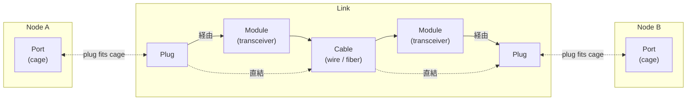
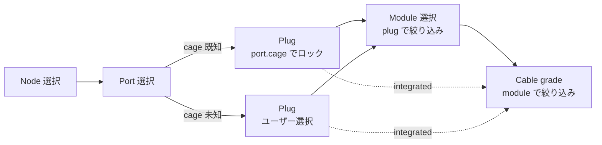
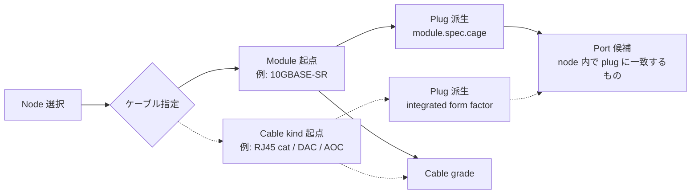
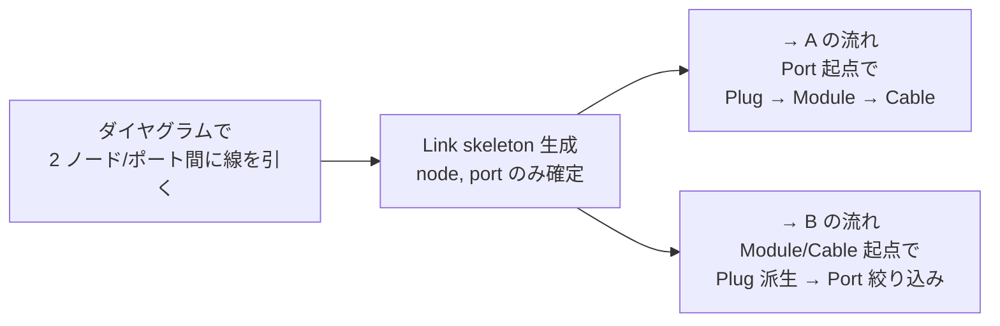
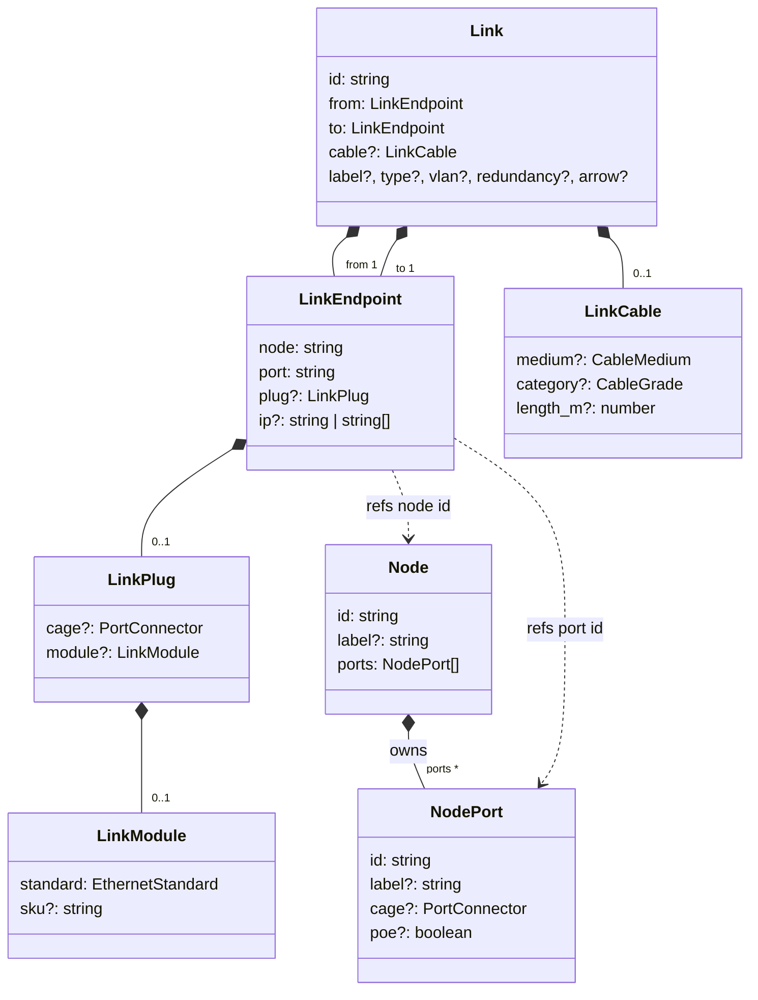

# 接続モデル

ネットワークリンクをどう表現しているか — 物理ハードウェア、ユーザがそれを編集する導線、そしてその下のデータモデルまでを、上から順に記述します。

メンタルモデルは「ノード側」「リンク側」とその**接続点**の三つで成り立ちます。

- **ノード側** — Device に Port が生えていて、Port は `cage`（物理レセプタクル: RJ45 / SFP+ / QSFP28 …）を持つ。カタログから提供されている場合もあれば、ない場合もある。
- **リンク側** — Cable が一本あり、両端それぞれに **Plug** と、構成によっては **Module**（トランシーバ）が付く。ケーブル単位の属性（grade / 長さ / 端コネクタ）は per-link。
- **接続点** — 端点の Plug と Port の cage は機械的に同じ form factor。これが噛み合っていることが物理的に成立する条件。

UI ロジック（カスケード絞り込み、cage ロック、バリデーション）はこの構造の**上**に乗っていて、データモデル自体は導線に依存しない。

## 関係図（ざっくり）

横並びで `Node A | Link | Node B`。両端の Node が Port を持ち、Link の中央に物理チェーン。Plug が Port の cage に噛み合うことで Link と Node が物理的に繋がる。



- Link 内は両端で**二経路**ある：
  - **経由（実線）**: Plug → Module → Cable。SFP / SFP+ / SFP28 / QSFP+ / QSFP28 などの **pluggable** な構成。
  - **直結（点線）**: Plug → Cable。RJ45 銅線直結や DAC / AOC のように **integrated** な構成（Module 無し）。
- Link と Node が交わるのは **Plug ↔ cage** の点のみ。それ以外は id 参照の関係。

## UI 導線

接続を作る入口は複数あり、出発点ごとに違う絞り込み順を辿る。データ的に決まる項目はどの導線でも同じだが「次に何を選ぶか」が変わる。Module の optionality は関係図と同じ実線（経由）/ 点線（直結）の表記で示す。

A と B はどちらも **Node 選択から始まる**点が共通。C は canvas 起点で、Link skeleton ができた後は A か B に収束する。

### A. 接続ページ・ポート起点（Node → Port から）

機材が先に決まっているケース。Port が決まれば port.cage が Plug を pin し、Module → Cable と絞り込まれる。



### B. 接続ページ・ケーブル起点（Node → Module/Cable から）

「このノードを SFP+ 10G で繋ぎたい」のように、ノードは決まっていて使うケーブル種別が先にあるケース。Module / Cable kind から Plug を派生させ、その plug に合う Port を node 内で絞る。



### C. ダイヤグラム起点

canvas 上で線を引いて Link skeleton を作り、後から詳細パネルで埋める。発見的・スケッチ的な入力に向く。**C は単独完結ではなく、skeleton 生成後は A か B に収束する**。



### Plug の値の解決順位（共通）

1. `port.cage`（ハードウェア制約 — 他より優先される）
2. `module.standard` から推論される plug（モジュールが既に選ばれているとき）
3. ユーザーの明示的な plug 選択（上記 1, 2 のどちらも無いときだけ意味を持つ）

Plug を変更すると、既存モジュールの要求 plug が新しい plug と一致しないときは Module を自動クリアする。

## データモデル

導線図の **Plug → Module?（optional）→ Cable** という入れ子をデータでも素直に表現する。`LinkEndpoint.plug` が構造の anchor で、その中に optional な `module` が入る。Cable は Link 直下で per-link 一本。`cable.connector` のような派生可能な情報は持たず、`module.standard` から都度導出する（ヘルパ `cableConnectorForStandard`）。



実線（◆）は所有（compose）、破線（..>）は id 参照。

設計の要点：

- **Plug は明示フィールド、cage は optional**。`LinkPlug.cage` は派生可能（`port.cage` か `module.standard` の `spec.cage`）なので、明示するのは「**両方とも未設定の中間状態**」のときだけ。validator が plug.cage と port.cage / module.standard の整合をチェックする。
- **モデルは導線に対して中立**。A / B / C どの順序でも、最終的に保存されるのは同じ `Link` 構造で、フィールドが埋まる順番だけが違う。
- **Module は per-endpoint で optional**。`LinkPlug.module` が optional であることが、関係図の「経由 / 直結」二経路に対応する。
- **Endpoint は Node を所有しない**。`node` / `port` を id で参照するだけで、Link 側に Node を複製しない。
- **Cable は per-link**。両端で grade / 長さが食い違うことは物理的に無いため、片端に偏らせず Link 直下に置く。
- **`cable.medium` を field 化**。category 未確定でも「fiber 配線である」みたいな段階的入力ができる。`mediumFromGrade()` で category と整合チェック。
- **`cable.connector` は持たない**。LC / MPO / RJ45 plug 等の端コネクタは `module.standard` の `spec.cableConnector` から派生。表示時は `cableConnectorForStandard()` ヘルパで取得。
- **`cable.category` は型強化**。`CableGrade` ユニオン（`'cat5e' | 'cat6' | 'cat6a' | 'cat7' | 'cat8' | 'om3' | 'om4' | 'om5' | 'os1' | 'os2' | 'dac' | 'aoc'`）で、壊れた値の侵入を型で防ぐ。parser 側も `normalizeCableGrade` で外部入力を境界で正規化。
- **`port.poe` は capability flag のみ**。boolean のまま。PoE の詳細（クラス・PSE/PD ロール・電力量・予算）は **catalog の `PowerProperties.poe_in` / `poe_out`** に既にあり、port instance に重複して持たない（poe-analysis.ts 参照）。

### フィールド対応

| 物理レイヤ          | モデル位置                              | 型                     | 例               |
| ------------------- | --------------------------------------- | ---------------------- | ---------------- |
| Port レセプタクル   | `Node.ports[].cage`                     | `PortConnector`        | `sfp+`、`rj45`   |
| Port PoE 対応      | `Node.ports[].poe`                      | `boolean`              | `true`           |
| PoE 詳細（class 等）| catalog `PowerProperties.poe_in/out`    | `PoEIn` / `PoEOut`     | （catalog 側）   |
| Endpoint プラグ cage | `Link.from/to.plug.cage` (optional)    | `PortConnector`        | `sfp+`（中間状態のみ）|
| Endpoint モジュール | `Link.from/to.plug.module.standard`     | `EthernetStandard`     | `10GBASE-SR`     |
| モジュール SKU      | `Link.from/to.plug.module.sku`          | `string`               | `FTLX8571D3BCL`  |
| ケーブル媒体 kind   | `Link.cable.medium`                     | `CableMedium`          | `fiber-mm`、`twisted-pair`|
| ケーブル媒体 grade  | `Link.cable.category`                   | `CableGrade`           | `om4`、`cat6a`   |
| ケーブル長          | `Link.cable.length_m`                   | `number`               | `30`             |
| ケーブル端コネクタ  | （派生）`cableConnectorForStandard(std)`| `CableConnector`       | `LC`、`MPO`      |

## UI 設計

導線を支える UI 要素・配置・バリデーション・実装状況。

### 画面別の配置

| 画面                                            | Plug + Module               | Cable grade   | 長さ          | Cable connector  |
| ----------------------------------------------- | --------------------------- | ------------- | ------------- | ---------------- |
| `LinkProperties.svelte`（詳細パネル）           | per-endpoint セクション     | per-link 行   | per-link 行   | （派生表示のみ） |
| `connections/+page.svelte` テーブル             | per-endpoint セル内縦並び   | Cable 列      | Length 列     | （なし）         |
| `connections/+page.svelte` 追加フォーム         | per-endpoint ピッカー       | Cable 列      | —             | —                |

### 共有コンポーネント

- `EndpointModulePicker.svelte` — Plug + Module の二段 select。port.cage の有無で Plug select の disabled / enabled を切り替える。上記 3 画面すべてが利用する。

### 導線の実装状況

| 導線                          | 実装                                                                | 備考                                              |
| ----------------------------- | ------------------------------------------------------------------- | ------------------------------------------------- |
| **A. ポート起点**             | ✅ 実装済み — 接続ページ追加フォーム / テーブル / 詳細パネル        | メイン導線                                        |
| **B. ケーブル起点**           | ❌ 未実装                                                            | 起点を切り替える UI（Module や Cable kind 先選択）が無い |
| **C. ダイヤグラム起点**       | ⚠️ 部分的 — canvas で線を引くと skeleton 生成。詳細パネルでは A の流れに収束 | B 経由の収束はまだ無い                              |

### バリデーション

`validateLinkCompatibility`（`port-compatibility.ts`）は VS Code の Diagnostics 風に診断レコード `ValidationIssue[]` を返す。各 issue は **rule id**（`code`）、**重大度**（`severity`）、**メッセージ**、そして **target**（どのフィールドに紐づくか）を持つ。UI 側は `issuesForTarget(issues, target)` で当該フィールド近傍に inline マーカーを出せる。

#### Issue 構造

```ts
type IssueSeverity = 'error' | 'warning' | 'info'

type IssueTarget =
  | { kind: 'endpoint'; side: 'source' | 'target'; field: 'port' | 'plug.cage' | 'plug.module' | 'ip' }
  | { kind: 'cable'; field: 'medium' | 'category' | 'length_m' }
  | { kind: 'port'; side: 'source' | 'target'; field: 'cage' | 'poe' }
  | { kind: 'link' }

interface ValidationIssue {
  code: string
  severity: IssueSeverity
  message: string
  target: IssueTarget
}
```

#### 実装：チェック関数 + レジストリ

各チェックは小さな純粋関数（`(ctx) => ValidationIssue | undefined`）で、`ENDPOINT_CHECKS` / `LINK_CHECKS` の二つのレジストリに登録される。`validateLinkCompatibility` 本体は両端をループしてレジストリのチェックを順に走らせるだけ。新しいチェック追加 = 関数を書いて配列に append、本体は触らない。

#### 登録済みチェック

| code                              | scope     | target                                | 重大度  |
| --------------------------------- | --------- | ------------------------------------- | ------- |
| `plug-cage-module-mismatch`       | endpoint  | `endpoint.plug.cage`                  | error   |
| `plug-cage-port-mismatch`         | endpoint  | `endpoint.plug.cage`                  | error   |
| `port-cage-cannot-host-module`    | endpoint  | `endpoint.plug.module`                | error   |
| `poe-flag-on-non-rj45`            | endpoint  | `port.poe`                            | error   |
| `cable-medium-category-mismatch`  | link      | `cable.medium`                        | error   |
| `endpoints-standards-asymmetric`  | link      | `link`                                | warning |
| `cable-length-exceeds-reach`      | link      | `cable.length_m`                      | warning |

非対称 standard（`endpoints-standards-asymmetric`）は警告するだけで許容する — BiDi ペア（例: `10GBASE-BX10-D` ↔ `10GBASE-BX10-U`）やメディアコンバータリンクで意図的に発生するため。

## 設計のステータス

主要な構造的問題は解消済み。以下は**残る subjective な点**で、好み次第。

1. **`Link` 内で物理 / プレゼンテーションが flat に混在**  
   `from / to / cable` が物理、`type / arrow / style / label / redundancy / vlan` が表示・論理。  
   分離派なら `Link.physical` / `Link.presentation` への入れ子化。  
   現状は **flat の方が ergonomic**（`link.type` で素直に参照できる）で実用最適。

2. **`Link.rateBps` が runtime 値だけ Link 直下にある**  
   診断・モニタリング系の値で、本来は別スコープ。気になるなら `Link.metrics?: { rateBps }` にラップ。  
   単独 1 フィールドなのでオーバーエンジニアリング感が出るため**現状維持**。

3. **`from` / `to` 命名 vs `ends: [LinkEnd, LinkEnd]` 配列**  
   対称性を素直に書きたいなら配列、書き味で勝つのは `from` / `to`。Arrow 等の方向性付き機能とも噛み合う。  
   **据え置き正解**。

これらは「もっと厳格にネストするか ergonomics を取るか」レベルの好みで、構造的・正規化的な不備は無い。

## コード上の場所

- `libs/@shumoku/core/src/models/types.ts` — `NodePort` / `Link` / `LinkEndpoint` / `LinkModule` / `LinkCable` / `PortConnector` / `EthernetStandard`。
- `libs/@shumoku/core/src/models/standards.ts` — `STANDARD_SPECS` レジストリ（standard の真実の源）、`cableVariantsForPlug`、`cableGradesForStandard`、`plugProfilesForCages`、`plugProfileForStandard`。
- `libs/@shumoku/core/src/models/port-compatibility.ts` — `validateLinkCompatibility`、`defaultStandardForCages`。
- `apps/editor/src/lib/components/EndpointModulePicker.svelte` — 共通の二段 select ピッカー。
- `apps/editor/src/lib/components/detail/LinkProperties.svelte` — ピッカーを使う詳細パネル。
- `apps/editor/src/routes/project/[id]/(content)/connections/+page.svelte` — 接続テーブルと追加フォーム。
