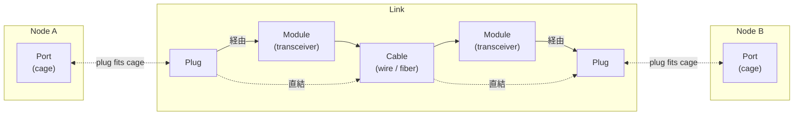
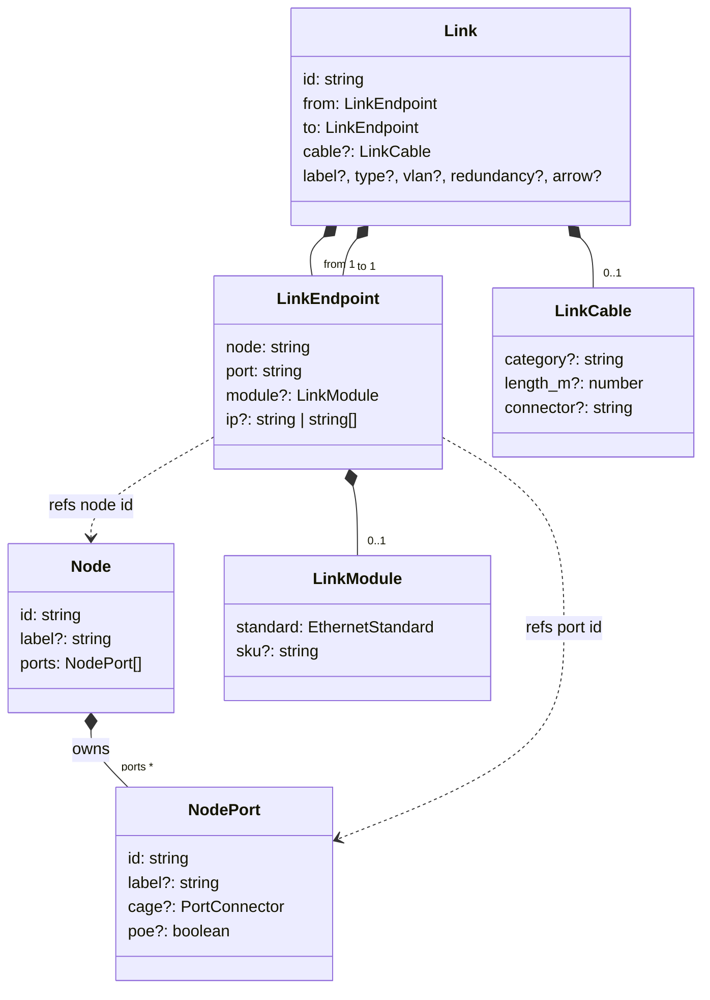
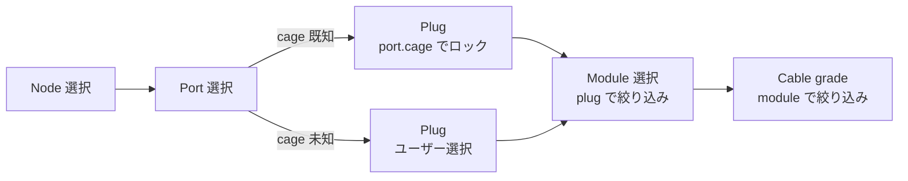

# 接続モデル

ネットワークリンクをどう表現しているか — 物理ハードウェアからエディタに保存するフィールド、そしてそれらをつなぐカスケード UI までを記述します。

メンタルモデルは「ノード側」「リンク側」と、その**接続点**の三つで成り立っています。

- **ノード側** — Device には Port が生えていて、Port は `cage`（物理レセプタクル: RJ45 / SFP+ / QSFP28…）を持つ。カタログから提供されている場合もあれば、ない場合もある。
- **リンク側** — Cable が一本あり、両端に Endpoint。各 Endpoint は **Plug**（ケーブル側 form factor）と **Module**（IEEE standard / トランシーバ）を保持する。ケーブル単位の属性（grade / 長さ / 端コネクタ）は per-link に置く。
- **接続点** — Endpoint の Plug と Port の cage は機械的に同じ form factor。これが噛み合っていることが物理的に成立する条件。

UI ロジック（カスケード絞り込み、cage ロック、バリデーション）は**この構造の中**ではなく、**この構造の上**に乗っています。

## 関係図（ざっくり）

横並びで `Node A | Link | Node B`。両端の Node はそれぞれ Port を持ち、Link の中央には両端の **Plug → Module?（あれば）→ Cable → Module? → Plug** という物理チェーン。Plug が Port の cage に噛み合うことで Link と Node が物理的に繋がる。

- 両端の Node は Port を所有して閉じる（Link 側からは id 参照のみ）。
- Link 内は両端で**二経路**ある：
  - **経由（実線）**: Plug → Module → Cable。SFP / SFP+ / SFP28 / QSFP+ / QSFP28 などの **pluggable** な構成。
  - **直結（点線）**: Plug → Cable。RJ45 銅線直結や DAC / AOC のように **integrated** な構成（モジュールが介在しない）。
- Link と Node が交わるのは **Plug ↔ cage** の点のみ。データ上は `LinkEndpoint` がこの「片端ぶんの Plug + Module + node/port id 参照」を一つにまとめた容器（プログラム上の都合の名前で、物理実体ではない）。

## データモデル

実装上のフィールドと composition / id 参照を含めた詳細。

実線（◆）は所有（compose）、破線（..>）は id 参照。

要点：

- **Plug は独立フィールドではない**。`LinkModule` が決まれば `STANDARD_SPECS[std].cage` で逆引き、未決なら `port.cage` を借りる。関係図では構造的に `Plug` ノードを置いているが、データ上は `LinkEndpoint` と `LinkModule` の間に入る派生概念。
- **Module は per-endpoint で optional**。RJ45 直結のような integrated 形態では持たない。BiDi ペアやメディアコンバータで両端の standard が非対称になり得るので各端独立。
- **Cable は per-link**。grade / 長さ / 端コネクタは「ケーブル全体」の属性で、どちらかの端に偏らせない。
- **Endpoint は Node を所有しない**。`node` / `port` を id で参照するだけ。

### フィールド対応

| 物理レイヤ          | モデル位置                       | 型                     | 例               |
| ------------------- | -------------------------------- | ---------------------- | ---------------- |
| Port レセプタクル   | `Node.ports[].cage`              | `PortConnector`        | `sfp+`、`rj45`   |
| Endpoint モジュール | `Link.from/to.module.standard`   | `EthernetStandard`     | `10GBASE-SR`     |
| モジュール SKU      | `Link.from/to.module.sku`        | `string`               | `FTLX8571D3BCL`  |
| ケーブル媒体 grade  | `Link.cable.category`            | `string`               | `om4`、`cat6a`   |
| ケーブル長          | `Link.cable.length_m`            | `number`               | `30`             |
| ケーブル端コネクタ  | `Link.cable.connector`           | `string`（freeform）   | `LC`、`MPO`      |
| Plug form factor    | `module.standard` から派生       | （フィールドなし）     | `sfp+`           |

## UI カスケード

Plug select は Port と Module の間に置く。port にカタログ由来の cage が乗っているときは Plug select を disabled にしてその値で固定する（ハードウェアが決めるため）。port に cage 情報がないときは Plug select がユーザーの最初の明示的な選択になり、Module 一覧を絞る。

Plug の値の解決順位：

1. `port.cage`（ハードウェア制約 — 他より優先される）
2. `module.standard` から推論される plug（モジュールが既に選ばれているとき）
3. ユーザーの明示的な plug 選択（上記 1, 2 のどちらも無いときだけ意味を持つ）

Plug を変更すると、既存モジュールの要求 plug が新しい plug と一致しないときは Module を自動クリアする — Module 一覧が再フィルタされ、ユーザーは選び直す。

## バリデーション

`validateLinkCompatibility`（`port-compatibility.ts`）は各端点を独立して、その端の port と module に対して検証する。

| チェック                                                          | 重大度  | 状態  |
| ----------------------------------------------------------------- | ------- | ----- |
| `port.cage` が `module.standard` の要求 cage を受け入れるか       | error   | ✅    |
| `from.standard` と `to.standard` が異なる（非対称リンク）         | warning | ✅    |
| `cable.length_m` が grade 補正後の reach を超えている             | warning | ✅    |
| `port.poe` が non-RJ45 cage に立っている                          | error   | ✅    |
| `cable.connector` が `spec.cableConnector` と一致するか           | —       | ❌ 未実装 |

非対称 standard は警告するだけで許容する — BiDi ペア（例: `10GBASE-BX10-D` ↔ `10GBASE-BX10-U`）やメディアコンバータリンクで意図的に発生するため。

## UI 配置

| 画面                                            | Plug + Module               | Cable grade   | 長さ          | Cable connector  |
| ----------------------------------------------- | --------------------------- | ------------- | ------------- | ---------------- |
| `LinkProperties.svelte`（詳細パネル）           | per-endpoint セクション     | per-link 行   | per-link 行   | per-link 行（テキスト） |
| `connections/+page.svelte` テーブル             | per-endpoint セル内縦並び   | Cable 列      | Length 列     | （なし）         |
| `connections/+page.svelte` 追加フォーム         | per-endpoint ピッカー       | Cable 列      | —             | —                |

`EndpointModulePicker.svelte` が共有コンポーネント — Plug + Module の二段 select で、上記 3 画面すべてが利用する。

## コード上の場所

- `libs/@shumoku/core/src/models/types.ts` — `NodePort` / `Link` / `LinkEndpoint` / `LinkModule` / `LinkCable` / `PortConnector` / `EthernetStandard`。
- `libs/@shumoku/core/src/models/standards.ts` — `STANDARD_SPECS` レジストリ（standard が何を意味するかの真実の源）、`cableVariantsForPlug`、`cableGradesForStandard`、`plugProfilesForCages`、`plugProfileForStandard`。
- `libs/@shumoku/core/src/models/port-compatibility.ts` — `validateLinkCompatibility`、`defaultStandardForCages`。
- `apps/editor/src/lib/components/EndpointModulePicker.svelte` — 共通の二段 select ピッカー。
- `apps/editor/src/lib/components/detail/LinkProperties.svelte` — ピッカーを使う詳細パネル。
- `apps/editor/src/routes/project/[id]/(content)/connections/+page.svelte` — 接続テーブルと追加フォーム。
