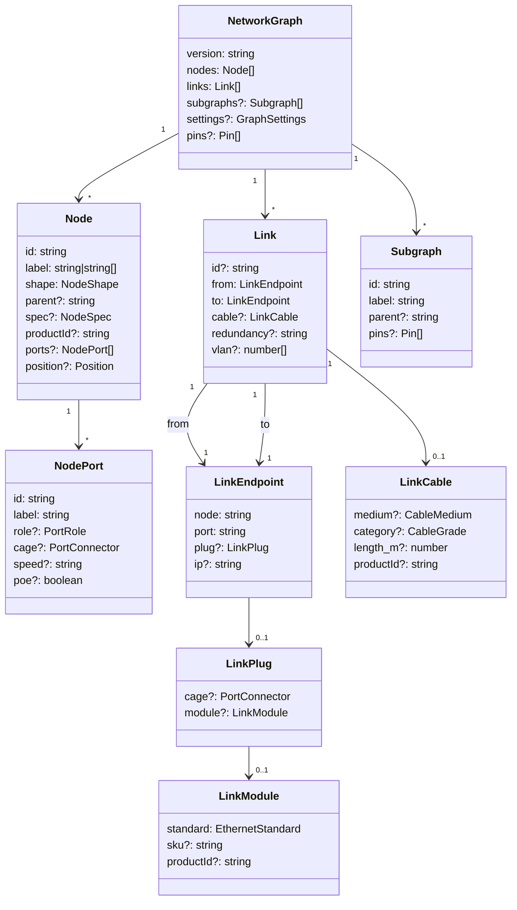
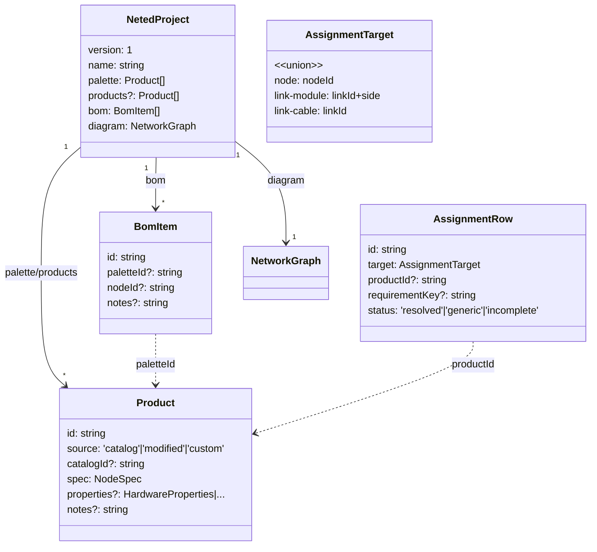

# データ構造レビュー（現状スナップショット）

`#162` 後の **現実装** を 1 枚に並べ、最適化の議論台にするための作業 doc。理想形（`project-workflow-model.md`）ではなく**今コードに何があるか**だけを書く。

> このドキュメントは議論用。決定事項は他の `*-model.md` に反映してから、ここから消す。

---

## 1. 全体像（簡略図）

```mermaid
flowchart LR
  subgraph CORE[&quot;@shumoku/core (canonical graph)&quot;]
    NG[NetworkGraph]
    NODE[Node]
    LINK[Link]
    SG[Subgraph]
    NG --> NODE
    NG --> LINK
    NG --> SG
  end

  subgraph EDITOR[apps/editor 拡張]
    PROD[Product 配列<br/>= palette]
    BOM[BomItem 配列]
    DIAG[diagram&#40;NetworkGraph&#41;]
    SVIEW[sheetView&#40;NetworkGraph&#41;]
  end

  PROD -. productId .-> NODE
  PROD -. productId .-> LINK
  BOM -. paletteId .-> PROD
  BOM -. nodeId .-> NODE
  DIAG --> NG
  SVIEW --> NG
```

3 つのコレクション（**Product 配列 / BomItem 配列 / NetworkGraph**）が `productId` / `paletteId` / `nodeId` で互いを指す構造。Diagram 編集の master は NetworkGraph。

---

## 2. データモデル詳細

### 2.1 core 側（`libs/@shumoku/core/src/models/types.ts`）



`productId` を持てる場所は **Node / LinkModule / LinkCable** の 3 箇所。

### 2.2 editor 側（`apps/editor/src/lib/types.ts`）



`SpecPaletteEntry` は `Product` の `@deprecated` alias。`paletteEntryLabel` も同。

---

## 3. ランタイム state（`context.svelte.ts`）

```
let palette: SpecPaletteEntry[]   // 実体は Product 配列
let bomItems: BomItem[]
let diagram: { nodes: SvelteMap, links, subgraphs, ... }
let sheetView: { ... }            // 子シート用、構造は diagram と同じ
let currentSheetId: string | null
let sheetCache: Map<id, ResolvedLayout>
let sheetCacheGeneration: number
```

`diagramState` API レイヤ：

```mermaid
flowchart TB
  subgraph L4[Layer 4: 統合 Assignment]
    A1[bindAssignment&#40;target, productId&#41;]
    A2[get assignmentRows]
  end

  subgraph L3[Layer 3: 高レベル node↔product]
    B1[bindNodeToPalette]
    B2[unbindNodes]
    B3[placeBomItem]
  end

  subgraph L2[Layer 2: BomItem CRUD]
    C1[addBomItem / updateBomItem / removeBomItem]
    C2[bindNodeToBom]
    C3[getBomItemsForPalette / getPaletteIdForNode]
  end

  subgraph L1[Layer 1: Product/Palette CRUD]
    D1[addProduct / removeProduct / updateProduct]
    D2[addToPalette / removeFromPalette / updatePaletteEntry]
    D3[get products / get palette]
  end

  subgraph L0[Layer 0: state]
    E1[palette]
    E2[bomItems]
    E3[diagram.nodes &#40;Node.productId&#41;]
    E4[diagram.links &#40;Module/Cable.productId&#41;]
  end

  A1 --> B1
  A1 --> E4
  A2 --> E2
  A2 --> E3
  B1 --> C1
  B1 --> E3
  D1 --> D2
  D2 --> E1
  D2 --> C1
  C1 --> E2
```



L1 は **products と palette の二重 API**（products は wrapper）。L4 だけが Module/Cable も対象、L3 以下は node 専用。

---

## 4. 同じ情報が複数箇所にある（重複の地図）

| 情報                          | 場所 A                  | 場所 B                  | 場所 C                  |
| ----------------------------- | ----------------------- | ----------------------- | ----------------------- |
| Product 配列                  | `palette` field         | `products` field        | （内部 state は 1 個）  |
| node → product bind           | `Node.productId`        | `BomItem.nodeId+paletteId` | —                    |
| node の spec                  | `Node.spec`             | `Product.spec`（経由） | —                       |
| node の ports                 | `Node.ports`            | `Product.spec` から再生成 | —                    |
| 未配置数（在庫）              | `BomItem` で nodeId 無し行 | `Product.quantity` は無い | —                  |
| module SKU                    | `LinkModule.sku`        | `LinkModule.productId` → `Product.spec.model` | — |

---

## 5. 議論したい論点

### Q1. `palette` と `products` field の二重出力

`exportProject` が両方書き、`applyProject` は `products ?? palette`。互換不要なら `products` 一本でよい。`palette` という名前は **UI 比喩**、`products` は **ドメイン語**。

- 内部 state 名も `products` にリネーム？
- L1 の `addToPalette` 系を消す？

### Q2. `BomItem` の存在意義

`Node.productId` ができたことで `BomItem` の `nodeId+paletteId` は二重持ち。残る役割は「未配置の在庫行」だけ。選択肢：

- **A**: `BomItem` を削除し、Product に `unplacedQty: number` を持たせる
- **B**: `BomItem` を `InventoryItem` にリネームし、`nodeId` フィールドも消し、未配置行のみのテーブル化（配置済みは Node から逆引き）
- **C**: 現状維持（移行期）

### Q3. Module / Cable の在庫管理

Node には Product bind + 在庫（BomItem 経由）あり、Module / Cable は Product bind だけで在庫概念なし。

- Module の SFP、Cable のリール本数を「未配置在庫」として持つか？
- 持つなら何の table？（`InventoryItem` を node 以外にも拡張？）

### Q4. `Node.spec` と `Product.spec` の同期

現在 `bindNodeToPalette` で Product.spec を Node.spec にコピー、`unbindNodes` で `stripProductFromSpec`。これは **snapshot pattern**。

- snapshot を維持する（Product 削除しても diagram は読める）
- 都度 lookup（Node.productId だけ持って spec は Product から引く）

snapshot 派なら、Product 編集時の Node.spec 更新ポリシーを明文化する必要あり（現状 update 時に `getNodesForPalette` で書き戻している）。

### Q5. `assignmentRows` は派生 view か、それとも state か？

現状は毎回 diagram + bom から生成する getter。重い場合は cache が要る。逆に軽いなら BomItem を消して assignmentRows ベースに統一する案もある。

### Q6. file format `.neted.json` は何を保存する？

現在: `palette / products / bom / diagram`。

- Q1, Q2 の結論次第で `bom` や `palette` を消す
- version bump するか（`version: 1` → `2`）

---

## 6. 関連 doc

- `data-model.md` — NetworkGraph 全体（core 側、編集者向け）
- `connection-model.md` — Port / Link / LinkModule / LinkCable
- `bom-model.md` — **#162 前の状態**。SpecPaletteEntry のまま、要更新
- `project-workflow-model.md` — **理想形**（Product/InventoryItem/RequirementLine）。まだ実装と乖離
- `sheet-model.md` — diagramState の sheetView / sheetCache 周り
- `layout-model.md` — NetworkGraph → ResolvedLayout 変換
