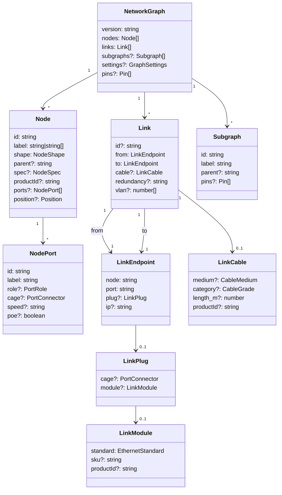
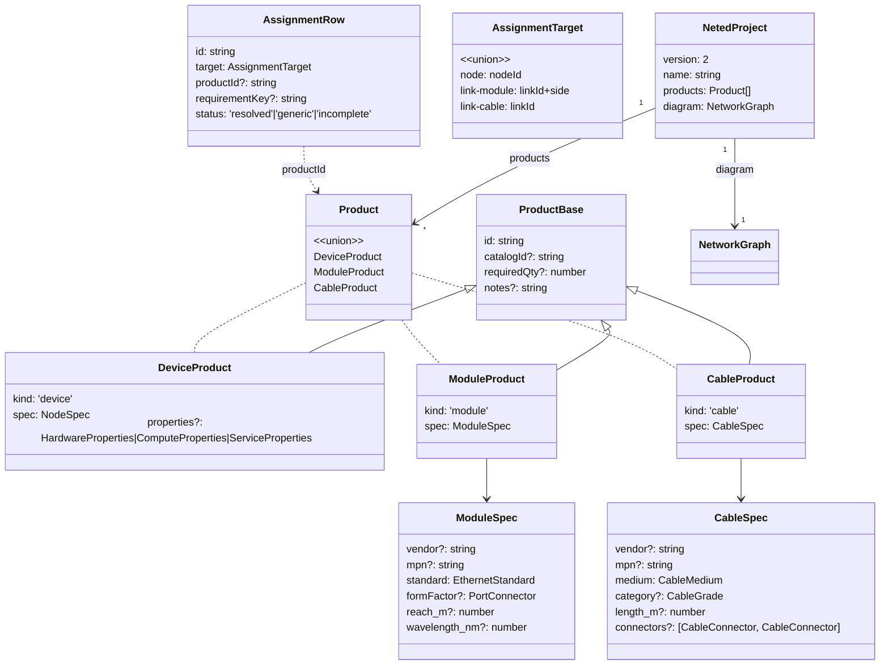

# データ構造（Materials 周り）

エディタ内のデータ構造を 1 枚にまとめた reference doc。Materials 操作フローや BOM ロジックなど、上位の議論はこの形を前提にする。

決定済みの議論ログは §6 に Q1〜Q6 として残してある（経緯を辿りたい人向け）。

---

## 1. 全体像（簡略図）

```mermaid
flowchart LR
  subgraph CORE[&quot;@shumoku/core (canonical graph)&quot;]
    NG[NetworkGraph]
    NODE[Node]
    LINK[Link]
    SG[Subgraph]
    NG --> NODE
    NG --> LINK
    NG --> SG
  end

  subgraph EDITOR[apps/editor 拡張]
    PROD[Product 配列]
    DIAG[diagram&#40;NetworkGraph&#41;]
    SVIEW[sheetView&#40;NetworkGraph&#41;]
  end

  PROD -. productId .-> NODE
  PROD -. productId .-> LINK
  DIAG --> NG
  SVIEW --> NG
```

**2 つのコレクション**で完結：

- **Product 配列** — プロジェクト固有の機材定義（device / module / cable）
- **NetworkGraph** — diagram の正本。Node / LinkModule / LinkCable が `productId` で Product を参照

「在庫」「BOM 表」は別 table を持たない。**Product.requiredQty（target）** と **diagram から派生する placedCount（実績）** の差分で表現する。

---

## 2. データモデル詳細

### 2.1 core 側（`libs/@shumoku/core/src/models/types.ts`）



`productId` を持てる場所は **Node / LinkModule / LinkCable** の 3 箇所。

### 2.2 editor 側（`apps/editor/src/lib/types.ts`）



## 3. ランタイム state（`context.svelte.ts`）

```ts
let products: Product[]
let diagram: { nodes: SvelteMap, links, subgraphs, ports, edges, bounds }
let sheetView: { ... }            // 子シート用、構造は diagram と同じ
let currentSheetId: string | null
let sheetCache: Map<id, ResolvedLayout>
let sheetCacheGeneration: number
```

`diagramState` の Materials 周り API：

```mermaid
flowchart TB
  subgraph L3[Layer 3: 統合 Assignment]
    A1[bindAssignment&#40;target, productId&#41;]
    A2[get assignmentRows]
  end

  subgraph L2[Layer 2: 高レベル node↔product]
    B1[bindNodeToProduct]
    B2[unbindNodes]
    B3[placeProductAsNode]
    B4[addEmptyNode]
  end

  subgraph L1[Layer 1: Product CRUD]
    D1[addProduct / removeProduct / updateProduct]
    D2[get products]
  end

  subgraph LD[Derived counts]
    DC1[placedCount&#40;productId&#41;]
    DC2[requiredCount&#40;productId&#41;]
  end

  subgraph L0[Layer 0: state]
    E1[products]
    E3[diagram.nodes &#40;Node.productId&#41;]
    E4[diagram.links &#40;Module/Cable.productId&#41;]
  end

  A1 --> B1
  A1 --> E4
  A2 --> E3
  A2 --> E4
  B1 --> E3
  B3 --> E3
  B4 --> E3
  D1 --> E1
  DC1 --> E3
  DC1 --> E4
  DC2 --> E1
  DC2 --> DC1
```



主要な不変条件：

- Product.requiredQty 編集は `diagram` に絶対影響しない（procurement target のみ動く）
- ノード追加/削除は renderer または `addEmptyNode` / `placeProductAsNode` 経由のみ
- `placedCount` は read-only な derive（Node + LinkModule + LinkCable の `productId === id` を数える）
- `requiredCount(id) = product.requiredQty ?? placedCount(id)`

---

## 4. 同期と snapshot

Diagram 側の `Node.spec` / `LinkModule` / `LinkCable` は Product から **snapshot** されている。

| 操作                       | snapshot 挙動                                                  |
| -------------------------- | -------------------------------------------------------------- |
| `bindNodeToProduct`        | Product.spec を Node.spec にコピー、ports を Product から再生成 |
| `placeProductAsNode`       | 新ノードに Product.spec / ports をコピー                        |
| `updateProduct`（spec 編集）| 紐付き Node 全部に Node.spec を上書き、ports を再生成           |
| `unbindNodes`              | Node.spec から vendor/model 等を剥がし、role のみに（kind/type）|
| `removeProduct`            | 紐付き Node の spec を role-only に剥がす + productId クリア。<br>紐付き LinkModule/LinkCable から productId を削除 |

snapshot のおかげで、Product を消した後も diagram は読める（壊れない）。一方で Product 編集時は紐付きノードに反映する責務を `updateProduct` 側が持つ。

---

## 5. ファイル形式（`.neted.json`）

```ts
interface NetedProject {
  version: 2
  name: string
  settings?: Record<string, unknown>
  products: Product[]
  diagram: NetworkGraph
}
```

Product は kind 毎の discriminated union。version=2 で確定。

---

## 6. 議論ログ（決定済み）

このリファクタの過程で決まったこと。後で経緯を辿りたい人向けの reference。

### Q1. `palette` / `products` field の二重出力 → `products` 一本に

旧 `NetedProject.palette` と `NetedProject.products` が並走していた。互換不要なので `products` のみに統一。state 名 `palette` も `products` にリネーム済み。

### Q2. `BomItem` の存在意義 → 削除

旧 `BomItem` は「未配置在庫」と「node bind」を兼ねていた。`Node.productId` 導入後は二重持ちに。**A 案（削除 + Product.requiredQty で表現）** を採用。個体管理が必要になったら別 model（`Asset` 等）として直交に追加する。

### Q3. Module / Cable の在庫管理 → 同じく requiredQty で表現

Module / Cable も Product として扱える discriminated union に拡張済み。在庫は Inventory ではなく `requiredQty` 経由。

### Q4. `Node.spec` と `Product.spec` の同期 → snapshot

Product 編集時に紐付き Node の spec を都度上書きする。これにより Product を削除しても diagram は壊れない（spec が独立したまま残る）。

### Q5. `assignmentRows` は派生 view → そのまま

現状の derived getter で十分軽い。BOM ページが `assignmentRows` 経由で集計に使う。

### Q6. `Product.source` field → 削除

旧 `source: 'catalog' | 'modified' | 'custom'` は UI badge 程度の意味。`catalogId` の有無で「カタログ由来 / 手起こし」が分かるので削除。

---

## 7. 関連 doc

- `data-model.md` — NetworkGraph 全体（core 側、編集者向け）
- `connection-model.md` — Port / Link / LinkModule / LinkCable
- `materials-flow.md` — Materials の操作フロー（このデータ構造を前提に書かれている）
- `bom-model.md` — BOM 派生ロジック（要更新）
- `project-workflow-model.md` — 上位の workflow 設計（要更新）
- `sheet-model.md` — diagramState の sheetView / sheetCache 周り
- `layout-model.md` — NetworkGraph → ResolvedLayout 変換
