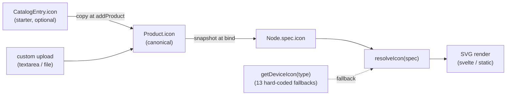
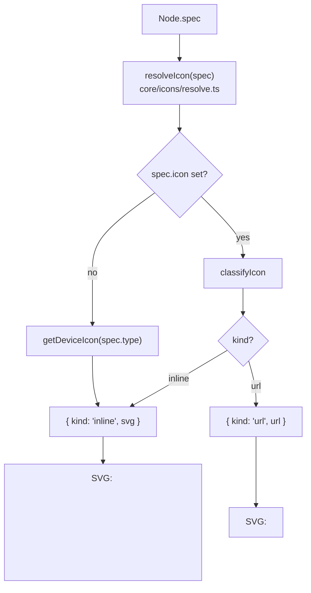

# アイコンモデル

ノードの絵柄（SVG / 画像）が catalog → Product → Diagram → renderer をどう流れるかの reference。

**設計原則**: producer が「何を描くか」を決め、renderer は **渡されたものを描くだけ**。

---

## 1. 全体像



- **Product.icon が正本**。catalog から自動コピーされるが、ユーザの custom upload で上書き可能
- bind 時に Node.spec.icon に **snapshot**（catalog/Product を消しても diagram は崩れない）
- renderer 内 `resolveIcon` が「explicit icon → fallback」の二択を吸収

---

## 2. 保存形式

`Node.spec.icon: string | undefined` が **唯一の永続フィールド**。値は 2 種類：

- **inline SVG**: `<` で始まる文字列（`<path d="..."/>` または `<svg viewBox="...">...</svg>`）
- **URL**: `https://...`、`data:...`、相対パス

判定は `core/icons/resolve.ts` の `classifyIcon(string)` 1 つ。先頭文字で見るだけのシンプルなルール。

`Product.icon` / `CatalogEntry.icon` も同じ規約（型は `string`、値は inline or URL）。

---

## 3. Producer 経路（icon が spec に乗るまで）

| 操作                     | 場所                                    | やること                                       |
| ------------------------ | --------------------------------------- | ---------------------------------------------- |
| Catalog から Product 作成 | `addFromCatalog` (Materials dialog)     | `entry.icon` → `Product.icon` にコピー         |
| Custom Product 作成      | `addCustom` (Materials dialog)          | textarea / upload の値を `Product.icon` に     |
| Product 編集             | Detail page の Icon card                | `updateProduct({ icon })` → 紐付き Node にも反映 |
| Node に Product を bind   | `bindNodeToProduct`                     | `Node.spec.icon = product.icon`               |
| Product を Node 化（place） | `placeProductAsNode`                  | 同上 + position も決める                       |
| プロジェクト load         | `applyProject`                         | catalogId 持ちで Product.icon 未設定なら catalog から backfill |
| unbind / remove          | `unbindNodes` / `removeProduct`         | `stripProductFromSpec` が icon ごと剥がす     |

「Product 編集 → bind 済み Node に反映」の同期ロジックは `updateProduct` 1 つだけが面倒を見ている。

---

## 4. Renderer 経路（spec から描画まで）



`resolveIcon` の戻り値は `{ kind: 'inline' | 'url', ... } | null`。renderer はその tag で分岐するだけ。

| Renderer                               | iconSize 計算                                      |
| -------------------------------------- | -------------------------------------------------- |
| `@shumoku/renderer/SvgNode.svelte`     | 固定 `DEFAULT_ICON_SIZE = 40`                      |
| `@shumoku/renderer-svg/svg.ts`         | URL は dim 取得 → aspect 保持で width 拡大、inline は固定 40 |

editor 側（svelte）が「ノード幅に対して icon が小さく見える」問題は静的 renderer と非対称な部分。これは別の改善トピック。

---

## 5. URL icon の補助層

URL icon は描画時に **画像の自然サイズ** を知っておかないと aspect 保持できない。`renderer-svg/icon-dims.ts` がその面倒を見る：

| 関数                          | 用途                                              |
| ----------------------------- | ------------------------------------------------- |
| `collectIconUrls(graph)`      | graph 内 URL icon を全部集める（inline は除外）   |
| `resolveAllIconDimensions`    | URL 群を並列 fetch + 画像 header から W:H を解析  |
| `fetchIconAsDataUrl`          | PNG export 時に外部 URL → base64 で埋め込む       |

inline SVG は dim 不要（viewBox 0 0 24 24 固定）なので fetch しない。

---

## 6. Fallback

`Node.spec.icon` が空の場合、`resolveIcon` は core 同梱の type-fallback を返す：

`core/icons/generated-icons.ts` の `getDeviceIcon(type)`：

```
DeviceType  → defaultIcons[key]
─────────────────────────────────
router       → 'router'
l3-switch    → 'l3-switch'
l2-switch    → 'l2-switch'
firewall     → 'firewall'
load-balancer → 'load-balancer'
server       → 'server'
access-point → 'access-point'
cpe          → 'cpe'
cloud        → 'cloud'
internet     → 'internet'
vpn          → 'vpn'
database     → 'database'
generic      → 'generic'
```

**永続化されない**: spec.icon に書き込まれず、renderer 実行時に決まるだけ。core の icon を更新すれば既存ファイルにも自動反映される。

---

## 7. 何が「綺麗」か（責務分離）

| 層                  | 持つ責務                              | 持たない責務                              |
| ------------------- | ------------------------------------- | ----------------------------------------- |
| `CatalogEntry.icon` | starter として明示 icon を提供         | 動的な URL 組み立て（catalog data に書く） |
| `Product.icon`      | プロジェクト内の正本                  | catalog の更新追従                        |
| `Node.spec.icon`    | 永続化される「描く文字列」            | fallback の埋め込み                       |
| `resolveIcon`       | 1 関数で URL/inline/fallback を tagged shape にまとめる | 描画                                      |
| renderer            | `resolveIcon` の戻り値を SVG にする    | URL 組み立て、CDN 知識、vendor mapping    |
| `icon-dims.ts`      | URL の dim 解決と byte fetch          | URL を作る                                |

## 8. 過去の負債

リファクタ前は以下が散らばっていた（PR #165 で除去）：

- ❌ `renderer-svg/cdn-icons.ts` の vendor → URL 自動組み立て（`getCDNIconUrl` / `hasCDNIcons` / `SVG_VENDORS` / `PNG_VENDORS`）
- ❌ `core/icons` の `vendorIconRegistry` / `registerVendorIcons` / `getVendorIcon`（dead code）
- ❌ `core/types.ts` の `specIconKey`（CDN URL 用 lookup key、もう不要）
- ❌ `renderer-png/png.ts` の独自 `collectIconUrls`（renderer-svg と重複）
- ❌ `SpecBase.vendor` の comment が「vendor-specific icons の鍵」と書かれていた（display metadata に整理）

## 9. ファイル所在地

```
libs/@shumoku/core/src/
├─ icons/
│  ├─ resolve.ts            classifyIcon / resolveIcon
│  ├─ generated-icons.ts    getDeviceIcon, defaultIcons (13 種)
│  └─ build-icons.ts        SVG → generated-icons.ts のビルダ
└─ models/types.ts          SpecBase.icon? / SpecBase.vendor?

libs/@shumoku/catalog/src/
├─ types.ts                 CatalogEntry.icon?
└─ builtin-data.ts          icon URL/inline を持つ entry が並ぶ

libs/@shumoku/renderer-svg/src/
├─ svg.ts                   calculateIconInfo (resolveIcon 経由)
├─ icon-dims.ts             URL 用 dim 解決 + byte fetch
└─ pipeline.ts              prepareRender → iconDimensions Map

libs/@shumoku/renderer/src/components/svg/
└─ SvgNode.svelte           resolveIcon 1 行で描画

libs/@shumoku/renderer-png/src/
└─ png.ts                   embedExternalImages で base64 化

apps/editor/src/lib/
├─ types.ts                 ProductBase.icon?
└─ context.svelte.ts        addProduct / updateProduct / bind 系で snapshot

apps/editor/src/routes/project/[id]/(content)/materials/
├─ +page.svelte             Library row preview, custom dialog (textarea + upload)
└─ [productId]/+page.svelte 詳細 page header + Icon card (textarea + upload + clear)
```

---

## 10. 関連 doc

- [`data-model.md`](./data-model.md) — Product / Node の型と snapshot pattern
- [`connection-model.md`](./connection-model.md) — Link 側の構造（Module / Cable）
- [`../pages/materials.md`](../pages/materials.md) — Materials ページの操作フロー
