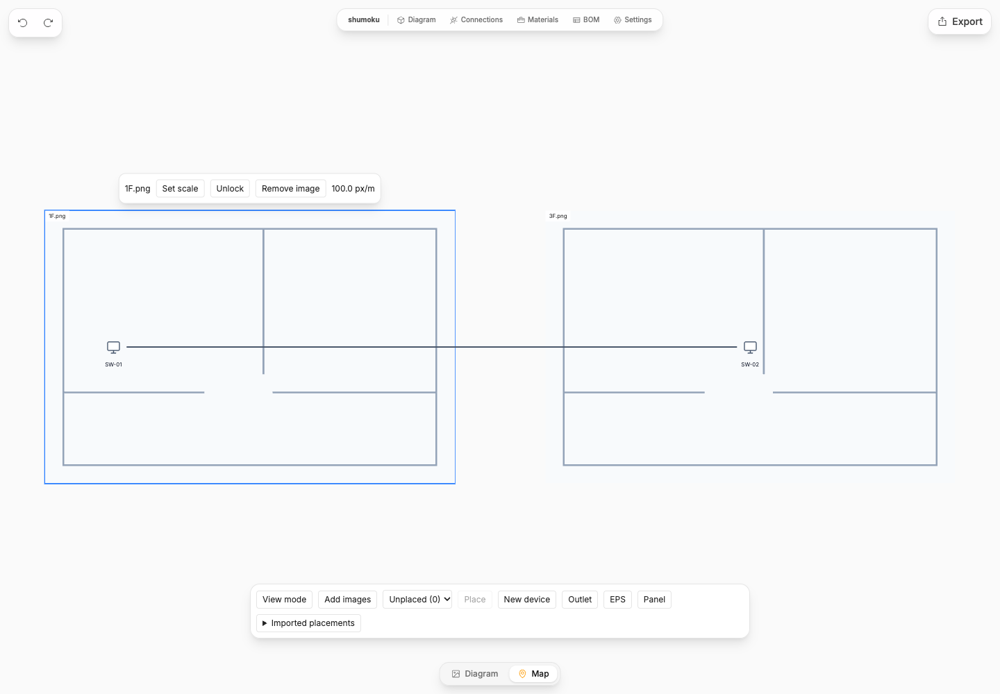
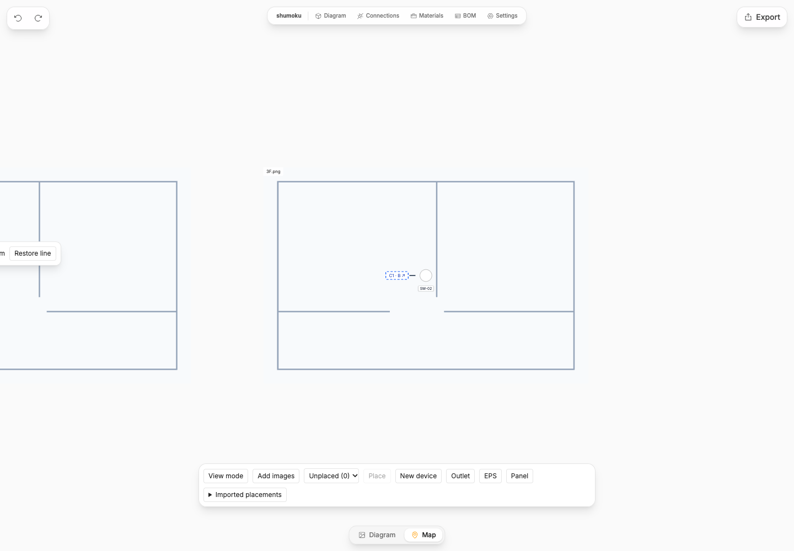
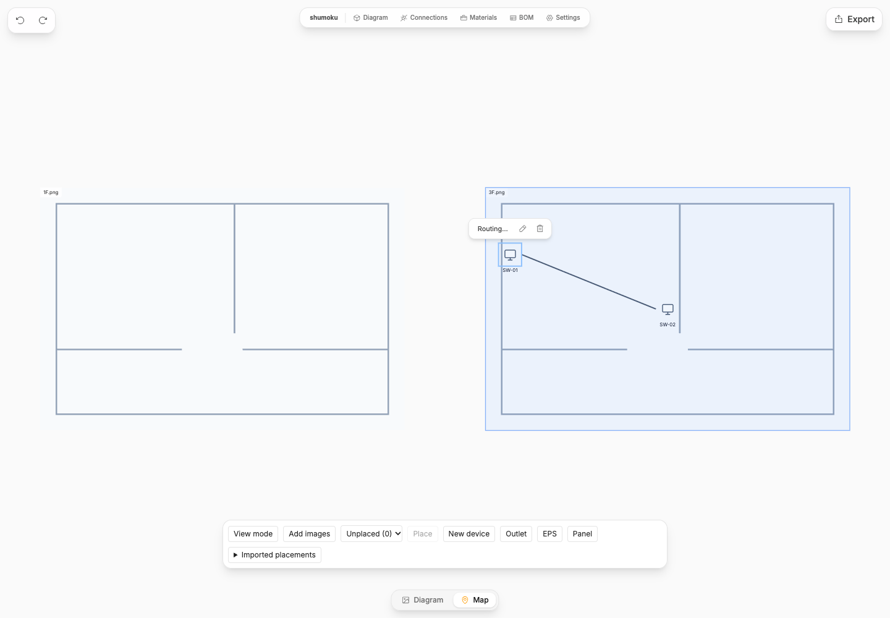

# One map workspace and cable continuations

The map is independent of the topology's subgraph hierarchy. A project has one
map with any number of image drawings. A drawing is a background, not a floor or
an equipment container. A single image can contain several floors, and several
images can cover one floor. Devices remain shared with the topology and have at
most one active map placement. Unplaced devices stay in the placement picker;
logical layout coordinates never implicitly become physical positions.

## Image interaction

Select an image to set its scale, lock/unlock it, or remove the image. Scale
calibration selects two points on that image and records their real distance.
References use original image pixels. Calibrated drawings share 100 map units
per meter. Moving/rescaling a drawing transforms its explicitly attached devices,
terminations, bends, and continuation endpoints together. Removing an image
leaves equipment and connections intact, but clears its measurement attachment.
Uncalibrated drawings are allowed; their distances remain unknown.

Placement and dragging softly highlight the drawing that will own the item. A drop
on a drawing selects that image (last containing image wins when images overlap).
Dropping on empty canvas retains an existing attachment; a new unplaced item stays
unattached there. Ownership changes only on drop, so passing over another drawing
does not reassign it. Position and attachment changes share one undo transaction.
The highlight is transient and is not included in print or saved project data.

## Omitted spans

Select a cable span, then **Omit span**. Two movable, paired continuation markers
replace its middle. Both belong to the same link ID and refer to adjacent stable
waypoint IDs, not matching human-readable text. **Go to other end** navigates to
the partner, **Restore line** removes both markers. Their label is only a visual
cross-reference. This is neither a physical connector nor a new cable or device.
EPS passage alone no longer implicitly splits a map cable.

The omitted distance is unknown until explicitly entered (zero is supported).
Canvas spacing between images is never a measured cable length. Visible spans
are measurable only when both endpoints attach to the same calibrated image.
A complete length is reported only when every span is known; otherwise a stored
whole-cable length may be used. If a route change invalidates a continuation's
waypoint references, the map shows an attention message and does not report a
complete calculated length. Restore that span before applying a new omission.

## References and scope of adaptation

- [EPLAN interruption point cross-references](https://eplan.help/en-us/Infoportal/Content/Plattform/2027/Content/htm/interruptionpointgui_k_darstellungabbruchstellen.htm): paired continuation points, cross-references, missing-partner detection.
- [KiCad schematic editor](https://docs.kicad.org/9.0/en/eeschema/eeschema.html): connections independent of continuous graphical wires, global and hierarchical labels.
- [KiCad schematic format](https://dev-docs.kicad.org/en/file-formats/sexpr-schematic/): explicit label objects, placement, and stable identifiers.

These are behavioral references, not copied source code. Unlike name-based net
labels, map marker text does not electrically join different links. One omission
pair is created/removed atomically and stays part of the existing link.

## Legacy projects

The scene canvas and per-subgraph scene navigation are removed. `/scene` redirects
to `/map`. For compatibility with existing IndexedDB and v1 project ZIP readers,
the persistence envelope still uses `scenes` and stores a single map record. Its
`map` payload contains drawings, omissions, and image attachments. Old scene-only
fields are read by migration; new map interactions do not use scene scopes.

Migration runs after old bend/termination and anchor migrations. Backgrounds are
laid out beside each other at a common scale. A device placement in its owning
scope is preferred over a root overview; original scene records are retained in
`map.legacyScenes` so alternative placements and calibration are not discarded.
Globally stored legacy bends/terminations are transformed only when their route
endpoints unambiguously identify the same old scene. Ambiguous points retain their
old coordinates and are not assigned a measurement image; these need review.
An existing map payload is not re-migrated on reload.

## Verification

Unit tests cover paired spans without link duplication, unknown vs zero omitted
length, invalid references, EPS pass-through, image transforms, and idempotent
legacy migration. Persistence tests cover images, calibration, attachments and
omissions in project ZIP round-trips. Browser checks cover the contextual image
menu, two-point calibration, image movement, continuation navigation and lengths,
undo/redo, and reload/export/import.

## Current limits and review considerations

- Calibration is uniform per image. A scanned sheet containing plans at different
  scales must be split into separate images first; image regions and rotation are
  not modeled yet.
- Overlapping images attach a newly placed point to the last containing drawing.
  Explicit attachment selection is a future improvement for overlapping plans.
- A device has one physical map placement. Repeated overview representations are
  not currently supported; any future representation must reference the same ID.
- JSON/SVG export continues to export the logical topology. Use project ZIP to
  preserve the complete map; browser Print renders the current map surface.
- Legacy scene data remains archived for recovery. The v1 envelope is retained,
  but older editors cannot render the new map payload. Keep the original project
  file when migrating; do not save the migrated file using an older editor.
- Modifying waypoints around an omission can invalidate its references. Restore
  the line and create a new omission after editing the route.

## UI examples

