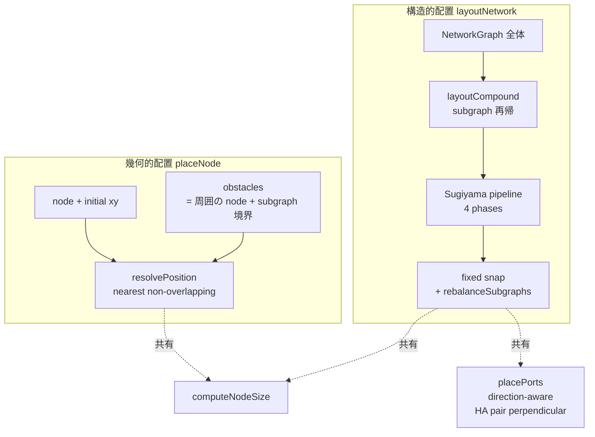
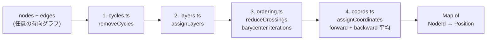
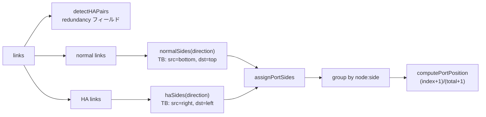
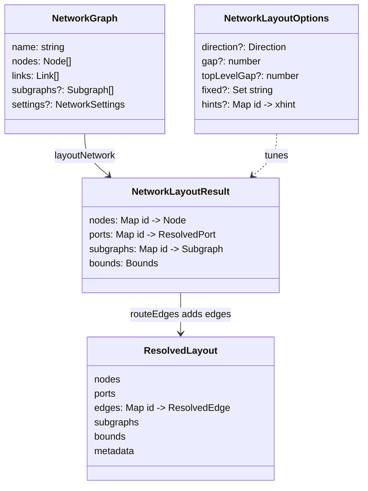

## レイアウトモデル

ノードを画面上に置く仕組み。"画面のどこに何を置くか" を決める入口は **二つだけ** に整理されていて、その下に Sugiyama スタイルのパイプラインと libavoid のエッジルータが入っている。

メンタルモデルは「**幾何的配置**」「**構造的配置**」「**境界跨ぎ**」の三つで成り立ちます。

- **幾何的配置** — `placeNode`。1 つの未配置ノードを「ユーザがクリックした座標」に置く。link 構造は **無視** する（ぶつからない一番近い点に snap するだけ）。drop / paste / BOM → diagram といった "周りを動かしたくない" 操作のための primitive。
- **構造的配置** — `layoutNetwork`。NetworkGraph 全体に Sugiyama パイプライン（cycle 除去 → layer → 順序 → 座標）を流して、リンクのフローに沿って全ノードを並び替える。YAML import 後の初期レイアウト、Auto-arrange、選択範囲整列に使う。
- **境界跨ぎ** — subgraph をネスト容器として扱った compound 拡張。子コンテナを再帰的にレイアウトしてから親レベルでまとめる。コンテナを跨ぐリンクは共通祖先のレベルに **昇格** されるので、container 同士の配置にも link 情報が効く。

二つの入口を意図的に分けているのは「O(障害物数) の幾何問題」と「O(V + E) の構造問題」を一つの関数に押し込めると、ユーザ操作のたびに full re-layout が走ってしまうため。`placeNode` は cheap、`layoutNetwork` は expensive、と覚えておけば呼び分けで迷わない。

## 関係図

二つの API がそれぞれどこで何を見るかを 1 枚にすると、次のようになる。



`placeNode` は障害物を見るだけで link を見ない。`layoutNetwork` は link を見て layer を決め、その後ポート配置と subgraph bounds を再計算する。両者ともノードのサイズは `computeNodeSize`（label + icon + port count）で揃えている。

## Sugiyama パイプライン

`layoutNetwork` の核心は `sugiyama/` 配下の四段パイプライン。各段は独立した純関数になっていて、`compose.ts` の `layoutFlat` がこれを順番に流すだけ。



- **Phase 1 — cycles**: フィードバックエッジを反転して DAG を作る。元の向きは `reversedEdges` で別途返す（renderer が必要なら使う）。
- **Phase 2 — layers**: 縦軸（TB なら y）方向の層を整数で割り当てる。長辺は仮想ノードを挟まずに飛ばしている。
- **Phase 3 — ordering**: 層内順序を barycenter iteration で交差最小化。`iterations` で反復回数を制御。
- **Phase 4 — coords**: 層 + 順序 → 絶対座標。**barycenter-aligned** モードでは、各非ソースノードの希望 x を「親層での親ノードたちの平均 x」とし、forward pack（左寄せ）と backward pack（右寄せ）を **両方走らせて平均** する（Brandes-Köpf を 4 → 2 alignment に縮約）。これで「親 1 つに対して兄弟 2 つ」のときに兄弟が中央に揃う。

二パスを平均しても重ならない理由は単純で、各入力が個別に non-overlap を満たしている → 隣接ノード `a, b` の x ギャップ制約は両入力で線形に成立 → 平均しても保たれる。

### コンパウンド（subgraph 再帰）

`compound.ts` の `layoutCompound` は subgraph をネスト容器として扱う。**bottom-up** に処理する。

```mermaid
flowchart TB
  subgraph CO[layoutCompound]
    direction TB
    D[subgraph を depth で sort<br/>leaf-most から処理]
    D --> LF["各 subgraph で<br/>layoutFlat(直接の子)<br/>→ 子の bounds 確定"]
    LF --> SU[親レベルでは<br/>子 subgraph を<br/>"compound node" として扱う<br/>size = 子の bounds + padding + label]
    SU --> P[親レベルで layoutFlat<br/>→ 親の中での position 確定]
    P --> SH[各 subgraph 内の中身を<br/>shift して整合]
  end
```

- 葉の subgraph から始め、`layoutFlat` で内部を解いて bounds を測る。
- 親はその bounds を「単一ノードのサイズ」として扱い、リーフノードと並べて `layoutFlat` を流す。
- 親レイアウトが終わったら、子 subgraph の中身を delta で shift して全体を整合させる。
- **コンテナを跨ぐエッジ**は、`network-layout.ts` の `buildCompoundEdges` で **共通祖先レベルへ昇格** される。`sg1 内の deep node → sg2 内の deep node` は親レベルでは `sg1 → sg2` として layer に効く。これがないとコンテナ同士は link 情報を持たずバラバラに配置される。
- HA 冗長 link（`link.redundancy`）は layer assignment から **除外** する。フロー方向を持たないので layer に効かせると pair の縦方向が崩れる。代わりに `placePorts` が perpendicular 方向のサイドを割り当てる。

## オプション設計

`NetworkLayoutOptions` は **直交する 2 つの constraint** を持つ。両方とも空が legacy 動作（全部レイアウト任せ）。

| オプション | 種類 | 何をするか |
| --- | --- | --- |
| `fixed: Set<string>` | **hard pin** | Sugiyama を普通に流したあと、このセットに入っている各ノードを **入力の `position` にスナップ** で戻す。ポートも同じ delta で動かす。subgraph bounds は `rebalanceSubgraphs` で再計算 |
| `hints: Map<string, {x}>` | **soft hint** | `assignCoordinates` 内で「親の barycenter」の代わりにこの x を希望値として使う。隣との詰め込みは普通に走るので、近所が混んでいれば最終 x はずれる。y は層が決めるので無視 |
| `direction` | フロー方向 | TB / BT / LR / RL。座標は TB で計算してから rotate |
| `gap` / `topLevelGap` | 間隔 | 層内ギャップ / 層間ギャップ |
| `subgraphPadding` / `subgraphLabelHeight` | 入れ子余白 | container の内側余白とラベル高 |
| `nodeWidth` / `minPortSpacing` | ノードサイズ下限 | port 数が多いノードはこの最小ピッチで横に伸びる |

`fixed` と `hints` は **両立** する。「これは絶対動かさない」（fixed）と「これくらいの x に置きたい」（hints）はレイヤが違う。

### 使い分け早見表

| シーン | 使う API | オプション |
| --- | --- | --- |
| YAML import 直後 | `layoutNetwork` | （なし） |
| 「Auto-arrange」ボタン | `layoutNetwork` | （なし） |
| 「選択範囲だけ整列」 | `layoutNetwork` | `fixed = 選択外のノード全部` |
| 「特定の x に寄せたい」 | `layoutNetwork` | `hints = Map(node → {x})` |
| ユーザが drop した位置に新ノード | `placeNode` | （障害物 collision のみ） |
| BOM → diagram の 1 個変換 | `placeNode` | （障害物 collision のみ） |
| paste at cursor | `placeNode` | （障害物 collision のみ） |

## ポート配置

ノードの位置が決まったあと、ポートをノードの **どの辺に何個並べるか** を決めるのが `port-placement.ts`。



- normal リンクは direction に沿った辺（TB なら上下）。
- **HA 冗長**ペアは perpendicular（TB なら左右）。pair 検出は `detectHAPairs` が `[from, to].sort().join(':')` を Set に入れて行う。
- 同じ side に乗ったポート同士は `(i+1)/(total+1)` の等比で並ぶ。3 ポートなら 1/4, 2/4, 3/4 の位置。

## データモデル

`layoutNetwork` の入出力。入力は normal な `NetworkGraph`、出力はランタイム表示用の `NetworkLayoutResult` で、これを `computeNetworkLayout` が `routeEdges`（libavoid）に通して最終的な `ResolvedLayout` を作る。



`computeNetworkLayout` がこの 2 段（layout → routing）をまとめる薄いラッパで、サーバ / CLI / renderer-html / renderer-svg 共通の入口になっている。エディタは `computeNetworkLayout` を直接呼んで `ResolvedLayout` をそのまま消費する（HTML renderer 用の legacy `LayoutEngine.layoutAsync` は createNetworkLayoutEngine 経由で残してある）。

## 設計のステータス

主要な抽象は landed。`placeNode` / `layoutNetwork` の二系統に整理されており、Sugiyama パイプラインは段階別の純関数になっている。

| 項目 | 状態 | issue / PR |
| --- | --- | --- |
| placeNode（幾何）と layoutNetwork（構造）の API 分離 | ✅ | #141 で commentary を追加 |
| Sugiyama 4 phases（cycles → layers → ordering → coords） | ✅ | #135-#138 |
| 共通 `SugiyamaOptions` への型統合 | ✅ | #140 |
| `layoutCompound` で subgraph 再帰 | ✅ | #137 |
| `fixed` オプション | ✅ | #134 |
| `hints` オプション | ✅ | #141 |
| barycenter-aligned 座標（forward + backward 平均） | ✅ | #138 |
| 共有幾何型を `models/types.ts` に集約 | ✅ | #139 |
| HA pair → perpendicular ポート配置 | ✅ | port-placement.ts |
| 共通祖先への cross-container edge 昇格 | ✅ | network-layout.ts |
| エッジ経路の libavoid ルーティング | ✅ | libavoid-router.ts |
| layer assignment が長辺で仮想ノードを使わない | ⚠️ | 仮想ノード入れれば交差最適化の精度が上がるが現状で実用十分 |
| `coords.ts` の `hints` がローカル座標系前提 | ⚠️ | doc に明記。グローバル座標で深い node を hint したい場合は `fixed` を使う |
| spline 風エッジ | ❌ | 設定としては受けるが現状は polyline に縮退 |

## 実装履歴（PR ベース）

このパイプラインは段階的に landed したので、各層がいつ入ったかを追えるようにしておく：

- **#133 — Auto-arrange ボタン**: エディタ側の入口。当初は ELK ベースの一発レイアウトで、後段で Sugiyama に置き換えられた。
- **#134 — `fixed` オプション**: 「選択外を pin」を可能にする。最初は `Map<id, Position>` の hard 制約として実装、Sugiyama 移行時に `Set<id>`（入力 position をそのまま使う）に簡略化。
- **#135 — Sugiyama foundation**: cycle removal + layer assignment（phase 1, 2）を分離関数として導入。既存 ELK 経路と並走。
- **#136 — Sugiyama phases 3-4**: crossing reduction + coordinate assignment（barycenter iterations + 単純 left-pack）。
- **#137 — Compound + composition**: `layoutFlat` で 4 phase を合成し、`layoutCompound` で subgraph 再帰を導入。
- **#138 — barycenter-aligned coords**: 単純 left-pack だと siblings が center に揃わない問題を Brandes-Köpf 風の forward + backward 平均で解決。
- **#139 — 幾何型の統合**: `Position` / `Bounds` / `Size` / `Direction` を `models/types.ts` に集約し、各 layout モジュールから重複定義を削除。
- **#140 — Option tower の崩壊**: `LayoutFlatOptions` / `CompoundOptions` / `AssignCoordinatesOptions` の重複を `SugiyamaOptions` 一つに統合。
- **#141 — `hints` + 二 API split を文書化**: `assignCoordinates` に soft hint を追加、`placeNode` と `layoutNetwork` の役割分担を JSDoc で明示。

`#143`（hierarchical sheet drill-down）以降は layout 自体は触らず、`buildChildSheetGraph` が **layout-free** に子シートの NetworkGraph を作って `computeNetworkLayout` に再投入する形になっている。シート側で独自レイアウトを持たないことで、Sugiyama の改良がそのままシートにも効く。

## コード上の場所

- `libs/@shumoku/core/src/layout/network-layout.ts` — `layoutNetwork`（公開 main entry）、`computeNodeSize`、`buildCompoundEdges`（共通祖先昇格）、`applyFixedOverride`、`countPortsPerNode`。
- `libs/@shumoku/core/src/layout/sugiyama/` — 4 phase の純関数と合成。
  - `cycles.ts` — `removeCycles`
  - `layers.ts` — `assignLayers`
  - `ordering.ts` — `reduceCrossings`
  - `coords.ts` — `assignCoordinates`（barycenter-aligned + hints 受け）
  - `compose.ts` — `layoutFlat`、`SugiyamaOptions`
  - `compound.ts` — `layoutCompound`（subgraph 再帰）
- `libs/@shumoku/core/src/layout/port-placement.ts` — `placePorts`、`detectHAPairs`、`computePortPosition`。
- `libs/@shumoku/core/src/layout/interaction.ts` — `placeNode`（公開、幾何プリミティブ）、`moveNode`、`resolveNodePosition`、`rebalanceSubgraphs`、`collectObstacles`。
- `libs/@shumoku/core/src/layout/libavoid-router.ts` — `routeEdges`（WASM）、`ensureLibavoidLoaded`。
- `libs/@shumoku/core/src/layout/unified-engine.ts` — `computeNetworkLayout`（layout + routing 一括）、`createNetworkLayoutEngine`（legacy interface）。
- `libs/@shumoku/core/src/layout/resolved-types.ts` — `ResolvedLayout` / `ResolvedEdge` / `ResolvedPort`。
- `libs/@shumoku/core/src/models/types.ts` — `Position` / `Bounds` / `Size` / `Direction` の幾何共有型。
- `apps/editor/src/lib/context.svelte.ts` — `autoArrange`（`layoutNetwork` 直接呼び出し）、`placeNodeForBom`（`resolvePosition` 経由で BOM → diagram 変換時のノード配置）、`switchSheet`（child sheet で `computeNetworkLayout`）。
- `docs/ARCHITECTURE.md` — レイアウトエンジンの bird's-eye view。
