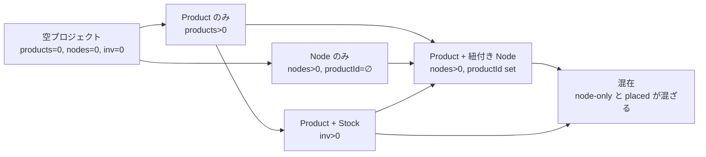
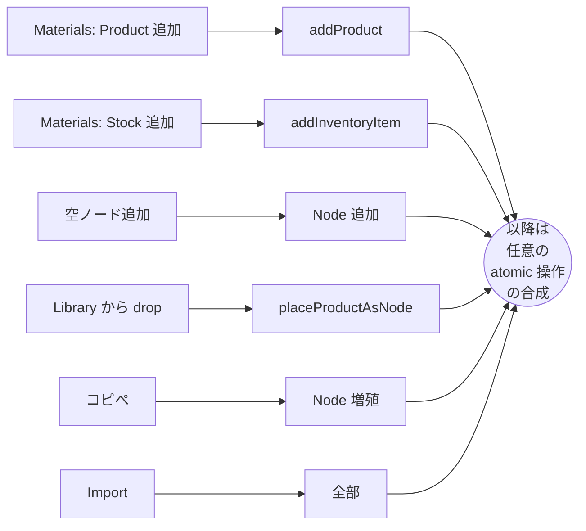
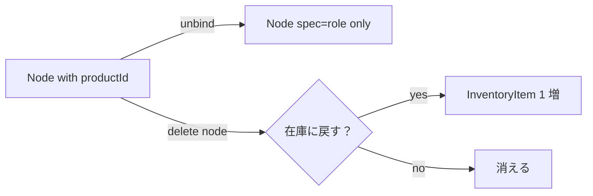
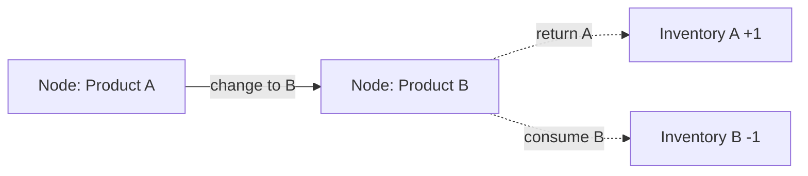
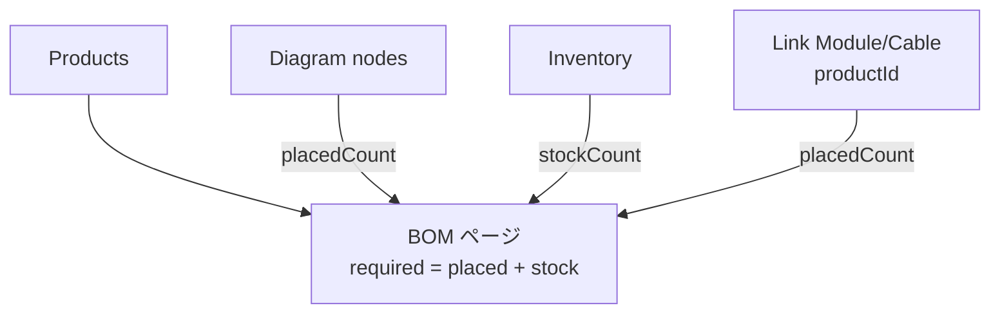

# Materials 操作フロー（作業 doc）

機材登録〜配置〜BOM 出力までのユーザ操作を整理する doc。

**前提**: 現実の操作は線形フローにならない。ユーザは複数の入口から始め、操作を自由に交ぜる。本 doc は「フロー = 線」ではなく **状態 + 入口 + atomic 操作の遷移グラフ** として表現する。Pattern 一覧（§5）は典型的なナラティブの例で、正解ではない。

**スコープ**: 本 doc は **device（Node）軸** に限定する。Link の Module / Cable に Product を紐付けるフローは Connections ページ側の責務で別 doc 扱い（atomic 操作 §3 にだけ参考で残す）。

---

## 1. 入口（Entry points）

ユーザが何かを始める瞬間は有限：

| 入口                                       | 触る対象              | きっかけ                  |
| ------------------------------------------ | --------------------- | ------------------------- |
| Materials ページで Product 追加            | Product               | カタログ閲覧 / 仕様確定   |
| Materials ページで Stock 追加              | Inventory             | 数量決定 / 発注情報       |
| ダイヤグラムに空ノード追加                 | Node (productId なし) | トポロジー設計            |
| ダイヤグラムに Library から drop / Place   | Node + Product 紐付け | 1 個サクッと置きたい      |
| 既存ノードのコピペ                         | Node 増加             | 同構成の複製              |
| Import（CSV / YAML / .neted）              | 全部                  | 既存資産の取り込み（未実装） |

どこから入っても以降は §3 の atomic 操作の自由な合成になる。

---

## 2. 状態空間（State）

プロジェクトの状態を **3 軸** で表現：

| 軸             | 値の例                              |
| -------------- | ----------------------------------- |
| Products       | なし / あり（種類数 N）             |
| Node.productId | 全 set / 一部 set / 全 undefined    |
| Inventory      | 0 / 1 以上                          |

組み合わせは多いが、典型的に経由する状態は限られる：

ゴールは「全 Node に productId が set」「Inventory は欲しい在庫だけ」「BOM 派生表が完成」の状態。中間はどう経由しても良い。

---

## 3. Atomic 操作（遷移）

任意のタイミングで実行できる単位操作。各操作が状態軸をどう動かすか：

| 操作                          | Products | Node    | Inventory | 実装                                |
| ----------------------------- | -------- | ------- | --------- | ----------------------------------- |
| Product 登録（catalog/custom）| +1       | -       | -         | `addProduct`                        |
| Product 削除                  | -1       | spec strip | -1〜0    | `removeProduct`                     |
| Product 更新                  | mod      | spec 同期 | -        | `updateProduct`                     |
| Inventory 追加（stock）       | -        | -       | +1        | `addInventoryItem`                  |
| Inventory 削除                | -        | -       | -1        | `removeInventoryItem`               |
| Inventory の Product 切替     | -        | -       | mod       | `updateInventoryItem`               |
| 空ノード追加                  | -        | +1（productId=∅）| -  | renderer の addNewNode             |
| ノード削除                    | -        | -1      | -         | renderer 経由                       |
| Node に Product 紐付け（bind）| -        | productId set | -1（あれば消費）| `bindNodeToProduct`        |
| Node から Product を外す      | -        | productId clear | -    | `unbindNodes`                       |
| Inventory を Node 化（place） | -        | +1      | -1        | `placeProductAsNode`                |
| ノードコピペ                  | -        | +N      | -         | renderer の clipboard               |
| Module / Cable に Product 紐付け | -     | link 内 productId set | -1（あれば） | `bindAssignment`             |

「bind」と「place」はどちらも Inventory を 1 消費する（matching があれば）— Inventory の消費ルールは現状一貫している。

---

## 4. 入口 × 操作のマップ

各入口から到達しやすい操作の傾向：

ゴール（BOM 完成）に達するまで、ユーザは Loop 内を歩き回る。

---

## 5. 典型的なナラティブ（参考）

「こう歩く人が多い」の例。これらは正解ではなく、**入口と歩き方の癖** のラベル。

| ラベル              | 入口                          | 主な歩き方                                     |
| ------------------- | ----------------------------- | ---------------------------------------------- |
| 設計先行・在庫経由  | Materials Product 追加        | Product 揃える → Stock 積む → 1 個ずつ Place   |
| 設計先行・直 drop   | Materials Product 追加        | Product 追加 → Library から drop で都度配置    |
| 設計先行・図先描き  | Materials Product 追加        | Product 追加 → 空ノード散らす → 後から bind    |
| ダイヤグラム先行    | 空ノード追加                  | トポロジー描く → 後で Product 登録 → bind      |
| テンプレ展開        | コピペ                        | 1 ブロック完成 → 範囲コピーで他拠点に展開      |
| BOM 逆引き          | Import                        | 既存発注書 → Product + Stock → 図に配置        |

各ラベル内でも `bind` の起点は 2 通り（Materials ページ / DetailPanel）あり、ユーザは混ぜる。

---

## 6. 直交軸まとめ

操作の癖を表現する軸：

| 軸                  | 値                                            |
| ------------------- | --------------------------------------------- |
| 機材登録の順番      | 先 / ノード作成と同時 / 後                    |
| Inventory 経由      | 経由する / 経由しない                         |
| ノード作成の起点    | 機材から / 図のレイアウトから / import / コピペ |
| bind UI 起点        | Materials ページ / ダイヤグラム DetailPanel   |

---

## 7. 補助フロー

### 7.1 配置解除（unbind）

### 7.2 製品差し替え（rebind）

### 7.3 BOM 派生

---

## 8. 引っかかっている / 未決の論点

### Q1. 「数量入力」UI

「Add Stock を N 回」が UX ダサい。Materials Library のセルに **数量フィールド** を置くか、Inventory 行で `qty` を許すか。

### Q2. Inventory 経由 / 不経由の区別

`bindNodeToProduct` は matching Inventory があれば消費する。しかし UI 上「在庫から place する」と「直接 bind」が同じ画面に混ざっていて、ユーザが在庫の動きを意識できない。残数表示だけで足りるか、明示的に分けるか。

### Q3. ノード削除時の在庫戻し

コピペで増えたノード（Inventory を消費していない）を削除するとき、在庫に戻すと数が壊れる。一方 unbind は戻すのが自然。**lifecycle 起点**（在庫から来たか、コピペで生まれたか）を Node に持つかどうか。

### Q4. 多数配置の効率

24 ポート AP を一気に置くなど。

- 案 1: 「N 個まとめて配置」ボタン（自動グリッド）
- 案 2: 連続クリック配置モード
- 案 3: import で済ませる

### Q5. 未紐付きノードの種類

`productId=undefined` のノードには現状 3 種類が混在しうる：

| spec 状態                  | productId | 解釈                              |
| -------------------------- | --------- | --------------------------------- |
| undefined                  | undefined | 空ノード                          |
| `kind+type` のみ           | undefined | 役割だけ決まってる                |
| 完備（vendor/model）       | undefined | 仕様は埋まってるが Product 未登録 |

「データの欠損度」は spec から分かる。一方 **ユーザの意図**（作業途中 vs 意図的に model TBD）は持っていないので区別不可能。

**結論（現状）**: 区別しない。spec の欠損度のみで運用し、BOM ページは `incomplete` / `generic` ラベルでフィードバックする。「意図的に未確定」フラグは必要性が見えてから検討。

### Q6. `Product.source` フィールドの要否

`source: 'catalog' | 'modified' | 'custom'` は UI の badge 色程度の意味しかない。プロジェクトに取り込んだ時点で「うちのもの」になる以上、由来追跡の意義は薄い。

**結論**: フィールド削除予定。`catalogId` の有無＝カタログ由来か手起こしか、で十分。Library 表示の badge は `catalogId` 有無で出し分ける。

---

## 9. 関連 doc

- `data-architecture-review.md` — データ構造のスナップショット
- `project-workflow-model.md` — 上位の workflow 設計
- `bom-model.md` — BOM 派生ロジック（要更新）
