# Materials 操作フロー（作業 doc）

機材登録〜ダイヤグラム配置〜BOM 出力までの操作フローを書き出すための作業 doc。実装の正解を決める doc ではなく、**何が現実のフローとして起こりうるか** を並べて議論する場。

---

## 1. 上位の分類

ざっくりと **設計先行 / ダイヤグラム先行 / ハイブリッド** の 3 系統。境界は曖昧で、現実のプロジェクトでは混在する。

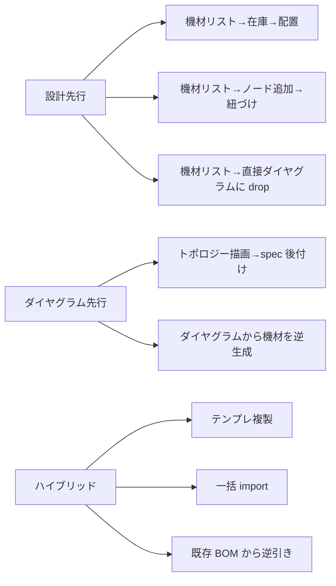

## 2. 直交する 4 軸

二分法より、独立した 4 軸の組み合わせで考えるほうが正確：

| 軸                  | 値                                            |
| ------------------- | --------------------------------------------- |
| **機材登録の順番**  | 先 / ノード作成と同時 / 後                    |
| **Inventory 経由**  | 経由する（在庫として積む）/ 経由しない        |
| **ノード作成の起点** | 機材から / 図のレイアウトから / import       |
| **bind UI 起点**    | Materials ページ / ダイヤグラムの DetailPanel |

bind UI 軸は「ノードに Product を紐付ける瞬間」をどこでやるか。同じデータ操作でも入り口の UI が違うだけで体験が大きく変わる。

「設計先行で在庫経由 + Materials 起点」「ダイヤグラム先行 + DetailPanel 起点」のように、4 軸の組み合わせで現実のフローを表す。

---

## 3. パターン一覧

### Pattern A — 機材登録 → 個数入力 → ダイヤグラム配置

「使う機材と数量が分かっている。後で図を起こす」典型的な設計先行。

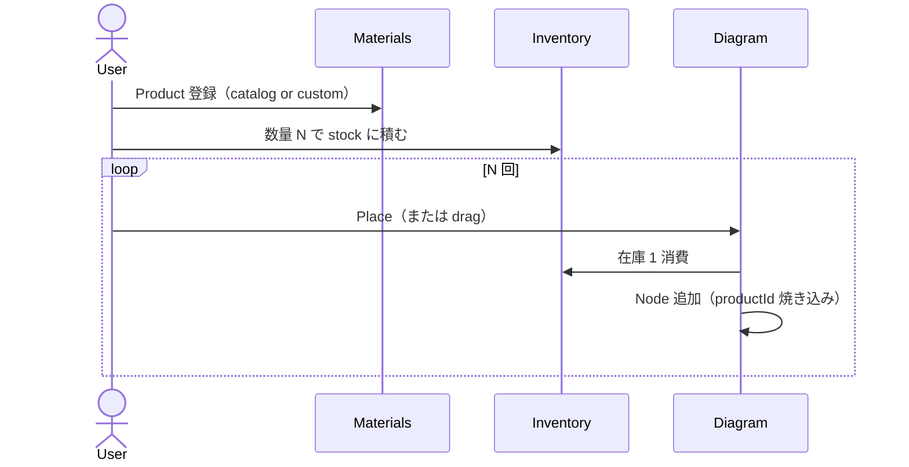

- 軸: 機材=先、Inventory=経由、ノード=機材から
- メリット: 発注計画と図が分離。残数が UI に出る
- 引っかかる点: 「数量入力」が単一アクションになってない（Add Stock を N 回押すは UX ダサい）→ **数量フィールドが要る**

### Pattern B — 機材登録 → ノード追加 → 紐づけ

「使う機材は決めた。どこに何台置くかは図を見ながら決める」ハイブリッド寄り。bind UI で D と同じく 2 サブパターン：

#### B-1. Materials ページ経由

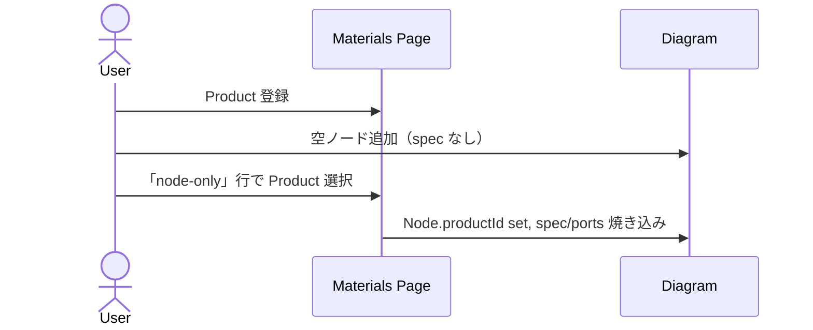

#### B-2. DetailPanel 経由

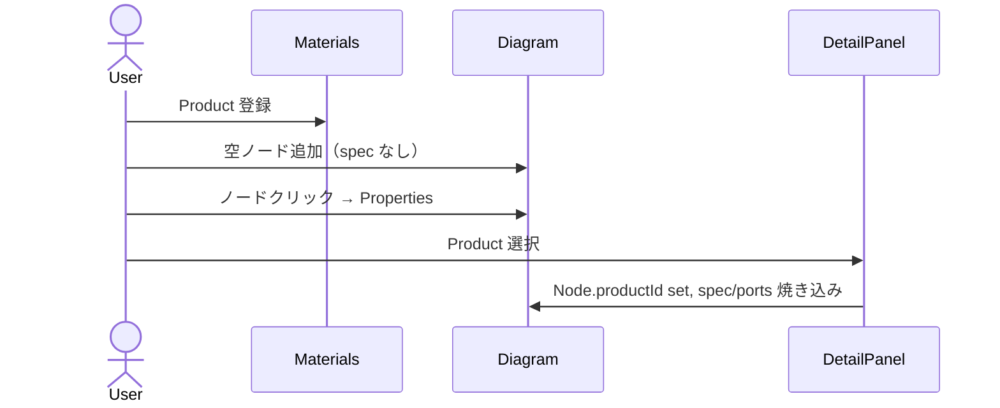

- 軸: 機材=先、Inventory=経由しない、ノード=図のレイアウトから
- メリット: 図を描きながら機材を当てはめられる
- 引っかかる点: 「Inventory を経由しないルート」と Pattern A の「経由するルート」が同じ Materials 画面で混在しているので、UI で明示的に分けないと混乱

### Pattern C — 機材登録 → 直接ダイヤグラムに drop

中間の Inventory ステップを飛ばし、Library から直接ノード化。

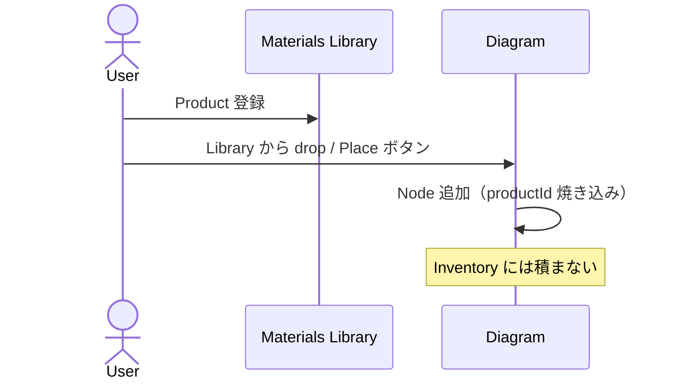

- 軸: 機材=先、Inventory=経由しない、ノード=機材から
- メリット: 思考の流れが速い。1 台しかない機材を素早く置く
- 現状の `placeProductAsNode` がこれに該当（Inventory が空のとき）

### Pattern D — ダイヤグラム先行 → spec 後付け

「とりあえずトポロジーを描く。機材は後で決める」。bind の UI 起点で 2 サブパターンに分岐：

#### D-1. Materials ページ経由

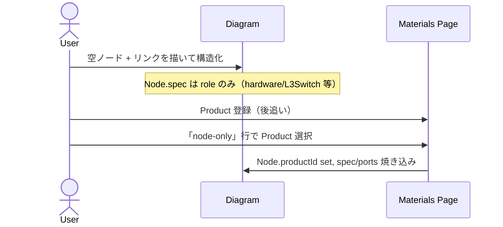

- 「assignment 表で全ノードを俯瞰しながら一括 bind」モード
- 大量のノードに同じ Product を当てる時に強い

#### D-2. ダイヤグラム上の DetailPanel 経由

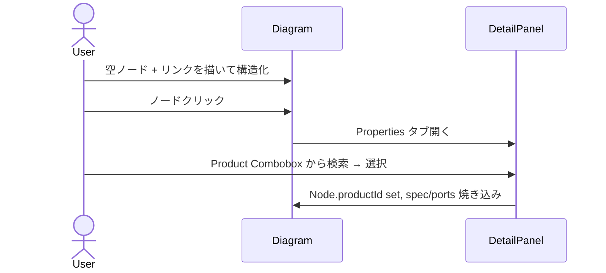

- 「図を見ながら 1 個ずつ確定」モード
- ノード単位で吟味して bind したい時に使う
- 現状の `NodeProperties.svelte` の `onbindproduct` 経路がこれ

軸: 機材=後、Inventory=経由しない、ノード=図のレイアウトから
共通の引っかかり: Pattern B との違いは「機材登録のタイミング」だけ。Pattern B も D-1 / D-2 と同じ UI 二分岐を持つ

### Pattern E — テンプレ複製

1 セット分を完成させて、コピペで展開。

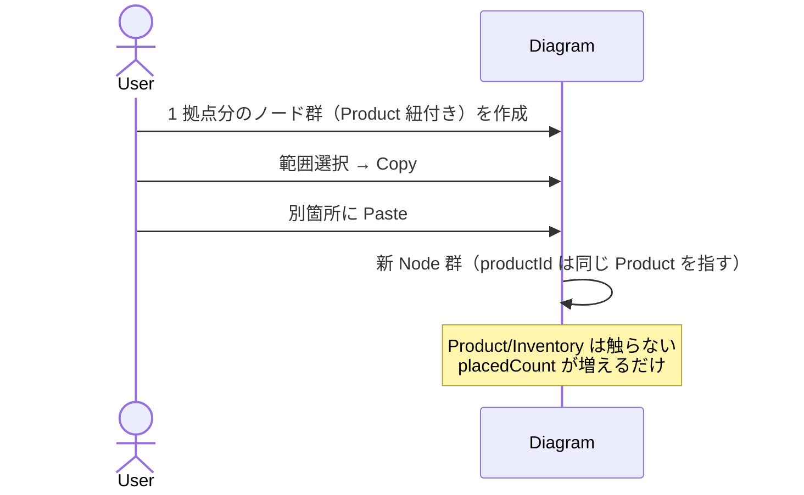

- 軸: 既存ノードからの派生
- メリット: 同じ構成を複数拠点に展開する設計で強い
- 現状の clipboard が単一ノード単位ではこれに近いが、**範囲選択コピー** は未実装

### Pattern F — 一括 import

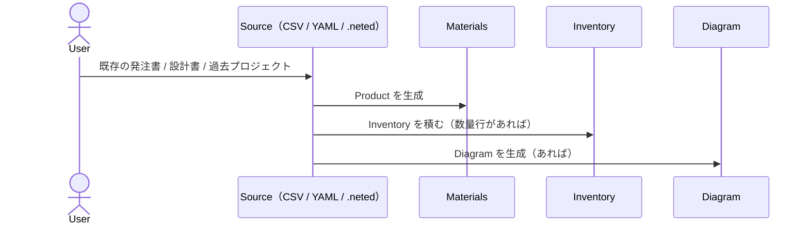

- 軸: 全部 import 駆動
- メリット: 大規模設計、既存資産の活用
- 未実装（Phase B 以降）

### Pattern G — 既存 BOM から逆引き

`.neted.json` の BOM 部分（または外部の見積書）を取り込んで Product + Inventory を作る。

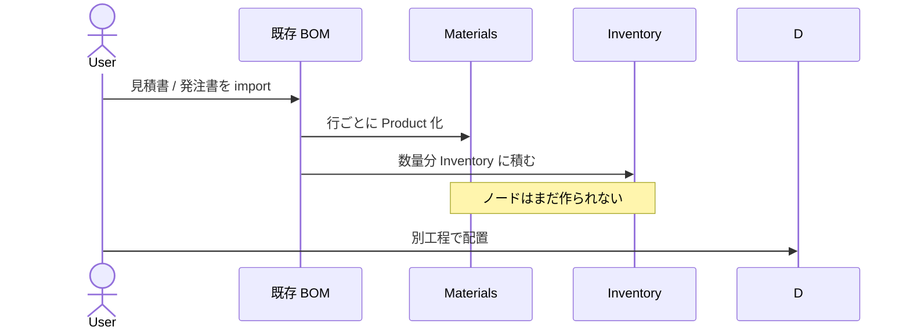

- F の特殊ケース。BOM が起点

---

## 4. 共通の補助フロー

どの起点パターンでも横断する操作。

### 4.1 配置解除（unbind）

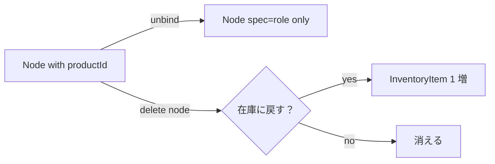

- 現状: unbind は Node.productId をクリア（Inventory には戻さない）
- 議論: 削除時に「在庫に戻すか / 完全削除か」を選ばせるか

### 4.2 製品差し替え（rebind）

別 Product に紐付け直す。

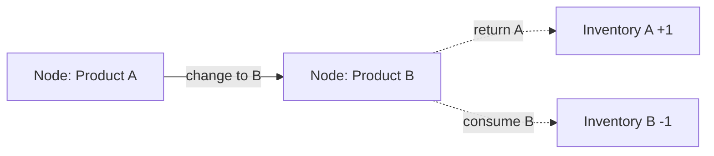

- 現状: `bindNodeToProduct` 内で旧 Product を Inventory に戻し、新 Product から消費

### 4.3 BOM 出力

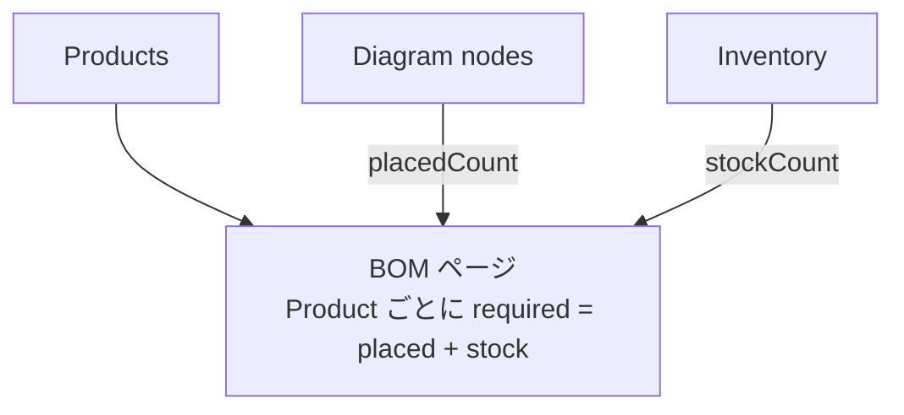

- 純粋な派生 view。コピー / TSV エクスポート

---

## 5. 引っかかっている / 未決の論点

### Q1. 「数量入力」UI

Pattern A で「Add Stock を N 回」になっている。**数量フィールド**を Materials Library のセルに置くか、新規 Inventory 行で `qty: N` を許すかの判断が要る。

### Q2. Inventory 経由 / 不経由の UI 区別

Pattern A（経由）と Pattern B/C（不経由）が同じ画面に混ざっている。ユーザに「在庫を積む」と「直接配置」を意識させる必要があるか、それとも自動的に振り分けるか。

### Q3. ノード削除時の在庫戻し

Pattern E のコピペ展開後に削除すると、**増えた個体を在庫に戻すべきか**。戻すと数量管理が壊れる（コピペは在庫を消費していないため）。戻さないと unbind とで挙動が一貫しない。

ルール候補：
- A: 削除は常に廃棄、unbind は常に在庫戻し
- B: コピペで増えたノードは「仮想ノード」フラグ持ち、削除時は廃棄
- C: ユーザに確認ダイアログ

### Q4. 多数配置の効率

24 ポート AP を一気に置くなど、N 個ノードを連続生成する操作の UX。

- 案 1: 「N 個まとめて配置」ボタン（自動グリッド配置）
- 案 2: 1 個置いた後の連続クリック配置モード
- 案 3: import で済ませる

### Q5. ダイヤグラム先行で「使う機材は決まっているが Product 登録はまだ」

Pattern D の前段階。「とりあえず L3 スイッチ」と分かっているが、特定 model はまだ。Node.spec.type だけ持って productId は undefined。これを **要件ノード** として扱うかどうか。

- BOM ページでは `incomplete` ステータスで出る
- Materials の assignments で「node-only」行になっている

---

## 6. 関連 doc

- `data-architecture-review.md` — データ構造の現状
- `project-workflow-model.md` — 旧 / 上位の workflow 設計
- `bom-model.md` — BOM 派生ロジック（要更新）
