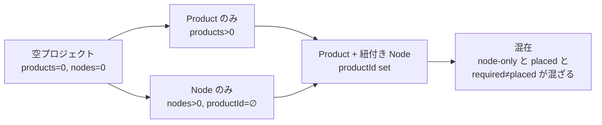
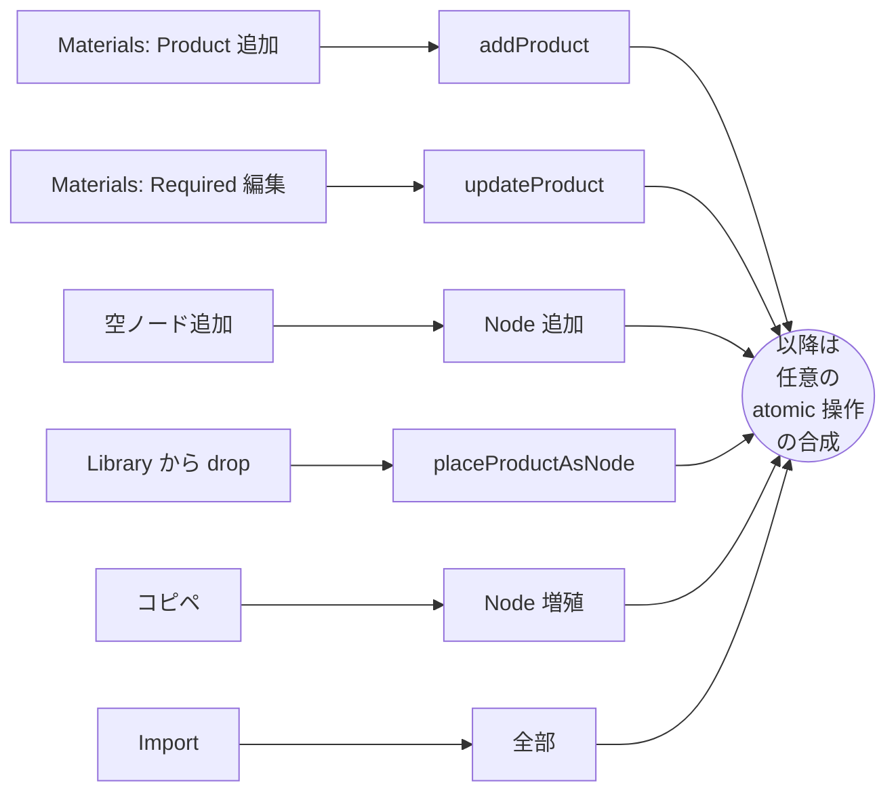
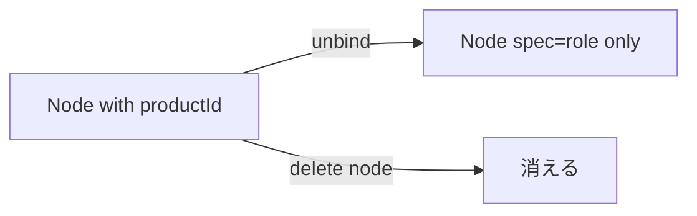
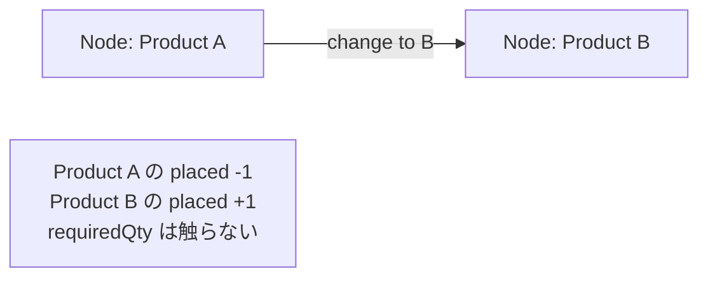

# Materials ページ

機材登録〜配置〜BOM 出力までのユーザ操作と、Materials ページの UI 設計。データ構造の前提は [`../design/data-model.md`](../design/data-model.md)。

**前提**: 現実の操作は線形フローにならない。ユーザは複数の入口から始め、操作を自由に交ぜる。本 doc は「フロー = 線」ではなく **状態 + 入口 + atomic 操作の遷移グラフ** として表現する。Pattern 一覧（§5）は典型的なナラティブの例で、正解ではない。

**スコープ**: 本 doc は **device（Node）軸** に限定する。Link の Module / Cable に Product を紐付けるフローは Connections ページ側の責務（[`connections.md`](./connections.md) 参照）。

**数量モデル**: 個体（Inventory）は持たず、**Product ごとの `requiredQty`（procurement target）** と diagram から派生する `placedCount` の 2 値で扱う。`requiredQty` は手動編集、`placedCount` は read-only。「数量を減らす」操作で diagram のノードが消えることは構造的に発生しない（§8 安全性の保証）。

---

## 1. 入口（Entry points）

ユーザが何かを始める瞬間は有限：

| 入口                                       | 触る対象              | きっかけ                  |
| ------------------------------------------ | --------------------- | ------------------------- |
| Materials ページで Product 追加            | Product               | カタログ閲覧 / 仕様確定   |
| Materials ページで Required 編集           | Product.requiredQty   | 数量決定 / 発注情報       |
| ダイヤグラムに空ノード追加                 | Node (productId なし) | トポロジー設計            |
| ダイヤグラムに Library から drop / Place   | Node + Product 紐付け | 1 個サクッと置きたい      |
| 既存ノードのコピペ                         | Node 増加             | 同構成の複製              |
| Import（CSV / YAML / .neted）              | 全部                  | 既存資産の取り込み（未実装） |

どこから入っても以降は §3 の atomic 操作の自由な合成になる。

---

## 2. 状態空間（State）

プロジェクトの状態を **3 軸** で表現：

| 軸                  | 値の例                              |
| ------------------- | ----------------------------------- |
| Products            | なし / あり（種類数 N）             |
| Node.productId      | 全 set / 一部 set / 全 undefined    |
| requiredQty / placed| 一致 / 不足 / 過剰（製品ごとの差分） |



ゴール: 「全 Node に productId が set」「製品ごとに required = placed（または許容できる差）」「BOM 派生表が完成」。

---

## 3. Atomic 操作（遷移）

任意のタイミングで実行できる単位操作。各操作が状態軸をどう動かすか：

| 操作                          | Products | Node                  | requiredQty | 実装                       |
| ----------------------------- | -------- | --------------------- | ----------- | -------------------------- |
| Product 登録（catalog/custom）| +1       | -                     | -           | `addProduct`               |
| Product 削除                  | -1       | spec strip / unbind   | -           | `removeProduct`            |
| Product 更新                  | mod      | spec 同期             | mod 可      | `updateProduct`            |
| requiredQty 編集              | -        | -                     | mod         | `updateProduct`            |
| 空ノード追加                  | -        | +1（productId=∅）     | -           | `addEmptyNode` / renderer  |
| ノード削除                    | -        | -1                    | -           | renderer 経由              |
| Node に Product 紐付け（bind）| -        | productId set         | -           | `bindNodeToProduct`        |
| Node から Product を外す      | -        | productId clear       | -           | `unbindNodes`              |
| Product を Node 化（place）   | -        | +1（productId set）   | -           | `placeProductAsNode`       |
| ノードコピペ                  | -        | +N（productId 継承）  | -           | renderer の clipboard      |
| Module / Cable に Product 紐付け | -     | link 内 productId set | -           | `bindAssignment`           |

---

## 4. 入口 × 操作のマップ

各入口から到達しやすい操作の傾向：



---

## 5. 典型的なナラティブ（参考）

「こう歩く人が多い」の例。線形フローではなく **入口と歩き方の癖** のラベル。

| ラベル              | 入口                     | 主な歩き方                                            |
| ------------------- | ------------------------ | ----------------------------------------------------- |
| 設計先行・数量計画  | Materials Product 追加   | Product 揃える → Required 入力 → 1 個ずつ Place       |
| 設計先行・直 drop   | Materials Product 追加   | Product 追加 → Library から drop で都度配置          |
| 設計先行・図先描き  | Materials Product 追加   | Product 追加 → 空ノード散らす → 後から bind          |
| ダイヤグラム先行    | 空ノード追加             | トポロジー描く → 後で Product 登録 → bind            |
| テンプレ展開        | コピペ                   | 1 ブロック完成 → コピペで他拠点に展開（required は手動更新） |
| BOM 逆引き          | Import                   | 既存発注書 → Product + Required → 図に配置            |

各ラベル内でも `bind` の起点は 2 通り（Materials ページ / DetailPanel）あり、ユーザは混ぜる。

---

## 6. 直交軸まとめ

| 軸                  | 値                                            |
| ------------------- | --------------------------------------------- |
| 機材登録の順番      | 先 / ノード作成と同時 / 後                    |
| 数量編集の順番      | 先（Required 計画）/ 後（Placed に追従）      |
| ノード作成の起点    | 機材から / 図のレイアウトから / import / コピペ |
| bind UI 起点        | Materials ページ / ダイヤグラム DetailPanel   |

---

## 7. 補助フロー

### 7.1 配置解除（unbind）



unbind は `Node.productId` をクリアするのみ。delete node は diagram から消えるだけ。**どちらも Product / requiredQty には触らない**。`placedCount` が減って `requiredQty - placedCount` の差が出るので、Library / BOM ページで Diff として可視化される。

### 7.2 製品差し替え（rebind）



### 7.3 BOM 派生

[`bom.md`](./bom.md) 参照。

---

## 8. 安全性の保証

「数量を減らすと意図せずノードが消える」を防ぐため：

- **`requiredQty` 編集は diagram に絶対影響しない**（Product update のみ）
- **ノード削除は diagram での明示操作のみ**（renderer 経由）
- **placedCount は read-only**。Library / BOM 表で表示するだけで編集 UI を持たない
- 「ノード追加 / 削除」と「Required 編集」は **完全に独立した操作**

ユーザが Library や BOM の数値を編集して困ることはない。困りたいなら Diagram を直接触る。

---

## 9. UI 構成

Materials は KiCad の library manager + footprint assignment、CAM の tool library + tool assignment、loadout UI の parts tree + equipment slot を合わせた workbench。Library と Assignments の 2 タブ。

```text
Materials
├─ Page header
│  └─ Status banner（Products / Placed / Required / Node-only / Incomplete）
└─ Tabs
   ├─ Library
   │  ├─ tab header
   │  │  ├─ heading
   │  │  └─ Add Product（catalog or custom）
   │  └─ Product table
   │     ├─ Kind / Vendor / Identifier / Origin
   │     ├─ Quantity（required + diff badge + 「+」increment popup）
   │     └─ row click → 詳細ページ /materials/[productId]
   └─ Assignments
      ├─ tab header
      │  ├─ heading
      │  └─ Add Node（空ノード追加 → 即 node-only 行として表示）
      └─ Assignment table
         ├─ Where（node label）
         ├─ Product（select）
         ├─ Status（placed / node-only）
         └─ node-only 行は持続的に amber tint
```

### 9.1 Library

Library は project-local Product の一覧。外部カタログ検索や custom 作成は、Library に Product を追加するための導線。

```text
Library row
├─ Kind / Vendor / Identifier / Origin（catalog or custom）
├─ Quantity セル
│  ├─ required を太字表示
│  ├─ diff（+N amber / -N rose）
│  └─ 「+」ボタン → 増分 popup
│     ├─ Current / Add / After の 3 列で計算プレビュー
│     └─ Save → requiredQty += N
└─ Trash → 影響プレビュー dialog → 削除
```

行クリックで詳細ページ（`/materials/[productId]`）に遷移。詳細ページでは Required を直接 set できる number input + Spec 全体 + 配置先一覧（node + link endpoints）。

### 9.2 Assignments

Assignments は Diagram のノードと Product 紐付けの編集 view。Module / Cable は Link の接続仕様なので Assignments では扱わず Connections に分離。

- 各行 = diagram の Node 1 つ
- `placed` = productId set / `node-only` = unbound
- node-only 行は **持続的なアンバー背景** で「未完了」が常に分かる
- Add Node でその場で空ノード生成 → 即 node-only 行として現れる

### 9.3 UI 原則

| 原則                       | 内容                                                                       |
| -------------------------- | -------------------------------------------------------------------------- |
| 対象の近くで編集する       | Node の Product 紐付けは Diagram の DetailPanel でも可                     |
| まとめて直す場所を持つ     | Materials / Assignments で Node の機材未割当を表で一括修正できる           |
| BOM は出力と検証           | BOM は編集面ではなく、必要部材と未確定箇所を見つけて source へ戻る view    |
| Library と instance を混ぜない | Materials / Library は Product 定義、Diagram / Connections は設計インスタンス |
| 常に source jump できる    | Library 行 → 詳細 → 配置先 Node → Diagram の流れで戻れる                   |
| generic を許す             | SKU 未確定でも `10GBASE-SR generic` や `Cat6A cable` として設計を進められる |

---

## 10. 引っかかっている / 未決の論点

### Q1. Required 入力の UX（Library）

現状: Quantity セルに `+` ボタン → 増分 popup（incremental Add）。詳細ページでは number input で直接 set。
2 経路の使い分けは **ざっと増やす = Library**、**目標値を直接決める = 詳細** で意味づけ。

### Q2. 過剰 / 不足の警告レベル

Diff > 0（足りない）/ Diff < 0（過剰）は Library Quantity セルの badge で色分け（amber / rose）。**banner レベルで全体警告するか**、**詳細表示は Library のみで OK か**は要決定。

### Q3. コピペで増えた Node の扱い

コピペで placed が増えたとき、required は連動しない（手動更新が必要）。

- 案 A: 連動しない（現状）
- 案 B: コピペで required を自動 +N

### Q4. 多数配置の効率

24 ポート AP を一気に置くなど。

- 案 1: Diagram で「N 個まとめて配置」
- 案 2: Library から drop の連続クリックモード
- 案 3: import で済ませる

### Q5. 「使う機材は決まっているが Product 未登録」状態

Pattern「ダイヤグラム先行」の途中状態。Node.spec.type だけ持って productId は undefined。BOM では `incomplete` 行になる。**結論**: 区別しない、spec 欠損度のみで運用。

### Q6. Module / Cable Product の作成導線

Connections ページから直接 Module/Cable Product を追加できる UI がまだない。当面は Materials から手動（device 専用 dialog のみ）。Phase B で対応。

---

## 11. 関連 doc

- [`../design/data-model.md`](../design/data-model.md) — データ構造（前提）
- [`../design/connection-model.md`](../design/connection-model.md) — Port / Link / Module / Cable
- [`bom.md`](./bom.md) — BOM 派生ロジック
- [`connections.md`](./connections.md) — Connections ページ
- [`diagram.md`](./diagram.md) — Diagram ページ
