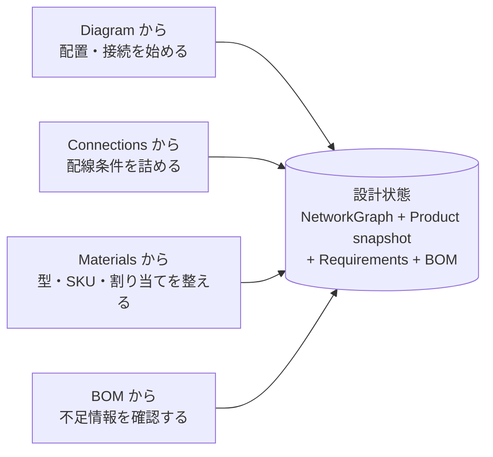
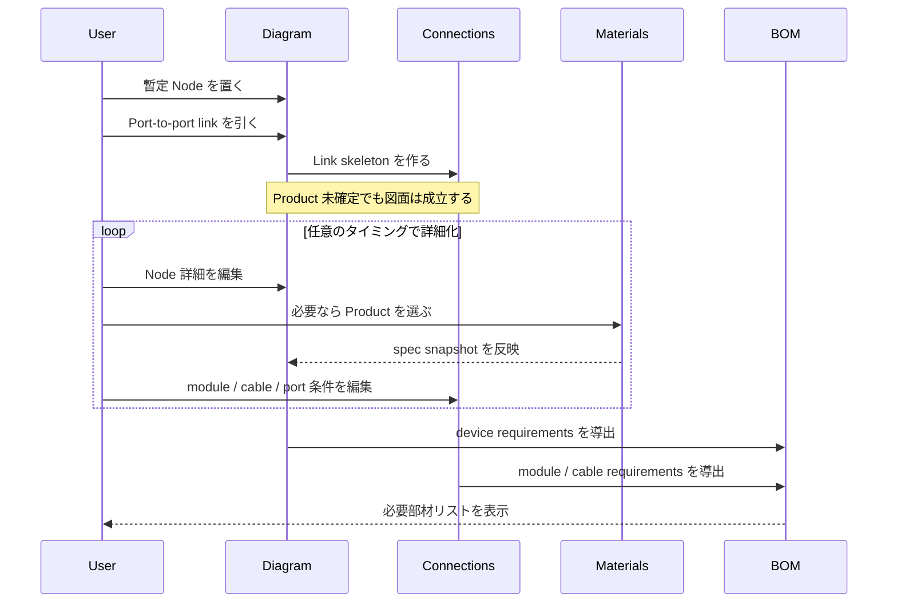
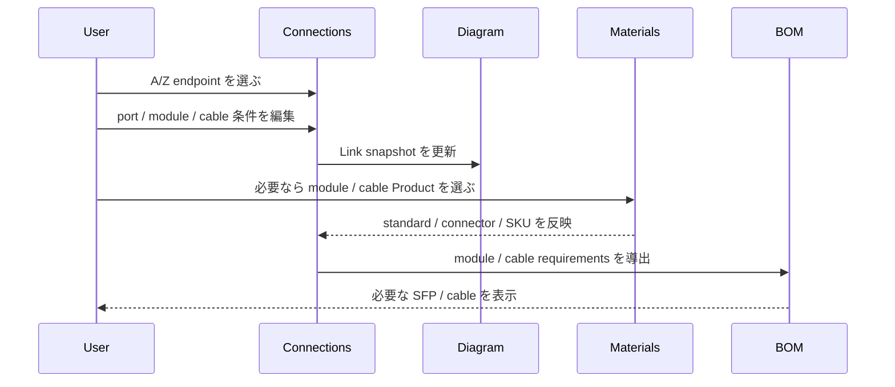
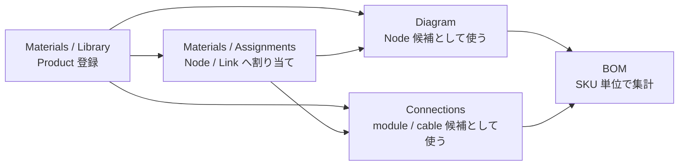
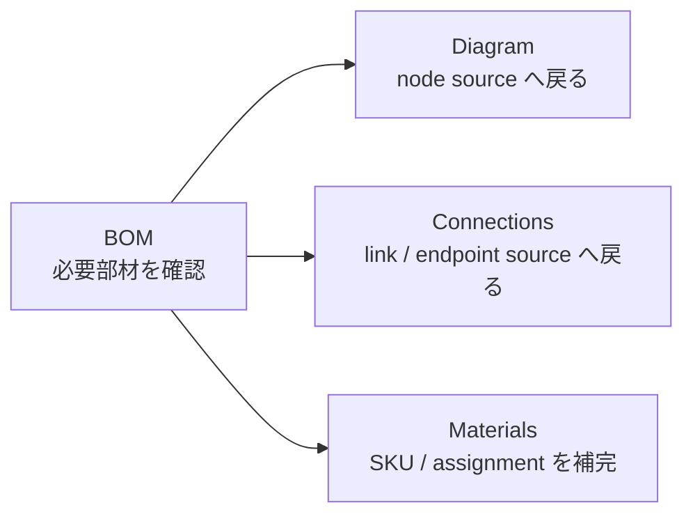
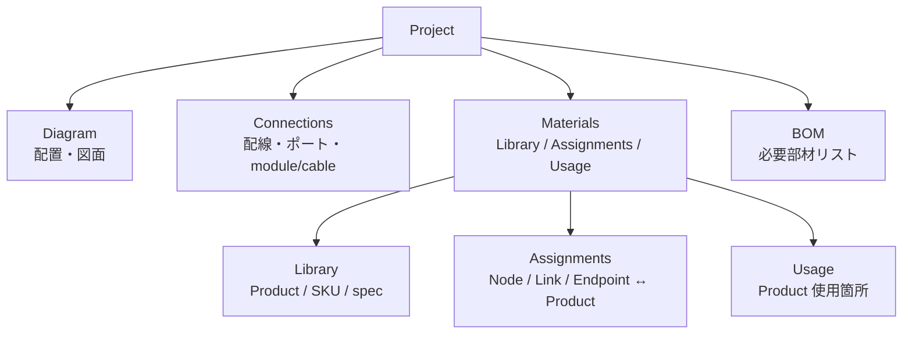
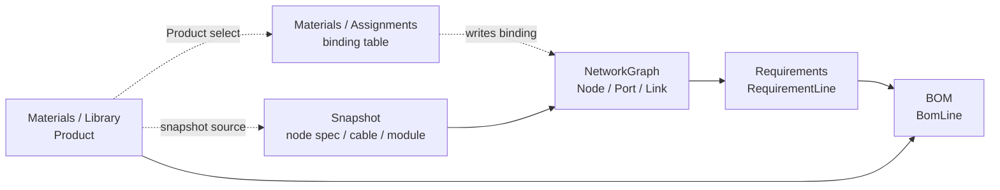
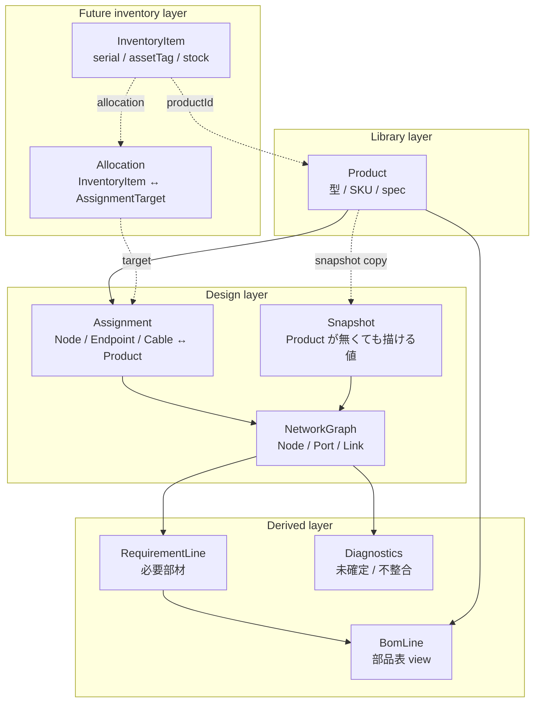
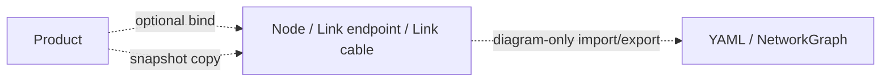

# Project Workflow モデル

Shumoku Editor 全体を **設計作業の流れ** から整理した開発ドキュメントです。

この段階では、在庫管理や資産管理は扱いません。Shumoku はまず **ネットワーク設計ツール** として成立させます。`serial`、`assetTag`、発注状態、保有在庫、未配置在庫、竣工後の資産台帳は後で拡張できる領域として残し、初期設計からは外します。

中心に置くのは次の 4 つです。

- `Diagram`: 図面上の配置と接続
- `Connections`: 配線、ポート、module、cable の詳細
- `Materials`: このプロジェクトで使う機材・部材の定義、割り当て、使用箇所確認
- `BOM`: 設計から導出される必要部材リスト

---

## 操作フロー

ネットワーク設計では開始点が固定されません。機種未確定のまま図面を描くこともあれば、配線条件から詰めることもあり、標準機材の Materials を先に整えることもあります。

したがって、どの入口から入っても最終的に同じ設計状態へ収束できるようにします。

### 簡単な構造図



| 起点 | 想定ケース | 主操作 |
| --- | --- | --- |
| Diagram | 初期設計、トポロジ検討、機種未確定のスケッチ | Node を置く、port-to-port link を引く、後から詳細を埋める |
| Connections | 10G SR、Cat6A、PoE など配線条件から決めたい | endpoint、port、module、cable を編集する |
| Materials | 標準機材、SKU、型番、図面要素との紐づけをまとめて整えたい | Product を登録し、Node / Link / Endpoint に割り当てる |
| BOM | 設計に必要な部材数を確認したい | 必要数を見て source へ戻る、SKU 未確定箇所を補完する |

### フロー 1: Diagram から始める

初期設計では、まず暫定的に Diagram に置いて、後から詳細パネルで段階的に詰めるのが自然です。



このフローでは Product が無くても図面を描けます。Product が選ばれた場合だけ、Materials / Library の spec を Node / Link 側へ snapshot として反映します。

### フロー 2: Connections から始める

ネットワークエンジニアは、トポロジより先に「この uplink は 10GBASE-SR」「この access は Cat6A PoE」といった接続条件から考えることがあります。



Connections は Diagram の link を台帳的に編集する場所です。ただし資産台帳ではなく、あくまで **設計上の接続仕様** を扱います。

### フロー 3: Materials から始める

標準構成やよく使う機材がある場合、Materials を先に整えてから設計に使います。



Materials は project-local library と assignment workbench です。`Product` は device だけでなく、module、cable、rack、patch-panel も表せます。ただし個体管理はしません。

Product の追加方法は複数あってよいです。

- 外部カタログから取り込む。
- カスタム Product を手入力で作る。
- Diagram / Connections の詳細編集中に、その場で Product 化する。

どの方法でも、最終的に作られるのは `Product[]` 内の project-local Product です。Node / Link が bind する相手も external catalog ではなく、この Product です。

Materials / Assignments では、Node / Link endpoint / Link cable と Product の紐づけを表で編集できます。これは KiCad の footprint assignment や field table に近い操作です。個別の Node 詳細や Connections 詳細でも同じ紐づけを編集できますが、まとめて確認・修正する場所として Materials に集約します。

### フロー 4: BOM から戻る

BOM は master data ではなく、設計の確認 view です。



BOM 行は直接編集しません。不足や未確定項目を見つけたら、その source である Node / Link / Endpoint / Product に戻って修正します。

---

## 全体構成

### 画面構成



トップレベルは `Diagram` / `Connections` / `Materials` / `BOM` の 4 ページにします。`Materials` はこのプロジェクトで使う機材・部材を扱う workbench で、内部に `Library` / `Assignments` / `Usage` を持ちます。`BOM` は Materials の下位ではなく、設計全体から導出される確認ページとして独立させます。

### データの流れ



読み方は単純です。

- `Materials / Library` は型や SKU の候補を提供する。
- `Materials / Assignments` は Node / Link / Endpoint と Product の紐づけをまとめて編集する。
- `Diagram` と `Connections` は同じ `NetworkGraph` を編集する。
- `NetworkGraph` は Node / Link / Endpoint の snapshot から requirements を導出する。
- `BOM` は requirements を group した derived view として表示する。

---

## ページ構成

```text
Project
├─ Diagram
├─ Connections
├─ Materials
│  ├─ Library
│  ├─ Assignments
│  └─ Usage
└─ BOM
```

| ページ | 編集対象 | 主な入力 / 出力 |
| --- | --- | --- |
| Diagram | `NetworkGraph.nodes`, `NetworkGraph.links` | node / subgraph / port-to-port link、詳細 panel |
| Connections | `NetworkGraph.links` | A/Z endpoint、port、plug、module、cable、VLAN、IP、diagnostics |
| Materials / Library | `Product[]` | 外部カタログ取り込み、custom Product、SKU、spec |
| Materials / Assignments | `Node.productId`, `Endpoint.module.productId`, `Link.cable.productId` | 図面要素と Product の紐づけ表 |
| Materials / Usage | derived usage index | Product ごとの使用箇所、source jump |
| BOM | derived `BomLine[]` | requiredQty、source jump、SKU 未確定の検出 |

現行の `Specs` 相当は `Materials / Library` に寄せます。現行の `BOM` が持っていた紐づけ表としての価値は `Materials / Assignments` に移します。新しい `BOM` は derived parts list として扱います。

---

## データモデル構成

データモデルは、KiCad / CAM / game loadout 系 UI に共通する層へ分けます。

```text
Library       = 使えるものの型定義
Design        = 図面上のインスタンス
Assignment    = Design instance に Library item を割り当てる
Derived       = Requirements / BOM / diagnostics
Inventory     = 将来拡張。実物、在庫、発注、serial、assetTag
```

初期実装では `Inventory` を保存モデルに入れません。ただし将来足すときに壊れないよう、`Product.id` と `AssignmentTarget` を安定した参照点として設計します。

### 簡単な構造図



実線が初期実装、点線が将来の在庫管理です。初期実装では図面上に置かれたものは `Node` / `Link` として存在し、Product への参照は optional です。将来 `InventoryItem` を追加する場合も、図面を資産台帳に変えるのではなく、`InventoryItem` が `Product` と `AssignmentTarget` を参照します。

### レイヤー責務

| レイヤー | 役割 | 保存するもの | 保存しないもの |
| --- | --- | --- | --- |
| Library | 設計で使える型定義 | `Product[]` | 図面上の配置、個体情報 |
| Design | 図面と接続事実 | `NetworkGraph`、snapshot、Product binding | BOM 集計、在庫数 |
| Assignment | 図面要素と Product の割り当て | 実体は Node / Endpoint / Link cable 側の `productId` | 独立した台帳行 |
| Derived | 設計から出る確認結果 | なし。都度生成 | master data |
| Future Inventory | 実物、在庫、発注、資産タグ | 将来の `InventoryItem` / `Allocation` | Product 定義、図面形状 |

### Product

`Product` は型定義です。個体ではありません。外部カタログから取り込んだ場合も、保存されるのは project-local Product です。

```ts
type ProductKind =
  | 'device'
  | 'module'
  | 'cable'
  | 'rack'
  | 'patch-panel'
  | 'accessory'

interface Product {
  id: string
  kind: ProductKind
  name: string
  sku?: string
  vendor?: string
  model?: string
  source?: ProductSource
  spec?: unknown
  properties?: unknown
  notes?: string
}

type ProductSource =
  | { kind: 'external-catalog'; catalogId: string; externalId: string }
  | { kind: 'custom' }
```

### NetworkGraph

`NetworkGraph` は設計の master です。Product が無くても成立するように、Node / Link / Endpoint は snapshot を持ちます。

```ts
interface NetworkGraph {
  nodes: Node[]
  links: Link[]
  subgraphs?: Subgraph[]
}
```

Node / Link 側には、次のような optional bind と snapshot を持たせます。実装では device、module、cable ごとに具体型を分けます。

```ts
interface ProductBinding {
  productId?: string
  snapshot?: unknown
}
```

この binding は在庫 item を指しません。指すのは必ず `Product.id` です。

### Assignment

Assignment は独立した保存エンティティではなく、Node / Link / Endpoint 側に保存されている Product binding を表形式で編集する view です。ここが KiCad の footprint assignment / field table に相当します。

```ts
type AssignmentTarget =
  | { kind: 'node'; nodeId: string }
  | { kind: 'link-module'; linkId: string; side: 'from' | 'to' }
  | { kind: 'link-cable'; linkId: string }

interface AssignmentRow {
  target: AssignmentTarget
  currentProductId?: string
  currentSnapshot?: unknown
  requirementKey?: string
  status: 'resolved' | 'generic' | 'incomplete'
}
```

保存される本体は `AssignmentRow` ではありません。`AssignmentRow` は NetworkGraph から導出され、編集結果は `Node.productId`、`Endpoint.module.productId`、`Link.cable.productId` などへ書き戻されます。

`AssignmentTarget` は将来の在庫管理でも再利用します。たとえば `InventoryItem` を「この link endpoint に挿した」という状態にしたい場合、`Allocation.target` が同じ target を指します。

### Future Inventory

在庫管理を追加する場合も、初期モデルの責務は変えません。追加するのは `Product` と `AssignmentTarget` を参照する別レイヤーです。

```ts
interface InventoryItem {
  id: string
  productId: string
  quantity?: number
  serial?: string
  assetTag?: string
  status?: 'planned' | 'ordered' | 'in-stock' | 'installed' | 'retired'
  allocation?: Allocation
  notes?: string
}

interface Allocation {
  target: AssignmentTarget
  quantity?: number
}
```

重要なのは、Inventory を入れても `Node` が `InventoryItem` を直接 master として持たないことです。

```text
Product       = 型
Node / Link   = 設計インスタンス
Assignment    = 設計インスタンスと型の対応
InventoryItem = 実物または在庫単位
Allocation    = 実物をどの AssignmentTarget に使ったか
```

これにより、設計だけの軽いプロジェクト、BOM 出力までのプロジェクト、竣工後の資産管理まで行うプロジェクトを同じ基本モデルで扱えます。

### RequirementLine

`RequirementLine` は Diagram / Connections から導出されます。保存しません。

```ts
interface RequirementLine {
  productKey: string
  productId?: string
  kind: ProductKind
  requiredQty: number
  sources: RequirementSource[]
}
```

`productId` がある場合は Materials / Library の Product に紐づく requirement です。`productId` が無い場合は `10GBASE-SR generic`、`Cat6A cable` のような compatibility key で集計します。

### BomLine

`BomLine` は BOM 表示用の derived row です。保存しません。

```ts
interface BomLine {
  productKey: string
  productId?: string
  label: string
  kind: ProductKind
  requiredQty: number
  sources: RequirementSource[]
  status: 'resolved' | 'generic' | 'incomplete'
}
```

`inventoryQty`、`placedQty`、`unplacedQty`、`delta` は初期モデルでは持ちません。在庫管理を入れる段階で追加します。

---

## Snapshot と bind

Diagram は Product が無くても成立する必要があります。そのため Node / Link は snapshot を持ち続けます。



理由：

- 機種未確定でも図面を描ける。
- 外部 import は snapshot だけで成立する。
- Product bind は後からできる。
- Product を編集したときは、必要に応じて bind 済み snapshot に propagation できる。

| 状態 | 表示元 |
| --- | --- |
| Product bind あり | Product spec + snapshot |
| bind なし、snapshot あり | snapshot 値 |
| bind なし、snapshot なし | generic / undefined |

---

## Requirements

Requirements は Diagram / Connections から導出されます。保存しません。

```mermaid
flowchart TB
  N[Node spec snapshot] --> RD[device requirement]
  M[Link endpoint module] --> RM[module requirement]
  C[Link cable] --> RC[cable requirement]

  RD --> R[RequirementLine[]]
  RM --> R
  RC --> R
```

| Source | Requirement |
| --- | --- |
| Node bound to Cisco C9300 Product | device: Cisco C9300 x1 |
| Node snapshot only | device: generic switch x1 |
| Link endpoint module `10GBASE-SR`, SKU あり | module: SKU x1 |
| Link endpoint module `10GBASE-SR`, SKU なし | module: 10GBASE-SR generic x1 |
| Link cable `category: om4`, `length_m: 30` | cable: OM4 run x1, length 30 m |
| Link cable `category: cat6a` | cable: Cat6A run x1 |

### Matching key

SKU が無い設計でも BOM を出せるように、requirement は `productId` だけでなく compatibility key でも group します。

```text
device: productId ?? kind + deviceRole + portProfile
module: productId ?? standard + connector + media + speed
cable: productId ?? category + media + lengthClass
```

これにより、最初は `10GBASE-SR generic x4` として出し、後から Materials / Assignments で具体 SKU に置き換えられます。

---

## BOM View

BOM View は Requirements を group した parts list です。

```mermaid
flowchart LR
  R[RequirementLine[]] --> G[group by productId/productKey]
  G --> B[BomLine[]]
  P[Product[]] --> B
```

| 値 | 意味 |
| --- | --- |
| `requiredQty` | Diagram / Connections から必要と判断された数 |
| `sources` | どの Node / Link / Endpoint から出た requirement か |
| `status='resolved'` | Product / SKU まで確定している |
| `status='generic'` | 互換条件だけ確定している |
| `status='incomplete'` | BOM に出すには情報が不足している |

BOM は直接編集しません。BOM で見つかった未確定行は、source jump で Diagram / Connections / Materials に戻って直します。

---

## Cable / Module の扱い

Cable / Module は、在庫ではなく **設計上の接続部材** として扱います。

| 段階 | 入力箇所 | 決まること | BOM |
| --- | --- | --- | --- |
| 1. 要件のみ | Connections | `10GBASE-SR`、`om4`、`cat6a` | generic requirement |
| 2. SKU 確定 | Materials / Assignments | `SFP-10G-SR-S`、`Cat6A 3m` | resolved requirement |
| 3. 個体管理 | 将来拡張 | serial / assetTag / install record | 初期対象外 |

RJ45、SFP+、QSFP28、fiber type、copper、PoE、speed は設計上重要なので snapshot / Product spec に持ちます。ただし「この個体の SFP をこのリンクに挿した」という資産管理は初期対象外です。

---

## 保存形式

初期の `.neted.json` は設計ツールとして必要なものだけを保存します。

```ts
interface NetedProject {
  version: 2
  name: string
  products: Product[]
  diagram: NetworkGraph
  settings?: Record<string, unknown>
}
```

`requirements` と `bom` は保存しません。必要なときに生成します。

```ts
function buildBom(project: NetedProject): BomLine[] {
  const requirements = deriveRequirements(project.diagram, project.products)
  return groupRequirements(requirements, project.products)
}
```

将来 Inventory を追加する場合は、`diagram` の構造を変えずに `inventory` を足します。

```ts
interface NetedProjectWithInventory extends NetedProject {
  inventory?: InventoryItem[]
}
```

このときも BOM は保存しません。BOM は `diagram + products + inventory?` から導出します。Inventory が無いプロジェクトでは `requiredQty` 中心の parts list、Inventory があるプロジェクトでは `requiredQty / inventoryQty / delta` を含む planning view に拡張できます。

---

## 現行モデルからの読み替え

| 現行 | 新モデル | 備考 |
| --- | --- | --- |
| `SpecPaletteEntry` | `Product` | device 中心から module / cable も含む Product へ拡張 |
| `NetworkGraph` | `diagram` | 設計の master として継続 |
| Specs ページ | Materials / Library | Product library |
| BOM の紐づけ表 | Materials / Assignments | Node / Link / Endpoint と Product の割り当て |
| BOM 集計 | BOM | derived parts list |
| Connections ページ | Connections | module / cable requirements の源泉 |
| Diagram ページ | Diagram | device requirements と link の源泉 |
| `BomItem` | 初期モデルでは廃止候補 | 資産 / 在庫管理を外すため |

現行の `BomItem` は device instance registry に近いですが、初期設計では複雑さを増やすため採用しません。必要になった段階で `InventoryItem` として再導入します。

---

## 参照モデルとの対応

KiCad / CAM / loadout 系の設計ツールに寄せると、Shumoku の構成は次のように対応します。

| 抽象概念 | KiCad | CAM | Loadout 系 UI | Shumoku |
| --- | --- | --- | --- | --- |
| Library | Symbol / Footprint library | Tool / material library | Vehicle / part tree | Materials / Library |
| Design instance | Schematic symbol / PCB item | Geometry / operation | Preset / lineup slot | Diagram の Node / Link / Endpoint |
| Assignment | Footprint assignment / fields | Tool assignment / setup | Loadout / modification | Materials / Assignments |
| Validation | ERC / DRC | simulation / collision / setup check | compatibility check | connection diagnostics / BOM incomplete diagnostics |
| Output | BOM / Gerber | G-code / setup sheet | battle-ready preset | BOM / reports |

共通点は、library と design instance を直接混ぜず、assignment/configuration layer を介して検証と出力へ進むことです。Shumoku でも `Materials / Library`、`Diagram / Connections`、`Materials / Assignments`、`BOM` を分けます。

KiCad の BOM は schematic の master ではなく出力です。Shumoku でも BOM は `NetworkGraph` から導出される report にします。将来 Inventory を入れる場合も、BOM を master にするのではなく、BOM view に inventory comparison を足します。

---

## UI 設計

UI は「ページを切り替える」のではなく、同じ設計対象を別の視点で編集する構成にします。KiCad、CAM、loadout 系 UI の共通点は、一覧・図面・詳細パネル・検証結果が互いにジャンプできることです。Shumoku でも、どのページから入っても `NetworkGraph` と `Product` binding に収束させます。

### UI 原則

| 原則 | 内容 |
| --- | --- |
| 対象の近くで編集する | Node の device assignment は Diagram detail、module/cable assignment は Connections detail でも編集できる |
| まとめて直す場所を持つ | Materials / Assignments で未割当・generic・不整合を表で一括修正できる |
| BOM は出力と検証 | BOM は編集面ではなく、必要部材と未確定箇所を見つけて source へ戻る view |
| Library と instance を混ぜない | Materials / Library は Product 定義、Diagram / Connections は設計インスタンス |
| 常に source jump できる | BOM、Assignments、Usage から Diagram / Connections の該当箇所へ移動できる |
| generic を許す | SKU 未確定でも `10GBASE-SR generic` や `Cat6A cable` として設計を進められる |

### 全体ナビゲーション

```text
Diagram      図面を作る
Connections  配線仕様を詰める
Materials    部材定義・割り当て・使用箇所を整える
BOM          必要部材リストを確認する
```

トップナビはこの 4 つだけにします。`Materials` 内だけ segmented tabs を持ちます。

```text
Materials
  Library
  Assignments
  Usage
```

### Diagram UI

Diagram は KiCad の schematic canvas に近い位置づけです。主操作は node / subgraph / link の作成で、Product assignment は詳細パネルの一部として扱います。

```text
Diagram
├─ Canvas
├─ Left palette / tools
└─ Right detail sheet
   ├─ Node
   │  ├─ label
   │  ├─ role / type snapshot
   │  ├─ Product selector
   │  ├─ ports
   │  └─ diagnostics
   └─ Link
      ├─ endpoints
      ├─ cable summary
      └─ Open in Connections
```

Node detail の `Product selector` は Materials / Library の Product を検索します。選択すると `Node.productId` と device snapshot を更新します。Product が無い場合は、detail sheet から custom Product を作ってそのまま bind できます。

### Connections UI

Connections は CAM の operation table に近いです。図面上の link を、配線・ポート・module・cable の台帳として編集します。

```text
Connections
├─ Link table
│  ├─ A node / A port
│  ├─ Z node / Z port
│  ├─ A module
│  ├─ Z module
│  ├─ cable
│  ├─ speed / media / PoE
│  └─ diagnostics
└─ Detail sheet
   ├─ endpoints
   ├─ module Product selector
   ├─ cable Product selector
   ├─ compatibility
   └─ source jump to Diagram
```

ここでは `RJ45 に SFP は刺さらない`、`SFP cage は PoE を出さない`、`fiber standard と cable media が合わない` といった診断を即時に出します。module / cable の SKU 未確定は許容しつつ、BOM では generic requirement として表示します。

### Materials UI

Materials は KiCad の library manager + footprint assignment、CAM の tool library + tool assignment、loadout UI の parts tree + equipment slot を合わせた workbench です。

```text
Materials
├─ Library
├─ Assignments
└─ Usage
```

#### Library

Library は project-local Product の一覧です。外部カタログ検索や custom 作成は、Library に Product を追加するための導線です。

```text
Library
├─ toolbar
│  ├─ search
│  ├─ kind filter
│  ├─ Add from external catalog
│  └─ Create custom product
├─ Product table
│  ├─ name
│  ├─ kind
│  ├─ vendor / model / SKU
│  ├─ key specs
│  ├─ usage count
│  └─ diagnostics
└─ Product detail sheet
   ├─ summary
   ├─ specs
   ├─ ports / interfaces
   ├─ compatibility
   ├─ usage
   └─ propagation
```

Product detail では、bind 済み snapshot との差分を表示します。Product spec を変更した場合は、自動反映ではなく `Update bound snapshots` として影響範囲を見せてから反映します。

#### Assignments

Assignments は現行 BOM が持っていた価値を移す場所です。Node / Endpoint / Cable と Product の紐づけを表で編集します。

```text
Assignments
├─ toolbar
│  ├─ search
│  ├─ target filter: Node / Module / Cable
│  ├─ status filter: incomplete / generic / resolved
│  └─ bulk assign
├─ Assignment table
│  ├─ target
│  ├─ source location
│  ├─ requirement key
│  ├─ assigned Product
│  ├─ snapshot summary
│  ├─ compatibility status
│  └─ actions
└─ Detail sheet
   ├─ candidate Products
   ├─ compatibility explanation
   ├─ snapshot diff
   └─ jump to source
```

この表は保存される master ではなく、`NetworkGraph` から導出される編集 view です。セルで Product を選ぶと、実際には `Node.productId`、`Endpoint.module.productId`、`Link.cable.productId` へ書き戻します。

#### Usage

Usage は Product から逆引きする view です。loadout UI の「この装備がどこで使われているか」に近いです。

```text
Usage
├─ Product list
└─ Usage table
   ├─ target
   ├─ page
   ├─ source label
   ├─ requirement
   └─ jump
```

削除や変更の前に影響範囲を見るために使います。Product を削除する場合、usage が残っていれば `unbind`、`replace`、`cancel` を選ばせます。

### BOM UI

BOM は KiCad の BOM export に近く、編集面ではなく出力・検証面です。

```text
BOM
├─ toolbar
│  ├─ search
│  ├─ kind filter
│  ├─ status filter
│  └─ export
├─ BOM table
│  ├─ item
│  ├─ kind
│  ├─ requiredQty
│  ├─ status
│  ├─ sources
│  └─ actions
└─ Source drawer
   ├─ source list
   ├─ unresolved reasons
   └─ jump to Diagram / Connections / Materials
```

`resolved` は SKU まで確定、`generic` は互換条件のみ確定、`incomplete` は requirement を作る情報が不足している状態です。BOM 上で直接 Product を編集しません。行の action は `Open Assignment`、`Open Source`、`Create Product from generic` に限定します。

### コンポーネント方針

shadcn-svelte は、情報密度の高い設計ツール UI と相性が良いものを中心に使います。

| UI 部品 | 用途 |
| --- | --- |
| `Table` / `@tanstack/table` | Connections、Assignments、BOM、Library の高密度表 |
| `Sheet` | Node / Link / Product / Assignment の詳細編集 |
| `Dialog` | custom Product 作成、削除時の影響確認 |
| `CommandDialog` | Product selector、external catalog search |
| `Tabs` / segmented control | Materials の Library / Assignments / Usage |
| `Badge` | kind、status、speed、media、PoE、diagnostics |
| `Tooltip` | icon button、compatibility reason |
| `DropdownMenu` | row actions、bulk actions |
| `Alert` | ページ全体の重大な未解決状態 |

表はすべて同じ操作感にします。検索は上部固定、追加操作は primary action、行クリックで detail sheet、source jump は明示的な icon action にします。

### 実装順

最初に作るべき順番は、データの流れに合わせます。

1. `Product` model と Materials / Library
2. Node / Link / Endpoint の `productId` binding
3. Materials / Assignments
4. Requirement derivation
5. BOM view
6. Usage / propagation / diagnostics の強化
7. 将来 Inventory / Allocation

この順番なら、現行 Specs と BOM の価値を失わずに、ページの意味だけを整理できます。

---

## 設計判断

1. **設計ツールを優先する**
   - 在庫、発注、serial、assetTag、保有数は初期対象外。
   - まず Diagram / Connections / Materials / BOM を軽くつなぐ。

2. **Materials は Library と Assignment を持つ**
   - Product は device / module / cable / rack などの型。
   - Assignment は Product と図面要素の紐づけをまとめて編集する view。
   - 個体管理ではない。

3. **BOM は保存しない**
   - BOM は `requirements` を group した derived report。
   - 不足確認ではなく、設計に必要な部材リストとして扱う。

4. **Diagram は snapshot を持つ**
   - Product が無くても図面は成立する。
   - bind されている場合だけ Materials / Library から補完する。

5. **Connections が module / cable の主編集面**
   - SFP、RJ45、QSFP28、fiber/copper、PoE、speed は Connections で扱う。
   - BOM は Connections の入力から module / cable requirement を導出する。

6. **資産管理は後で足せる形に残す**
   - 将来必要なら `InventoryItem` / `Allocation` を追加する。
   - `InventoryItem.productId` は `Product.id` を参照する。
   - `Allocation.target` は `AssignmentTarget` を参照する。
   - その場合も `Product` / `NetworkGraph` / `Assignment` / `BOM` の基本構造は変えない。
