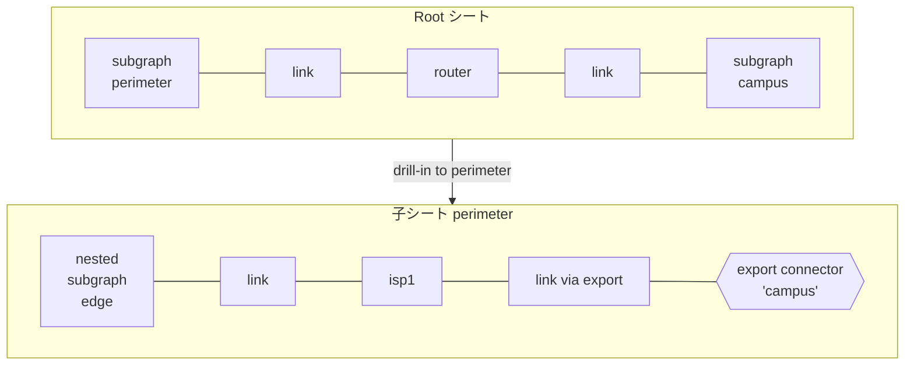
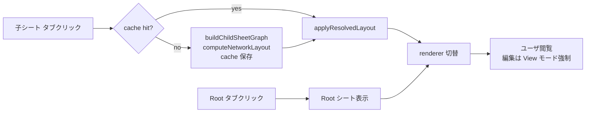
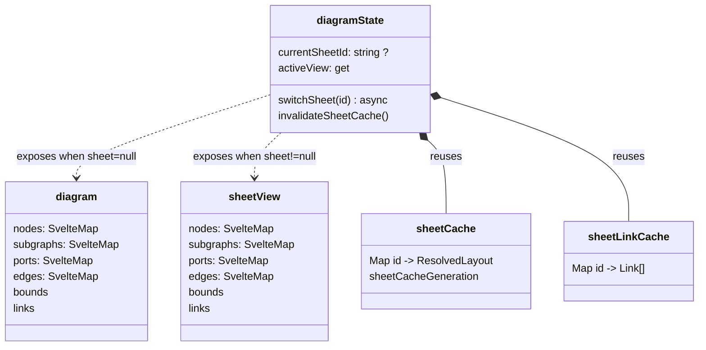

# シートモデル

階層的なネットワーク図を「ページの束」として扱う仕組み。KiCad のシート機能と同じ発想で、トップレベルの subgraph をクリックするとそのサブグラフ内部だけを丸ごと「子シート」として開き、外部とのリンクは境界に **export connector** として現れる。

メンタルモデルは「Root シート」「子シート」「境界接続点」の三つで成り立ちます。

- **Root シート** — ダイヤグラム全体を 1 枚に描いた表示。subgraph はその場で容器として描かれ、内部の node もそのまま見える。これまでのエディタはこれしか無かった。
- **子シート** — トップレベル subgraph 1 つを取り出して、そのサブグラフの直接の子をルートに昇格して描く。subgraph 自身の枠は描かれず、内部 subgraph はネスト容器として残る。
- **境界接続点** — 子シート内側のノードと外側のノードを繋ぐリンクは、内側からは「外への管」として扱う。これを stadium 形（`shape: 'stadium'`）の **export connector** ノードに置き換え、相手シート名をラベルにする。

切替は `SheetBar`（画面下中央）で行う。状態は `diagramState.currentSheetId` に乗り、`null` が Root、それ以外は subgraph id。シート遷移は同期的に state を反映し、レイアウトの計算は非同期で完了次第 `sheetView` に流し込まれる。

## 関係図

Root と子シートの間で起きていることを 1 枚にすると、**フィルタ + プロモート + 連結器置換** の 3 つに分解できる。



- 子シート構築時、**トップレベル subgraph の直接子（node + nested subgraph）だけをフィルタ**する。
- ノード id とサブグラフ id は **prefix を剥がす**（例: `perimeter/edge` → `edge`、`perimeter/security` → `security`）。表示上ローカルな名前空間に正規化される。
- リンクは両端が子シート内に閉じているものだけを残す。**境界を跨ぐリンク**は、外側の終端を相手 subgraph に置き換えた **export connector ノード** に差し替える（`__export_perimeter_to_campus_…` のような id）。dashed line で描画される。

## UI 導線

`SheetBar` は Root + トップレベル subgraph 各 1 つでタブ化される。クリックでそのシートに drill-in、もう一度 Root を押すと戻る。



- 子シート中は `editorState.mode` を強制的に `'view'` 扱いにする。`renderer` は `bind:` で `sheetView` のマップに書き戻すため、編集を許すと root canonical state に届かないままシート切替で消える。Layer 2（`#145`）で書き戻しを実装するまでは読み取り専用。
- ネスト drill-in（子シート内の subgraph をさらにクリックして開く）は未実装。トップレベル subgraph のみが `availableSheets` に挙がる。`#144` 参照。
- export connector ノードはクリックしても何も起きない。本来は相手シートに飛ばしたい（`#144` のスコープに含まれる）。

## データモデル

ランタイム状態は **Root とシートで二重持ち**にし、renderer は `activeView` getter 経由で active な側にバインドする。Root の編集は `diagram` を直接書き換え、シートの再構築は `sheetView` を別個に書き換える。



`activeView` getter:

```ts
get activeView() {
  if (currentSheetId === null) return diagram
  return sheetView
}
```

`+page.svelte` は単に `bind:nodes={diagramState.activeView.nodes}` のように書く。バインド先が `diagram` か `sheetView` かは getter が切替えるため、renderer 側の実装は変更不要。

### `sheetCache` の世代管理

子シートのレイアウトは Root のグラフ構造に依存する。**構造的な変更**（node / subgraph の追加削除、parent の付け替え、link の追加削除更新）が起きたら全シートのキャッシュは無効。**位置だけの変更**（drag、auto-arrange、ラベル編集）はシート構造に影響しないため無効化しない。

| 操作                              | invalidate するか                  |
| --------------------------------- | ---------------------------------- |
| `applyGraph`（load 全置換）       | ✅ する                              |
| `addLink` / `updateLink` / `removeLink` | ✅ する                        |
| `updateNode({ parent: ... })`     | ✅ する（parent 変更時のみ）        |
| `updateSubgraph({ parent: ... })` | ✅ する（parent 変更時のみ）        |
| `moveNodeToGroup`                 | ✅ する                              |
| `removeBomItem`（Node も削除）    | ✅ する                              |
| renderer の `onnodeadd` / `onnodedelete` | ✅ する（`+page.svelte` で明示） |
| ノード drag / autoArrange         | ❌ しない（位置のみ）                |
| label / spec / link bandwidth 等の visual 変更 | ❌ しない                |

`sheetCacheGeneration` カウンタは、**非同期で動いている `switchSheet` の途中で root が書き換わった**ケースを検出する。`switchSheet` が `computeNetworkLayout` を await している間に invalidate が走ると generation が増え、戻り値はもう信用できない → そのまま捨てる：

```ts
const generation = sheetCacheGeneration
const childGraph = buildChildSheetGraph(rootGraph, id)
const { resolved } = await computeNetworkLayout(childGraph)
if (currentSheetId !== id || generation !== sheetCacheGeneration) return
sheetCache.set(id, resolved)
applyResolvedLayout(sheetView, resolved, childGraph.links)
```

stale guard は二段：`currentSheetId !== id`（ユーザが別タブを押した）と `generation !== sheetCacheGeneration`（root が変わった）。

### `buildChildSheetGraph`

`@shumoku/core/hierarchical.ts` から export される **layout-free** な関数。Root の `NetworkGraph` と subgraph id を受け取り、子シートの `NetworkGraph` を返す。レイアウトはやらない。ID prefix の剥離、export connector ノード生成、cross-boundary link の dashed link への置換、すべてここで完結する。

エディタが `computeNetworkLayout` を直接呼ぶことで、`createNetworkLayoutEngine()` 経由の legacy interface（`LayoutEngine.layoutAsync`）を回避し、Sugiyama pipeline と一貫させている。

## ロード経路

`switchSheet` の流れ：

```mermaid
flowchart TD
  S[switchSheet&#40;id&#41;] --> V{id is null?}
  V -->|yes| C0[sheetView クリア<br/>currentSheetId = null]
  V -->|no| K[currentSheetId = id]
  K --> H{cache hit?}
  H -->|yes| AP[applyResolvedLayout<br/>cached]
  H -->|no| BG[buildChildSheetGraph]
  BG --> CL[computeNetworkLayout]
  CL --> SG{generation OK<br/>currentSheetId still id?}
  SG -->|no| DR[結果を捨てる]
  SG -->|yes| ST[sheetCache.set<br/>applyResolvedLayout]
```



`applyResolvedLayout` ヘルパは `sheetView` の SvelteMap identity を保ったまま中身を入れ替える（`replaceMap`）。renderer の `bind:` 接続が切れない。

## 設計のステータス

主要な機能は landed、UX 上の隙間と編集機能が残課題。

| 項目                                        | 状態 | issue           |
| ------------------------------------------- | ---- | --------------- |
| Root + トップレベル subgraph の drill-in   | ✅    | #143 で実装済   |
| Cache + structural-only invalidation        | ✅    | #143 で実装済   |
| Boundary export connector の表示            | ✅    | core から流用   |
| 子シート中の **書き戻し編集**               | ❌    | `#145`（要 #98）|
| **ネスト drill-in**（子の中の subgraph）   | ❌    | `#144`           |
| Cache 構造の polish（2 Map → 1 Map 等）     | ❌    | `#146`           |
| Breadcrumb / parent 表示                    | ❌    | `#144` のスコープ |
| 子シートで add node 時の自動 parent 設定    | ❌    | Layer 2 領域     |

`#145` は renderer の operations separation（`#98`）に依存。それまでは sub-sheet 中は強制 View モード。

## 実装履歴（PR ベース）

- **#143** — Layer 0（state plumbing + SheetBar 機能化）と Layer 1（KiCad 的 drill-down）を 2 commit で landed。`buildHierarchicalSheets` 経由の重い経路で動かしてからすぐに `buildChildSheetGraph` + `computeNetworkLayout` 直接 + cache に置換。

## コード上の場所

- `libs/@shumoku/core/src/hierarchical.ts` — `buildChildSheetGraph`（公開）、`buildChildSheet` / `buildHierarchicalSheets`（HTML renderer 向け、layout 込み）、`generateExportConnectors`（境界 connector 生成）。
- `apps/editor/src/lib/context.svelte.ts` — `currentSheetId` / `sheetView` / `sheetCache` / `sheetLinkCache` / `sheetCacheGeneration`、`switchSheet` / `availableSheets` / `activeView` / `invalidateSheetCache`、`applyResolvedLayout` ヘルパ。
- `apps/editor/src/lib/components/SheetBar.svelte` — Root + 子シートのタブ UI。
- `apps/editor/src/routes/project/[id]/diagram/+page.svelte` — `bind:nodes={diagramState.activeView.nodes}`、子シート時の View モード強制、renderer イベントから `invalidateSheetCache` 呼び出し。
- `docs/ARCHITECTURE.md` — リポジトリ全体俯瞰の中の "Known gaps" 節。
