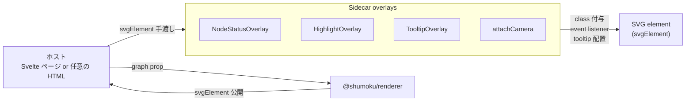
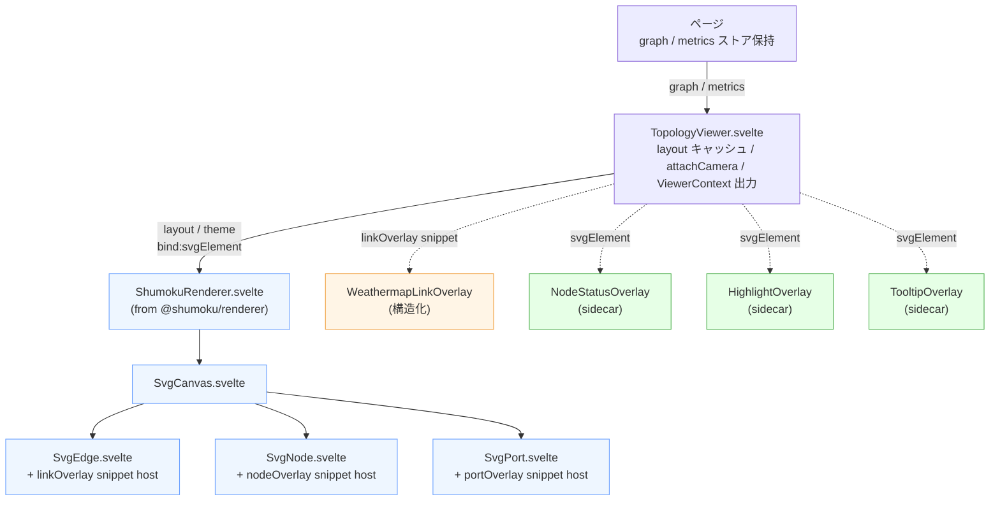
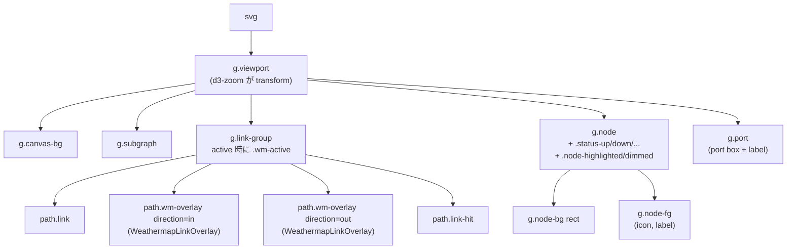
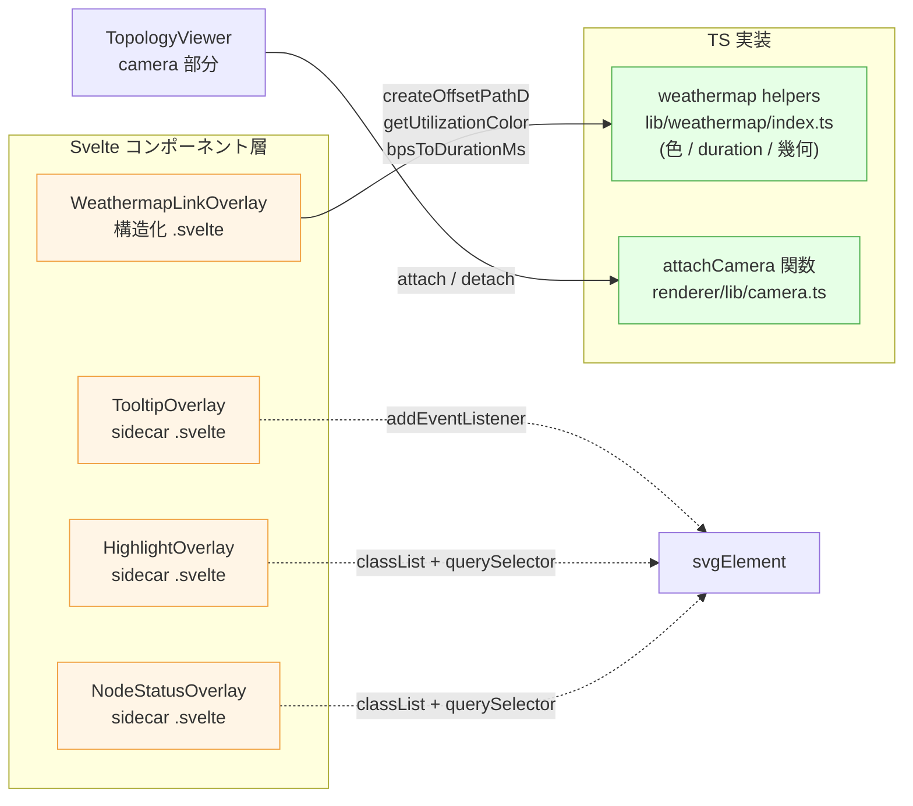
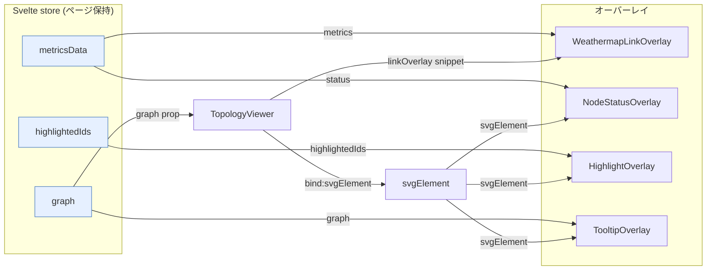
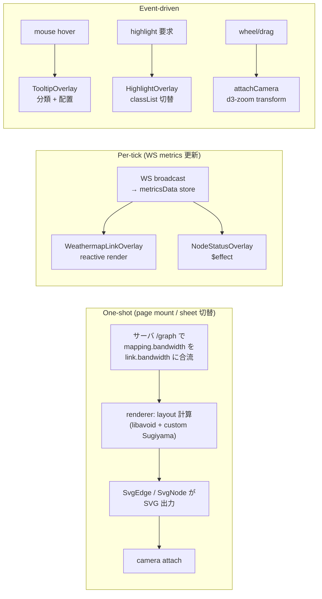

# Topology 描画アーキテクチャ

サーバー Web アプリのトポロジー描画スタック — `@shumoku/renderer` を
中核に、その上に複数のオーバーレイ(weathermap / node-status /
highlight / tooltip / camera)が乗る構造 — を **アーキテクチャ・
構造・相関・フロー** の4軸で説明する。

オーバーレイは大きく **2 種類** に分かれる:

- **構造化 overlay**: renderer の `linkOverlay` / `nodeOverlay` 等の
  snippet で、各 SVG エンティティの中に直接 render される
- **サイドカー overlay**: renderer から `svgElement` だけを受け取って、
  自前で DOM 操作(class 付与、event listener、tooltip 配置等)する

実装の中核:
- `libs/@shumoku/renderer/` — 描画中核(Svelte / Web Component / camera)
- `apps/server/web/src/lib/components/topology/` — サーバ専用 Svelte オーバーレイ群
- `apps/server/web/src/lib/weathermap/` — weathermap 用の色 / duration / ジオメトリ helper

---

## 1. 概要

トポロジー描画は数十〜数百のリンクを同時に表示しつつ、ページは
パン/ズーム、ホバー、WebSocket メトリクス更新も並行して処理する。
3 つの設計原則でこれを軽くしている。

1. **renderer がドメイン構造を所有する。** subgraph / link / node /
   port の DOM 順は renderer が決め、外側からは触らない。z-order は
   この宣言順だけで決まる。
2. **オーバーレイは 2 つの形に揃える。**
   - 各エンティティの中に何かを描き足したい → renderer が公開する
     `linkOverlay` / `nodeOverlay` / `subgraphOverlay` / `portOverlay`
     snippet を使う
   - エンティティ横断 / DOM event / グローバル装飾 → svgElement を
     受け取るサイドカーとして書く
3. **毎フレームのアニメは CSS が動かす。** ブラウザが
   `stroke-dashoffset` / pulse / transition の keyframe ループを
   所有し、JS は値の更新だけを担う。

---

## 2. アーキテクチャ

### 2.1 消費モード

`@shumoku/renderer` は 2 つのモードで使える。サイドカー overlay は
どちらでも動くが、構造化 overlay (snippet 方式) は Svelte 限定。

| モード | 形 | 使用場所 | DOM | snippet |
|---|---|---|---|---|
| **Svelte component** | `<ShumokuRenderer>` | `apps/editor`, `apps/server/web` | light DOM | ✓ |
| **Web Component** | `<shumoku-renderer>` カスタム要素 | 任意の HTML/他フレームワーク | Shadow DOM(`mode: 'open'`) | ✗(代替案は 7 節)|

WC 版は `libs/@shumoku/renderer/src/wc.svelte.ts` で `vite` が
`dist/wc/wc.js` にバンドルし、`customElements.define('shumoku-renderer', ...)`
でタグ登録する。

### 2.2 パッケージ境界

```
libs/@shumoku/renderer/           ← 描画の中核(外部パッケージ)
├── components/
│   ├── ShumokuRenderer.svelte    ← 外向き Svelte component
│   └── svg/
│       ├── SvgCanvas.svelte
│       ├── SvgEdge.svelte        ← path.link + linkOverlay snippet host
│       ├── SvgNode.svelte        ← g.node + nodeOverlay snippet host
│       └── SvgPort.svelte        ← port box + portOverlay snippet host
├── lib/
│   ├── camera.ts                 ← attachCamera 関数(d3-zoom + wheel-gestures)
│   └── overlays.ts               ← snippet の型定義(LinkOverlayContext 等)
├── wc.svelte.ts                  ← Web Component ラッパー
└── index.ts                      ← 公開 API

apps/server/web/src/lib/
├── components/topology/          ← server-web 専用 Svelte
│   ├── TopologyViewer.svelte     ← renderer を mount + sidecar を呼ぶ
│   ├── WeathermapLinkOverlay.svelte   (構造化, linkOverlay snippet)
│   ├── NodeStatusOverlay.svelte  (サイドカー)
│   ├── HighlightOverlay.svelte   (サイドカー、imperative API もあり)
│   └── TooltipOverlay.svelte     (サイドカー、DOM event)
└── weathermap/
    └── index.ts                  ← weathermap helper(色 / duration / 幾何)
```

**依存の向きは常に上向き**(server-web は renderer に依存するが、
renderer は server-web を知らない)。renderer 単体で editor / docs /
CLI でも動く。

### 2.3 オーバーレイの2分類

#### 構造化 overlay(snippet)

renderer が描画順を所有したまま、各ドメイン要素の **中** に Svelte
snippet で拡張点を公開する。snippet は domain object と context を
受け取り、その position に直接 render される。

| snippet | 挿入位置 | 主な用途 | 実装例 |
|---|---|---|---|
| `subgraphOverlay(subgraph, ctx)` | `g.subgraph` 背景 rect 後、label 前 | group 背景装飾 | (未使用) |
| `linkOverlay(edge, ctx)` | `g.link-group` の base link 後、hit path / label 前 | weathermap lane、link 装飾 | **WeathermapLinkOverlay** |
| `nodeOverlay(node, ctx)` | `g.node-bg` 後、`g.node-fg` 前 | node 内バッジ、状態装飾 | (未使用) |
| `portOverlay(port, ctx)` | port box 後、label 前 | port 内状態、利用率表示 | (未使用) |

context には **domain object 参照** と **DOM 参照** の両方が入る:

```ts
// libs/@shumoku/renderer/src/lib/overlays.ts
export interface LinkOverlayContext {
  selected: boolean
  groupElement: SVGGElement | null      // ← 親 g.link-group
  pathElement: SVGPathElement | null    // ← base path.link
  pathD: string
  width: number                         // ← getLinkWidth(link)
  fromPort: ResolvedPort | null
  toPort: ResolvedPort | null
  ...
}
```

これにより overlay は `closest('g.link-group')` のような class 名逆引き
を一切しない。renderer が DOM 構造を refactor しても snippet 契約だけ
保てば壊れない。

#### サイドカー overlay

renderer 本体を直接 import せず、`svgElement: SVGSVGElement` だけ
受け取って、その中で DOM 操作する。複数エンティティを横断する処理 /
DOM event ハンドリング / グローバル装飾はこちら。



**サイドカーの契約**:

1. 入力は `svgElement` のみ。renderer 内部に依存しない
2. DOM 操作は渡された svg 配下に閉じる(`document.querySelector` は使わない)
3. `destroy()` / `detach()` で自分が付けたものを全部クリーンアップ
4. renderer の DOM 属性は**読むだけ**、書き換えない
5. CSS 注入は `svelte:head` または scoped style(現状 light DOM 前提、詳細は 7 節)

サイドカーは現状 **renderer の class 名 / data-attribute に依存する**
(e.g. `g.node[data-id]`、`g.link-group[data-link-id]`)。これらは
renderer の "public DOM contract" として安定扱い。

### 2.4 描画型モデルと設計思想

トポロジーの概念構造はグラフであり、SVG DOM は木構造である。特に
`Port` は「Node の所有物」である一方、「Link の端点」でもあるため、
DOM の親子だけで概念を表そうとすると破綻しやすい。

このため、描画型モデルは **所有(ownership)** と **参照(reference)**
を分けている。

```txt
Node owns Port
Link references endpoint Ports
ResolvedEdge owns resolved endpoint references
Renderer owns SVG order
Overlay receives typed context
```

#### Core model

core の生モデルでは、`Node` / `Subgraph` / `Link` がユーザー入力に近い
ドメインオブジェクト。`Port` は Node に属するインターフェースであり、
`Link` は `from` / `to` endpoint で node/port を参照する。

```txt
Node
  └─ Port definition

Link
  ├─ from: { node, port? }
  └─ to:   { node, port? }
```

ここで Link が Port の実体コピーを持たないのは、ラベル変更、ポート
サイズ、位置、削除時の正本を Node 側に一本化するため。Port を Node と
Link の両方が実体所有すると、同期問題が発生する。

#### Resolved layout model

layout 後は、描画に必要な座標と関係を `Resolved*` 型に落とす。

| 型 | 役割 |
|---|---|
| `Node` | position 済みの node 本体 |
| `Subgraph` | bounds 済みの group |
| `ResolvedPort` | Node 所有の port を絶対座標に解決したもの |
| `ResolvedEdge` | Link の routing 結果 + endpoint port 参照 |

`ResolvedEdge` は `fromPortId` / `toPortId` だけでなく、
`fromPort` / `toPort` も持つ。

```ts
interface ResolvedEdge {
  id: string
  fromPortId: string | null
  toPortId: string | null
  fromPort: ResolvedPort | null
  toPort: ResolvedPort | null
  points: Position[]
  width: number
  link: Link
}
```

これは「Port の所有者は Node」という原則を保ったまま、Link 側の描画
や overlay が endpoint port を型付きで直接扱えるようにするため。
renderer 側で `ports.get(edge.fromPortId)` のように逆引きしない。

#### Renderer model

renderer は `ResolvedLayout` を SVG DOM に落とす責務を持つ。描画順は
renderer が所有し、overlay はこの順序を変更しない。

```txt
g.viewport
  g.subgraph
  g.link-group
  g.node
  g.port
```

この順序は z-order そのものでもある。SVG は後に出た要素ほど上に描かれる
ため、z-order を CSS や overlay 側 DOM 操作で調整しない。

#### Overlay context model

構造化 overlay は、DOM を query して必要情報を探すのではなく、renderer
から typed context として受け取る。

```ts
linkOverlay(edge, ctx)
```

`edge` には routing 済みの path と endpoint port 参照があり、`ctx` には
renderer が生成した DOM 参照が入る。

```ts
interface LinkOverlayContext {
  groupElement: SVGGElement | null
  pathElement: SVGPathElement | null
  pathD: string
  width: number
  fromPort: ResolvedPort | null
  toPort: ResolvedPort | null
}
```

この分担により、overlay は `.link-group` や `path.link` という class 名を
知る必要がない。class 名に依存するのは、複数要素を横断するサイドカー
overlay に限定する。

### 2.5 Renderer boundary

renderer は **リッチなブラウザ機能を内蔵する場所ではない**。renderer の
責務は、core の topology domain を安定した SVG 構造へ落とし、外側の
ブラウザ層が安全に拡張できる場所と型を提供すること。

言い換えると、renderer は「何を意味するか」ではなく **「どこに、どの
構造で描けるか」** を所有する。

```txt
renderer = stable structure provider
host layer = semantic behavior provider
overlay = typed bridge between them
```

#### renderer が所有するもの

| 責務 | 理由 |
|---|---|
| `NetworkGraph` / `ResolvedLayout` を SVG DOM に落とす | renderer の本分 |
| `subgraph → link → node → port` の z-order | SVG の描画順は DOM 順で決まるため |
| 各 entity 内の基本 DOM 構造 | overlay が安全に乗る土台 |
| hit target / selection の基本イベント | editor / server-web / docs で共通 |
| `linkOverlay` 等の typed extension point | 外側の機能を renderer に混ぜないため |
| `svgElement` の公開 | camera / tooltip 等の sidecar を可能にするため |
| 汎用的な `mode` / `theme` | topology renderer として横断的に意味があるため |

#### renderer が所有しないもの

| 責務 | 所有者 |
|---|---|
| live metrics / WebSocket / polling | host app / store |
| traffic flow / weathermap の意味論 | server-web overlay |
| node status の解釈(up/down/degraded 等) | server-web overlay |
| highlight のルール / spotlight / dashboard event | host app / overlay |
| tooltip の内容生成 | host app / overlay |
| utilization color map / alert threshold | domain-specific layer |
| dashboard widget の状態 / config | server-web |
| API fetch / auth / tenant context | server-web |

これらを renderer に入れ始めると、renderer が `@shumoku/core` の汎用描画
ではなく server-web dashboard 専用 UI になってしまう。たとえば
`metrics` / `nodeStatus` / `showTrafficFlow` / `tooltipBuilder` のような
props は renderer に追加しない。

#### 判断基準

新しい機能を renderer に入れるか overlay / host layer に置くか迷ったら、
以下で判断する。

| 問い | yes なら |
|---|---|
| `NetworkGraph` / `ResolvedLayout` だけで説明できるか？ | renderer 候補 |
| editor / docs / WC / server-web のどれでも同じ意味があるか？ | renderer 候補 |
| SVG 構造、z-order、hit area、汎用 event に関するものか？ | renderer 候補 |
| server-web の store / API / live metrics を知る必要があるか？ | host / overlay |
| 状態の意味解釈(status, utilization, alert 等)を含むか？ | host / overlay |
| 見た目の効果は汎用だが、発火条件が業務固有か？ | renderer は拡張点だけ提供 |

基本方針は、renderer には **拡張点と型** を足し、意味論は外側に置くこと。
今回の weathermap も renderer に traffic 機能を入れたのではなく、
`linkOverlay(edge, ctx)` という link 内拡張点を公開し、server-web 側が
その上に traffic 表現を載せている。

---

## 3. 構造

### 3.1 Svelte コンポーネントツリー



青 = renderer 内部 / 橙 = 構造化 overlay / 緑 = サイドカー overlay

### 3.2 描画後の SVG DOM ツリー



**z-order の不変条件**: renderer が `.viewport` 内の大枠順序
`subgraphs → edges → nodes → ports` を所有する。各エンティティの内部順序
(base → overlay snippet → hit area / label)も renderer が固定する。
overlay 側で DOM 挿入位置を弄る必要は無い。

---

## 4. 相関

### 4.1 Svelte ↔ TS 実装の wrap 関係

オーバーレイの実装パターンは 3 種類:

| パターン | 例 | DOM 操作 | 状態管理 |
|---|---|---|---|
| **構造化 overlay**(.svelte 単独) | WeathermapLinkOverlay | template の `<path>` を Svelte が render | `$derived` / `$effect` |
| **サイドカー(.svelte 単独)** | NodeStatusOverlay / HighlightOverlay / TooltipOverlay | `svgElement.querySelectorAll(...)` + classList 操作 | `$effect` |
| **サイドカー(関数)** | attachCamera | svgElement に listener 追加 + d3-zoom | closure |



### 4.2 ライフサイクルの手綱

各オーバーレイは Svelte 5 runes(`$props` / `$effect` / `$derived`)
の標準パターン:

```ts
// 構造化 overlay の骨格 (WeathermapLinkOverlay.svelte)
let { context, metrics, enabled, animation }: Props = $props()
const baseColor = $derived(/* ... */)

$effect(() => {
  const group = context.groupElement
  if (!group || !active) {
    group?.classList.remove('wm-active')
    return
  }
  group.classList.add('wm-active')
  group.style.setProperty('--wm-base-color', baseColor)
  return () => {
    group.classList.remove('wm-active')
    group.style.removeProperty('--wm-base-color')
  }
})
```

```ts
// サイドカー overlay の骨格 (NodeStatusOverlay.svelte)
let { svgElement, status, enabled }: Props = $props()

$effect(() => {
  if (!svgElement || !enabled) return
  const svg = svgElement
  for (const [id, meta] of Object.entries(status ?? {})) {
    svg.querySelector(`g.node[data-id="${CSS.escape(id)}"]`)
      ?.classList.add(`status-${meta.status}`)
  }
  return () => {
    /* clear classes on cleanup */
  }
})
```

**共通の不変条件**:

- **svgElement / context が変わったら自動的に reset**(`$effect` 依存追跡)
- **小さい props 変更だけでは再構築しない**(必要な計算は `$derived` で memoize)
- **unmount で必ず cleanup**

---

## 5. フロー

### 5.1 Svelte 視点 — props / bind の向き



- **graph は上から props で流れ下る**(page → TopologyViewer → ShumokuRenderer)
- **構造化 overlay は renderer の snippet で各エンティティ内に入る**
- **サイドカー overlay は svgElement を受け取って自前で DOM 操作**
- **オーバーレイは store に直接触らない**(props 経由のみ — テスタビリティと WC 対応のため)

### 5.2 時間軸 — one-shot と per-tick



- **One-shot** は page mount / sheet 切替時に 1 回。重い layout 計算が
  ここに集中
- **Per-tick** は数秒おき。表示中エンティティの差分更新だけ走る
- **Event-driven** はユーザー操作毎。debounce / throttle は各 overlay
  内で必要に応じて

---

## 6. オーバーレイ詳細

各オーバーレイの入力 / 出力 / DOM 操作 / カスタマイズ点をまとめる。

### 6.1 Weathermap(構造化、`linkOverlay` snippet)

**用途**: 各リンク上に流量を 2 レーンのドットで可視化、利用率に応じて
base pipe を tint する。

**入力**:
- `context: LinkOverlayContext`(renderer から)
- `metrics: LinkFlowMetrics`(in/out 利用率と bps)
- `enabled` / `animation`(`'full'` / `'reduced'` / `'off'`)

**DOM 出力**(`g.link-group` の中):
- `path.wm-overlay[data-direction="in"]`
- `path.wm-overlay[data-direction="out"]`
- 親 `g.link-group` に `.wm-active` クラス + `--wm-base-color` 変数

**CSS 契約**(WeathermapLinkOverlay.svelte の `<style>`):

| 変数 | スコープ | 用途 |
|---|---|---|
| `--wm-color` | レーン path | 色(利用率マップ or down 時赤) |
| `--wm-width` | レーン path | 太さ = `max(baseWidth / 2, 2)` |
| `--wm-dash` | レーン path | dash パターン(通常 `"3 21"`、down `"8 4"`) |
| `--wm-opacity` | レーン path | 透明度(通常 `0.9`、down `0.5`) |
| `--wm-duration` | レーン path | 周期(`bpsToDurationMs(bps)`、300ms–2s) |
| `--wm-play` | レーン path | `running` / `paused` |
| `--wm-base-color` | `g.link-group` | base pipe の tint 色 |

**レーン幾何**(stroke の内側に 2 本):

```
laneWidth  = max(baseWidth / 2, 2)
laneOffset = baseWidth / 4
in  lane:  offset = +laneOffset  (stroke 上半分)
out lane:  offset = -laneOffset  (stroke 下半分)
```

10G リンク(baseWidth 14)の例:

```
┌───── baseWidth 14 ─────┐
│  ═══ ═  ═══  ═══  ═══ │  ← out lane (width 7, offset -3.5)
│───────── base ──────── │  ← path.link (stroke は --wm-base-color で tint)
│    ═══  ═══  ═══ ═    │  ← in  lane (width 7, offset +3.5)
└────────────────────────┘
```

**アニメ**(`stroke-dashoffset` の keyframe):

```css
@keyframes wm-flow-in  { from { stroke-dashoffset: 0; } to { stroke-dashoffset: -24; } }
@keyframes wm-flow-out { from { stroke-dashoffset: 0; } to { stroke-dashoffset:  24; } }
```

`-24` / `+24` は `dash (3) + gap (21) = 24` px 。1 周期で dash+gap 1 単位
進む。

**Base tint**(SVG 属性を CSS で上書き):

```css
:global(.wm-active > path.link) {
  stroke: var(--wm-base-color, currentColor);
  opacity: 0.55;
  transition: stroke 200ms ease, opacity 200ms ease;
}
```

`:global()` は同コンポーネントで定義した変数を、外側 (`g.link-group` /
`path.link` は SvgEdge.svelte が出してる) のスコープに当てるため。

**モード**:

| モード | 動作 |
|---|---|
| `'full'` | ドットアニメ + tint |
| `'reduced'` | `.wm-static` で keyframe 停止、solid lane |
| `'off'` | render 自体スキップ |
| `prefers-reduced-motion` | `@media` で keyframe 強制停止(tint は残す) |
| `@media print` | `app.css` 側でオーバーレイ非表示、tint 解除 |

### 6.2 Node Status(サイドカー、`<svelte:head>` で CSS 注入)

**用途**: ノードに up/down/warning/degraded/unknown の状態色を反映。

**入力**:
- `svgElement: SVGSVGElement`
- `status: Record<nodeId, { status: string }>`
- `allowedStatuses?` (default: `['up', 'down', 'unknown', 'warning', 'degraded']`)

**DOM 操作**: 各 `g.node[data-id]` に `status-up` / `status-down` 等の
クラスを付与。要素自体は作らない、classList 操作だけ。

**CSS**(`<svelte:head>` で `<style id="shumoku-node-status-css">` を注入):

```css
g.node.status-up    .node-bg rect { stroke: #22c55e; stroke-width: 2px; }
g.node.status-down  .node-bg rect {
  stroke: #ef4444; stroke-width: 2.5px;
  filter: drop-shadow(0 0 6px ...);
  animation: shumoku-status-down-pulse 1.6s infinite alternate;
}
g.node.status-warning  .node-bg rect { stroke: #f97316; ... }
g.node.status-degraded .node-bg rect { stroke: #eab308; ... }
g.node.status-unknown  .node-bg rect { stroke: #6b7280; stroke-dasharray: 4 3; }
```

`<svelte:head>` 注入を使う理由は、複数の Svelte コンポーネントが
同じ rule 集合を共有するため(scoped style だと各コンポーネントで
重複定義になる)。

`@media print` と `prefers-reduced-motion` も同じ block で扱う。

### 6.3 Highlight(サイドカー、reactive + imperative)

**用途**: 検索結果や選択フィルタで、特定ノードを強調(pulse + drop-shadow)、
他を dim する。

**入力**:
- `svgElement`
- `highlightedIds?: ReadonlySet<string> | string[]`(reactive)
- `attributeMatch?: { key, value }`(reactive、属性ベースマッチ)
- `dimOthers?: boolean` — 非マッチを暗くする
- `highlightColor?: string` — `--highlight-color` に流す
- `pulseAnimation?: boolean`

**imperative API**(`bind:this` で取って使える):
- `apply(ids: Iterable<string>): void`
- `applyByAttribute(key, value): void`
- `clearHighlight(): void`

reactive と imperative が共存してるのは、ダッシュボードからの
クエリ駆動(reactive)と event 駆動(`onhover` callback など)の
両方に対応するため。

**DOM 操作**: マッチした `g.node[data-id]` に `.node-highlighted`、
`dimOthers=true` なら他全ての node + link-group に `.node-dimmed`。

**CSS**(`<svelte:head>` で `<style id="shumoku-highlight-css">`):

```css
g.node.node-highlighted {
  animation: var(--highlight-pulse, node-pulse) 0.5s ease-in-out infinite alternate;
}
g.node.node-highlighted rect,
g.node.node-highlighted circle,
g.node.node-highlighted path {
  stroke: var(--highlight-color, #f59e0b) !important;
  stroke-width: 3px !important;
  filter: drop-shadow(0 0 8px ...);
}
g.node.node-dimmed,
g.link-group.node-dimmed {
  opacity: 0.15;
  transition: opacity 0.2s ease;
}
```

色とアニメは `--highlight-color` / `--highlight-pulse` 変数で外から
上書き可能。SVG element 側に `style.setProperty` で書き込む。

### 6.4 Tooltip(サイドカー、DOM event)

**用途**: ホバー時のツールチップ。何が hover されたか(node /
subgraph / link)を分類して、カスタマイズ可能な内容を浮かべる。

**入力**:
- `svgElement` / `graph` / `enabled` / `delay` / `maxWidth`
- `content?: Snippet<{ hovered, graph }>` — Svelte snippet で本体を描く
- `contentBuilder?: (hovered, graph) => string` — 文字列で本体を返す関数

**DOM 操作**:
- `mouseover` / `mouseout` / `mousemove` を `svgElement` に直接 attach
  (`AbortController` で cleanup)
- ツールチップ本体は **コンポーネントが直接 `<div>` を render**(SVG
  外、`position: fixed`)
- DOM 改変は無し(svg 配下は読み取りのみ)

**hit detection**:

```ts
function classify(target: EventTarget): HoveredElement | null {
  if (target.closest('g.node[data-id]'))      return { kind: 'node', ... }
  if (target.closest('g.subgraph[data-id]'))  return { kind: 'subgraph', ... }
  if (target.closest('g.link-group[data-link-id]')) return { kind: 'link', ... }
  return null
}
```

`closest()` で renderer の class 名 / data-attribute を逆引きしてる。
これはサイドカー特有の "public DOM contract" 依存(2.3 節参照)。

### 6.5 Camera(関数 utility、`@shumoku/renderer` 提供)

**用途**: pan / zoom。マウスホイール = ズーム、トラックパッド 2 本指 =
パン、ピンチ = ズーム、Alt+左 / 中ボタンドラッグ = パン。

**API**(関数1個):

```ts
const camera = attachCamera(svgElement, {
  wheelMode: 'auto',          // 'auto' | 'zoom' | 'pan'
  panFilter: ...,
  ...
})
camera.zoomBy(factor)
camera.reset()
camera.panToNode(nodeId)
camera.detach()
```

**実装**: d3-zoom + wheel-gestures。マウスホイールとトラックパッドを
gesture 開始時に "sticky" に判別し、gesture 中は同じ扱いを維持
(zoom と pan が混ざらない)。詳しくは `docs/ARCHITECTURE.md` の
Camera 節 と `libs/@shumoku/renderer/src/lib/camera.ts` を参照。

**DOM 操作**: svgElement 上の wheel / pointerdown / pointermove
listener と、`g.viewport` の `transform` 属性。renderer の class 名
には依存しない(`g.viewport` は renderer が常に出す唯一の zoom 対象)。

`TopologyViewer.svelte` がこの関数を呼んで camera を attach し、
sheet 切替時に `camera.reset()` する。

---

## 7. Web Component 対応状況

### 7.1 公開 API 対応表

WC も Svelte 版も **svgElement を外に出す契約**。サイドカーはこの
svgElement を受け取って動く。

| 面 | WC (`<shumoku-renderer>`) | Svelte (`<ShumokuRenderer>`) |
|---|---|---|
| graph | `el.graph = ...` setter | `bind:nodes bind:links ...` |
| theme | `el.theme = ...` setter | `theme={...}` prop |
| mode | `el.mode = 'view' | 'edit'` | `mode={...}` prop |
| SVG 取得 | `el.svgElement` getter | `bind:svgElement` |
| イベント | `el.onshumokuselect = fn` | `onselect={fn}` |
| 命令的操作 | `el.addNewNode(...)` | `renderer.addNewNode(...)` |
| **構造化 overlay (snippet)** | ✗ 未対応 | ✓ |

WC 版からの利用例(他フレームワーク / 素 HTML):

```html
<shumoku-renderer id="topo"></shumoku-renderer>
<script>
  const el = document.querySelector('#topo')
  el.graph = myGraph
  // サイドカーは同じ関数で動く
  const camera = attachCamera(el.svgElement)
  // 構造化 overlay は WC では未提供(後述)
</script>
```

### 7.2 Shadow DOM での CSS 注入問題

WC 版は **Shadow DOM 内** に SVG を描く。サイドカーの DOM 操作は
svgElement 配下で完結するので問題ないが、**CSS 注入** は経路によって
shadow に届く / 届かないが分かれる。

| 注入方式 | 使用しているオーバーレイ | Shadow DOM への到達 |
|---|---|---|
| Svelte コンポーネントの `<style>`(scoped) | WeathermapLinkOverlay | 微妙 — Svelte ランタイムが生成する `<style>` は document.head 行き。`:global()` 内の rule は shadow に届かない |
| `<svelte:head>` で `<style>` 注入 | NodeStatusOverlay / HighlightOverlay | ✗ — 常に document.head 行き、shadow に届かない |
| 要素の `style.setProperty('--var', ...)` | 全 overlay | ✓ — 要素自体に書くので shadow も関係なし |
| `attachCamera` の SVG transform 操作 | Camera | ✓ — CSS 不使用 |

**現状**: Svelte 版しか使ってないので実害なし。WC 外部配布を始める
タイミングで、`<svelte:head>` の代わりに **shadow root に注入** する
ヘルパーが必要:

```ts
function ensureStyleInRoot(svg: SVGSVGElement, id: string, css: string): void {
  const root = svg.getRootNode()
  const target = root instanceof ShadowRoot ? root : document.head
  if (target.querySelector(`#${id}`)) return
  const style = document.createElement('style')
  style.id = id
  style.textContent = css
  target.appendChild(style)
}
```

これを各 overlay の `$effect` 開始時に呼ぶように変える(現状 NodeStatus
/ Highlight の `<svelte:head>` 部分を置き換える)。

**構造化 overlay の WC 対応**: snippet は Svelte 限定なので、WC では
`linkOverlay` 等の機能が使えない。代替案は以下のいずれか:

- HTML `<slot>` で「リンクごとに複製」を実現(MutationObserver が必要)
- imperative callback API(`el.onRenderLink = (link, group) => {...}`)
- 構造化 overlay は Svelte 専用と割り切り、WC は visual-only(camera
  + tooltip)で運用

---

## 8. 不変条件・注意点

### 8.1 共通(全オーバーレイ)

1. **入力は受け取った参照のみで完結**(`svgElement` / `context`)。
   `document.querySelector` などグローバルアクセスは使わない
2. **renderer の DOM 属性は読むだけ、書き換えない**(必要なら CSS 変数
   や class 経由で上書き)
3. **unmount で必ず cleanup**(class 削除 / CSS 変数削除 / listener
   abort / timer clear)
4. **渡された domain object が変われば自動 reset**(`$effect` 依存追跡
   に任せる)
5. **store には触らない**(props 経由)

### 8.2 構造化 overlay

- snippet 内で `closest('g.link-group')` 等の class 名逆引きは禁止 —
  必要な参照は context 経由で受け取る
- snippet の return 直前に追加要素を render するだけで済むよう設計する
  (DOM 並び替えは不可)

### 8.3 サイドカー overlay

- renderer の **public DOM contract**(class 名 / data-attribute)に
  依存する。ここは renderer 側の breaking change 扱い:
  - `g.viewport`、`g.node[data-id]`、`g.link-group[data-link-id]`、
    `g.subgraph[data-id]`、`g.node-bg`、`path.link`、port box
- DOM event の listener は `AbortController` で必ず cleanup

### 8.4 Weathermap 固有

- レーン path のサンプリング: 直線は fast path、曲線は法線方向に 30+ 点
- pan/zoom 追従: `g.viewport` の transform に乗るので毎フレーム同期不要
- `prefers-reduced-motion` は keyframe だけ止める(色 / 太さ情報は残す)

---

## 付録 A: 関連ファイル

### Renderer 中核

| ファイル | 役割 |
|---|---|
| `libs/@shumoku/renderer/src/components/ShumokuRenderer.svelte` | 描画中核の Svelte コンポーネント |
| `libs/@shumoku/renderer/src/components/svg/SvgEdge.svelte` | `path.link` + `linkOverlay` snippet host |
| `libs/@shumoku/renderer/src/components/svg/SvgNode.svelte` | `g.node` + `nodeOverlay` snippet host |
| `libs/@shumoku/renderer/src/components/svg/SvgPort.svelte` | port box + `portOverlay` snippet host |
| `libs/@shumoku/renderer/src/lib/overlays.ts` | snippet の型定義(LinkOverlayContext 等) |
| `libs/@shumoku/renderer/src/lib/camera.ts` | `attachCamera` (pan/zoom) |
| `libs/@shumoku/renderer/src/wc.svelte.ts` | `<shumoku-renderer>` Web Component ラッパー |

### 構造化 overlay

| ファイル | 役割 |
|---|---|
| `apps/server/web/src/lib/components/topology/WeathermapLinkOverlay.svelte` | `linkOverlay` snippet 内で flow lane を描く |
| `apps/server/web/src/lib/weathermap/index.ts` | weathermap の色 / duration / 幾何ヘルパー |

### サイドカー overlay

| ファイル | 役割 |
|---|---|
| `apps/server/web/src/lib/components/topology/NodeStatusOverlay.svelte` | `status-up/down/...` クラスと CSS(svelte:head) |
| `apps/server/web/src/lib/components/topology/HighlightOverlay.svelte` | ノード強調(reactive + imperative)とその CSS |
| `apps/server/web/src/lib/components/topology/TooltipOverlay.svelte` | hover ツールチップ |

### ホスト + サーバ側

| ファイル | 役割 |
|---|---|
| `apps/server/web/src/lib/components/topology/TopologyViewer.svelte` | renderer mount + `attachCamera` + ViewerContext 出力 |
| `apps/server/api/src/api/topologies.ts` (`applyMappingBandwidth`) | mapping の override を `link.bandwidth` に合流させるサーバ側ロジック |
| `libs/@shumoku/core/src/layout/link-utils.ts` (`getLinkWidth`) | bandwidth → stroke-width の校正(single source of truth) |
