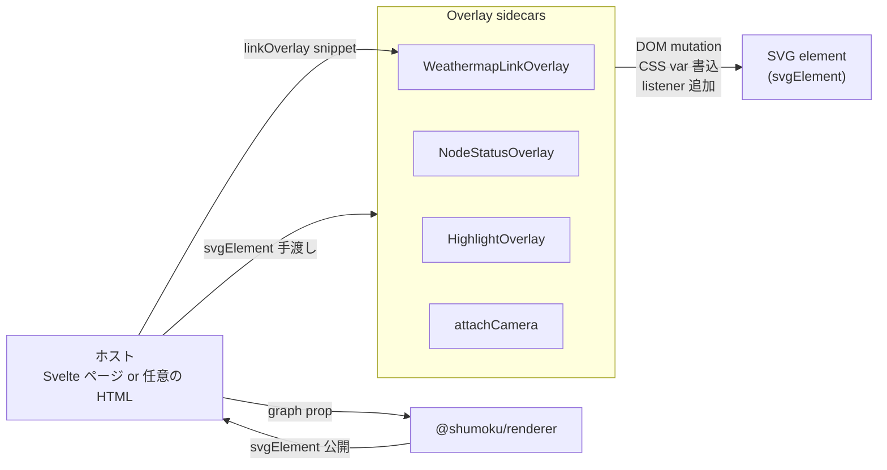
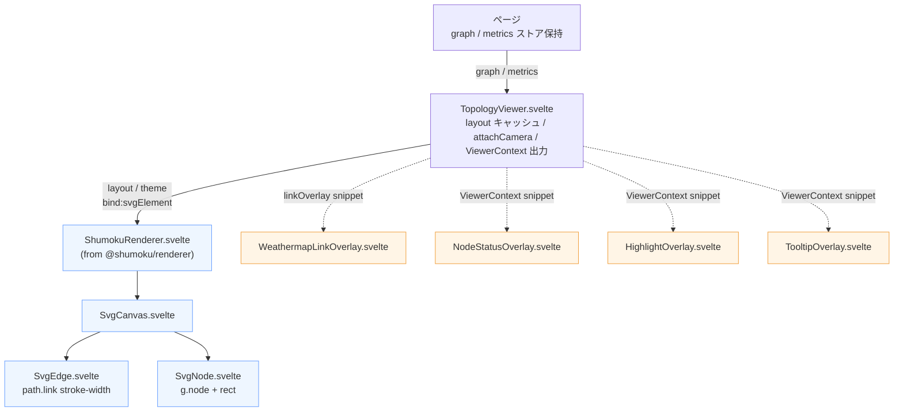
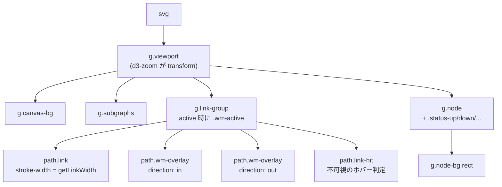
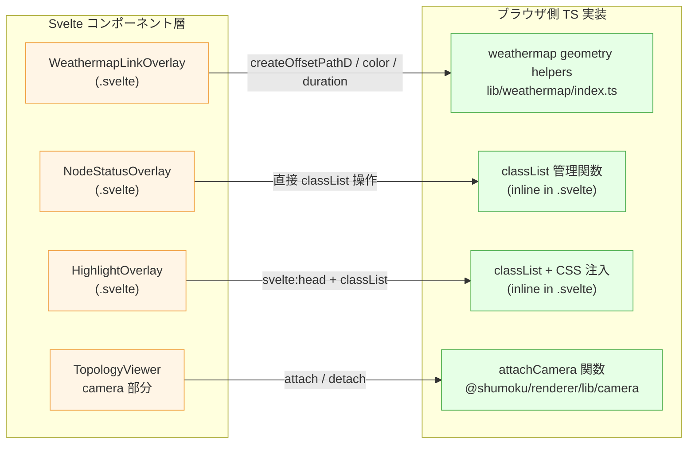
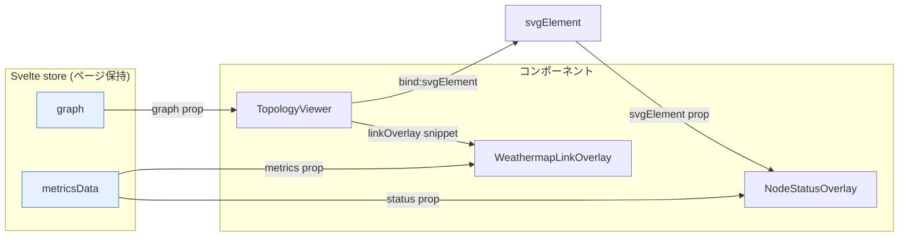
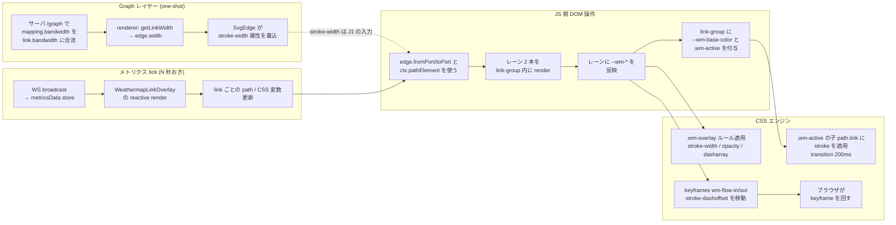

# Topology 描画アーキテクチャ

サーバー Web アプリのトポロジー描画スタック — `@shumoku/renderer` を
中核に、renderer が公開する構造化オーバーレイ(link / node / port /
subgraph snippet)と、従来型のサイドカー(node-status / highlight /
tooltip / camera)を組み合わせる構造 — を **アーキテクチャ
・構造・相関・フロー** の4軸で説明する。

本書の主要な具体例は **weathermap**(各リンク上をドットが流れる
ライブトラフィック可視化)だが、ほとんどの設計原則は他のオーバーレイ
にも共通して当てはまる。

実装の中核:
- `libs/@shumoku/renderer/` — 描画中核(Svelte / Web Component)
- `apps/server/web/src/lib/components/topology/` — サーバ専用 Svelte オーバーレイ
- `apps/server/web/src/lib/weathermap/` — weathermap 用の色 / duration / ジオメトリ helper

---

## 1. 概要

weathermap は数十〜数百のリンクを同時にアニメーションさせつつ、
ページはパン/ズーム、ツールチップ、WebSocket メトリクス更新も
同時に処理する。2つの設計判断でこれを軽くしている。

1. **毎フレームのアニメは CSS が動かす、JS ではない。** ブラウザが
   `stroke-dashoffset` の keyframe ループを所有するので、JS 側は
   per-frame の処理を持たない。
2. **weathermap は link の内側に描く。** renderer の `linkOverlay`
   snippet で `g.link-group` の中へ flow lane を差し込むため、別
   レイヤーを DOM 順で後から動かす必要がない。
3. **tick ごとの更新は Svelte の差分と CSS 変数に寄せる。** メトリクス
   が来たら、該当リンクの overlay path と `--wm-*` 変数だけが更新される。

---

## 2. アーキテクチャ

### 2.1 消費モード

`@shumoku/renderer` は 2 つのモードで使える。weathermap を含む
全オーバーレイは、どちらでも動くようになっている(Shadow DOM の
注意点は 8 節参照)。

| モード | 形 | 使用場所 | DOM |
|---|---|---|---|
| **Svelte component** | `<ShumokuRenderer>` | `apps/editor`, `apps/server/web` | light DOM |
| **Web Component** | `<shumoku-renderer>` カスタム要素 | 任意の HTML/他フレームワーク | Shadow DOM(`mode: 'open'`) |

WC 版は `libs/@shumoku/renderer/src/wc.svelte.ts` で `vite` が
`dist/wc/wc.js` にバンドルし、`customElements.define('shumoku-renderer', ...)`
でタグ登録する。

### 2.2 パッケージ境界

```
libs/@shumoku/renderer/           ← 描画の中核(外部パッケージ)
├── components/
│   ├── ShumokuRenderer.svelte    ← 外向き Svelte component
│   └── svg/
│       ├── SvgCanvas.svelte
│       ├── SvgEdge.svelte        ← path.link に stroke-width を書く
│       └── SvgNode.svelte        ← g.node.node-bg rect 等を出す
├── lib/camera.ts                 ← attachCamera 関数
├── wc.svelte.ts                  ← Web Component ラッパー
└── index.ts                      ← 公開 API

apps/server/web/src/lib/
├── components/topology/          ← server-web 専用 Svelte
│   ├── TopologyViewer.svelte     ← renderer を mount + sidecar を呼ぶ
│   ├── WeathermapLinkOverlay.svelte
│   ├── NodeStatusOverlay.svelte
│   ├── HighlightOverlay.svelte
│   └── TooltipOverlay.svelte
└── weathermap/
    └── index.ts                  ← weathermap helper(素の TS)
```

**依存の向きは常に上向き**(server-web は renderer に依存するが、
renderer は server-web を知らない)。そのおかげで renderer は単体で
editor/docs/CLI で動く。

### 2.3 構造化 overlay とサイドカー

renderer は描画順を所有したまま、各ドメイン要素の内側に Svelte
snippet の拡張点を公開する。

| snippet | 挿入位置 | 主な用途 |
|---|---|---|
| `subgraphOverlay(subgraph, ctx)` | `g.subgraph` の背景 rect 後、label 前 | group 背景装飾 |
| `linkOverlay(edge, ctx)` | `g.link-group` の base link 後、hit path / label 前 | weathermap lane、link 装飾 |
| `nodeOverlay(node, ctx)` | `g.node-bg` 後、`g.node-fg` 前 | node 内バッジ、状態装飾 |
| `portOverlay(port, ctx)` | port box 後、label 前 | port 内状態、利用率表示 |

weathermap は `linkOverlay` を使う。したがって flow lane は個々の
`g.link-group` の子として描かれ、z-order は renderer の通常の
描画順に従う。

`ResolvedEdge` は `fromPortId` / `toPortId` だけでなく、resolve 済みの
`fromPort` / `toPort` も持つ。Port の実体所有者は Node だが、Link は
endpoint として Port 参照を持つ、という構造にしている。

一方、node-status / highlight / tooltip / camera は、複数要素を横断
する挙動や DOM event が中心なので、従来通り `svgElement` を受け取る
サイドカーとして動く。

サイドカー型オーバーレイは **renderer 本体を直接 import しない**。
受け取るのは `svgElement: SVGSVGElement` だけで、そこから下だけで
DOM 操作する。



**サイドカーの契約**:

1. 入力は `svgElement` のみ。renderer 内部に依存しない
2. DOM 操作は渡された svg 配下に閉じる(`document.querySelector` は使わない)
3. `destroy()` / `detach()` で自分が付けたものを全部クリーンアップ
4. renderer の DOM 属性は**読むだけ**、書き換えない(e.g. `stroke-width`
   を読むが、`stroke` を直書きしない — CSS 変数経由で上書きする)
5. CSS 注入は `svg.getRootNode()` で判別(現状 light DOM 前提、詳細は 8 節)

---

## 3. 構造

### 3.1 Svelte コンポーネントツリー



青 = `@shumoku/renderer` パッケージ(描画中核) / 橙 = server-web ローカルのオーバーレイ

### 3.2 描画後の SVG DOM ツリー



**z-order の不変条件**: renderer が `.viewport` 内の大枠順序
`subgraphs → edges → nodes → ports` を所有する。weathermap は
`g.link-group` の中で `path.link` の後、`path.link-hit` / label の前
に入るため、base pipe の**上**、ノード/ポートの**下**という順序が
DOM 挿入操作なしで決まる。

### 3.3 レーンのジオメトリ — パイプの中

2本のフローレーンは base リンクの stroke の **内側** に収まる。
`baseWidth = path.link の stroke-width` として:

```
laneWidth  = max(baseWidth / 2, 2)
laneOffset = baseWidth / 4
in  lane:  offset = +laneOffset  (stroke の上半分)
out lane:  offset = -laneOffset  (stroke の下半分)
```

10G リンク(baseWidth 14)の例:

```
┌───── baseWidth 14 ─────┐
│  ═══ ═  ═══  ═══  ═══ │  ← out lane (width 7, offset -3.5)
│───────── base ──────── │  ← path.link (stroke は --wm-base-color で tint)
│    ═══  ═══  ═══ ═    │  ← in  lane (width 7, offset +3.5)
└────────────────────────┘
```

2本合わせてちょうど `[-baseWidth/2, +baseWidth/2]` をカバーするので、
パイプの視覚幅を超えてはみ出ず、ポート/ラベルにも被らない。

---

## 4. 相関

### 4.1 Svelte ↔ TS 実装の wrap 関係

オーバーレイの Svelte コンポーネントは、実際の DOM 操作を持つ
**ブラウザ側の素の TS**(class or function)を薄く wrap して、
Svelte のライフサイクル(`$effect`)に合わせるだけの役割。



`WeathermapLinkOverlay` は renderer の `linkOverlay` snippet で各リンク
内に直接描画し、差分管理は Svelte の keyed render に任せる。

### 4.2 ライフサイクルの手綱

各オーバーレイは Svelte 5 runes の標準パターンで書かれている:

```ts
// WeathermapLinkOverlay.svelte の骨格
let { context, metrics, enabled, animation }: Props = $props()

$effect(() => {
  // context.pathElement / metrics / enabled / animation のいずれかが変わったら再実行
  const group = context.pathElement?.closest('g.link-group')
  if (!group || !enabled || animation === 'off' || !metrics) return
  group.classList.add('wm-active')
  group.style.setProperty('--wm-base-color', baseColor)
  return () => {
    group.classList.remove('wm-active')
    group.style.removeProperty('--wm-base-color')
  }
})
```

**重要な不変条件**:

- **link ごとに Svelte の keyed render が寿命を管理する。**
  layout / sheet が変わって edge が消えれば、対応する
  `WeathermapLinkOverlay` も unmount される。
- **metrics だけが変わった場合は該当 link の path と CSS 変数だけが
  更新される。** 外側の SVG レイヤー作成や DOM 探索は走らない。
- **base tint は cleanup で戻る。** `wm-active` と `--wm-base-color`
  は `$effect` の return で確実に剥がす。

### 4.3 図 ↔ ファイル対応表

| 図のノード | ファイル |
|---|---|
| `TopologyViewer.svelte` | `apps/server/web/src/lib/components/topology/TopologyViewer.svelte` |
| `ShumokuRenderer.svelte` | `libs/@shumoku/renderer/src/components/ShumokuRenderer.svelte` |
| `SvgCanvas / SvgEdge / SvgNode` | `libs/@shumoku/renderer/src/components/svg/` |
| `WeathermapLinkOverlay.svelte` | `apps/server/web/src/lib/components/topology/WeathermapLinkOverlay.svelte` |
| `Weathermap helpers` | `apps/server/web/src/lib/weathermap/index.ts` |
| `attachCamera` | `libs/@shumoku/renderer/src/lib/camera.ts` |
| `NodeStatusOverlay.svelte` | `apps/server/web/src/lib/components/topology/NodeStatusOverlay.svelte` |
| `HighlightOverlay.svelte` | `apps/server/web/src/lib/components/topology/HighlightOverlay.svelte` |
| `TooltipOverlay.svelte` | `apps/server/web/src/lib/components/topology/TooltipOverlay.svelte` |

---

## 5. フロー

### 5.1 Svelte 視点 — props / bind の向き



- **graph は上から props で流れ下る**(page → TopologyViewer → ShumokuRenderer)
- **weathermap は renderer の `linkOverlay` snippet で link 内に入る**
  (TopologyViewer → ShumokuRenderer → SvgEdge → WeathermapLinkOverlay)
- **svgElement は下から `bind:` で吸い上げて、サイドカーに配る**
  (ShumokuRenderer → TopologyViewer → ViewerContext → node-status 等)
- **metrics も上から props で流れ下るだけ**。オーバーレイは store に
  触らない(テスタビリティと WC 対応のため)

### 5.2 時間軸 — one-shot と per-tick



- **one-shot の列** はページロード時に1回だけ走る(mapping 保存時も
  サーバ側で `parsed.graph` キャッシュが invalidate されて再取得)
- **tick の列** は毎メトリクス tick(数秒ごと)で走る
- JS は tick あたり **表示中 link の reactive 更新** に閉じる

---

## 6. CSS の契約

アニメーションと色のツマミは全部 CSS 変数。JS はこれを書くだけで、
`ensureStyle()` が document(将来は shadow root)に 1 回だけ注入する
`<style>` がそれを読む。

### 6.1 `path.wm-overlay` (各レーン) 上の変数

| 変数 | セットする側 | 消費する側 | 用途 |
|---|---|---|---|
| `--wm-color` | `applyDirection` | `.wm-overlay { stroke }` | レーンの色(利用率マップ or down 時赤) |
| `--wm-width` | `applyDirection` | `.wm-overlay { stroke-width }` | レーンの太さ = `max(baseWidth / 2, 2)` |
| `--wm-dash` | `applyDirection` | `.wm-overlay { stroke-dasharray }` | 通常 `"3 21"`、down 時 `"8 4"` |
| `--wm-opacity` | `applyDirection` | `.wm-overlay { opacity }` | 通常 `0.9`、down 時 `0.5` |
| `--wm-duration` | `applyDirection` | `.wm-overlay { animation-duration }` | bps から `bpsToDurationMs` で決定(300ms–2s) |
| `--wm-play` | `applyDirection` | `.wm-overlay { animation-play-state }` | `running` / `paused` |

### 6.2 `g.link-group` (active なリンク) 上の変数

| 変数 | セットする側 | 消費する側 | 用途 |
|---|---|---|---|
| `--wm-base-color` | `apply` | `.wm-active > path.link { stroke }` | base パイプの色付け(両方向のうち重い方の利用率色) |

### 6.3 クラス

| クラス | セットする側 | 消費する側 | 用途 |
|---|---|---|---|
| `.wm-active` on `g.link-group` | `apply` | `.wm-active > path.link` | base tint + opacity dim を有効化 |
| `.wm-static` on `path.wm-overlay` | `setAnimationMode('reduced')` | `.wm-overlay.wm-static` | 流れない solid lane(小さいウィジェット向け) |

### 6.4 JS と CSS の責任分界

```
┌─────────── JS / Svelte 側 (linkOverlay render) ────┐
│ メトリクス tick ごとに実行                         │
│ - どのリンクにオーバーレイを出すか(Svelte diff) │
│ - CSS 変数の値(color, width, duration, …)       │
│ - クラス切替(.wm-active, .wm-static)            │
└────────────────────────────────────────────────────┘
                          ↕ CSS カスタムプロパティ
┌─────────── CSS 側 (ブラウザ) ──────────────────────┐
│ 毎フレーム CSS animation として実行               │
│ - stroke-dashoffset の keyframe                 │
│ - stroke / opacity の transition(200ms)          │
│ - dasharray / stroke-width のレンダリング         │
└────────────────────────────────────────────────────┘
```

この分担が、リンク数が増えても重くなりにくい理由。JS は tick あたり
表示中 link の差分更新に閉じ、毎フレームの流れ表現は CSS animation に
任せる。

---

## 7. 実装詳細

### 7.1 `stroke-dashoffset` の行進

レーンの stroke は dash パターン(`--wm-dash`)で分断されている。
keyframe が `stroke-dashoffset` を1周期分動かすと、dash がスライド
しているように見える。

```css
@keyframes wm-flow-in  { from { stroke-dashoffset: 0; } to { stroke-dashoffset: -24; } }
@keyframes wm-flow-out { from { stroke-dashoffset: 0; } to { stroke-dashoffset:  24; } }
```

`-24` / `+24` は `dash (3) + gap (21) = 24` px に一致するので、
1 iteration で dash+gap 1単位進み、パターンが連続して見える。
周期は `--wm-duration`(bps が高いほど短周期 = 速い)。

### 7.2 base パイプの tint

```css
.wm-active > path.link {
  stroke: var(--wm-base-color, currentColor);
  opacity: 0.55;
  transition: stroke 200ms ease, opacity 200ms ease;
}
```

renderer は `stroke="#94a3b8"` を SVG 属性として書く。CSS の
`stroke: var(--wm-base-color)` はカスケードで上書きする — SVG 属性
は CSS ルールより優先順位が低いので `!important` 不要。200ms の
transition で色バンド跨ぎが滑らかに。

### 7.3 モード切替

| モード | トリガー | 効果 |
|---|---|---|
| `'full'` (default) | `setAnimationMode('full')` | ドットの keyframe アニメが動く |
| `'reduced'` | `setAnimationMode('reduced')` | `.wm-static` → solid lane、keyframe 停止 |
| Reduced motion | `@media (prefers-reduced-motion: reduce)` | OS 設定、全レーンの keyframe を停止 |
| 印刷 | `@media print` (`app.css` 側) | オーバーレイを完全に非表示、`path.link` の opacity を戻す |

---

## 8. Web Component 対応状況

### 8.1 公開 API 対応表

WC も Svelte 版も **svgElement を外に出す契約** になっている。
オーバーレイは入力として受け取り、その中で完結する。

| 面 | WC (`<shumoku-renderer>`) | Svelte (`<ShumokuRenderer>`) |
|---|---|---|
| graph | `el.graph = ...` setter | `bind:nodes bind:links ...` |
| theme | `el.theme = ...` setter | `theme={...}` prop |
| mode | `el.mode = 'view' | 'edit'` | `mode={...}` prop |
| SVG 取得 | `el.svgElement` getter | `bind:svgElement` |
| イベント | `el.onshumokuselect = fn` | `onselect={fn}` |
| 命令的操作 | `el.addNewNode(...)` | `renderer.addNewNode(...)` |

WC 版からの利用例(他フレームワーク / 素 HTML):

```html
<shumoku-renderer id="topo"></shumoku-renderer>
<script>
  const el = document.querySelector('#topo')
  el.graph = myGraph
  // 同じ関数が Svelte でも素 HTML でも動く
  const camera = attachCamera(el.svgElement)
  // WC では Svelte snippet が使えないため、構造化 weathermap は未提供。
  // camera / tooltip 等の svgElement sidecar は同じ形で利用できる。
</script>
```

### 8.2 Shadow DOM での CSS 注入問題(既知の設計債務)

WC 版は **Shadow DOM 内** に SVG を描く。オーバーレイの DOM 操作は
svgElement 配下で完結するので問題ないが、**CSS 注入先** だけは
対応が必要。

```ts
// 現状: document.head に <style> を入れる
function ensureStyle(): void {
  document.head.appendChild(style)  // Shadow DOM には届かない!
}
```

Svelte 版(light DOM)では問題なし。WC 版では `.wm-overlay` や
`.wm-active > path.link` のルールが shadow に届かず無効化される。

**将来の対応案**: `svg.getRootNode()` で shadow root か判別:

```ts
function ensureStyle(svg: SVGSVGElement): void {
  const root = svg.getRootNode()
  const target = root instanceof ShadowRoot ? root : document.head
  if (target.querySelector(`#${STYLE_ID}`)) return
  target.appendChild(style)
}
```

同じ問題は `NodeStatusOverlay` の `<svelte:head>` 注入
(= 常に document.head 行き)、`HighlightOverlay` も同様。
**今は** Svelte 版しか使ってないので実害なし。WC 外部配布を始める
タイミングで "inject into root" 方式に切り替える。

`attachCamera` は SVG の transform を弄るだけで CSS 注入しない
ので、WC/Svelte 両対応で今すぐ動く。

---

## 9. 不変条件・注意点

**構造化 overlay**:

1. renderer が描画順を所有する
2. overlay は `linkOverlay` / `nodeOverlay` / `portOverlay` /
   `subgraphOverlay` の中だけに描く
3. class 名の逆引きではなく、snippet 引数の domain object と context
   を使う
4. endpoint 情報は `edge.fromPort` / `edge.toPort` を使う
5. DOM element が必要な場合は `ctx.pathElement` のように renderer から
   渡された要素を使う

**Weathermap 固有**:

- **ジオメトリ入力**: endpoint は `edge.fromPort` / `edge.toPort`、
  path は `linkOverlay` の `ctx.pathElement` / `ctx.pathD` /
  `ctx.width` を使う。`querySelector('path.link')` は不要。
- **base の stroke 属性は触らない**: `path.link` の `stroke` SVG 属性
  は renderer の所有物。CSS が `--wm-base-color` でカスケード上書き
  する。unmount / disabled 時にクラスと変数を消せば元に戻る。
- **オフセットパスのサンプリング**: 曲線(libavoid が出した多セグ
  メントの折れ線)は、`createOffsetPathD` が法線方向に 30+ 点を
  サンプリングする。直線は fast path でサンプリング不要。
- **パン/ズームに自動追従**: flow lane は `g.link-group` の中にあり、
  その親である `.viewport` が d3-zoom で transform される。毎フレーム
  の transform 同期は不要。
- **`prefers-reduced-motion` は keyframe だけ止める** — base tint と
  色のバンド分類は残るので、利用率のシグナルは消えない。

---

## 付録: 関連ファイル

| ファイル | 役割 |
|---|---|
| `apps/server/web/src/lib/weathermap/index.ts` | Weathermap の色 / duration / ジオメトリヘルパー |
| `apps/server/web/src/lib/components/topology/WeathermapLinkOverlay.svelte` | `linkOverlay` snippet 内で flow lane を描く Svelte コンポーネント |
| `apps/server/web/src/lib/components/topology/TopologyViewer.svelte` | renderer を mount し、オーバーレイに `svgElement` を渡すホスト composable |
| `apps/server/web/src/lib/components/topology/NodeStatusOverlay.svelte` | `status-up/down/...` クラスと CSS(svelte:head) |
| `apps/server/web/src/lib/components/topology/HighlightOverlay.svelte` | ノード強調のクラスと CSS |
| `apps/server/api/src/api/topologies.ts` (`applyMappingBandwidth`) | mapping の override を `link.bandwidth` に合流させるサーバ側ロジック |
| `libs/@shumoku/core/src/layout/link-utils.ts` (`getLinkWidth`) | bandwidth → stroke-width の校正(single source of truth) |
| `libs/@shumoku/renderer/src/components/svg/SvgEdge.svelte` | `path.link` に `stroke-width={edge.width}` を書き込む |
| `libs/@shumoku/renderer/src/components/ShumokuRenderer.svelte` | 描画中核の Svelte コンポーネント |
| `libs/@shumoku/renderer/src/lib/camera.ts` | `attachCamera` (pan/zoom) |
| `libs/@shumoku/renderer/src/wc.svelte.ts` | `<shumoku-renderer>` Web Component ラッパー |
