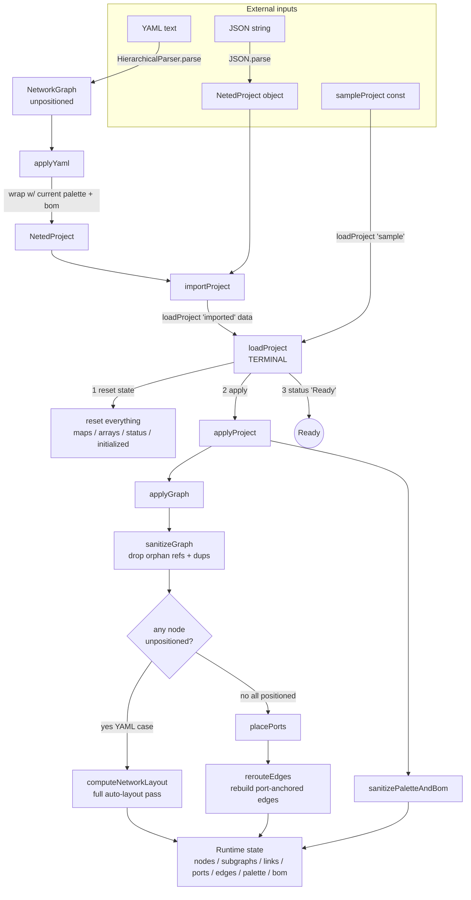
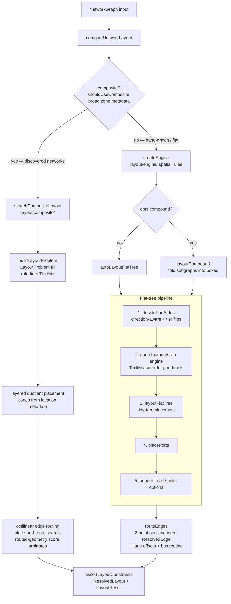
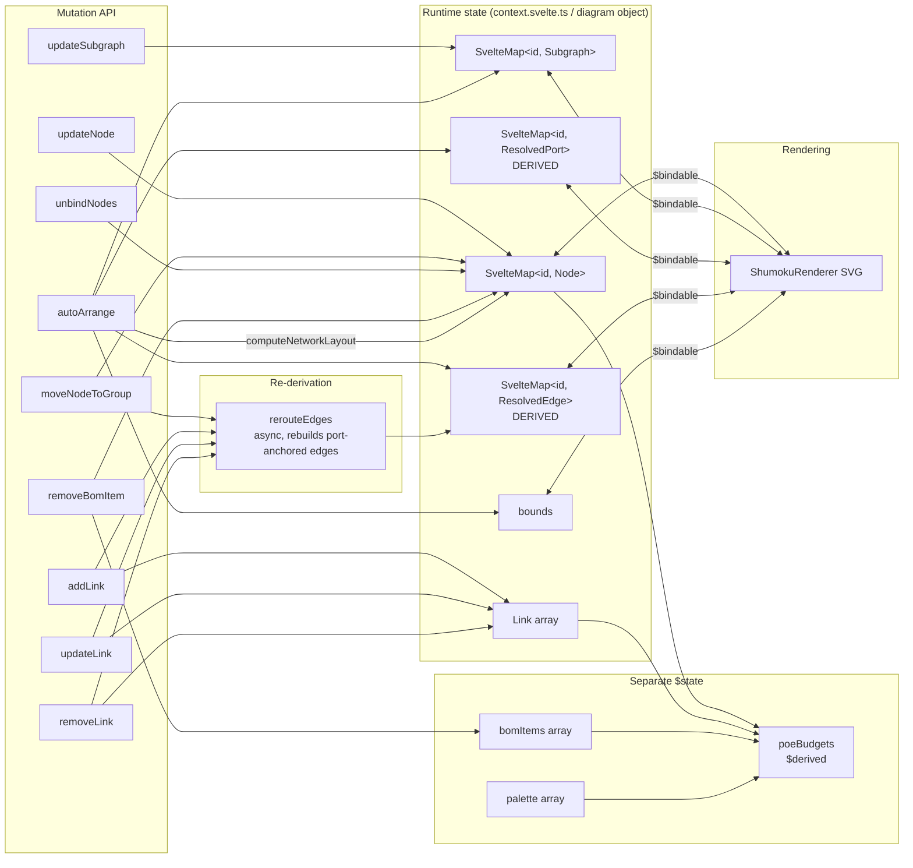
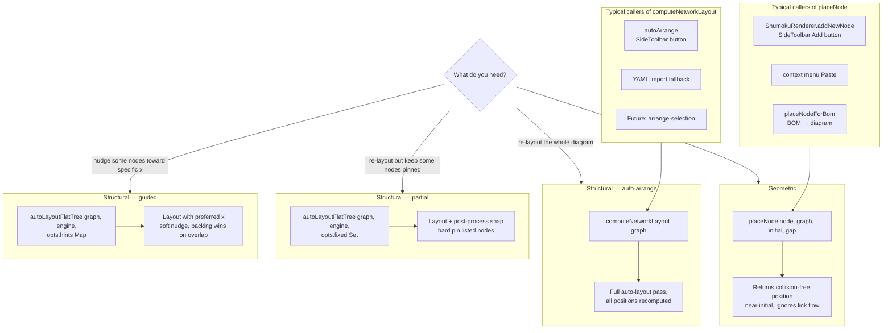
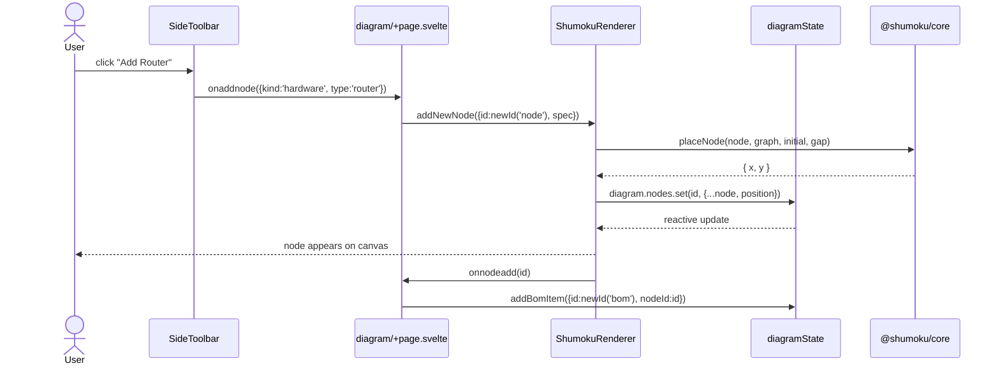
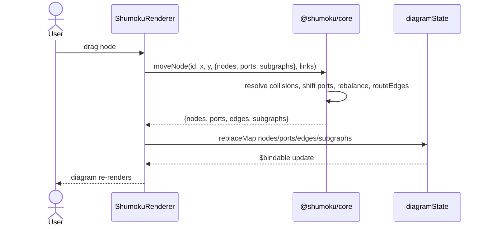
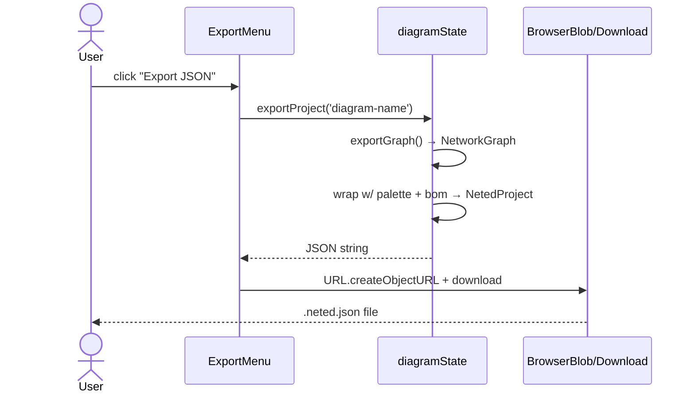
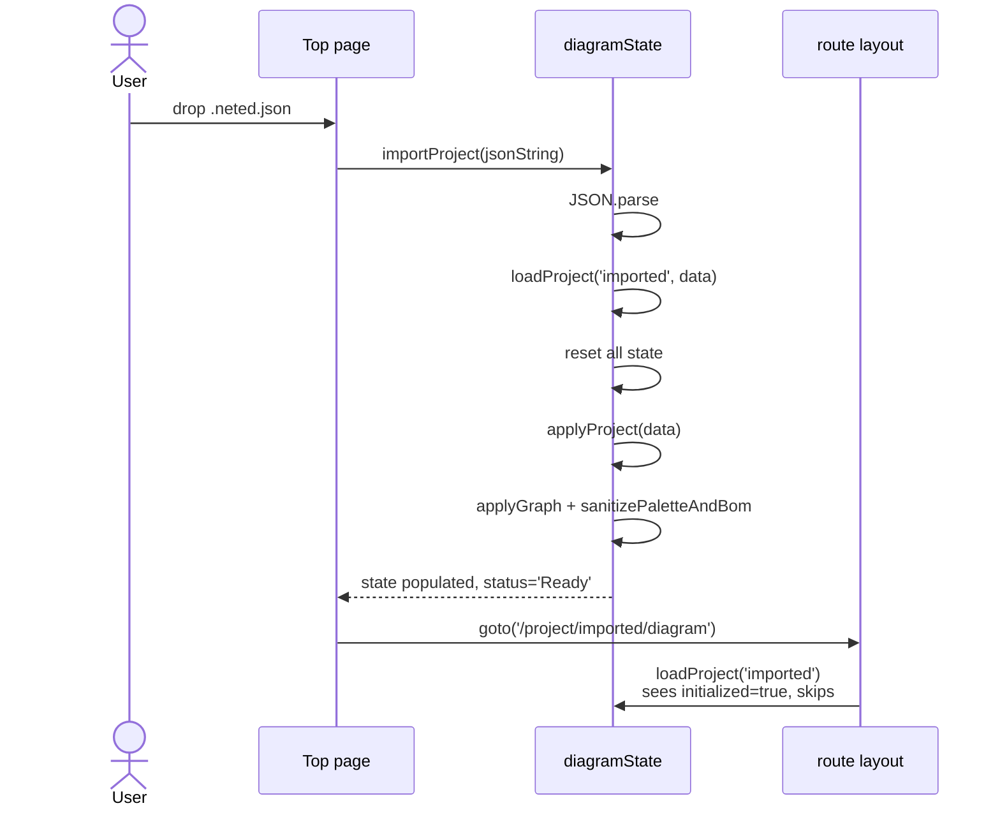
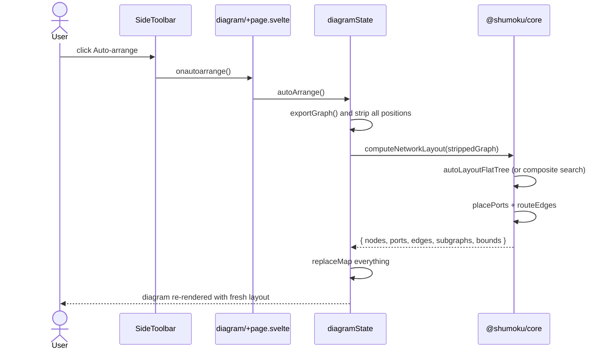

# Architecture

Cross-cutting overview of how the shumoku monorepo fits together.
Editor-specific data model details live in
[`apps/editor/docs/design/data-model.md`](../apps/editor/docs/design/data-model.md);
link composition (port / plug / module / cable) is in
[`apps/editor/docs/design/connection-model.md`](../apps/editor/docs/design/connection-model.md);
this doc focuses on the flows that span packages.

## Contents

- [Bird's-eye view](#birds-eye-view)
- [Load pipeline (editor)](#load-pipeline-editor)
- [Layout engine (core)](#layout-engine-core)
- [Runtime state and mutations](#runtime-state-and-mutations)
- [Placement APIs — when to use which](#placement-apis--when-to-use-which)
- [End-to-end use cases](#end-to-end-use-cases)
- [Package boundaries](#package-boundaries)
  - [Plugin contract](#plugin-contract)
- [Camera (pan/zoom)](#camera-panzoom)
- [Known gaps](#known-gaps)

---

## Bird's-eye view

```mermaid
flowchart LR
  subgraph IN[External inputs]
    YT[YAML text]
    JF[.neted.json file]
    CLK[User click / paste]
    DRG[User drag]
    BTN[SideToolbar buttons]
  end

  subgraph EDITOR[@shumoku/editor]
    LP[Load pipeline]
    RT[Runtime state]
    UI[Diagram UI]
  end

  subgraph CORE[@shumoku/core]
    LN[computeNetworkLayout<br/>tiered / composite]
    PN[placeNode<br/>collision]
    PP[placePorts]
    RE[routeEdges<br/>port-anchored edges]
  end

  subgraph RNDR[@shumoku/renderer]
    SR[ShumokuRenderer<br/>SVG]
  end

  YT --> LP
  JF --> LP
  LP --> RT
  RT --> SR
  SR --> UI

  CLK --> PN
  DRG --> SR
  BTN --> LN

  PN --> RT
  LN --> RT
  PP --> RT
  RE --> RT

  RT -->|export| JF
```

**Reading guide:**

- User input flows in from the left (YAML text, JSON file, direct UI
  interactions).
- The editor's load pipeline converts external input into runtime
  state; runtime state is also the sink for every interactive edit.
- Core exposes the pure-function primitives (layout, placement, port
  placement, edge derivation) that the editor calls into. Drawn edge
  geometry is cubic Béziers computed from port positions in the
  renderer — there is no routing solver.
- The renderer reads runtime state via `$bindable` and emits events
  back when the user drags or clicks.

---

## Load pipeline (editor)

Every route to runtime state is a linear pipeline — conversion on each
step, `loadProject` as the single terminal that resets state and
applies project data.



**Key properties:**

- One entry point per input shape, never multiple (`applyYaml` is the
  only YAML entry; `importProject` the only JSON entry).
- State reset happens exactly once per load, inside `loadProject`.
- Any fix to load-time derivation (port placement, edge routing,
  bounds) lands in `applyGraph` and benefits every path.

---

## Layout engine (core)

`computeNetworkLayout()` (`libs/@shumoku/core/src/layout/unified-engine.ts`)
is the single entry point. It dispatches between the flat-tree /
compound layouts and the composite zone layout, all built on the
spatial-rule engine in `layout/engine/` (`LayoutRules` for sizing /
separation / framing, `PlacementPolicy` for `tryPlace` / `snapTo`,
injectable `TextMeasurer`). It returns both a `ResolvedLayout` and a
legacy `LayoutResult`.



**Highlights:**

- **No routing solver** — the previous libavoid-js WASM router was
  removed (PR #227). `routeEdges` is a trivial pass that attaches
  port-anchored `ResolvedEdge` records with 2-point polylines; the
  renderer draws cubic Béziers from the port positions and sides.
  The points remain only for non-rendering consumers (label midpoint,
  hit testing, cable length). Post-processes fan out edges sharing a
  port (lane offsets) and merge same-layer fans into T-shaped buses.
- **Composite auto-select** — `shouldUseComposite` enables the
  composite zone layout for graphs with broad zone (location)
  metadata, i.e. discovered networks. It builds a `LayoutProblem` IR
  (`layout/problem.ts`, PR #533) with role-tier hints
  (`layout/role-tiers.ts`, sparse 0–100 device-role tiers), places
  layered zone bands, then runs a place-and-route search where routed
  octilinear geometry scores the placement variants.
- **Engine as policy authority** — sizing, gaps, and label widths come
  from one `createEngine()` instance shared conceptually with manual
  placement (`engine.tryPlace`), so auto-layout and drag-snap stay
  consistent.
- **Constraint assertion** — `assertLayoutConstraints` (#482) throws
  on BLOCKING violations in dev/test and logs in production, so a
  broken figure never ships silently.

---

## Runtime state and mutations

The editor's diagram state is intentionally reactive-friendly. Nodes,
subgraphs, ports, and edges live in `SvelteMap`s inside a single
`$state` object; ports and edges are treated as derived and rebuilt
via `rerouteEdges`.



**Notes:**

- `SvelteMap.set()` / `.delete()` trigger Svelte 5 reactivity
  directly — no copy-on-write needed.
- Ports and edges are "derived" conceptually; operationally they're
  rebuilt by explicit calls. A future PR could move this to `$effect`
  once the drag-path's atomicity concerns are resolved.
- `ResolvedPort` remains node-owned, while `ResolvedEdge` carries
  `fromPort` / `toPort` endpoint references. This keeps Port ownership
  canonical on the node side, but lets link rendering and link-level
  overlays consume the resolved endpoint ports without reverse-looking
  them up from the ports map.
- `$bindable` on the renderer is bidirectional: the canvas writes
  back directly when the user drags or creates a link.

---

## Placement APIs — when to use which

Two primitives, different intents, deliberately kept separate:



**Rule of thumb:**

- Does the user know *exactly* where they want the node? → `placeNode`.
- Do you want the algorithm to decide based on graph topology? →
  `computeNetworkLayout`.
- Somewhere in between? The lower-level `autoLayoutFlatTree` accepts
  `fixed` (hard pin) and `hints` (soft x-nudge) options; note that
  `computeNetworkLayout` does not currently plumb these through — its
  options are `{ compound?, composite? }`.

---

## End-to-end use cases

### Add node via SideToolbar



### Drag node



### Save to JSON



### Import JSON



### Auto-arrange



---

## Package boundaries

What each package owns, and what it doesn't:

```mermaid
flowchart TB
  subgraph apps[apps/]
    ED[editor<br/>SvelteKit UI, state, routes]
    DOC[docs<br/>Next.js, playground]
    CLI[cli<br/>shumoku render]
    SRV[server<br/>topology API]
  end

  subgraph libs[libs/@shumoku/]
    COR[core<br/>models, layout, parser]
    CAT[catalog<br/>device/service catalog]
    SDK[plugin-sdk<br/>HTTP client, pagination]
    RND[renderer<br/>Svelte SVG]
    RSV[renderer-svg<br/>SSR SVG]
    RHT[renderer-html<br/>embeddable]
    RPN[renderer-png<br/>resvg]
    SHU[shumoku<br/>umbrella]
  end

  subgraph libp[libs/plugins/]
    PAI[aruba-instant-on]
    PGF[grafana]
    PNB[netbox]
    PNS[network-scan]
    PPR[prometheus]
    PZB[zabbix]
  end

  ED --> COR
  ED --> CAT
  ED --> RND
  ED --> RSV

  DOC --> COR
  DOC --> RSV
  DOC --> RHT

  CLI --> COR
  CLI --> RSV
  CLI --> RPN
  CLI --> RHT

  SRV --> COR
  SRV --> RSV
  SRV --> RHT
  SRV --> RND

  CAT --> COR
  RND --> COR
  RSV --> COR
  RHT --> RSV
  RPN --> RSV
  SHU --> COR
  SHU --> RSV
  SHU --> RHT

  PAI --> COR
  PGF --> COR
  PNB --> COR
  PNB --> SDK
  PNS --> COR
  PNS --> CAT
  PPR --> COR
  PZB --> COR
  PZB --> SDK
```

**Invariants:**

- **Plugins depend only on `core`** (plus the shared `plugin-sdk`
  runtime helpers, and `catalog` where device identification needs
  it) — never on renderers, never on editor. Keeps them embeddable
  anywhere.
- **Renderers depend on `core`** — never on editor. Core models are
  the lingua franca.
- **Editor depends on core + catalog + renderer** — plus
  `renderer-svg` for SVG export.
- **Server consumes renderers, not just core** — the API side uses
  `renderer-svg` / `renderer-html` for baked layouts and static
  export; the web side uses the Svelte `renderer`.
- **Apps don't cross-depend** — editor doesn't import from docs, etc.

The **canonical data shape** at every boundary is `NetworkGraph`
(core's type). YAML and the project JSON (`NetedProject`, which wraps
`NetworkGraph`) are boundary formats; everything inside the system
speaks `NetworkGraph`.

### Plugin contract

Data-source plugins (Zabbix, NetBox, Prometheus, Grafana, Aruba
Instant On, network-scan) connect shumoku to external systems through a small
contract in `@shumoku/core`. The rule is **core defines the display
contract; plugins conform**. Concretely:

- Core types describe what the UI consumes — `Host`, `Alert`,
  `LinkMetrics`, etc. — and contain no plugin-name enums.
- Plugins translate upstream vocabularies (Zabbix priorities,
  Prometheus severities, Aruba health tokens) into core vocab at
  their own boundary — never the other way.
- The web app renders plugins generically via `configSchema`; it
  must not branch on `plugin.type`. (#270 is resolved — the
  invariant is now enforced by a vitest guard,
  `apps/server/api/src/plugins/host-branch-guard.test.ts`, which
  fails the build if a `type === '<plugin>'` branch reappears in
  the config surfaces.)

For the full author-facing reference — capability mixins, data
shapes, severity translation table, the three node-state axes, the
passthrough `discoverMetrics` pattern, dev-only `nativeApi` — see
[`plugin-authoring.md`](./plugin-authoring.md).

---

## Camera (pan/zoom)

Camera behaviour — how wheel events, trackpad gestures, pinch and
pointer drags translate into viewport transforms — is deliberately
**not** baked into `@shumoku/renderer`. Different apps want different
policies (the editor wants mouse-wheel-zoom like a CAD tool; a static
share preview wants no camera at all; SSR/CLI has no DOM to attach
to), and a renderer that picks a default for everyone ends up either
wrong-by-default or stuffed with opt-out props.

```mermaid
flowchart LR
  subgraph RND[@shumoku/renderer]
    SVG[SVG output<br/>stable DOM:<br/>g.viewport, g.node[data-id], path.link]
    AC[attachCamera<br/>utility<br/>opt-in]
  end

  subgraph WG[wheel-gestures]
    START[isStart marker]
    MOM[isMomentum marker]
  end

  subgraph D3[d3-zoom]
    ST[__zoom state]
    TRF[transform on g.viewport]
  end

  subgraph APP[Host app]
    EDT[editor]
    WID[dashboard widget]
    DET[detail page]
    SHR[share page]
  end

  SVG -.- AC
  AC --> WG
  AC --> D3
  D3 --> TRF
  WG --> AC

  EDT --> AC
  WID --> AC
  DET --> AC
  SHR --> AC
```

### API shape

```ts
import { attachCamera } from '@shumoku/renderer'

const camera = attachCamera(svgEl, {
  scaleExtent: [0.2, 10],           // zoom bounds
  panFilter: (e) => e.altKey,       // which pointer-down events pan
  wheelZoomSensitivity: 1.0015,     // mouse tick feel
  pinchZoomSensitivity: 1.01,       // trackpad pinch feel
})
camera.zoomBy(1.5)
camera.panToNode('device-42')
camera.reset()
camera.detach()                     // cleanup on unmount
```

The renderer always emits a `<g class="viewport">` as its zoom target;
`attachCamera` throws if that element isn't present. Apps that want
**no** camera simply don't call `attachCamera`.

### UX policy (Figma / Miro style)

| Input | Result |
|---|---|
| Mouse wheel (plain) | zoom at cursor |
| Mouse ctrl+wheel | zoom at cursor (explicit) |
| Trackpad two-finger | pan (with natural momentum) |
| Trackpad pinch | zoom at cursor (browser synthesises `ctrlKey=true`) |
| Middle-click drag / Alt+left-drag | pan (via `panFilter`) |
| Node drag (edit mode) | move node (handled per-element in `SvgNode`) |

### Why we need three layers (d3-zoom + wheel-gestures + sticky detection)

Each layer solves a problem the others can't:

1. **d3-zoom** owns the transform state (`svg.__zoom`). It's a stable
   base: attaching to the svg once and routing all transform changes
   through `zoomBehavior` keeps state consistent regardless of whether
   a change came from a wheel event, imperative `zoomBy`, or external
   `panToNode` call. A previous version bypassed d3-zoom by writing
   `transform=` directly on the viewport — d3-zoom's state went stale
   and the next gesture jumped to wherever d3-zoom last remembered.

2. **wheel-gestures** classifies each event as "user input", "momentum
   tail", or "gesture start". We use two specific signals:
   - `state.isStart` — the first event of a gesture. That's when we
     decide "mouse or trackpad" and stick with the verdict. Per-event
     classification doesn't work because Chrome's smooth-scrolling
     makes mouse wheel ticks indistinguishable from trackpad scrolls
     frame-by-frame (both can emit fractional deltaY with varying
     magnitudes).
   - `state.isMomentum` — OS-generated inertia events that continue
     after the user's fingers have lifted. Critically, these often
     drop `ctrlKey` partway through a pinch's decay. Skipping momentum
     for zoom prevents phantom pans after a pinch; keeping it for
     pan preserves the natural trackpad feel.

3. **Sticky device detection** (inside `attachCamera`) runs at
   `isStart` only, using `deltaMode`, presence of `deltaX`, and
   magnitude of `deltaY` as signals. Once picked — `mouse` or
   `trackpad` — the whole gesture uses that mode, so mid-flight
   event ambiguity can't flip the verdict.

### Coordinate-system discipline

The renderer's SVG uses a `viewBox` sized to the layout bounds with
`width="100%"` — so one viewBox user-space unit is NOT one CSS pixel.
d3-zoom's transform is applied as an SVG `transform=` attribute on
the viewport group, which is interpreted in user-space. The wheel
event's `clientX/Y` is in screen pixels. Passing the cursor to
d3-zoom directly drifts the zoom focus by the viewBox scale factor.

`attachCamera` converts cursor to user-space via
`svg.getScreenCTM().inverse()` and declares `zoom.extent` in user-space
too, so d3-zoom's internal math and the applied transform agree.

### Consumer summary

- **editor** — `attachCamera(svg)` with defaults (Miro/Figma UX).
- **docs/editor** — same, attached after the WebComponent's
  `customElements.whenDefined('shumoku-renderer')` resolves.
- **server/web TopologyViewer** — takes `camera?: CameraOptions | false`
  as a prop; passes through to `attachCamera`. Widget, detail page
  and share page all use this.
- **CLI / PNG / SSR** — don't mount a Svelte component, so never see
  `attachCamera`. d3-zoom isn't loaded at all in those paths.

---

## Known gaps

### Hierarchical / multi-sheet editing

`@shumoku/core` ships a `buildHierarchicalSheets()` function that
generates one sheet per top-level subgraph with boundary pins for
cross-sheet links. `@shumoku/renderer-html` uses this for static
multi-page export with click-through navigation.

**The editor does not yet drive the interactive flavour.** The Svelte
renderer (`@shumoku/renderer`) has no concept of "active sheet"; it
always renders the whole graph. The editor's runtime state now tracks
`currentSheetId` and the `SheetBar` lets users switch between the
root and each top-level subgraph, but the renderer keeps showing the
full graph regardless.

**Landed:**
- `diagramState.currentSheetId: string | null`
- `diagramState.availableSheets` — root + top-level subgraphs
- `diagramState.switchSheet(id | null)` — runs
  `buildHierarchicalSheets` for non-null ids, populates `sheetView`
- `diagramState.activeView` — root state or `sheetView`, bound by
  the editor's diagram page
- `SheetBar` renders the real tabs, click drills KiCad-style

When drilled in, the renderer sees the subgraph's filtered graph
with export-connector nodes for cross-boundary links. The editor
forces View mode while drilled in so the renderer's `$bindable`
writes don't land on the ephemeral sheet maps — edits stay on the
root sheet only for now.

**Not yet landed:**
- **Write-through editing on a sub-sheet.** Requires the renderer to
  stop relying on `$bindable` writes and become a pure view that
  emits events, which the editor then routes to the canonical root
  state (tracked under #98 "operations separation"). Until then,
  edits happen on the root sheet; sub-sheets are read-only.
- **Nested drill-down.** Clicking into a subgraph that is itself
  inside a sub-sheet would require another level of
  `buildHierarchicalSheets` or equivalent. Top-level only for now.
- **Sheet-specific autoarrange / add-node defaults / sheet-local
  positions.** Polish once write-through lands.

Why this wasn't finished earlier: the editor's MVP was a single
diagram, `SheetBar` was a UI placeholder during early iteration, and
subsequent refactors (#130-#142) focused on the single-diagram happy
path. No principled decision to defer — it was plain technical debt,
now partly paid down.
