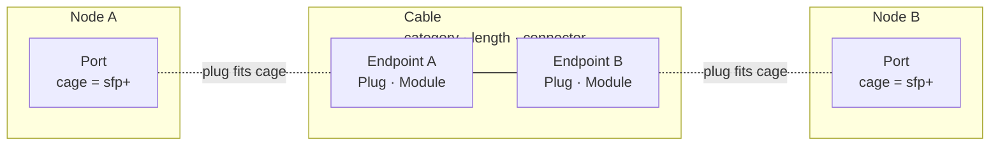
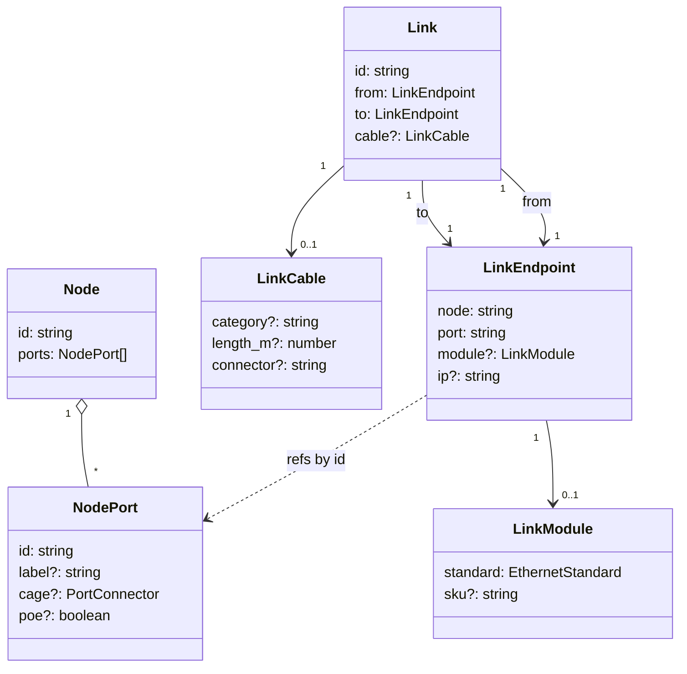
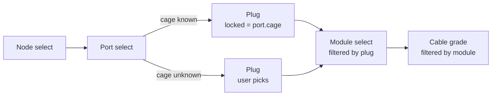

# Connection Model

How a network link is modeled — from physical hardware down to the
fields the editor stores, and the cascading UI that wires them together.

The mental model has two sides plus their connection point:

- **Node side** — devices with Ports. Each Port has a `cage` (the
  physical receptacle: RJ45, SFP+, QSFP28…). Catalog data may or may
  not provide it.
- **Link side** — a Cable with two Endpoints. Each Endpoint carries a
  Plug (cable-side form factor) and a Module (the IEEE standard /
  transceiver). Cable-level attributes (grade, length, end connector)
  are per-link.
- **Connection point** — the Endpoint's Plug is mechanically the same
  form factor as the Port's cage. That match is what makes the
  connection physically valid.

UI logic (cascading selects, cage-locking, validation) sits on top of
this structure rather than inside it.

## Conceptual layers

- Plug and cage must agree mechanically (`spec.cage` of the chosen
  standard must match the port's cage when known).
- Module and cable medium are the user's choice within that constraint.
- `cable.connector` (LC, MPO, RJ45 plug) describes the cable end
  termination — separate from the plug form factor.

## Data model

- **Plug is implicit.** No standalone field — it's derived from
  `module.standard` via `STANDARD_SPECS[std].cage` (and falls back to
  `port.cage` when the module isn't picked yet).
- **Module is per-endpoint.** Cables can be asymmetric (BiDi pairs,
  media converters), so each endpoint owns its own standard.
- **Cable is per-link.** Grade, length, and end connector belong to
  the cable as a whole, not to either endpoint.

| Physical layer       | Model location                          | Field                  | Example          |
| -------------------- | --------------------------------------- | ---------------------- | ---------------- |
| Port receptacle      | `Node.ports[].cage`                     | `PortConnector`        | `sfp+`, `rj45`   |
| Endpoint module      | `LinkEndpoint.module.standard`          | `EthernetStandard`     | `10GBASE-SR`     |
| Endpoint module SKU  | `LinkEndpoint.module.sku`               | `string`               | `FTLX8571D3BCL`  |
| Cable medium grade   | `Link.cable.category`                   | `string`               | `om4`, `cat6a`   |
| Cable length         | `Link.cable.length_m`                   | `number`               | `30`             |
| Cable end connector  | `Link.cable.connector`                  | `string` (freeform)    | `LC`, `MPO`      |
| Plug form factor     | derived from `module.standard`          | (no field)             | `sfp+`           |

## UI cascade

The plug select sits between Port and Module. When the port carries a
cage from catalog data, the plug select is disabled and pinned to that
value (the port hardware fixes it). When the port has no cage info,
the plug select is the user's first explicit choice and constrains the
module list.

Plug priority when resolving the value displayed:

1. `port.cage` (hardware constraint — wins over everything else)
2. plug implied by `module.standard` (when a module is already picked)
3. user's explicit plug pick (only meaningful when neither of the
   above is set)

Changing the plug clears the module if the previous module's required
plug doesn't match the new pick — the module list will refilter and
the user can pick again.

## Validation

`validateLinkCompatibility` (in `port-compatibility.ts`) checks each
endpoint independently against its own port and module.

| Check                                                        | Severity | Status |
| ------------------------------------------------------------ | -------- | ------ |
| `port.cage` accepts the cage required by `module.standard`   | error    | ✅     |
| `from.standard` and `to.standard` differ (asymmetric link)   | warning  | ✅     |
| `cable.length_m` exceeds grade-adjusted reach                | warning  | ✅     |
| `port.poe` set on a non-RJ45 cage                            | error    | ✅     |
| `cable.connector` matches `spec.cableConnector`              | —        | ❌ TODO |

Asymmetric standards are flagged but allowed — they are intentional
for BiDi pairs (e.g. `10GBASE-BX10-D` ↔ `10GBASE-BX10-U`) and media
converter links.

## UI placement

| Surface                                  | Plug + Module           | Cable grade  | Length   | Cable connector |
| ---------------------------------------- | ----------------------- | ------------ | -------- | --------------- |
| `LinkProperties.svelte` (detail panel)   | per-endpoint sections   | per-link row | per-link row | per-link row (text) |
| `connections/+page.svelte` table         | per-endpoint cell stack | Cable column | Length column | (none)        |
| `connections/+page.svelte` add form      | per-endpoint pickers    | Cable column | —        | —               |

`EndpointModulePicker.svelte` is the shared component — two stacked
selects (plug + module) used by all three surfaces.

## Where to look in code

- `libs/@shumoku/core/src/models/types.ts` — `NodePort`, `Link`,
  `LinkEndpoint`, `LinkModule`, `LinkCable`, `PortConnector`,
  `EthernetStandard`.
- `libs/@shumoku/core/src/models/standards.ts` — `STANDARD_SPECS`
  registry (the source of truth for what a standard implies),
  `cableVariantsForPlug`, `cableGradesForStandard`,
  `plugProfilesForCages`, `plugProfileForStandard`.
- `libs/@shumoku/core/src/models/port-compatibility.ts` —
  `validateLinkCompatibility`, `defaultStandardForCages`.
- `apps/editor/src/lib/components/EndpointModulePicker.svelte` — the
  shared two-select picker.
- `apps/editor/src/lib/components/detail/LinkProperties.svelte` —
  detail panel using the picker.
- `apps/editor/src/routes/project/[id]/(content)/connections/+page.svelte`
  — connections table and add form.
