# ネットワーク配置実験 作業メモ

保存日: 2026-09-13。途中の試行を含む作業スナップショット。
**本番の配置エンジンには未統合。現在は V8 / distributed-ports。ノードの接続辺は中心基準で考え、実際の接続点は線側の余白と本数に応じて辺上に分散する。線余白係数 1.5、ノード帯の基準面積比 15%、一階層一行は維持。**

## 今回の保存地点 / 再開用サマリー

2026-09-13、ユーザーが分散接続点版の見た目を確認し、ここを実験の区切りとして保存。
前回の保存コミット `f6e0b641` 以降の V7 配線修正と V8 の試行・画像・レポートをまとめた。
本番への採用・リリース・外部公開を行うコミットではない。

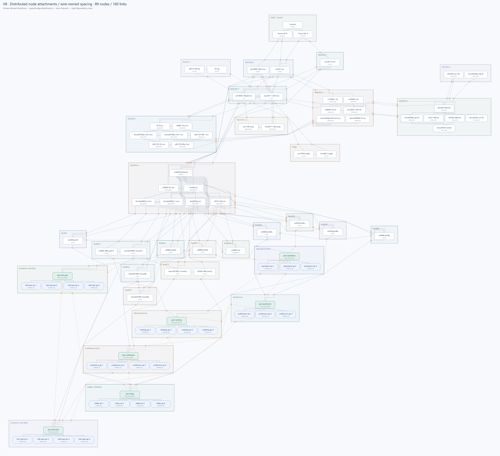

| 現在の扱い | 内容 |
|---|---|
| 入力と起点 | 保存済みの上流〜APテスト構成。89台・160リンク・31グループ。Internet を固定 |
| 実機の内部配置 | 同じ依存階層は横一列。左右順を保持。個別の上下逃がし・折り返しなし |
| ノードと枠の余白 | 面積・自身の接続数から算出。基準面積比15%。必要帯不足は許さない |
| 線の通過領域 | 列内は仮想通過枠、行間は重なる横方向区間のレーン容量。足りない行間だけ拡張 |
| 実際の接続点 | 選択した辺の中央を基準に本数分を分散。線余白係数1.5、端点・レーン間隔5.5px |
| 残る問題 | 交差353対、共有区間の重なり長1305.61。端点順・レーン順・外部配線の同時最適化は未実施 |

次回は以下から再開できる。最新生成器の暗黙の既定モードは旧実験なので、
**`--distributed-ports` を明示すること**。以下のコマンドは `archive/` 内で実行する。

```powershell
# 全保存実験の検証。描画済みデータからの再生成一致も含む
bun test .

# 現在の分散接続点版を再生成。最新版の出力だけを更新
bun tmp-test6-v8-elastic-render.mjs --distributed-ports

# 同じ配置データから SVG / PNG だけを再生成
bun tmp-test6-v8-elastic-render.mjs --distributed-ports --render-report

# 検証・再描画後にアーカイブのハッシュ一覧を更新
bun tmp-refresh-manifest.mjs
```

主要ソース: [生成・描画](archive/tmp-test6-v8-elastic-render.mjs)、
[接続点の分散](archive/tmp-test6-v8-distributed-ports.mjs)、
[線の容量と行間](archive/tmp-test6-v8-wire-channels.mjs)、
[実機行と仮想通過枠](archive/tmp-test6-v8-virtual-rows.mjs)、
[必要余白の分離](archive/tmp-test6-v8-hard-halo.mjs)。
最新生成は保存済み `virtual-rows-area-15-report.json` を開始点にする。
入力データから過去の全探索を再実行する方式ではない。

保存前の再検証: 60テスト / 476,632アサーション成功、実験専用 Biome 設定で全46ソース成功。
191成果物のサイズ・SHA-256と、メモ内77リンクの実在を確認。
今回の通常 pre-commit も `bunx` 未検出、およびルート Biome 設定の `preset` 非対応で失敗。
共通設定を変更せず、この保存コミットに限って `LEFTHOOK=0` とする。
本番パッケージの変更はなく、全体 lint の成功や本番統合を意味しない。
以下は逆時系列の実験経緯。古い節にある「現在」「最新」は、その試行当時を指す。

## V8 追記: 中心基準の方向と、実際の接続点を分離

「中心の一点から出すのではなく、中心から考えるだけで始点は余白と同様に分散させる」に対応。
既存の四辺中央固定を外し、始点・終点の両方を分散した。`distributed-ports` として別保存。

- 接続辺の選択は従来の中心基準の結果を維持。その辺の中では、接続先ノードの中心方向で
  並べ、方向が同じ並列リンクはリンク ID で安定順序にする。位置変更前の中心を使う初期割当であり、
  最終グループ配置の変更後に全接続辺や端点順序を再探索するものではない。
- 本数を k、0 始まりの順番を i とし、辺中央からの位置を
  `offset = (i - (k - 1) / 2) × pitch` とする。1 本なら従来どおり中央。
- pitch は線レーンと共通の `線幅 + 2 × クリアランス × 線余白係数`。
  今回は 5.5px。別の固定ポート間隔を追加せず、線余白係数で追従する。
- ノード直近の同一直線部分も接続点の分散に合わせて移動させる。
  すぐ元の中央一点へ戻す処理は入れない。元の直線を分散後も安全に直線で結べる場合は維持する。
  仮想通過枠とサブグラフ境界点は勝手にずらさず、必要なら内部の可視グラフで実機を避ける。
- この新しい端点・直近配線を使って行間の占有区間とレーン容量を再計算する。
  固定した既存レーンへ表示上の端点だけを差し替える方式ではない。
- ノードのサイズ・階層・行内 X と左右順、Internet の絶対位置、ノード帯の計算式を維持。
  本数が増えて `k × pitch > 接続辺の長さ` となる入力はエラーにする。
  隠れた間隔圧縮・ノードのサイズ変更・別の辺への振り分けは行わない。今回の入力では余裕を持って収まった。

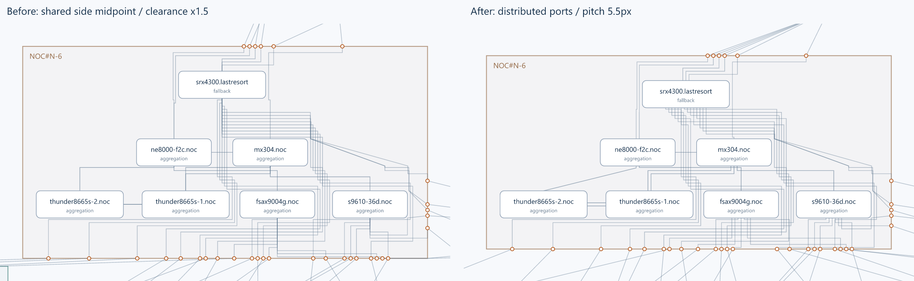

[全体 SVG](archive/tmp-test6-v8-distributed-ports.svg) · [全体 PNG](archive/tmp-test6-v8-distributed-ports.png) ·
[レポート（nodePorts に各端点・間隔・順番を保存）](archive/tmp-test6-v8-distributed-ports-report.json)

320 端点のうち 227 端点が複数本の辺に所属し、辺上へ分散した。
同一ノード上の接続点重複は 0、最大 14 本／辺。内部経路の障害物迂回による修復は今回は 0。
全 89 ノード・160 リンク・31 グループ・196 境界点・34 仮想通過枠を保持。

| 指標 | 直前の線余白係数1.5版 | 分散端点版 |
|---|---:|---:|
| 線と実機の貫通対 | 0 | 0 |
| ノード／グループの必要帯不足対 | 0 / 0 | 0 / 0 |
| 交差リンク対 | 360 | 353 |
| 重なり長（リンク対ごとの加算） | 7671.19 | 1305.61 |
| 表示線長 | 80185.19 | 78432.49 |

重なり長は約83%減。ただし交差と、仮想通過枠や外部経路で共有される区間は残る。
辺選択・端点順序・レーン順序をまとめて最適化した結果ではない。

再現: `archive/` で `bun tmp-test6-v8-elastic-render.mjs --distributed-ports`。
このモードの既定線余白係数は現在の 1.5。`--wire-clearance-scale=...` で指定できる。
描画のみは `--render-report` を追加。旧モード・旧画像は維持する。
全体 **60 テスト / 476,632 アサーション成功**。
四辺の分散・1本中央・方向順序・間隔追従、辺容量不足、並列リンク直近の非合流、入力非破壊、
再生成一致、全端点の一意性と描画一致、行維持、レーン容量・実際の通過、実機非貫通、必要帯、
外部経路の枠非貫通を検証。全体・比較 PNG を目視確認。

## V8 追記: 線側の余白係数を 1.0 → 1.5 に増量

動的計算は維持し、線が行間で使用するレーンのクリアランスだけを増やした。
新パラメーター `wireClearanceScale` を追加し、従来値 1.0 と比較する。

```text
レーン幅 = 線幅 + 2 × 基本クリアランス × 線余白係数
必要行間 = レーン数 × レーン幅
実際の行間 = max(入力の行間, 必要行間)
```

片側余白 1.3 → 1.95px、レーン幅 4.2 → 5.5px。
係数を掛けるのは余白部分だけで、描画線の太さは 1.6px のまま。
ノード帯 15%、実機行・左右順、列内の仮想通過枠は変更しない。
同じ `virtual-rows-area-15` を開始点にしているため、増量を再実行しても累積しない。
従来の図は保持し、`wire-channels-clearance-1.5` として別保存。

NOC#N-6 の例: 13 レーンの行間は 54.6 → 71.5px、8 レーンの行間は 33.6 → 44px。
線とノードの貫通・必要帯不足は 0、交差は 360 のまま。
線長 79598.39 → 80185.19、重なり長 7018.61 → 7671.19。
行間は広がったが、縦の進入区間の重なりは余白増量だけでは解消しない。
グループ再分離の結果、最小グループ可視隙間は 25.22 → 18.33px と減ったが、必要帯は満たす。
線側の係数であり、すべての種類の隙間を一律に広げるパラメーターではない。

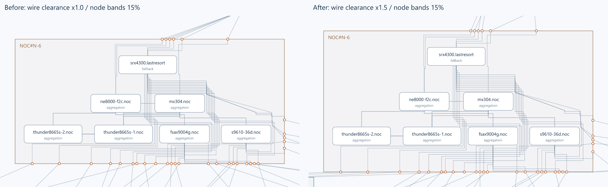

[全体 SVG](archive/tmp-test6-v8-wire-channels-clearance-1.5.svg) ·
[全体 PNG](archive/tmp-test6-v8-wire-channels-clearance-1.5.png) ·
[レポート](archive/tmp-test6-v8-wire-channels-clearance-1.5-report.json)

再現: `archive/` で
`bun tmp-test6-v8-elastic-render.mjs --wire-channels --wire-clearance-scale=1.5`。
描画のみは `--render-report` を追加。係数を省略すると従来の 1.0 を再現する。
テストで 1.5 出力の再生成一致、必要容量の充足・増加、行維持、実機非貫通を検証。

## V8 追記: 線自身が必要な通過領域を確保する

「ノードに所属グループの台数・線数を加算するのではなく、線自体が動的に余白を確保すべき」
という方針を実装。`virtual-rows-area-15` を入力に、旧成果物は残して `wire-channels` を生成した。
ノード側の基準面積比・自身の接続数による帯計算は変更せず、今回の差を線の容量に限定する。
グループ台数・総リンク数のノード余白への加算は入れていない。

### 今回の処理

1. 既存の内部配線を実機行の上端・下端で分割し、各行間（枠と最初／最後の行の間も含む）
   を通る部分を抽出する。各部分の始点・終点が作る横方向の区間を通過要求とする。
2. 横方向の占有範囲が重なる要求に別レーンを割り当てる。離れた区間はレーンを再利用する。
   区間の左端順に処理し、空いている最初のレーンへ入れる区間分割法。
   サブグラフの総線数ではなく、同じ場所で必要な同時通過容量を求める。
3. 1 レーンの幅は `線幅 + 2 × クリアランス = 1.6 + 2 × 1.3 = 4.2px`。
   行間の必要容量は `レーン数 × 4.2px`。新しい行間は `max(従来の行間, 必要容量)`。
   縦に行を横切る既存の仮想枠は、元から 1 本ごとの幅を横に足しているため増幅しない。
4. 行間だけを拡張する区分線形の Y 変換を使う。実機の行は平行移動だけで、
   ノードサイズ・階層・左右順・行内 X は保持する。Internet の絶対位置も保持。
   行を水平に保つため、ある X 位置で必要になった高さはその行間全体に適用される。
5. 占有範囲が競合する線は確保した水平レーンへ接続する。競合しない部分は元の経路形状を保ち、
   行間の伸びだけを反映する。実機のある行の中の経路も元の形状を保つ。
6. 枠も配線領域を含めて拡張し、必要余白の分離はグループ単位の平行移動で実行。
   境界点は従来の辺を保持して枠と一緒に変換し、外部経路はその境界点間で再計算する。
   今回、境界点の辺選択や配置全体の最適化をやり直してはいない。

本方式は内部行間の線容量を扱う。外部配線全体の太い通路を確保する実装ではない。
単なる余白の一括増量でもないが、レーンの容量だけでは出入口の交差までは解消できない。

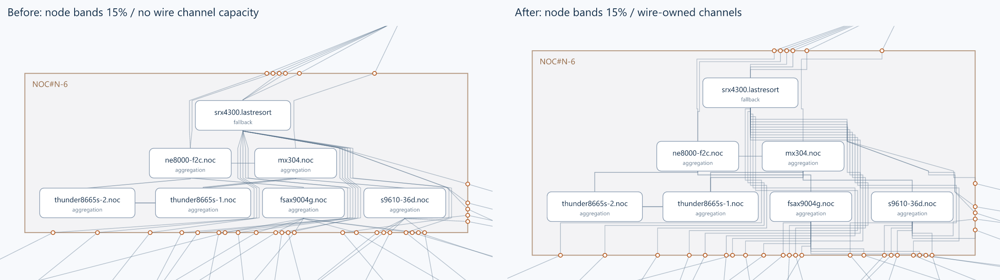

[全体 SVG](archive/tmp-test6-v8-wire-channels.svg) · [全体 PNG](archive/tmp-test6-v8-wire-channels.png) ·
[レポート（wireChannels に容量・割当を記録）](archive/tmp-test6-v8-wire-channels-report.json)

### 結果と限界

10 サブグラフの 12 区間で容量不足分を拡張。例えば NOC#N-6 では
上の行間 29.22 → 54.60px（13 レーン）、次の行間 16.30 → 33.60px（8 レーン）、
最下行と枠の間 24 → 54.60px（13 レーン）。実機を別の行に折り返していない。
実機 89 台、リンク 160 本、31 グループ、境界点 196 個、仮想通過枠 34 個を維持。

| 指標 | 直前の15%版 | 線容量版 |
|---|---:|---:|
| 線と実機の貫通対 | 0 | 0 |
| ノード／グループ必要余白不足対 | 0 / 0 | 0 / 0 |
| ノード／グループ最小可視隙間 | 5.22 / 25.22px | 5.22 / 25.22px |
| 交差リンク対 | 253 | 360 |
| 重なり長（リンク対ごとの加算） | 2937.63 | 7018.61 |
| 表示線長 | 72561.18 | 79598.39 |

**容量は確保できたが、配線の見やすさは全面改善していない。** 水平レーンから端点へ戻る
縦の接続区間が重なり、交差と線長（約9.7%増）が増えた。共通の四辺中央からのファンアウト、
縦の進入区間、水平レーンの並び順を連動させる処理は未実装。最小交差・大域最適は主張しない。
通過量の計算と配線の入り方を分けて検証するための試作として保存する。

再現: `archive/` で `bun tmp-test6-v8-elastic-render.mjs --wire-channels`。
描画のみは `--render-report` を追加。専用テストは `bun test ./tmp-test6-v8-wire-channels.test.mjs`。
全体 **54 テスト / 279,964 アサーション成功**。区間重複による容量・離れた区間の再利用、
入力非破壊・再生成一致、実機の行・左右順・サイズ、必要帯、実際の水平レーン通過、
全線分の実機非貫通、四辺中央、境界点と外部経路の一致を検証。全体・比較 PNG を目視確認。

## V8 追記: 動的余白の基準面積比を 10% → 15% に増量

「もう少し動的余白のパラメーターを上げる」に対応し、ノード・サブグラフ両方の
基準面積比だけを 0.10 から 0.15 にした。同じ `hard-halo` シードで再生成し、
接続数の sqrt 係数・辺別配分・仮想通過枠の幅・描画インセット・一階層一行は変更していない。
面積比の 1.5 倍であって、隙間幅を一律 1.5 倍にする指定ではない。
10% 版の成果物を上書きせず、`virtual-rows-area-15` として保存した。

| 指標 | 10% | 15% |
|---|---:|---:|
| ノード間の最小可視隙間 | 3.51px | 5.22px |
| グループ間の最小可視隙間 | 17.40px | 25.22px |
| 線とノードの貫通対 | 0 | 0 |
| ノード／グループの必要余白不足対 | 0 / 0 | 0 / 0 |
| 交差リンク対 | 256 | 253 |
| 重なり長（リンク対ごとの加算） | 3413.49 | 2937.63 |
| 表示線長 | 71738.38 | 72561.18 |

線長は約 1.1% 増加。実機 89 台・160 本・31 グループ・196 境界点は保持。
比較レポートの `before` と `resized` は 10% 版が基準、`moved` は配置開始シードが基準。

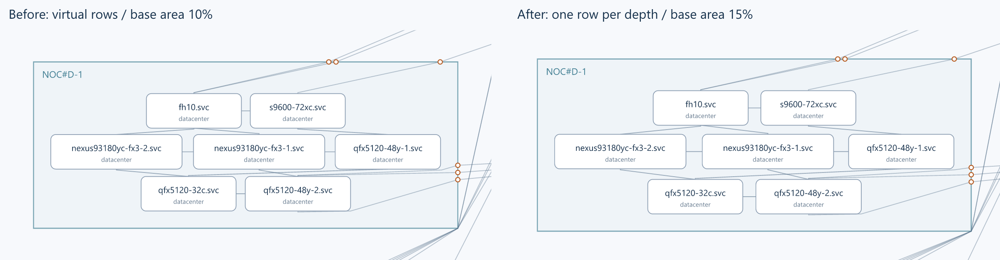

[全体 SVG](archive/tmp-test6-v8-virtual-rows-area-15.svg) ·
[全体 PNG](archive/tmp-test6-v8-virtual-rows-area-15.png) ·
[レポート](archive/tmp-test6-v8-virtual-rows-area-15-report.json)

再現: `archive/` で `bun tmp-test6-v8-elastic-render.mjs --virtual-rows --area-ratio=0.15`。
`--render-report` を加えると描画のみ。引数なしの 10% 再現経路は従来のまま維持する。
15% 出力の再現一致、行・左右順の維持、全線分のノード非貫通、必要余白の充足を回帰検証。

## V8 追記: 横一列の復元と、線の仮想ノード化

ユーザーの「線との干渉回避前の横一列へ戻したい。線をノードが一つ増えたように扱えないか」に対応。
`side-centers` の内部深さと実機の左右順を復元し、`hard-halo` のグループ位置を初期値に使用。
個別ノードの SAT 回避移動・上下の微調整・旧配線スコアによる位置探索は、このモードでは実行しない。
旧ソースと画像は比較用に保存する。実機 89 台・リンク 160 本・31 グループ・196 境界点は保持。

- 線が途中の階層を横切るたび、その行へ非表示の仮想通過枠を差し込む。今回は 34 個。
  線の中点に一つ置く方式ではない。実機と同じ行の占有領域として横方向に詰める。
- 実機は元の階層ごとに同一 Y、元の左右順。仮想枠の初期 X は接続両端の X を補間する。
  元の順序を保持した構成的な配置であり、左右順や階層の再探索は行っていない。
- 仮想枠は実機サイズではなく、描画線幅 + 両側のクリアランス幅を持つ。
  今回は線幅 1.6px、クリアランス (ノード枠線 1px + 線幅 1.6px) / 2 = 1.3px、通過幅 4.2px。
  実機の余白は従来の面積・辺別接続数から計算する必要帯を使用する。
- 行間も、隣接行の必要帯厚さと通過幅から算出。以前の兄弟間隔 18px・段間隔 20px は使わない。
  枠は実機と通過枠の内容から決まり、以前の描画用インセット（左右・下 24px、上 44px）は維持。
  境界点分配の既存処理（角 18px、最大ピッチ 10px）も今回の変更対象外。
- 各ノードの接続辺は内部階層／開始時の境界点方向から決め、四辺中央を端点にする。
  グループ移動後もその辺を保持するため、最終的な最短経路向きとは限らない。
- 内部線は通過枠の入口・出口を通り、間は実機矩形を障害物とした可視グラフの最短路でつなぐ。
  上下接続はまず行の外まで出る。必要に応じて曲がるが、実機を上下に散らさない。
  同じ行の離れた実機同士には行外の配線専用経由点を使う（今回の入力では該当 0、合成例で検証）。
- サブグラフの必要余白は維持する。分離修復はグループ全体の平行移動だけとし、内部行を壊さない。
  Internet の絶対位置を固定。枠のサイズ上限・最小サイズ・折り返し・役割別 tier は追加しない。
- 仮想枠は `virtualNodes` と各リンクの `virtualIds` にのみ保存し、入力・実機一覧には追加しない。

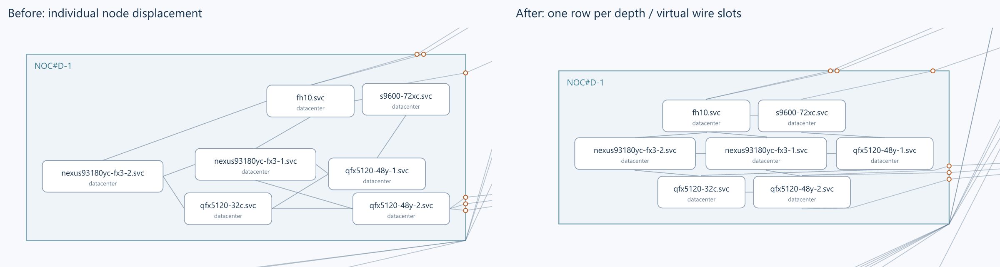

[全体 PNG](archive/tmp-test6-v8-virtual-rows.png) · [全体 SVG](archive/tmp-test6-v8-virtual-rows.svg) ·
[レポート](archive/tmp-test6-v8-virtual-rows-report.json)

| 指標 | 直前 hard-halo | virtual-rows |
|---|---:|---:|
| 線と無関係ノードの貫通対 | 0 | 0 |
| ノード／グループの必要余白不足対 | 0 / 0 | 0 / 0 |
| 実体の接触対（ノード／グループ） | 0 / 0 | 0 / 0 |
| 交差リンク対 | 222 | 256 |
| 重なり長（リンク対ごとの加算） | 607.65 | 3413.49 |
| 表示線長 | 64477.40 | 71738.38 |

横一列を復元したまま貫通をなくせたが、線同士の共有区間・交差・線長は増えた。
仮想枠の並び順と配線レーン割当の同時最適化は未実施。これを最適化済みの配線とは呼ばない。
外部経路は従来通りサブグラフ矩形を避ける境界点間の可視グラフ経路。
入力が異なれば必ず解ける保証はなく、経路や必要余白を成立させられない場合はエラーにする。

再現: `archive/` で `bun tmp-test6-v8-elastic-render.mjs --virtual-rows`。
描画のみは `--render-report` を追加。専用テストは `bun test ./tmp-test6-v8-virtual-rows.test.mjs`。
全実験 **48 テスト / 105,891 アサーション成功**。元の階層・左右順・同一 Y、入力非破壊、
仮想枠の通過・実機非占有、全線分の実機非貫通、四辺中央、外部の枠非貫通、必要帯非重複、
決定的な再生成を検証。全体・比較 PNG を目視確認した。

## V8 追記: 必要余白を成立条件に変更

ユーザーの「多い分は削れるが、少ない分は困る」に合わせ、ノード同士／サブグラフ同士の
必要余白帯が重ならないことを必須にした。計算式は前回と同じ基準 10% × sqrt(1 + 接続数)、
基本帯を維持して本数増分を接続側へ配分する。新しい固定幅・折り返し・枠サイズ上限は追加しない。

- 各移動候補で余白不足を修復し、枠、端点の辺、本数配分、余白帯を更新して成立点を探す。
- 外部配線を全再計算した後にも、実際の端点・境界点から余白帯を再計算して非重複を検証。
  条件を満たさない候補は、貫通・交差・線長がどれだけ改善しても採用しない。
- ノード間／グループ間の帯ペナルティは計測記録だけに残し、目的関数から外した。
  成立する候補の中でノード貫通数を優先し、同数なら侵入深さ・交差・重なり長・線長を評価。
  過剰な余白への加点はなく、詰める候補も必要量を満たす限り採用できる。
- 数値許容は矩形の交差幅・高さ 1e-6px。描画余白の条件ではなく浮動小数計算の許容。

成立点探索の数値処理も変更した。単純に重なり量を両側へ半分ずつ押し返す処理では、
辺の切替やグループ列の押し戻しが連鎖し、512 回でも成立に至らなかった。
修復を行う一つの候補内だけ、各辺で観測済みの必要厚さの最大値を保持し、
分離軸とその候補開始時の座標順を使って一方向へ不足を伝播させる。
最後に全体の平行移動を戻して Internet の絶対位置を保つ。内部深さの上下順も保持する。
これらの一時的な保持値は次の候補に持ち越さず、採否は最終配線の実必要量で判断する。
これは局所的な成立点を探す手法であり、唯一解や最小移動解ではない。
修復上限 128 回を超えた候補は棄却する。今回の開始配置は診断実行で 10 回・83 補正で成立した。

`connection-halo` の出力を開始点にし、旧結果を保持して `hard-halo` に保存。
再実行: `archive/` で `bun run tmp-test6-v8-elastic-render.mjs --hard-halo`。
描画だけの再生成: `--render-report` を追加。
専用テスト: `bun test ./tmp-test6-v8-hard-halo.test.mjs`。

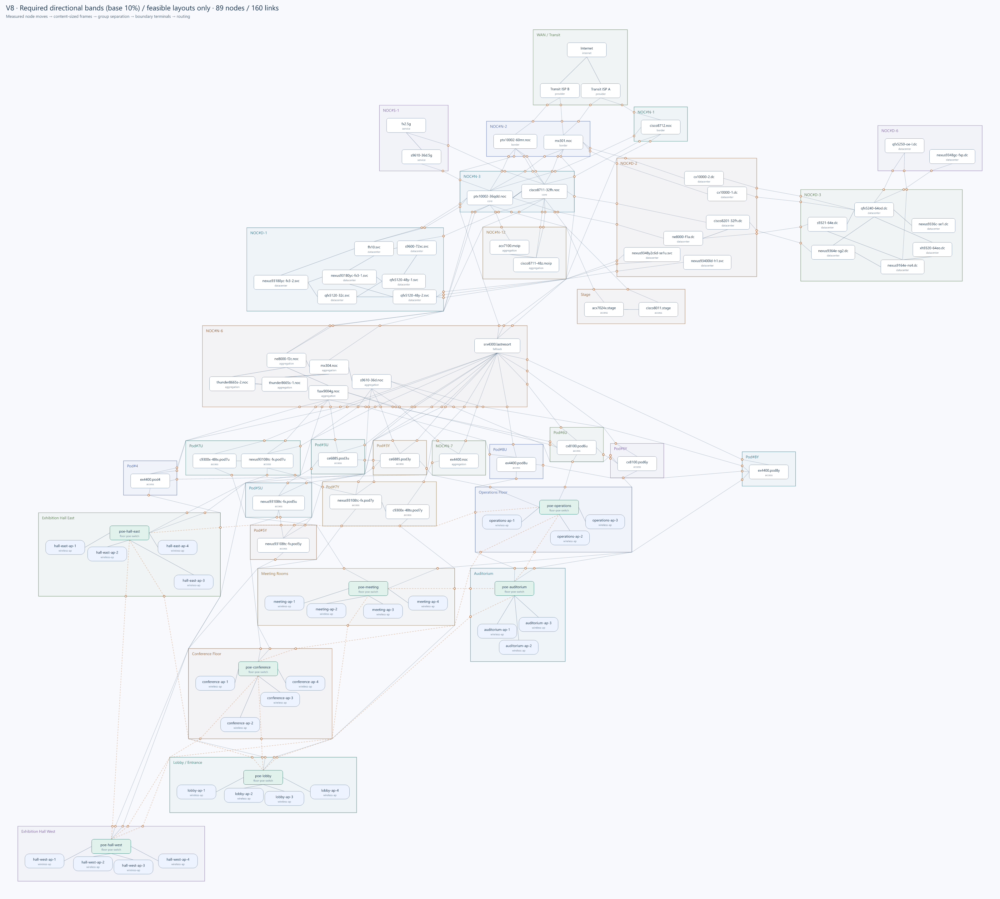

[全体 SVG](archive/tmp-test6-v8-hard-halo.svg) ·
[同縮尺比較](archive/tmp-test6-v8-hard-halo-comparison.png) ·
[計測レポート](archive/tmp-test6-v8-hard-halo-report.json)

| 直前のソフト条件版との比較 | ソフト条件 | 成立条件 |
|---|---:|---:|
| ノード余白帯の重なる組 | 1（数値的に微小） | 0 |
| サブグラフ余白帯の重なる組 | 22 | 0 |
| ノード枠線がほぼ接触する組 | 0 | 0 |
| サブグラフ枠線がほぼ接触する組 | 4 | 0 |
| ノード間の最小可視隙間 | 3.51px | 3.51px |
| サブグラフ間の最小可視隙間 | 0px | 12.18px |
| ノード貫通リンク・ノード対 | 0 | 0 |
| 図全体の交差リンク対 | 209 | 222 |
| 重なり長（リンク対ごとに加算） | 743.20 | 607.65 |
| 表示線長 | 63537.12 | 64477.40 |

初期配置を成立条件へ修復した直後は、貫通 3、交差 237、線長 64865.18。
これも `rebuiltInitial` に記録し、その後の探索で貫通 0 に戻している。
必要余白の不足は全て解消した一方、前回より交差は 13 組増え、線長も約 1.5% 増えた。
余分な余白を全て取り切ったことや、最小交差・大域最適は主張しない。

72 ノードが移動、12 グループが拡縮。最大移動量は約 208.30px。
2,633 候補を採点し、修復不能または最終余白不足による棄却は今回は 0 件。
8 周の探索上限で停止し、最終周にも 2 回の更新があった。
全体 **42 テスト / 27,843 アサーション成功**。
余白帯の接触許可と侵入検出、修復の入力非破壊・Internet 固定、簡易端点と本配線の一致、
最終図と各周ログの帯非重複、実体の非重複、内部深さ、全リンク保持、外部経路の枠非貫通を検証。
全体 PNG と同縮尺比較 PNG を目視確認済み。

## V8 追記: 接続数と辺ごとの集中を反映した余白帯

`area-halo` の結果を開始点に、同じ基準面積比 10% で追加実験。
ノードは接続リンクの端点数、サブグラフは境界プロット点数を k として、
外周余白の面積を **本体面積 × 0.1 × sqrt(1 + k)** とする。
本体は枠線を含む外接矩形。内部だけで完結するリンクはサブグラフの k に含めない。
並列リンクはそれぞれ数え、同じ四辺中央の接続点を共有していてもまとめない。

各候補の再配線後に、実際のノード端点と境界点から辺ごとの本数を数え直す。
接続していない辺にも前回の等厚の基本余白を保持し、**接続数で増えた面積だけ**を
辺ごとの `本数 / 辺の長さ` に応じた厚さで配分する。角の面積も含めて総面積を一致させる。

```text
目標余白面積 B = r A sqrt(1 + k)
基本余白の厚さ = d0（従来の面積比 r から算出）
各辺の厚さ = d0 + t × その辺の本数 / その辺の長さ
```

t は、拡張後の矩形面積 − 枠線込み本体面積 = B を満たす正の解。
接続のない辺の厚さは d0 のまま。サイズ拡縮に相似追従し、役割名による重み付けはしない。
枠と周辺グループ、境界点、外部経路を再計算する点や、余白の重なりをソフトに評価する点は継続。
余白帯そのものを配線の障害物にはせず、配線は実際の枠を避ける。

ノード貫通件数を最優先にし、同数なら既存 4 指標とノード間／グループ間余白ペナルティを
開始時の値（下限 1）で規格化して等重み加算する。比率、平方根の増加則、辺への配分則、
探索上限 8 周という選択は残る。接触ゼロを必須条件には追加していない。

各要素の本数、辺ごとの本数、実効面積比、面積、基本厚さ、四辺の厚さを
レポートの `avoidance.haloProfiles.before/after` に保存する。

再実行: `archive/` で `bun run tmp-test6-v8-elastic-render.mjs --connection-halo`。
描画のみ再生成: 同じコマンドに `--render-report` を追加。
比率変更は `--area-ratio=0.1`。再実行すると `connection-halo` の出力だけを上書きする。
専用テスト: `bun test ./tmp-test6-v8-connection-halo.test.mjs`。

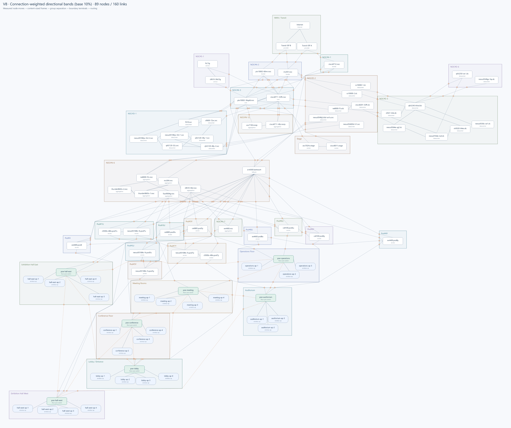

[全体 SVG](archive/tmp-test6-v8-connection-halo.svg) ·
[同縮尺比較](archive/tmp-test6-v8-connection-halo-comparison.png) ·
[計測・辺別余白レポート](archive/tmp-test6-v8-connection-halo-report.json)

| 直前の一律面積比版との比較 | 一律 10% | 本数・辺別配分 |
|---|---:|---:|
| ノード間の最小可視隙間 | 1.34px | 3.51px |
| ノード枠線がほぼ接触する組 | 0 | 0 |
| サブグラフ枠線がほぼ接触する組 | 0 | 4 |
| ノード貫通リンク・ノード対 | 1 | 0 |
| 図全体の交差リンク対 | 208 | 209 |
| 重なり長（リンク対ごとに加算） | 814.13 | 743.20 |
| 表示線長 | 63847.54 | 63537.12 |

新しい余白指標で開始配置も測り直すと、ノード間の帯ペナルティは 1.01005 → 約 2.08e-15、
グループ間は 40.55572 → 3.19549。旧指標の 0.00967 / 0.81638 と直接比較しない。
ノードの帯はほぼ分離したが、グループ側の帯は 22 組で重なり、実枠線の接触も 4 組戻った。
最後の探索 1 周（14 回の更新）の前後では貫通 1 → 0、交差 210 → 209、
線長 63812.41 → 63537.12 に対し、グループ接触 3 → 4、帯ペナルティ 2.78219 → 3.19549。
このログは周単位であり、単一の移動の前後とは区別する。
貫通が減る候補は最優先。同数の場合にも他指標との加算評価があるため、接触増加は許される。
接触数自体は評価に含まず、帯の重なり面積で評価する。全箇所の空きを保証する実装ではない。

例えば NOC#N-6 は境界点 33 個（左 0・右 3・上 6・下 24）で実効面積比は約 58.3%。
計算上の帯厚は左約 10.83px、右約 55.93px、上約 33.61px、下約 101.93px。
これは目安の帯厚であって、実際に全周で確保された空白距離ではない。
全ノードの端点数合計 320、全グループの境界点数合計 196 を確認した。

75 ノードが移動し、15 グループの枠サイズが変化。最大移動量は約 460.20px。
4,762 候補を全再配線後に評価。8 周の上限で停止し、収束や大域最適は主張しない。
前回出力を開始点とする追加探索の比較であり、同じ探索回数のアブレーション比較ではない。
面積の等式、角の面積、方向配分、スケール相似、本数、入力保持、幾何、再配線と計測再現を検証。
全体 **38 テスト / 21,566 アサーション成功**。全体 PNG と同縮尺比較 PNG を目視確認済み。

## V8 追記: 面積比による外周の余白帯

`elastic-frames` の結果を開始点として、ノード同士とサブグラフ同士の接近を評価に追加。
以前の出力は上書きせず、`area-halo` として保存する。

ユーザーの面積ベースの定義を採用。比率の指定はなかったため、試験値 **10%** を採用した。
高さの何%でも、一定 px の最小間隔でもない。
枠線を含む外接矩形の幅を W、高さを H とし、その外側に付ける余白帯の厚さ d を求める。

```text
(W + 2d)(H + 2d) − WH = r WH
d = r WH / (sqrt((W + H)² + 4rWH) + W + H)
```

W/H はノード・グループごとに実寸から求める。グループが拡縮するたびに d を再計算。
同じ面積なら細長い形ほど薄くなる。描画全体を一様に拡大すれば厚さも同じ倍率で拡大する。
丸角の厳密な面積ではなく、枠線を含む外接矩形によるモデル。

- 本体同士の非重複条件は従来どおり。余白帯は **ソフトな評価** であり、強制的に離す条件ではない。
- 余白帯を含めて拡張した矩形同士の重なり面積を、両者の小さい方の余白帯面積で割り、
  その二乗を組ごとに加算する。余白帯に相手の本体が侵入する場合も評価対象。
  純粋な「帯と帯」だけの交差では、辺同士が接触した状態を適切に罰せないため。
- ノード間／グループ間のペナルティをそれぞれ開始時の値（下限 1）で規格化し、
  既存の線長・交差・重なり・侵入深さと等重みで加算する。ノード貫通件数最優先は維持。
- 帯の重なりをちょうど解消する移動量も幾何から生成する。全量・半量を候補とし、
  枠・周辺グループ・境界点・外部経路を更新した結果で採否を決める。
- 比率、評価の等重み、探索上限 8 周という設定は残る。完全自動・大域最適ではない。
  タイトル用などの既存の内側余白と、境界点の分散処理も変更していない。

再実行: `archive/` で `bun run tmp-test6-v8-elastic-render.mjs --area-halo`。
比率変更: `--area-ratio=0.1`。変更して再実行すると `area-halo` の成果物を上書きする。
`--area-halo` を付けない既存実験の経路は、余白帯の評価なしで維持する。
専用テスト: `bun test ./tmp-test6-v8-area-halo.test.mjs`。

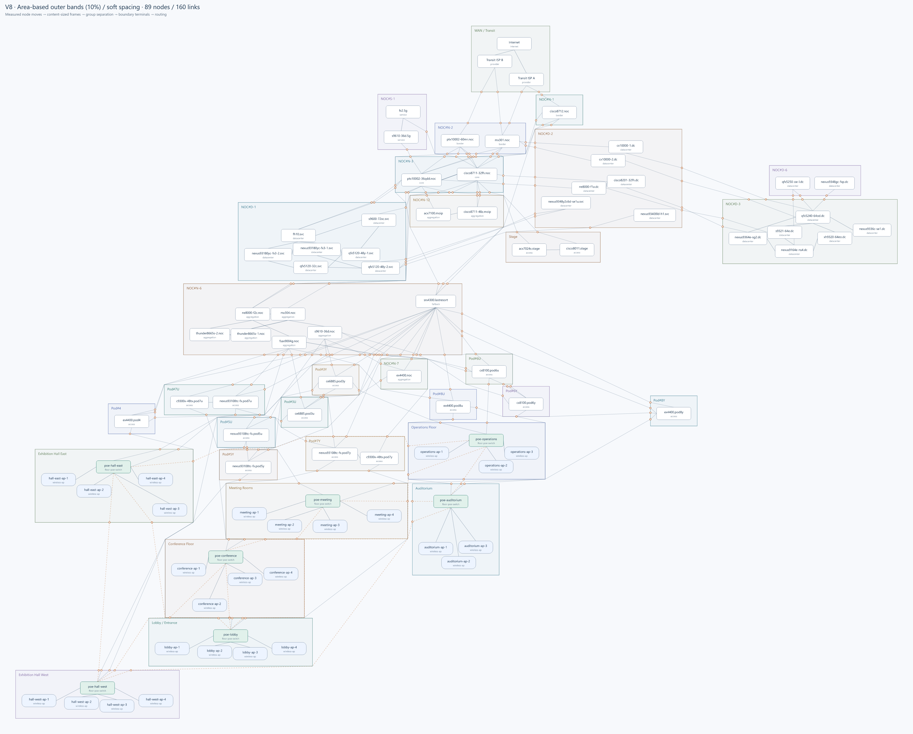

[全体 SVG](archive/tmp-test6-v8-area-halo.svg) ·
[同縮尺比較](archive/tmp-test6-v8-area-halo-comparison.png) ·
[計測レポート](archive/tmp-test6-v8-area-halo-report.json)

| 直前の可変枠版との比較 | 余白帯なし | 面積比 10% |
|---|---:|---:|
| ノード枠線がほぼ接触する組 | 11 | 0 |
| サブグラフ枠線がほぼ接触する組 | 19 | 0 |
| ノード間の余白帯込み領域が重なる組 | 21 | 6 |
| サブグラフ間の余白帯込み領域が重なる組 | 25 | 9 |
| ノード貫通リンク・ノード対 | 1 | 1 |
| 図全体の交差リンク対 | 197 | 208 |
| 重なり長（リンク対ごとに加算） | 1183.22 | 814.13 |
| 表示線長 | 62322.77 | 63847.54 |

接触判定は枠線の外側同士の距離が 0.00001px 以下の場合。接触がゼロでも、十分に広い
間隔を保証するものではない。最小の見た目上の隙間はノード間約 **1.34px**、
サブグラフ間約 **0.72px** で、縮小表示では近く見える箇所が残る。
余白帯の重なりを許すソフトな評価のため、目安の厚さを全箇所で確保してはいない。

計算された余白帯の厚さは、ノードが約 1.76〜1.92px、サブグラフが約 3.49〜11.12px。
ノード間ペナルティは 1.5714 → 0.00967、サブグラフ間は 9.5115 → 0.81638。
線の重なり長は約 31.2% 減ったが、交差数は増え、総線長も約 2.4% 増加した。
単に面積比を入れるだけですべての指標が改善するわけではない。

75 ノードが移動し、15 グループの枠サイズが変化。最大移動量は約 325.73px。
4,474 候補を評価し、上限 8 周で停止。最終周にも更新があり、収束は主張しない。
入力・所属・接続、Internet 固定、枠とノードの非重複、内部階層順、再配線と評価値を検証。
面積比の等式、形状依存、スケール相似、枠線込み接触の評価も単体テストで検証。
全体 **34 テスト / 20,474 アサーション成功**。全体 PNG と同縮尺比較 PNG を目視確認済み。

## V8 追記: 枠の固定を解除し、周辺配置と配線まで再計算

直前の `dynamic-avoidance` の出力を開始点とする。以前の実験はそのまま保存。
内部ノードを動かす候補ごとに、次を一連の評価として実行する。

1. 各グループのノード外接矩形から枠を再生成する。旧サイズを上限・下限にはしない。
2. 枠同士が重なれば、重なりを解消する短い軸方向へグループごと平行移動する。
   移動可能な両側で補正量を半分ずつ負担し、Internet を含むグループは平行移動しない。
   連鎖的な重なりも反復解消する。128 回で収束しない候補は却下する。
3. 新しいノード位置と枠から境界点を再計算し、外部の最短可視経路を引き直す。
   ノード端点は四辺中央のまま。見通しが通る境界点間は直線を維持する。
4. 更新後の全配線で、ノード貫通・交差・重なり長・総線長を評価する。
   接続先に近づくグループ全体の移動も候補として試す。

枠の位置・サイズ・境界点・外部経路を固定する条件を解除した。
新しい最大幅、最小枠サイズ、折り返し、固定リング、役割別配置は追加していない。
内部の異なる深さの上下順は維持し、同じ深さのノードには上下のずれを許す。
これは折り返し処理ではなく、個別移動の結果。

**残る表示条件・探索上の判断**:

- 描画余白は `side-centers` の内容外接矩形と枠の差から引き継ぐ。
  このデータでは左右・下が約 24px、上が 44px。余白自体を最適化したわけではない。
  `dynamic-avoidance` 移動後の空いた領域を、新たな余白として固定しない。
- 既存の境界点分散処理（角から 18px、点間最大 10px）は変更していない。
- ノード間の非重複、内部階層順、Internet ノードの絶対位置を保持する。
  グループ同士の間隔は表示枠線幅 1.5px から求める。従来の約 20px は課さない。
  Internet グループの枠全体を他の全枠より上に置く別条件は課していない。
- ノード貫通件数を最優先。同数なら、侵入深さ二乗和・交差リンク対数・重なり長・
  総線長を開始時の値で規格化して等重み加算。変位は同評価時の選択にのみ使用する。
- 最大 8 周で停止。最後の周にも微小な更新があり、収束・大域最適は主張しない。
  3,192 候補を全配線更新後に評価した。衝突解消の軸選択も局所的な探索方針。

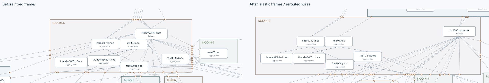

[全体 SVG](archive/tmp-test6-v8-elastic-frames.svg) ·
[全体 PNG](archive/tmp-test6-v8-elastic-frames.png) ·
[計測・サイズ変更レポート](archive/tmp-test6-v8-elastic-frames-report.json)

| 直前の枠固定版との比較 | 枠固定 | 可変枠・全再配線 |
|---|---:|---:|
| ノード貫通リンク・ノード対 | 24 | 1 |
| 図全体の交差リンク対 | 129 | 197 |
| 重なり長（リンク対ごとに加算） | 1301.84 | 1183.22 |
| 表示線長 | 67282.86 | 62322.77 |

初期位置のまま枠と配線だけを再生成した時点では、貫通は 29、交差は 118。
この中間値も `rebuiltInitial` として保存し、前後比較から隠していない。
探索後は貫通が 1 まで減り、総線長は直前より約 7.4% 短縮した一方、交差は増加した。
貫通最優先のため交差悪化を受け入れた結果であり、すべての指標が改善したわけではない。

31 グループ中 19 個の枠サイズが変化。例えば NOC#N-6 は約 673×252 → 1067×274、
Auditorium は 480×184 → 約 348×350 と、拡大・縮小の両方が発生した。
85 ノードが移動し、グループ移動も含む最大変位は約 863.16px。
移動を小さく抑える保証はない。残る 1 件の貫通と交差増加は次の評価方針の検討対象。

89 ノード・160 リンク・31 グループ・196 境界点、入力ハッシュ、所属と接続を保持。
枠同士／ノード同士の非重複、Internet 固定、内部階層順、端点の四辺中央、境界点の再計算、
外部経路の枠非貫通、直線可視性、計測値の再現をテスト。全体 30 テスト / 13,008 アサーション成功。
全体 PNG と同縮尺比較 PNG を目視確認済み。

再実行: `archive/` で `bun run tmp-test6-v8-elastic-render.mjs`。
専用テスト: `bun test ./tmp-test6-v8-elastic-frames.test.mjs`。
アーカイブのハッシュ更新: `bun run tmp-refresh-manifest.mjs`。

## V8 追記: 固定ピクセル量から計測値駆動へ

同じ `side-centers` の初期配置を使う比較実験。
前の `avoid-lines` の結果から追加移動したものではない。
固定 8px の線周囲余白、24px の移動上限、12/8/4/2/1px の移動ステップは使用しない。

1. 線分とノード矩形の投影から、衝突を解消するための移動量を計算する。
2. 追加クリアランスは描画 SVG の線幅とノード枠線の幅の和の半分から得る。
3. 接続先の重心方向への移動も候補にし、端点を更新して全配線を測り直す。
4. ノードへの貫通件数を最優先。同数なら、侵入深さ二乗和・交差リンク対数・
   同一直線上の重なり長・実際の表示線長を、それぞれ初期値で規格化して等重み加算する。
5. 移動量の小ささは評価が同等の場合の選択に使う。固定上限はない。

優先順位・等重みという判断は残る。数値を取得するだけで、何を良い図とするかまで自動で決まるわけではない。
最大 12 周、実行は改善が止まった 7 周で終了。候補の移動量の半分を試すことや
幾何的に移動できる範囲を二分探索するのは数値探索手法であり、ピクセル余白の条件ではない。

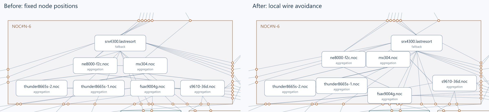

[全体 SVG](archive/tmp-test6-v8-dynamic-avoidance.svg) ·
[計測・移動レポート](archive/tmp-test6-v8-dynamic-avoidance-report.json)

| 同じ固定初期配置との比較 | 初期 | 動的移動後 |
|---|---:|---:|
| ノード貫通リンク・ノード対 | 55 | 24 |
| 図全体の交差リンク対 | 135 | 129 |
| 重なり長（リンク対ごとに加算） | 1361.19 | 1301.84 |
| 表示線長 | 68183.43 | 67282.86 |

交差数は内部と外部を含む全ポリラインでリンク対を数え、端点で触れるだけの場合は除外する。
従来の外部のみの交差数とは異なる指標なので、82 などの値とは直接比較しない。
重なり長は並列リンクの同一路線も含み、共通区間をリンク対ごとに数える。

57 ノードが移動し、最大移動量は約 143.74px。固定 24px 版も貫通件数は 24 まで減っていたため、
貫通件数について動的版が優れたわけではない。移動が大きすぎるケースもあり、
元の配置をどれだけ保つかという優先度は残課題。

まだ固定しているもの: サブグラフの位置・サイズ、境界点、外部経路、Internet、内部階層順。
タイトルを守るため、初期の最上段ノードの上端を内容領域の上限として引き継ぐ。
枠内への包含とノード同士の非重複も必須。これらをなくした完全な自由配置ではない。
以前の 6/32/4/2px の追加余白は使わず、枠線の太さと既存の内容領域で判定する。

再実行: `archive/` で `bun run tmp-test6-v8-avoid-lines.mjs --dynamic`。
専用テスト: `bun test ./tmp-test6-v8-dynamic-avoidance.test.mjs`。
全体 26 テスト / 3,953 アサーション成功。

## V8 追記: 線を避けるノードの局所移動

ユーザーの「線の周りにあるノードが多少よける」要求に対応。
`side-centers` の配置を基準に、ノードだけ最大 24px 移動する。
線の周囲 8px を避ける目安とし、線と無関係ノードの交差件数を優先、同数なら
侵入深さの二乗和＋元位置からの移動量の二乗和×0.05 を小さくする。
移動のたびに四辺中央の端点を更新するため、線側の変化も再評価する。
線自身の接続先ノードは衝突対象から除外し、同じリンク・ノードの組は一回だけ数える。

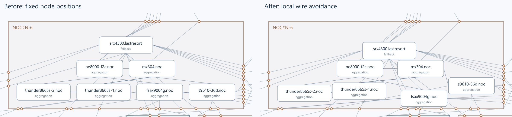

[全体 SVG](archive/tmp-test6-v8-avoid-lines.svg) ·
[PNG](archive/tmp-test6-v8-avoid-lines.png) ·
[移動量・残った衝突・探索レポート](archive/tmp-test6-v8-avoid-lines-report.json)

- 線と無関係ノードの交差: **55 → 24 組**。55 ノードが移動、最大移動は 24px。
- 周囲 8px 内にある組: 64 → 70。交差解消を優先したため、近接件数自体は増えている。
  近接の深さの二乗和は 83,601.58 → 40,233.60。すべての近接・重なりが解消したわけではない。
- サブグラフの位置・サイズ、境界点、外部経路は不変。89 ノード・160 リンクを維持。
- Internet は固定。ノード同士の非重複、枠内への包含、異なる内部階層の上下順を維持。
- **同階層の厳密な一行整列は局所的に緩和**。少し上下へよけることを許す。折り返しではない。
- 固定枠内で動くための安全余白: 左右・下 6px、タイトル側 32px、ノード間 4px、階層間最低 2px。
  元の枠サイズは拡大しない。元位置へ戻す弱い評価を併用する。
- 12 / 8 / 4 / 2 / 1px の上下左右・斜め移動を、各段階最大 4 周探索。実行で 10,744 候補を評価。
- 局所探索であり完全解の保証はない。枠・移動量・階層制約の範囲では残る重なりがある。
- 23 テスト / 3,114 アサーション成功。

`archive/` で `bun run tmp-test6-v8-avoid-lines.mjs` により再生成する。
テスト: `bun test ./tmp-test6-v8-avoid-lines.test.mjs`。
内部ノード位置が変わるので、以前の中心基準評価をそのまま最新値として引き継がず、
専用の `avoidance` 計測をレポートに保存する。

## V8: ノードの四辺中央から配線

V7 / direct-routing のノード・サブグラフの配置と境界点をそのまま引き継ぎ、
ノード側の端点だけを上・右・下・左の各辺中央に変更した。
相手へ向かうレイが交わる辺を選び、その辺の正確な中央を使う。
外部接続は境界点の方向、内部接続は相手ノード中心の方向を使う。
角への完全な同率は左右辺を優先する。辺の選択の最適化はまだ行っていない。

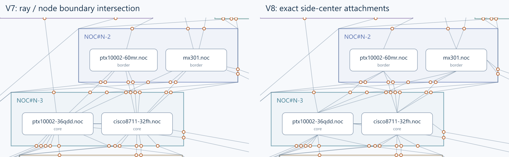

[V8 全体 SVG](archive/tmp-test6-v8-side-centers.svg) ·
[V8 PNG](archive/tmp-test6-v8-side-centers.png) ·
[V8 レポート](archive/tmp-test6-v8-side-centers-report.json)

- 89 ノード・160 リンク・31 グループを保持。全 320 ノード側端点が辺中央にあることを検証。
- 境界点と外部経路は V7 から完全一致。直角の出入りや余分な中継点は追加しない。
- 同じ辺を使う複数リンクは同じ中央点を共有する。重なり解消やポートの分散は未実施。
- 中央に寄せることでノード付近の線長は変わる。従来の中心基準距離指標ではこの差を測れないため、
  レポートに実際の表示線長合計も記録（63,616.50 → 68,183.43）。
- 20 テスト / 1,774 アサーション成功。内部配線の再最適化・再配置はしていない。

`archive/` で `bun run tmp-test6-v8-side-centers.mjs` により V8 と比較画像を再生成する。
V8 テストは `bun test ./tmp-test6-v8-side-centers.test.mjs`。
共有ルーターの標準動作は V7 のまま、V8 が明示的に辺中央の端点関数を渡す。

## 保存後の追記: 境界の強制直角出入りを撤去

境界から法線方向へ必ず 10px 出る処理と、障害物枠の 10px 膨張を撤去した。
境界点そのものを経路探索の端点にし、実際の枠内部を横切らない最短可視経路を使う。
境界点間の直線が通れば、その一本を採用する。枠への接触は許し、内部への貫通は許さない。

**配置・内部順序・境界点は変更していない。再配置の最適化は実行していない。**
グループ同士の配置間隔など、既存配置の条件はこの修正では変更しない。
free-groups などの過去レポート・画像は旧ルーターの履歴として維持する。
現行の共有ルーターを使って今後再探索する場合は、新しい配線で候補が評価される。

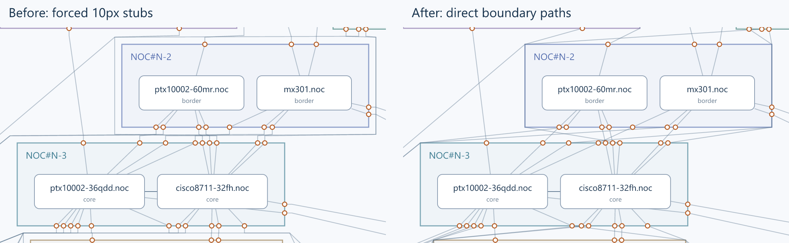

[修正後の全体 SVG](archive/tmp-test6-v7-direct-routing.svg) ·
[修正後 PNG](archive/tmp-test6-v7-direct-routing.png) ·
[配線だけの比較レポート](archive/tmp-test6-v7-direct-routing-report.json)

- 98 本の外部接続のうち、境界点間を直線で結べるものは 45 本。
- そのうち従来不必要に曲がっていた 44 本は、すべて直線に修正。
- 枠貫通・端点欠落・従来より長い経路はいずれも 0。
- 全接続の中心基準経路長: 81,777.29 → 80,274.25。
- 外部交差リンク対: 77 → 82。短い経路への変更で交差が増える箇所は残る。
- 18 テスト / 1,180 アサーション成功。

`archive/` で `bun run tmp-test6-v7-direct-routing.mjs` により、保存した free-groups の配置を
固定したまま新しい配線と比較画像を生成する。
テストは従来の 4 ファイルに `./tmp-test6-v7-direct-routing.test.mjs` を加えて実行する。

## 配置実験の保存結果（配線は修正前）

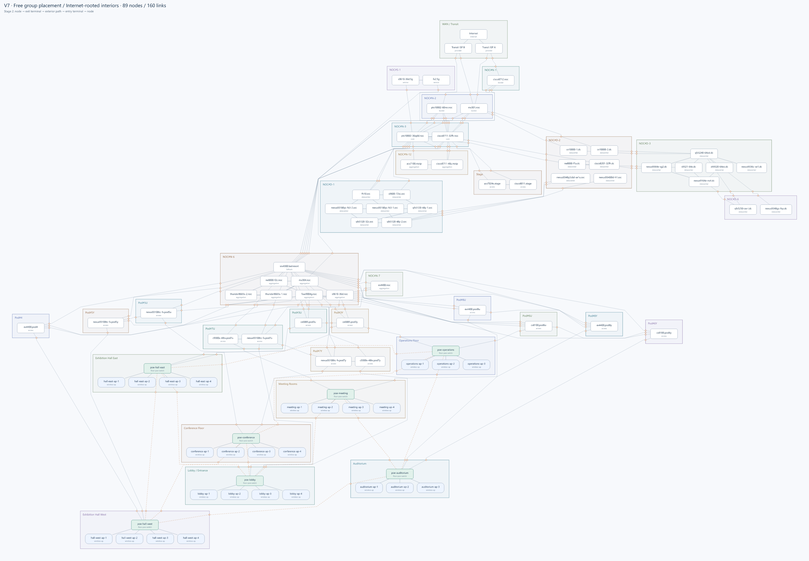

[拡大用 SVG](archive/tmp-test6-v7-free-groups.svg) ·
[配置だけの図](archive/tmp-test6-v7-free-groups-only.png) ·
[グループだけの図](archive/tmp-test6-v7-free-groups-macro.png) ·
[座標・評価・検証レポート](archive/tmp-test6-v7-free-groups-report.json)

## 目的と入力

機器の役割をハードコードした段配置ではなく、ノード間・サブグラフ間の依存関係から、
複雑なネットワークを読み取れる配置を探す。ここで依存関係は接続関係を指す。
無向の接続データから実際の通信経路・因果関係・トラフィック方向を断定しない。

- 元データ: 53 ノード / 104 リンク / 1 グループ。
- 所属などを補完したデータ: 同じ 53 ノード / 104 リンク / 23 グループ。
- 別途作った簡略サンプル: 27 ノード / 38 リンク / 6 グループ。
  元の複雑さが失われるため、以後の比較の本線にはしなかった。
- 最終比較用データ: **89 ノード / 160 リンク / 31 グループ**。
  元の接続を残し、Internet・ISP、場所別の PoE スイッチ、AP などをテスト用に追加。
  フロア間の相互接続や冗長接続も保持する。
- グループ間リンク 98 本、境界端点 196 個。端点は描画上の接続点で、追加の実機ではない。
- 入力: [tmp-test6-complete-upstream-to-ap.json](archive/tmp-test6-complete-upstream-to-ap.json)
- SHA-256: `744813125f7a0c5b46e9b351843048e76a5d1a2829647681e4c793e8e1a92cda`

入力には検出元の機器名・プライベート管理アドレス等と、テスト用の推測・補完情報が含まれる。
検証済みの実ネットワーク構成でも、匿名化済み公開データでもない。
試作の入力・履歴であり、本番設定として使わない。

## 実験の経緯

| 段階 | 試したこと・判断 | 保存した図 |
|---|---|---|
| 構成補完 | AP だけを独立した島にせず、ラック側スイッチ → 場所別 PoE → AP とし、フロア間接続も残す | [ラック〜AP](archive/tmp-test6-rack-floor-poe-ap.png) |
| 共同最適化 | ノード座標とグループの位置・大きさを同時に探索。役割・方向などの条件が多すぎる問題があった | [初期案](archive/tmp-test6-joint-placement.png) |
| 役割を除外 | 役割を評価から外し、接続関係を中心に探索 | [role-free](archive/tmp-test6-role-free-placement.png) |
| 依存関係のみ | 起点を固定し、ノード接続とメンバー由来のグループ関係を評価。包含枠をノードから算出 | [dependency](archive/tmp-test6-dependency-placement.png) |
| 探索の拡張 | 同じ評価関数で、グループ移動・入れ替え・大きな移動と局所緩和を追加。局所探索だけより改善 | [expanded](archive/tmp-test6-search-expanded.png) |
| V7 境界モデル | グループ枠を置き、各リンクの枠上の出入口を決め、内部を配置する方式に変更 | [boundary](archive/tmp-test6-v7-boundary.png) |
| 極座標 / 直交座標 | グループ中心は半径・角度、内部は回転しない直交座標 | [polar](archive/tmp-test6-v7-polar.png) |
| 内部階層化の誤った試行 | 固定枠に入れるため兄弟を折り返した。要求と異なるため取りやめ | [不採用・折り返し案](archive/tmp-test6-v7-hierarchy.png) |
| 内容由来の枠 | 一階層を一行とし、枠は行の実寸から算出。幅上限と折り返しを撤去 | [tree](archive/tmp-test6-v7-tree.png) |
| 境界を含む評価 | グループ中心同士の距離だけでなく、実ノードからの境界点、内部順序、最終的な外部経路を評価 | [boundary-optimized](archive/tmp-test6-v7-boundary-optimized.png) |
| 起点を明示 | ユーザー指定として Internet を最上流にした。内部階層はまだ境界接続ノード起点だった | [Internet 起点](archive/tmp-test6-v7-internet-upstream.png) |
| 内部階層を修正 | Internet からの全体接続段数を内部にも反映。内部交差・貫通・重なりを評価に追加 | [内部修正後](archive/tmp-test6-v7-rooted-interior-refined.png) |
| **現在** | **非起点グループ間の「下流枠全体を上流枠全体より下に置く」制約を外した** | [free-groups](archive/tmp-test6-v7-free-groups.png) |

古い `*-notes.md` は当時の仕様を説明する履歴。現在の採用仕様と混同しないこと。
特に `v7-hierarchy` の固定枠・折り返しは不採用。

## 現在のアルゴリズム

### 構成から決めるもの

1. `test:internet` をユーザー指定の起点として扱う。
2. 全リンクを無向 BFS でたどり、ノードごとの最短接続段数を求める。
3. 各グループ内で段数順に配置。同じ段数は一行。存在しない段数の空行は作らない。
4. 内部の上流隣接ノードは複数でも `parentNodes` に保持。木にするためにリンクを削除しない。
5. ノード幅・行幅・行高・タイトルと描画余白から枠を算出。役割ラベルは表示だけに使う。

### 探索するもの

- サブグラフ中心の距離・角度、角度の入れ替え、接続グループ群の一括移動、ランダム再配置。
- 同じ内部階層の左右順。今回の内部候補は全グループ合計 265 通り、最大 48 通り/グループ。
- 実ノードから相手ノードへ向かう方向に基づく境界端点を再計算し、内部順序と最大 3 回交互更新。
- 高速探索では外部端点間を直線で評価。64 周の探索で得た候補を、実際に描画する外部経路で再評価。
- 最新実行は 21,078 候補を提案、配置可能な 5,703 候補を評価し、最終候補 7 件を外部経路で比較。

### 評価関数

外部＋内部の交差、内部線の無関係ノード貫通、内部線の同一直線上の重なり、全接続経路長の二乗和。
各項を以前の Internet 起点図の値で規格化して加算する。件数の分母は最低 1。
枠拡大直後の大きな初期余白を分母にすると長い配線が軽く評価されるため、比較基準を固定した。

内部線はノードの表示枠で切り取った直線と、ノードから境界までの線を計測。
外部の交差はリンク対単位で数え、共通の実ノードを持つリンク対は除外する。
内部と外部の交差は別領域のイベントとして加算する。外部の同一路線の重なりは未評価。

### 維持している条件 / 外した条件

- 維持: Internet を含む起点グループは最上部、内部は一階層一行、枠・ノードは非重複、全リンクを保持。
- 維持: ノード間隔 18px、内部段間隔 20px、タイトル等の描画余白、外部経路の片側 10px クリアランス。
  枠同士の分離判定は約 20px。これらは今回変更していない。
- **撤去: 非起点グループ同士の、枠全体に対する上下順序。** 接続していても横並びや逆の高さを許す。
- 追加していない: 枠の最大サイズ、兄弟の折り返し、固定リング・角度セクター、役割別 tier。
- グループの所属、内部階層・サイズ、規格化の基準は直前の実験から維持。内部の左右順は再探索される。

## 比較結果と注意点

| 指標 | Internet 起点・内部未修正 | 内部修正・上下制約あり | 現在・上下制約なし |
|---|---:|---:|---:|
| 内部交差（境界への線を含む） | 98 | 22 | 19 |
| 内部線の無関係ノード貫通 | 73 | 43 | 38 |
| 内部線の直線重なり | 24 | 5 | 5 |
| 外部経路の交差リンク対 | 56 | 71 | 77 |
| 全接続の中心基準経路長合計 | 90,659.08 | 83,282.24 | 81,777.29 |

内部修正で 15 ノードの内部深さと 4 グループの内容由来サイズが変わった。
最後の制約撤去では階層と枠サイズを変えていない。線長は直前から約 1.8% 短縮したが、外部交差は増えた。
**全指標が改善したわけではなく、見た目の余白も大きくは解消していない。**
最後の実験は直前結果からの追加探索でもあるため、差分すべてを制約撤去だけの効果とは断定しない。
異なる方式の目的関数値をそのまま比較しない。

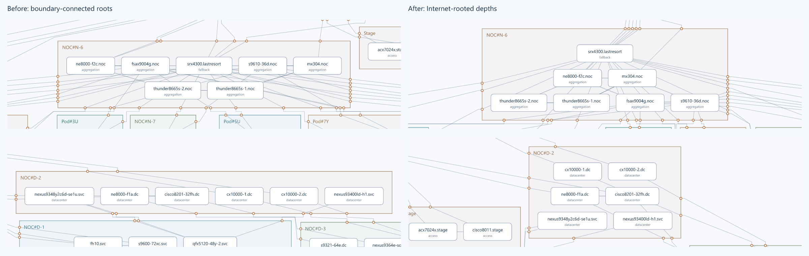

## 検証と残課題

保存先で 15 テスト、687 アサーションを実行する構成。
入力ハッシュ・ID・リンク端点・内部階層の維持、Internet 最上流、ノード・枠の非重複、
包含、境界端点、外部経路の枠貫通、描画と評価の幾何一致を検証。
最新レポートの必須幾何チェックはすべて 0。ただし内部の線による貫通は評価対象であって禁止条件ではない。

残課題:

- BFS の段数は実際の上流方向ではない。冗長・迂回接続をどう意味づけるか。
- 内部深さは探索前に固定。階層自体の別解は探索していない。
- 同階層一行＋直線では避けられない重なりがある。条件変更は勝手に追加せず別途判断する。
- 内部と外部の目的が競合する。外部交差の悪化を許す評価でよいか。
- 高速な直線評価と、最終の迂回経路評価に差がある。候補の絞り込みで良い配置を落としていないか。
- 3 回の内部・端点交互更新、初期配置依存、有限の大域移動。最適解の保証はない。
- 同一の探索予算で制約あり/なしを比較する対照実験は未実施。
- 起点グループだけは枠全体を最上部に置く条件が残る。Internet ノードだけの固定とは異なる。
- 本番規模への計算量評価、UI の起点選択、本番エンジンへの統合は未実施。

## 保存構成と再開手順

`archive/` に入力・実験ソース・テスト・計測レポート・主な PNG/SVG・当時のメモを同居させた。
相互参照を保つため `tmp-test6-*` の名前を維持しているが、ここは意図的にバージョン管理する。
本番パッケージ・バージョン・依存関係は変更しない。
元のルート直下の scratch と無関係な Web サイトの変更は、この保存作業では変更・コミットしない。

PNG 出力スクリプトの依存参照だけ、保存先からリポジトリの `renderer-png` を参照するよう調整した。
履歴の図は当時の保存物であり、現行の実験コードで全履歴を完全に再現できる保証はない。
途中のレポートを固定シードとして保存し、現在の実験を再開できるようにしている。

前提: リポジトリの依存を `bun install` 済み。確認環境は Windows / Bun 1.3.4。
**以下はすべて `archive/` をカレントディレクトリにして実行する。再描画は保存済み成果物を更新する。**

```powershell
Set-Location docs/experiments/2026-09-13-network-layout/archive

# 保存済み成果物とロジックのテスト（再探索なし）
bun test ./tmp-test6-v7-free-groups.test.mjs ./tmp-test6-v7-rooted-interior.test.mjs ./tmp-test6-v7-upstream.test.mjs ./tmp-test6-v7-boundary-search.test.mjs

# 最新の実験を、保存した直前結果から再探索
bun run tmp-test6-v7-boundary.mjs --upstream test:internet --rooted-interior --free-groups
bun run tmp-test6-export-placement.mjs --v7-free-groups

# 内部修正時の比較画像（free-groups との比較ではない）
bun run tmp-test6-v7-compare-interiors.mjs

# インストール済み Biome に対応した実験専用設定
$sources = Get-ChildItem -File | Where-Object { $_.Extension -in '.mjs','.ts' } | Select-Object -ExpandProperty Name
bun x biome check --config-path=tmp-test6-biome.json @sources
```

データ補完スクリプト 3 本も保存しているが、最新入力の生成過程には対話的な修正も含まれる。
比較実験の入力には保存した最終 JSON を使うこと。補完スクリプトの再実行で上書きしない。
`manifest.json` は保存時点の各アーカイブファイルのサイズと SHA-256 を記録する。

### 保存コミット時の検証環境

保存先で 15 テスト / 687 アサーション成功。19 ソースを実験専用 Biome 設定でチェックし成功。
PNG 再出力、作業メモのリンク先、99 アーカイブファイルのハッシュを検証した。
通常の pre-commit はシェル内で `bunx` が見つからず、リポジトリ全体の lint も
インストール済み Biome がルート設定の `preset` を解釈できないため失敗した。
全体 typecheck も、ドキュメント生成が参照する `libs/plugins/snmp-lldp/src/index.ts` の欠落で失敗した。
本作業では全体設定や依存を変更せず、この保存コミットに限って共通フックをスキップする。
リポジトリ全体の検証成功を意味するものではない。
