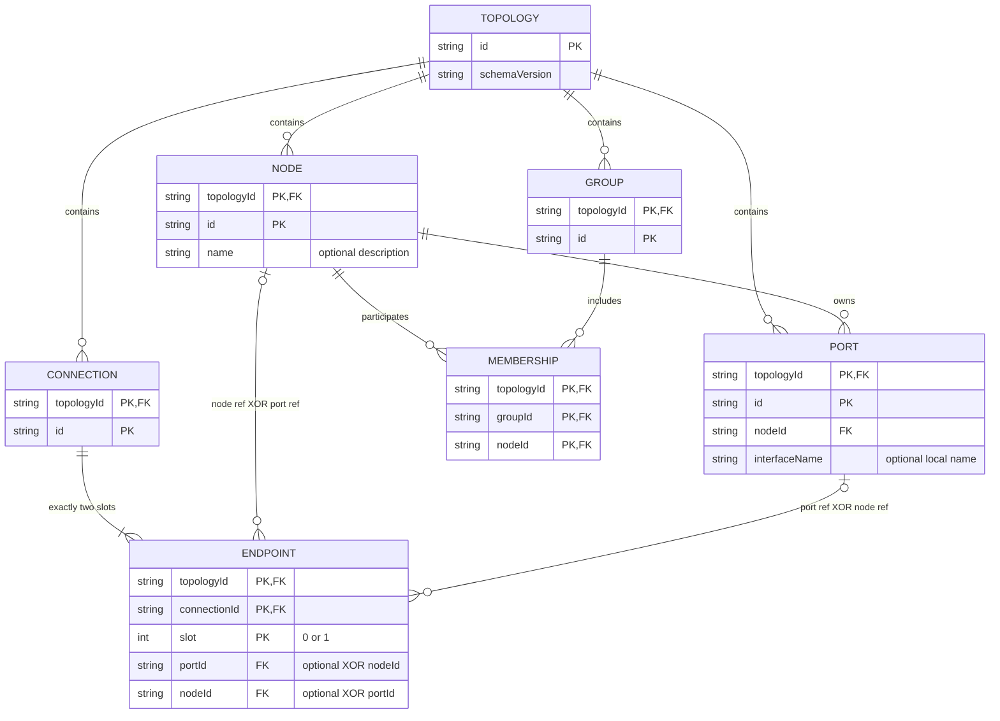
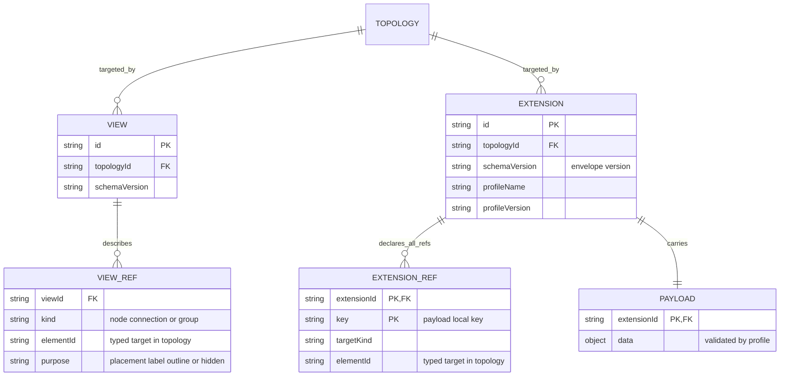
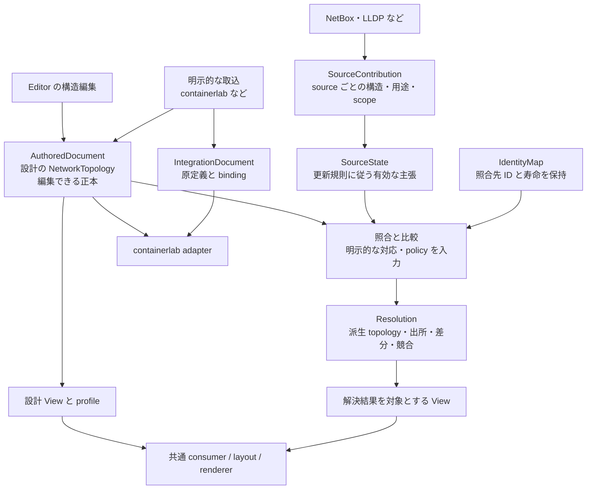
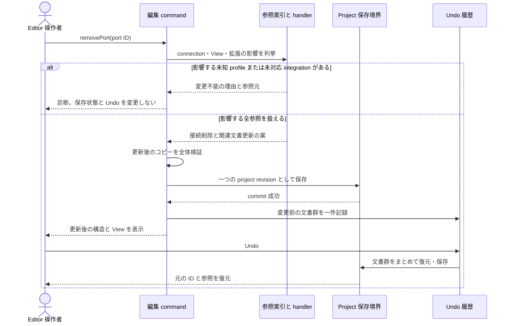
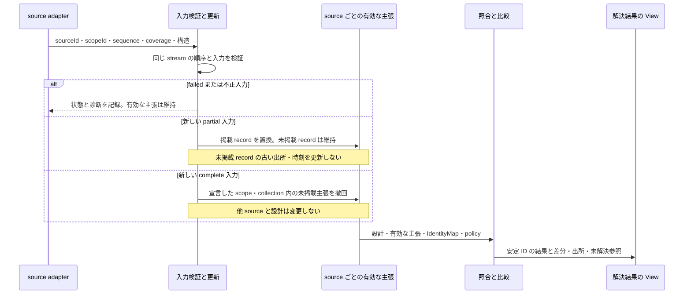
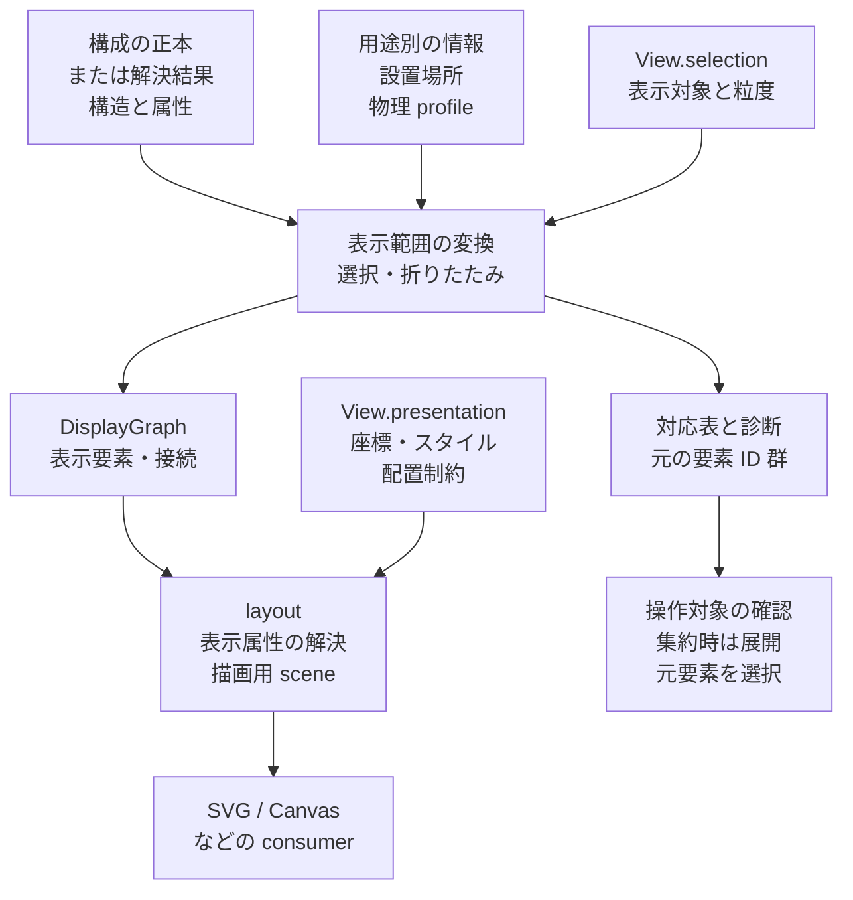

# Shumoku ネットワークモデルの論理設計

**小さな構造の核、拡張の参照契約、編集と観測の境界を図と変更例で確認するための設計案。**

更新日: 2026-10-06。状態: 論理設計の提案。図の整合性と具体例を確認する段階であり、
runtime schema、編集処理、source 更新処理の実装で成立を確認したものではない。
[図の閲覧版](examples/network-model/design-diagrams.html)は六つの図を切替・拡大して確認できる。
[再設計方針](network-model-direction.ja.md)の詳細を定め、
[実装計画](network-model-implementation-plan.ja.md)の設計確認と試作の入口にする。
要求と候補の比較は [概念選定レビュー](network-model-concept-review.ja.md)を参照。
図は初期コアと P1 の候補方式を示す。envelope、端点 slot、収集 sequence は公開仕様として未確定。
ER 図は再編案を示す。最小分離案との比較は P1a で行い、その結果に合わせて更新する。
現在は[表示分離の小さな実験](experiments/2026-10-06-model-separation/README.md)で、
座標・サイズ・ポート配置・代表的なスタイル・配置方向を別保存できることを確認した。
選択・折りたたみ・所属表現の比較と、この文書全体の契約検証はまだ残っている。

ここでの ER 図は論理的な所有・参照・多重度を示す。
図の箱をそのまま SQL table にすることや、現在の DB に合わせることは要求しない。
JSON の保存形、メモリー上の索引、DB の物理設計は、この意味の契約を満たす別の実装である。
図だけでは表せない XOR、端点数、ID スコープ、変更時の制約は本文を併せて読む。

## 意味の原則と試作する方式

| 判断 | 理由 | 確認する例 |
| --- | --- | --- |
| NetworkTopology は構造を表す値の型。どの文書が正本かは所有者で決める | 型が同じことと、編集権限が同じことを混同しない | Editor の設計と source の再取込 |
| Node、Port、二端点 Connection と任意の名前付き Group を初期候補にする | 範囲を限定し、包含や共有媒体を同じ関係にしない | Group なしの consumer、二つの View と物理配線 profile |
| 設計、source ごとの主張、Resolution を別に保持する | 実態の更新で人の設計を上書きしない | 改名後の再収集と設計・観測の差 |
| 拡張の版と参照の影響を検査できるようにする。envelope は候補方式 | 参照契約を守る producer の payload を、未対応 consumer でも保持できる | envelope と参照パスの比較、未知 profile を持つポートの削除 |
| 小さな consumer と変更例で土台を先に検証する | 全製品の移植前に意味の不足を発見する | 複数所属の描画と partial snapshot |

## 基本構造の ER 図



`ENDPOINT` と `MEMBERSHIP` は参照関係を見せるための論理表現である。
wire format では `Connection.endpoints` と `Group.nodeIds` にできる。
複合 PK は topology を含むスコープを示す。FK は必ず同じ topology の要素へ向く。
Node は文書内の要素で、実機との同一性は ID だけで決めない。
Port は物理・論理の端点を表し、connector や interface の詳細は対応する規約で区別する。
媒体・層・実現方法を混ぜた Connection.kind は初期コアに置かない。

### ID と端点の制約

1. Node、Port、Connection、Group の ID は、同じ topology の全 collection を通して一意。
   名前、配列順、IP、interfaceName から ID の意味や実機の同一性を推定しない。
2. Port は必ず一つの Node に所有される。Port の所有者変更は通常の改名とは別の構造変更。
   Connection が portId を持つ場合、所有 nodeId は Port から求めて重複保存しない。
3. Connection は二つの端点を持ち、各端点は `{portId}` または `{nodeId}` の XOR。
   不明なポートを生成しない。同じ参照を二回指定した接続は初期契約では不正とする。
4. Connection は無向。ただし端点の slot 0/1 は、端ごとの拡張情報を参照する位置として維持する。
   無向であることを理由に端点を自動で並べ替えない。slot は送受信方向を意味しない。
   slot は P1 の候補方式であり、端点 ID を持つ方式と入替・付替えで比較する。
5. 一つの Port を複数の Connection が参照することは core では禁止しない。
   物理コネクターの占有や containerlab の interface 使用制約は、対応する profile/adapter が検査する。

同じ Node の異なる Port を結ぶ接続は表せる。
同じ二端点を結ぶ別の Connection も別 ID で保持できる。
接続関係、通信の正常性、ケーブルの一本数、接続の同定を一つの制約にしない。

### 名前付き集合の制約

Membership は重複のない明示的な所属集合で、Node は複数 Group に所属できる。
Group は省略でき、初期には parentGroupId を持たない。
分類の親子、装置の物理的包含、VLAN / VRF の通信文脈は用途別の関係で定義する。
集合への所属は、その Node の通信制御や隔離を保証しない。
P1 では表示以外の集合参照も試し、core に置く必要性を確認する。

サイトとセキュリティ区画の両方に属する Node を、異なる View でそれぞれ囲む例を初期試験にする。
一つの View に重なる囲みを出す場合、描画 consumer は対応能力を宣言する。
単一の親を要求する layout へ渡すために、一方の所属を構造から削除してはいけない。
最初の layout 試作では、選んだ囲みが重なる場合に診断を返す方式でよい。

## 表示と拡張の参照図



`VIEW_REF` は nodePlacements、nodeLabels、groupOutlines、hidden IDs などをまとめた図上の略記。
`EXTENSION` は domain profile と integration が共有する参照 envelope の概念であり、
すべての用途を一つの巨大な payload schema に統合する宣言ではない。
elementId の解決先は指定した kind の collection に限定する。
設計 project の commit 時には全参照が存在することを要求する。
解決結果を対象とするライブ View は、一時的に解決できない参照を保存して診断できる。
描画へ渡す派生 View には、その時点で解決できる参照だけを含める。

### View が保証すること

View は一つの topology を対象にし、要素 ID へ参照する。
表示ラベル・配置・非表示・囲みを変えても NetworkTopology は変わらない。
Group の囲みは表示の選択であり、所属の正本にはならない。
物理座標や校正・配線長を扱う場合は、物理 profile を参照して表示する。
自由配置の座標から物理位置や長さを推定しない。
View の selection と presentation を分け、選択・折りたたみから読み取り用の表示グラフを作る。
保存形式を二つに増やす要求ではない。詳細は [表示範囲の契約](#構造から表示範囲を作る契約)を参照。

### 拡張 envelope の最小契約

以下は P1 で試す候補方式である。参照の影響を列挙する要求を、payload の宣言的な参照パスで
満たす方式とも比較する。envelope が未知 payload 内の隠れた ID を自動で発見するわけではなく、
producer が全参照を宣言する契約を守ることが前提になる。

| 項目 | 初期に決める意味 |
| --- | --- |
| id と topologyId | 拡張文書の ID と参照先のスコープ |
| schemaVersion | envelope の構造の版 |
| profileName と profileVersion | 用途を表す名前空間と、その意味・payload schema の版 |
| references | key と型付き target の全一覧。key はこの拡張内で一意 |
| payload | 内部要素を参照する箇所は references の key を使う。ID を隠して直接埋めない |

例として、ケーブル経路を connection に結ぶ最小の profile を試す。
部材表や全コネクター模型を初期に完成させる必要はない。

```json
{
  "schemaVersion": "0.1.0-draft",
  "id": "profile-cable-route",
  "topologyId": "network-campus",
  "profileName": "shumoku.physical-route",
  "profileVersion": "0.1.0-draft",
  "references": [
    { "key": "uplink", "target": { "kind": "connection", "id": "connection-uplink" } }
  ],
  "payload": {
    "routes": [{ "connectionRef": "uplink", "length_m": 12.5, "basis": "measured" }]
  }
}
```

この例の測定値は架空の fixture で、既存ネットワークの実測ではない。
profile の validator が connectionRef の解決、単位・値域、basis の意味を検査する。
core の型に cable route 用のフィールドを追加せず、profile を追加できることを確認する。
[profile の文書例](examples/network-model/router-switch.route-profile.json)と、
[基本 View](examples/network-model/router-switch.view.json)、
[区画を囲む View](examples/network-model/router-switch.security-view.json)を使って検証する。
端ごとの情報は connection ID と slot で参照する別の型付き locator を profile 契約にできる。
core の配列順を変える操作では、この locator も編集対象になる。

未知の profile は envelope と payload を保持し、参照の存在とスコープまで検査する。
payload の意味の適合は「未検証」と表示し、全 profile が有効だと宣言しない。
未知の profile が参照する要素の削除・付替えは、編集全体を止めて診断する。
これは有効な設計 project を保存する初期 Editor の方針である。
読み取り consumer、履歴として参照切れを保持する consumer は別の能力・保存契約を宣言できる。
既知 profile は handler が参照・payload を一緒に更新して再検証する。
handler がないことを理由に拡張を捨てたり、本文の文字列を検索置換したりしない。

必須 profile を consumer が理解できない場合、その機能は実行しない。
単なる構造描画なら未対応 profile を保持したまま描画できる。
profile の内容が不正な場合と、未対応のため未検証の場合も区別する。

### containerlab integration の境界

IntegrationDocument も内部参照の一覧を持ち、外部形式の原定義と対応表を別に保持する。
外部の nodeName、interface 名、kind/image と、Shumoku の ID・説明名を混同しない。
Editor で Node.name を変えても containerlab の nodeName を暗黙に変えない。
実行用の名称変更は、adapter の対応能力を検査する別の操作にする。

初期の変換対象は明示的な二端点 veth と対応する nodes とする。
別の link type や未知の起動設定も原定義に保持するが、編集・生成の対応能力とは分ける。
原定義をそのまま返せることだけで import の正しさを証明せず、
抽出した Node、Port、Connection と binding の対応も比較する。
実際の deploy は論理設計の確認とは別の検証にする。

## 編集と情報源のデータフロー



図の AuthoredDocument、SourceState、IdentityMap は責務の名前であり、
新たに必ず三つの公開 package や DB を作る要求ではない。
単独の静的 topology の生成・描画にこの処理群を要求しない。
sequence・record 全体置換・ID 対応の保管は収集試作の候補方式で、構造の core schema には入れない。

### 書込みの権限と正本

| 対象 | 書く処理 | 更新しない対象 |
| --- | --- | --- |
| 設計の NetworkTopology | Editor の atomic command、明示的な import | source の原主張と Resolution |
| source ごとの主張 | 対応する collector/adapter と更新処理 | 人が作った設計 |
| IdentityMap | 明示的な照合操作。初期は自動照合を不要とする | 装置の名前・構造・実在性 |
| Resolution | resolver が入力と policy から再計算 | 元の設計や source の値 |
| View/profile/integration | 対応する編集処理と、宣言された参照調整 | 観測値を設計上の事実へ暗黙に昇格させること |

Editor の基本編集は設計文書を対象にする。Resolution の topology を直接編集して保存しない。
観測値を設計へ採る場合は、対象と内容を指定した明示的な取込操作にする。
containerlab の静的 import も設計へコピーする操作で、継続監視の登録とは別である。
これにより、設計の改名後に NetBox が元の名前を返しても設計の改名は残る。
Resolution は双方の値と用途を保持し、差を示す。

NetworkTopology が「正本」であるという表現は、この編集可能な設計文書に対して使う。
同じ型で source の局所構造や派生構造を表せても、それぞれの書込み権限は異なる。

### 同定と参照先の寿命

source 内の参照は `(sourceId, scopeId, local element ID)` で区別する。
外部参照の authority は、NetBox の接続先インスタンスまで含む。
表示名や IP の一致だけで同一の Node に統合しない。

Resolution の出力先 topology ID と canonical element ID は、解決する workspace 内で保持する。
元の topology/element ID と canonical ID の対応は IdentityMap に記録する。
毎回の再計算で新しい ID を生成したり、現在の勝者 source の ID に付け替えたりしない。
一つの source が撤回しても、残る主張に対応する canonical ID は維持する。
撤回と同定の解除は別の操作である。
異なる kind の要素は同じ canonical ID に対応させない。
Port の対応は、その所有 Node の対応と矛盾してはいけない。
同じ実機の証拠があっても、異なる層・用途の Node を自動で一つにしない。
明示的な対応でも、その要素の意味と文脈を確認する必要がある。

初期は自動 merge/split を実装しない。明示的な照合と、安定した対応だけを試す。
将来の merge/split による ID 変更は、View/profile の再結合を伴う独立した設計対象にする。
取り消した ID を別の装置へ再利用しない。

設計 View は設計 topology ID を対象にし、解決結果の View は出力先 topology ID を対象にする。
異なる topology の ID を偶然一致させて結び付けない。
ライブな参照先が観測から消えた場合、配置などは保持して未解決参照と診断し、表示対象から外す。
再登場した同じ canonical ID へ再結合できる。設計文書の明示的な削除とは異なる扱いである。

## ポート削除を確認するシーケンス図



初期の removePort は、設計の Port とそれを端点にする Connection を削除する。
該当 Connection の表示情報・既知 profile・integration binding も handler の契約に従って調整する。
node 端点に変換して接続を残す操作は別 command にする。削除時に未知ポートへ暗黙変換しない。
removeNode は所有 Port と接続、Membership、関連参照を同じ方法で扱う。

参照の影響を調べる索引は文書から再構築できる派生値とする。
保存された配列と索引を、別々の正本として編集しない。
validation または保存が失敗した場合は変更前を維持し、成功した履歴を作らない。
初期の同じ project に対する構造編集 command は直列に処理する。
Undo は設計・View・拡張・binding の同じ変更範囲を復元し、外部 source の収集を巻き戻さない。
実際の保存トランザクションや Undo の方式は、この契約を満たすように試作で選ぶ。

## source 更新を確認するシーケンス図



### snapshot の最小更新契約

sourceId は情報源、scopeId はその情報源が主張を更新する範囲の識別子にする。
scope の内容と、対象 collection ごとの complete/partial/not-collected を宣言する。
Node の一覧が complete でも、Port を収集していなければ Port の撤回には使えない。
scope の変更を同じ scopeId で暗黙に上書きしない。

初期は掲載された record 全体の置換を入力契約にする。
partial は未掲載 record の撤回を禁止する意味であり、掲載 record のフィールド別 patch ではない。
掲載 record で属性を省略した場合、その source の現在の record はその属性を主張しない。
別 source の属性を消すことや、0/false に変えることは意味しない。
未掲載 record を保持する場合、その record の元 contribution と時刻も保持し、最新の観測に見せない。
フィールド単位の partial patch は初期に実装しない。

更新順序には同じ source/scope stream 内で単調に増える sequence を使う案とする。
capturedAt は採取時刻の意味に保ち、異なる装置の時計で更新順を推測しない。
遅れて到着した古い sequence は有効な主張を戻さない。
同じ sequence の同じ入力は冪等、異なる入力は不正とする。
sequence の割当・stream 再作成時の扱いは試作で確認する保留事項である。

record の部分撤回で参照先だけが消える場合、有効な主張の集合を無理に有効な topology と呼ばない。
元の主張を保持し、Resolution は所有者のない Port や、端点・所属の参照が成立しない要素を
出力から外して診断する。有効な参照を持つ範囲だけを topology にする。
未特定 node 端点への付替えや Port の捏造は行わない。
有効な topology を提供する adapter の入力と、異なる時点の主張の集合を区別する。
この図の入力方式は、所有者が未収集の Port 単体などの観測をすべて扱える契約ではない。
初期の対応範囲外として元情報と診断を残し、観測が誤りであることや実機の不在とは同一視しない。

### 設計と観測の差を残す

用途は設計・台帳・観測を区別し、手動/自動や内部/外部とは別に記録する。
設計の capacity と観測の容量が違う場合、用途と出所を残した候補として比較する。
Resolution の表示に一つの値を選ぶ場合は、明示した policy と採用理由を持たせる。
表示値が選ばれたことを、別の主張が撤回されたことにしない。
canonical topology 単体ではこの差を説明できないため、差を扱う consumer は Resolution も受け取る。

## 図から確認する五つの変更例

| 変更例 | 期待する結果 | 試作で必要な証拠 |
| --- | --- | --- |
| 設計の改名後に source が元の名前を返す | 設計の値・ID は維持。別用途の値と差を Resolution に残す | 更新前後の入力と出力、ID 対応の比較 |
| Port 削除後に Undo と再読込 | 接続・View・既知 profile・binding が一緒に変更・復元される | project 全体の参照検査と保存結果の比較 |
| 未知 profile が削除対象を参照する | 編集を止め、元の payload と project を保持する | handler なしの fixture と変更前後の一致 |
| サイトと区画の二重所属を二つの View で描く | 構造は同じ。囲みと配置だけが異なる | 小さな独立 consumer の描画と構造の不変性 |
| complete の後に partial/failed、最後に scope 内の撤回 | 未掲載や失敗だけでは消えず、撤回も他 source・設計へ波及しない | 静的 JSON の合否だけでなく、時系列の状態遷移比較 |

図と文章は、この期待結果が矛盾しないかをレビューする材料である。
期待結果が実装で通ることは未検証。スキーマの合格だけで状態遷移の合格としない。

## 構造から表示範囲を作る契約

大規模な構成では、正しい構造をすべて描くだけでは必要な図にならない。
表示する対象と粒度を選ぶ責務を、構造の正本と配置・スタイルの責務から分ける。
次の図は selection / presentation の候補境界であり、新しい public API や保存 schema の決定ではない。



selection と presentation は一つの ViewDocument に置いてもよい。
DisplayGraph、対応表、scene は派生値であり、構成の存在・接続・所属の正本にはならない。
構成の入力は設計 topology または Resolution の読み取り結果とし、変換で一方を他方へ上書きしない。
設計の正本は一つに保ち、別 View のために構成を複製して別々に編集しない。
複数 source の主張を比較する場合も、表示用の解決結果を新しい設計の正本へ暗黙に昇格させない。

### 入出力と変更の境界

| 責務 | 入力・保存するもの | 出力と境界 |
| --- | --- | --- |
| 構成・用途別の事実 | Node、端点、接続、明示的集合、役割、設置場所、測定・設計上の配線情報 | 表示を変えても維持。座標や色から事実を作らない |
| selection | ID 集合、属性条件、表示集合、折りたたみ対象。将来は経路条件 | 構成を変更せず、対象と粒度を決める。選択されないことは不在・削除を意味しない |
| projection | 構成、必要な profile、selection | DisplayGraph、元 ID 対応表、隠した境界・未対応条件の診断。保存時は再生成可能にする |
| presentation / layout | 表示 ID または元要素への参照、表示ラベル、配置、スタイル、配置制約 | scene の形・位置・描画属性。自動計算値と利用者の override を区別する |
| renderer / editor | scene と対応表 | SVG / Canvas の出力や選択。構造編集は元の要素に対する command として行う |

最初の選択は明示 ID と役割・建物などの単純な属性条件から試す。
論理接続と物理配線の一対一対応は要求しない。物理 profile には事実と構成への対応を持たせ、
ラベルや色はその表示として生成する。表示だけを保存して配線情報を保持したことにはしない。
profile の属性を条件に使う場合は、その規約を理解する reader を用意する。
不明な属性・未対応 profile の条件は診断し、全件一致として扱わない。
表示のために選んだ集合は core Group の所属へ書き戻さず、必要なら明示的な構成編集として別に採用する。

通常の絞り込みは選んだ Node の間に存在する接続を対象にし、平行接続の ID を保持する案を試す。
対象外へ伸びる接続は、隠した件数や境界として説明できるようにする。
折りたたみでは、集約要素の表示 ID と元 Node / Connection の ID 群を別にする。
同じ見た目の線へ複数接続を集約した場合も元の ID 群を失わず、内部接続と境界接続を区別する。
再展開は正本から行い、集約要素を実機として保存しない。

構成要素へ一意に戻せる表示は編集対象を決められる。
複数要素を表す集約からの構造編集は、展開または元要素の選択を先に要求する。
表示上の移動・スタイル変更は presentation を変更し、Port / Connection の削除とは分ける。

### 経路と階層についてまだ決めないこと

始点から終点までの選択は、まず構成グラフ上の経路の問題として扱う。
それだけで転送経路、実際のパケット経路、ACL の許可を求められるとはしない。
最短路・複数候補・属性条件・到達不能・探索上限の契約が必要であり、P1a の完成には要求しない。
初期に試す ID / 属性選択と一段の折りたたみの結果を受けて、次の選択機能を決める。

分類の階層、物理的包含、View の表示階層は別の関係である。
Group の親を初期 core に置かないことは、意味の定義された階層の将来追加を禁止しない。
いずれの階層を選んでも、接続全体に木の制約をかけない。

### 現行項目を分けるときの判断

以下は [現在の core 型](../libs/@shumoku/core/src/models/types.ts)を起点にした責務の整理である。
プロパティ名を見て機械的に削除するのではなく、その値が表す意味を確認する。
既存項目の存在は新モデルへの採用理由にならない。現在必要な用途がない項目は引き継がず、
構成から外すためだけに表示側へ新たな機能を実装しない。

| 現行項目・意味 | 候補の移動先 | 保持する意味 |
| --- | --- | --- |
| Node.position、表示用 size、NodePort.placement | 利用者の指定は presentation、自動計算値は scene | 図の配置。校正された設置位置とは区別する |
| Node / Link / Subgraph.style、shape、表示ラベルの装飾 | presentation と renderer の変換 | 見た目。同じ色でも装置の種別や状態を事実として推定しない |
| Node.rank | 初期モデルに引き継がない | 現在必要な用途がない。配置アルゴリズム内部の段番号を保存する要件にしない |
| Subgraph.direction | 必要な配置方向の指定は presentation | 図の配置方向。装置の役割属性や通信方向とは分ける |
| role、設置場所、配線長、校正、物理経由点 | 意味を定義した構成属性または用途別 profile | フィルターや部材・配線の判断に使う事実。描画情報として捨てない |
| Subgraph.parent、membership、Link.redundancy などの複合した責務 | 意味上の所属・関係と、表示上の整理・配置を個別に判断 | 親子や冗長関係の意味を保持する。現在の配置への影響を構成の定義にしない |

### SVG とスタイルの案

SVG の要素に元の要素 ID を属性として持たせ、CSS から見た目を指定する案は consumer の候補である。
接続は自身の ID も識別できるようにし、両端 Node の ID だけで平行接続を混同しない。
折りたたんだ表示の ID は元の要素 ID と同一視せず、対応表を使う。

CSS の selector は SVG 出力に適用する。構成グラフの経路や所属のクエリには別の処理が必要である。
Canvas consumer も同じ presentation の意味を解釈できるようにし、構成データに SVG の
fill / stroke を戻さない。P1a は一つの renderer で分離を試し、CSS の全面採用や Canvas の再実装は条件にしない。

## DB へ落とすときの確認事項

論理的には element の key は topology と ID の組であり、所有・端点・所属の参照も同じスコープに限定する。
端点の XOR と slot 0/1 は CHECK などで表せるが、「必ず二つの端点がある」は文書全体の検証も必要になる。
collection をまたぐ ID 一意性、所属の重複、未知 profile の影響検査も単純な FK だけでは完結しない。

設計の保存は project revision を単位に構造・View・拡張を一緒に commit する。
source の主張、対応表、派生結果にはそれぞれの所有者と更新契約を持たせる。
JSON 保存と正規化 table のどちらでも、この意味を変えない。
物理設計では検索・更新頻度・transaction 境界を測って索引と table を選ぶ。
この段階で現在の SQLite/IndexedDB schema の移行を設計判断の条件にしない。

## 試作へ進む条件と保留事項

実装計画の設計確認段階では、五つの変更例を表せることと、図・型・保存責務の一致を確認する。
続く土台の試作では、参照 validator、小さな profile、最小編集 command、
時系列の source 更新、小さな描画 consumer と静的な変換例で成立を確認する。
Editor/Server/CLI の本格的な導入は、その結果を受けて別の完了条件で進める。

| 保留事項 | 決める時期 | 今の境界 |
| --- | --- | --- |
| 最小分離案と再編案の採用、selection / presentation の保存契約 | P1a の比較 | ER 図と既存 JSON 例は再編案。複数 View と構成不変で比較する |
| schema URL・最終フィールド名・意味の版の指定方法 | 土台の試作の契約整理 | URL は未発行。例は draft |
| canonical ID の保管と sequence の割当・再作成 | source の時系列試作 | 自動 merge/split と分散書込は対象外 |
| project commit と Undo の実装方式 | 最小編集と保存の試作 | 全文書の参照整合性と失敗時の不変性を要求 |
| Group の必要性と重なる囲みの描画 | 小さな consumer の試作 | Group なしの利用と表示以外の参照を確認。対応できない View は診断する |
| 端点 slot / 端点 ID、envelope / 参照パス | P1 の比較試作 | 現行図は候補方式。入替・付替え・保存時の負担を比較する |
| SQL/IndexedDB の table・索引・migration | 製品ごとの導入設計 | 旧 DB との互換性は新モデルの制約にしない |

## 学んだ内容と Shumoku の判断

RFC 8345 は network、node、termination point、link の参照関係を定義する。
所有・参照を明示する考え方を学ぶ一方、有向 link を今回の無向 Connection と同一視しない。
[RFC 8345](https://www.rfc-editor.org/rfc/rfc8345.txt)

RFC 8342 は intended configuration と operational state を区別する。
設計と観測を別の主張として保持する判断の参考にするが、Shumoku の文書群をそのまま
NMDA datastore と呼ぶわけではない。[RFC 8342](https://www.rfc-editor.org/rfc/rfc8342.html)

OTel Telemetry Schemas は意味の規約の進化を扱い、全データの形を定義するものではない。
構造 schema と属性・profile の意味を区別する参考にする。
[OTel Telemetry Schemas](https://opentelemetry.io/docs/specs/otel/schemas/)

以上の ER 図、参照 envelope、snapshot 更新規則は Shumoku への提案であり、
これらの標準の規定をそのまま採用したものではない。
既存実装の経験は [方針の根拠](network-model-direction.ja.md#これまでの実装と実験から分かった問題)、
[Editor 接続モデル](../apps/editor/docs/design/connection-model.md)、
[Server の現在の設計入力](../apps/server/api/src/services/topology.ts)、
[観測の更新経路](../apps/server/api/src/services/observations.ts)を参照する。
