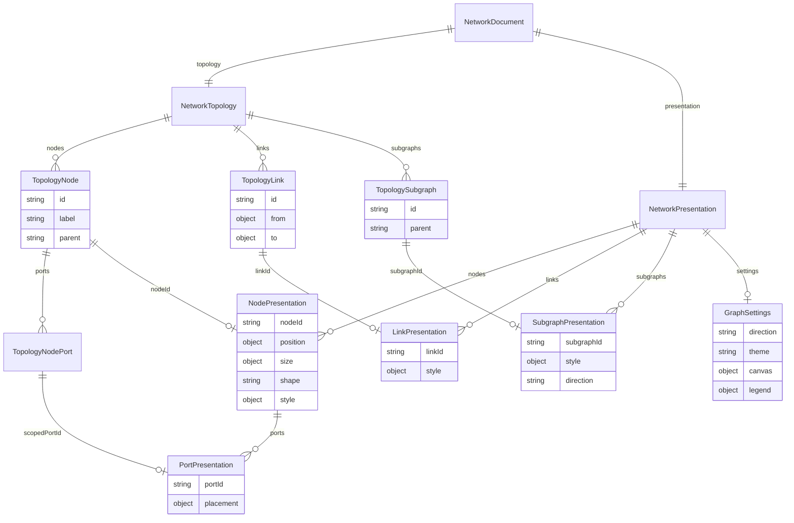
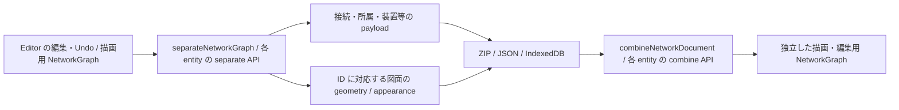

# 構成と表示の分離: Editor の実保存契約

2026-10-07。不要な Node.rank の削除に続き、必要な表示情報を構成 payload から移した。
今回までに Node の図面座標・表示サイズ・形・スタイル、ポートの図上配置、Link / Subgraph の
スタイル、Subgraph.direction、全体の GraphSettings を移した。自動計算する Subgraph.bounds は保存しない。
Editor の ZIP、JSON、ローカル DB の保存・読込・差分同期で同じ境界を使う。

## 目標と現在地

同じネットワークを移動・リサイズ・装飾しても、接続・所属・装置属性は変わらない。
表示データを外しても構成データは利用でき、再合成すれば必要な見た目を復元できる。
この実装は既存モデルから責務を分離する一段である。新しい全機能モデルや公開標準の完成ではない。

| 項目 | 保存先 |
| --- | --- |
| Node の position / size / shape / style | presentation.nodes、nodeId で参照 |
| NodePort.placement | presentation.nodes[].ports、所有 nodeId と portId で参照 |
| Link.style | presentation.links、linkId で参照 |
| Subgraph.style（色・線・ラベル位置・padding・spacing）と direction | presentation.subgraphs、subgraphId で参照 |
| GraphSettings（方向・配色・線・間隔・用紙・凡例・表示の絞込み） | presentation.settings |
| Subgraph.bounds | 保存しない。位置と所属から読込時に再計算 |
| 装置属性、接続先、グループ所属、物理配線など | topology に保持 |
| spec.icon、Link.type / arrow、配線 bends 等の残る項目 | 意味と利用実態の棚卸しが必要 |

既存のスタイル語彙を維持し、独自の CSS 言語や profile 機構は追加していない。
Subgraph.style.rankSpacing は層間の表示間隔であり、削除した Node.rank とは別の項目である。

## 保存契約と図

core の NetworkDocument は schemaVersion: '3'、topology、presentation を持つ。
TopologyNode は position / size / shape / style を、内部の TopologyNodePort は placement を持てない。
TopologyLink は style を、TopologySubgraph は style / direction / bounds を、topology 自体は settings を持てない。
合成 API はこれらの混入を実データでも拒否する。



図は保存時の対応関係を示す。portId は所有 Node 内で一意であり、別 Node の同じ portId と混同しない。
物理記録などは省略している。
グループの親子とリンクの接続は独立した関係であり、接続グラフを木にしない。

```json
{
  "schemaVersion": "3",
  "topology": {
    "version": "1",
    "nodes": [
      { "id": "router", "label": "Router", "ports": [{ "id": "eth0", "label": "eth0", "connectors": [] }] },
      { "id": "switch", "label": "Switch", "ports": [{ "id": "eth1", "label": "eth1", "connectors": [] }] }
    ],
    "links": [
      { "id": "uplink", "from": { "node": "router", "port": "eth0" },
        "to": { "node": "switch", "port": "eth1" } }
    ]
  },
  "presentation": {
    "settings": { "direction": "LR", "legend": false },
    "nodes": [{ "nodeId": "router", "position": { "x": 120, "y": 180 },
                "shape": "cylinder", "style": { "fill": "#123456" },
                "ports": [{ "portId": "eth0", "placement": { "side": "left", "order": 0 } }] }],
    "links": [{ "linkId": "uplink", "style": { "stroke": "#234567" } }],
    "subgraphs": []
  }
}
```

NodePresentation は座標・サイズ・形・スタイル・ポート配置の少なくとも一つが必要。
ports を指定する場合は一件以上で、所有 Node に存在する安定 ID を参照する。未知・重複 portId と構成側への placement 混入を拒否する。
ポート順序は有限値とし、ゼロ・負数・小数を許容する。空 placement は指定したまま保持し、既定値を生成しない。
座標は有限値、サイズ・文字サイズは正の有限値、線幅・間隔は非負の有限値、opacity は 0〜1。
未知の表示キー、重複 ID、参照欠落、不正な値を診断する。色や dash は既存 renderer の文字列語彙を使う。
省略した要素は既存の既定値で描画する。空 style は保存しても色・座標などを補完しない。

表示付き Link には安定 ID が必要。両端が同じ平行接続も各 Link の ID で区別する。
core document / ZIP は無装飾の ID なし Link を保持するが、Editor の正規化キャッシュは全 Link に ID が必要。
キャッシュ保存は ID 欠落・重複を明示的に拒否し、黙って接続を捨てたり統合したりしない。
この validator は表示と合成の境界を検査するもので、構成全体の参照・所属・物理属性の検証器ではない。

## 保存と描画の経路



合成結果と保存値は可変オブジェクトを共有しない。描画や編集から保存値への暗黙の書戻しはない。
保存は編集後の runtime graph を snapshot して明示的に分離する。
保存済み geometry は自動配置で上書きせず、最終位置で port・edge・囲み・表示範囲を再計算する。

| 保存経路 | 現在の形 |
| --- | --- |
| .neted v4 | diagram.json は topology、presentation.json は nodes / links / subgraphs / settings |
| Editor JSON | NetworkDocument schema v3 envelope。JSON import が検査・合成 |
| IndexedDB v6 | Node / Link / Subgraph 行の data と presentation、project 行の diagramPresentation.settings |

DB では二つの table に分けず同じ entity 行に置き、差分保存・全 snapshot 保存・削除を transaction で扱う。
表示だけの変更で data は変わらない。削除で sidecar も消える。
検査失敗は metadata・他の行を含めて rollback する。
DB v2〜v5 は upgrade transaction 内で移行する。旧 sidecar と data を合成してから分け直し、
既存 style と geometry を保ったまま port placement と group direction を移し、bounds を捨てる。
失敗時は upgrade を中断する。旧 DB v1 の扱いは既存方針のままである。

全体設定は Editor の state / snapshot / Undo / diff に追加し、設定だけの変更や解除も project 行に保存する。
project metadata / manifest の settings は別のアプリ設定であり、diagramPresentation.settings と混同しない。
以前の Editor が保存時に落としていた GraphSettings は旧 DB から復元できない。未保存の値を推測して補わない。
Undo/Redo は復元後に cache.touch() を呼び、再読込しても戻した状態を保つ。
bounds の再生成は衝突解消なしで行い、保存ノード位置を動かさない。空グループに古い bounds を残さない。

ZIP v1/v2/v3 と NetworkDocument schema v1/v2 の互換 reader は提供しない。
旧 geometry-only 公開 API / NodeGeometry は NodePresentation と separateNodePresentation / combineNodePresentation に置き換える。
archive、DB、document、package の各版は別契約であり、package version を直接書き換えない。

## 確認した結果

- core 関連 154 テスト、Editor 全 105 テストが成功。
- core build と Editor typecheck が成功。Editor には既存 Svelte warning 7 件がある。
- ZIP 保存から再読込した runtime graph で公開 SVG API を呼び、保存前と同一 SVG と各色の描画を確認。
- core の平行接続、形・style・port 配置のみ、ゼロ値、構成不変、ID・表示値の診断をテスト。
- 実 Editor composer の設定変更・Undo/Redo の保存起動、不正設定拒否、全ノード配置済みの入れ子 bounds 再生成と表示範囲更新をテスト。
- 隔離 Chromium の実 DB v5→v6 移行で、二ノード・一接続・一グループの geometry / style を保ち、port 配置・group direction を分離、bounds を除外。
- DB v2→v6 の直接移行、不正 port 配置による upgrade 中断・旧 v5 の node / group payload 保持も確認。
- 実 diagramState の port 面変更と設定だけの変更→Undo/Redo→cache drain→DB 再読込→DB から ZIP export→project 切替・reload を確認。
- 全体設定の解除・再設定、不正 DPI の diff / snapshot 保存失敗で metadata と entity 全体の rollback を確認。
- Node / Link / Subgraph の削除で対応する保存行も消えることを確認。
- 実際の diagramState で JSON 取込、別 project を挟む cache reload、JSON export、形・線・塗りの復元と一 edge の再生成を確認。

先行 geometry 分離と追加レビューでは、部分配置の復元と transaction 中断も検証した。
全 UI 操作・全 style 値の見え方・新モデル全体を検証したとは扱わない。

## 残る境界と次の一件

Node / NetworkGraph、Editor の state と Undo は合成後の型を使う。構成正本と表示のメモリー状態はまだ別 store ではない。
NetworkTopology には spec.icon、Link.type / arrow、図面と配線にまたがる bends 等が残る。
今回動かした GraphSettings の全項目を各 consumer が描画へ反映する保証は追加していない。保存語彙と既存の利用範囲を保った。
Subgraph.direction も既存 consumer の解釈を維持する。型名だけで純粋な構成への移行完了とは扱わない。
Server の保存・観測解決・YAML の保存契約、Port 独立 collection、source/profile、containerlab adapter は未移行。

次は残る spec.icon、Link.type / arrow、配線 bends を利用コードと照合し、事実・装飾・物理経路を区別する。
特に Link.bends は型コメントでは visual-only とされる一方、Editor の cable-length.ts は配線長に使う。
表示項目と断定して削る前に、図の迂回と実配線経路の保存責務を確認する。
完了条件は、アイコン・線の装飾の変更で構成が不変となり、物理経路・配線長・BOM を失わず往復できること。

Termination の物理座標、Scene の設置位置・校正、Link.via / cable / module は物理情報として保持する。
Link.bends は今回移動せず保持し、上記の意味の不一致を後続で解消する。
色や図上距離からネットワーク・物理の事実を生成せず、position という名前だけで一律に削除しない。
