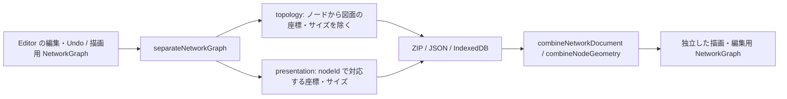

# 構成と表示の分離: 最初の製品変更

2026-10-07。Editor が保存するノードから、図上の `position` と表示用 `size` を分離した。
不要な `rank` の削除に続き、必要な情報を別の責務へ移す段階である。
スタイルの分離や、設計案全体の採用を完了したものではない。

## 今回の保存契約

core の `NetworkDocument` は `schemaVersion: '1'`、`topology`、`presentation` を持つ。
`TopologyNode` は既存 Node から `position` と `size` を除いた型で、両項目の混入を合成時にも拒否する。
`presentation.nodeGeometry` の各要素は `nodeId` と、座標・サイズの少なくとも一つを持つ。
座標は有限値、サイズは正の有限値とする。重複 ID、存在しない参照、未知の表示項目は診断する。
この validator は表示データと合成境界を検査するもので、構成全体の適合仕様ではない。

```json
{
  "schemaVersion": "1",
  "topology": {
    "version": "1",
    "nodes": [{ "id": "router", "label": "Router" }],
    "links": []
  },
  "presentation": {
    "nodeGeometry": [{ "nodeId": "router", "position": { "x": 120, "y": 180 } }]
  }
}
```

座標の原点・アンカーと表示サイズの意味は現行 Node の契約を維持する。
物理的な位置・筐体寸法へ読み替えない。座標がないノードは既存の自動配置経路で扱う。



合成結果と保存値は可変オブジェクトを共有しない。描画側で値を変更しても保存値へ書き戻されない。
Editor の保存操作は編集後の runtime graph を明示的に分離する。自動配置後に保存した場合も、
図の座標・サイズは presentation へ入り、topology へ戻らない。

| 保存経路 | 保存する形 | 読込 |
| --- | --- | --- |
| `.neted` v2 | `diagram.json` は topology、`presentation.json` は presentation | 検査・合成して既存 Editor へ渡す |
| Editor の JSON ダウンロード | 上記 NetworkDocument envelope | JSON import が合成して Editor へ渡す |
| IndexedDB v4 | 同じ node 行の `data` と `presentation` を分離 | nodeId と行 ID を検査して合成する |

IndexedDB は構成と表示を別 table にせず、同じ行へ保存する。差分同期、全 snapshot 保存、
ノード削除は一つの transaction で扱う。移動・サイズ変更では `data` は変わらず `presentation` が変わる。
DB v2/v3 の既存 node 行は v4 upgrade transaction 内で分離する。失敗時は upgrade を中断する。
snapshot 保存中の検査失敗も transaction 全体を abort し、metadata や他の行の部分保存を防ぐ。

ZIP v1 の互換 reader は用意しない。v1 は明示的に拒否する。
ZIP の版、IndexedDB の版、NetworkDocument の版、package の版は別の契約である。

## 残っている境界

- `Node` / `NetworkGraph` は既存 renderer と Editor 内部で使う合成後の型であり、座標・サイズを持つ。
  永続化の入口と出口を切り替えた段階で、Editor のメモリー上の state や Undo 自体は再編していない。
- `NetworkTopology` には、まだ Node/Link/Subgraph のスタイルや layout settings が残る。
  今回の型名だけで純粋なネットワーク構造への移行完了とは扱わない。次の作業はスタイルの実保存分離。
- Server の保存、観測解決、YAML の保存形式は今回の geometry 分離の対象外。
- Termination の物理座標、Scene の設置位置・校正、Link の物理配線 bends は保持する。
  すべての `position` という名前を一律に削ることはしない。
- Port の独立 collection 化、新しい Group/source/profile 契約、containerlab adapter は未導入。

## 確認した結果

core の関連 114 テスト、Editor 全 89 テスト、core の型検査、Editor の型検査が成功した。
Editor 型検査には既存の Svelte warning が残る。全体 lint/typecheck の既存失敗は
[実装計画](network-model-implementation-plan.ja.md)に記載しており、全体成功とは扱わない。

隔離した Chromium の実 IndexedDB でも以下を確認した。ユーザーの保存データは使っていない。

1. DB v3 に座標・サイズ入りの二ノードと一接続を保存し、実際の `openDb()` で v4 へ upgrade。
2. `data` から二項目が消え、`presentation` と接続が保持されることを確認。
3. 実際の差分同期で移動・サイズ変更を保存し、構成 payload が同一であることを確認。
4. 既存 UndoManager と差分同期を使い、Undo/Redo と再読込で座標・サイズを復元。
5. 全 snapshot 保存を実行し、不正サイズで保存を失敗させ、metadata と node 行がともに rollback されることを確認。
6. ノード削除で同じ行の表示データも消えることを確認。
7. NetworkDocument の JSON を実際の `diagramState.importDiagram()` へ渡し、別 project を挟んで再読込。
   保存座標・サイズを維持し、一接続の描画 edge を再生成できることを確認。
8. Editor の reactive state を snapshot して JSON export でき、構成側に座標・サイズが混入しないことを確認。

これは保存境界と基本的な描画復元の検証であり、全 UI 操作・全スタイル・新モデル全体の検証ではない。

レビューでは、保存境界が漏れていないか、ノード ID の対応と原子性が保たれるか、
図面と物理情報の区別が適切か、残るスタイル分離が具体的な次の一件になっているかを確認する。
