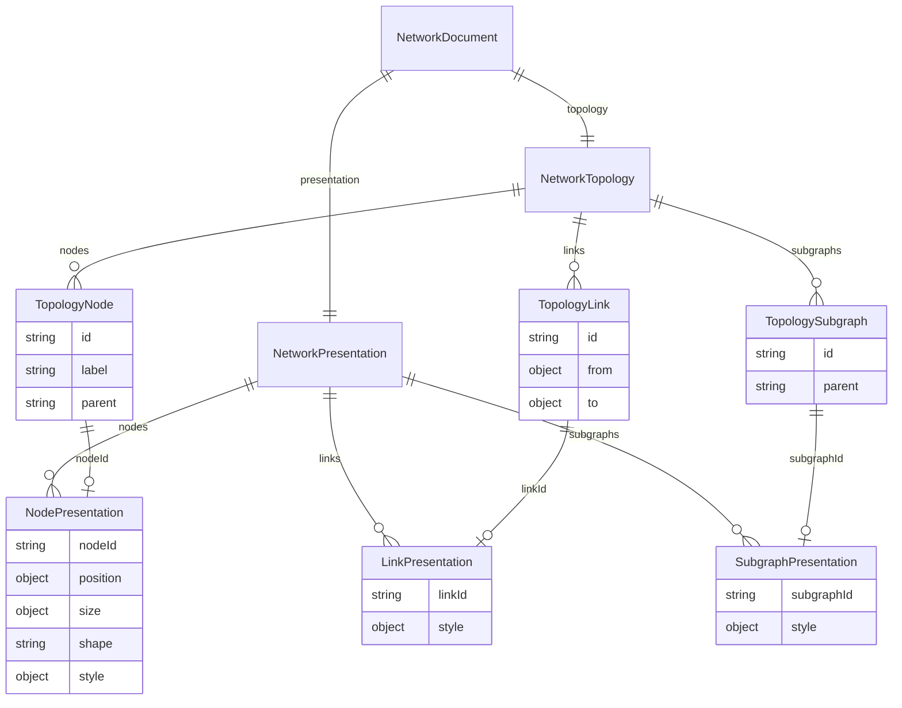
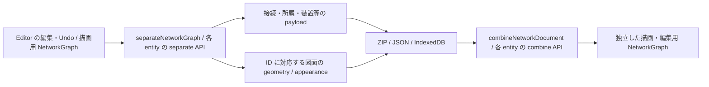

# 構成と表示の分離: Editor の実保存契約

2026-10-07。不要な Node.rank の削除に続き、必要な表示情報を構成 payload から移した。
今回の範囲は Node の図面座標・表示サイズ・形・スタイルと、Link / Subgraph のスタイルである。
Editor の ZIP、JSON、ローカル DB の保存・読込・差分同期で同じ境界を使う。

## 目標と現在地

同じネットワークを移動・リサイズ・装飾しても、接続・所属・装置属性は変わらない。
表示データを外しても構成データは利用でき、再合成すれば必要な見た目を復元できる。
この実装は既存モデルから責務を分離する一段である。新しい全機能モデルや公開標準の完成ではない。

| 項目 | 保存先 |
| --- | --- |
| Node の position / size / shape / style | presentation.nodes、nodeId で参照 |
| Link.style | presentation.links、linkId で参照 |
| Subgraph.style（色・線・ラベル位置・padding・spacing） | presentation.subgraphs、subgraphId で参照 |
| 装置属性、接続先、グループ所属、物理配線など | topology に保持 |
| NodePort.placement、root layout settings、Subgraph.bounds 等 | 構成側に残る。次の分離対象 |

既存のスタイル語彙を維持し、独自の CSS 言語や profile 機構は追加していない。
Subgraph.style.rankSpacing は層間の表示間隔であり、削除した Node.rank とは別の項目である。

## 保存契約と図

core の NetworkDocument は schemaVersion: '2'、topology、presentation を持つ。
TopologyNode は position / size / shape / style を、TopologyLink と TopologySubgraph は style を持てない。
合成 API はこれらの混入を実データでも拒否する。



図は保存時の対応関係を示す。Node の ports、物理記録などは省略している。
グループの親子とリンクの接続は独立した関係であり、接続グラフを木にしない。

```json
{
  "schemaVersion": "2",
  "topology": {
    "version": "1",
    "nodes": [
      { "id": "router", "label": "Router" },
      { "id": "switch", "label": "Switch" }
    ],
    "links": [
      { "id": "uplink", "from": { "node": "router", "port": "eth0" },
        "to": { "node": "switch", "port": "eth1" } }
    ]
  },
  "presentation": {
    "nodes": [{ "nodeId": "router", "position": { "x": 120, "y": 180 },
                "shape": "cylinder", "style": { "fill": "#123456" } }],
    "links": [{ "linkId": "uplink", "style": { "stroke": "#234567" } }],
    "subgraphs": []
  }
}
```

NodePresentation は座標・サイズ・形・スタイルの少なくとも一つが必要。
座標は有限値、サイズ・文字サイズは正の有限値、線幅・間隔は非負の有限値、opacity は 0〜1。
未知の表示キー、重複 ID、参照欠落、不正な値を診断する。色や dash は既存 renderer の文字列語彙を使う。
省略した要素は既存の既定値で描画する。空 style は保存しても色・座標などを補完しない。

表示付き Link には安定 ID が必要。両端が同じ平行接続も各 Link の ID で区別する。
core document / ZIP は無装飾の ID なし Link を保持するが、Editor の正規化キャッシュは全 Link に ID が必要。
キャッシュ保存は ID 欠落・重複を明示的に拒否し、黙って接続を捨てたり統合したりしない。
この validator は表示と合成の境界を検査するもので、構成全体の参照・所属・物理属性の検証器ではない。

## 保存と描画の経路



合成結果と保存値は可変オブジェクトを共有しない。描画や編集から保存値への暗黙の書戻しはない。
保存は編集後の runtime graph を snapshot して明示的に分離する。
保存済み geometry は自動配置で上書きせず、最終位置で port・edge・囲み・表示範囲を再計算する。

| 保存経路 | 現在の形 |
| --- | --- |
| .neted v3 | diagram.json は topology、presentation.json は nodes / links / subgraphs |
| Editor JSON | NetworkDocument schema v2 envelope。JSON import が検査・合成 |
| IndexedDB v5 | Node / Link / Subgraph 行ごとに data と presentation を分離 |

DB では二つの table に分けず同じ entity 行に置き、差分保存・全 snapshot 保存・削除を transaction で扱う。
表示だけの変更で data は変わらない。削除で sidecar も消える。
検査失敗は metadata・他の行を含めて rollback する。
DB v2/v3/v4 は upgrade transaction 内で移行する。v4 の座標 sidecar と data 内の形・style を合成してから分け直す。
失敗時は upgrade を中断する。旧 DB v1 の扱いは既存方針のままである。

ZIP v1/v2 と NetworkDocument schema v1 の互換 reader は提供しない。
旧 geometry-only 公開 API / NodeGeometry は NodePresentation と separateNodePresentation / combineNodePresentation に置き換える。
archive、DB、document、package の各版は別契約であり、package version を直接書き換えない。

## 確認した結果

- core 関連 47 テスト、Editor 全 99 テストが成功。
- core build と Editor typecheck が成功。Editor には既存 Svelte warning 7 件がある。
- ZIP 保存から再読込した runtime graph で公開 SVG API を呼び、保存前と同一 SVG と各色の描画を確認。
- core の平行接続、形のみ・style のみ・ゼロ値、構成不変、ID・表示値の診断をテスト。
- 隔離 Chromium の実 DB v4→v5 移行で、二ノード・一接続・一グループの座標・形・各要素の style を保持。
- DB v2→v5 の直接移行と Termination store の追加、不正 style による upgrade 中断・旧 v4 の全 payload 保持も確認。
- 実際の差分同期、Undo/Redo、再読込で、表示変更時の構成 payload 不変を確認。
- 不正 Link.style、ID 欠落・重複による全 snapshot 保存失敗で metadata と全 entity の rollback を確認。
- Node / Link / Subgraph の削除で対応する保存行も消えることを確認。
- 実際の diagramState で JSON 取込、別 project を挟む cache reload、JSON export、形・線・塗りの復元と一 edge の再生成を確認。

先行 geometry 分離と追加レビューでは、部分配置の復元と transaction 中断も検証した。
[レビュー記録](network-model-review-2026-10-07.ja.md)を参照。
全体 lint/typecheck の既存失敗は [実装計画](network-model-implementation-plan.ja.md)に記録している。
全 UI 操作・全 style 値の見え方・新モデル全体を検証したとは扱わない。

## 残る境界と次の一件

Node / NetworkGraph、Editor の state と Undo は合成後の型を使う。構成正本と表示のメモリー状態はまだ別 store ではない。
NetworkTopology には NodePort.placement、root layout settings、Subgraph の配置関連項目・bounds、
spec.icon 等が残る。型名だけで純粋な構成への移行完了とは扱わない。
Server の保存・観測解決・YAML の保存契約、Port 独立 collection、source/profile、containerlab adapter は未移行。

次は NodePort.placement と root の配置設定を、参照と既定値を保って表示側へ移す。
その際に自動計算する Subgraph.bounds と利用者の指定を区別し、計算値を構成として保存しない。
完了条件は、ポート面・順序・配置方向の変更で topology が変わらず、ZIP / JSON / DB 再読込と Undo で表示を復元できること。

Termination の物理座標、Scene の設置位置・校正、Link.bends / via / cable / module は物理情報として保持する。
色や図上距離からネットワーク・物理の事実を生成せず、position という名前だけで一律に削除しない。
