<!--
======================================================================
 Shumoku 概要資料（公開可能・汎用 / 社内共有・稟議でも使える粒度）
 - 対象: Shumoku を初めて見る人 / 法人の技術担当 / 上長・別部署

 ──────────────────────────────────────────────────
 ★ この資料の軸（背骨）— 迷ったらここに照らす
 ──────────────────────────────────────────────────
 一言の軸:
   Shumoku は、分散したネットワーク情報を「運用に使える 1 枚のトポロジー
   （＝運用の地図）」に変換する OSS。運用では、その地図を生かす Server が中心。

 ナラティブ（product-first 順 — 価値から見せたいので Server を早めに置く）:
   1. なぜ        — 情報が運用に使えない（課題）→ 地図が必要（気づき）   … 課題・地図
   2. 何か        — Shumoku とは（解決）→ 置き換えない（立ち位置）→ どう図になる → 形 … とは・置き換えない・できるまで・エンジン
   3. 生かす(Server) — 運用の中心。まず Server を見せる            … Server とは・Server の使い方
   4. 機能ツアー    — その上で使う機能（生成〜結びつけ〜検索）       … 生成・データソース・結びつけ・状態/アラート・検索
   5. 広がりと信頼  — 使いどころ・OSS 運営・ロードマップ・まとめ

 反復のルール（“似た話”を許す/許さないの基準）:
   - 軸そのもの（統合してトポロジーに／置き換えない／状態・アラート）は、
     高度差があれば反復してよい = 表紙(予告) → 本文(詳細) → まとめ(回収)。
   - 同じ高度で同じことを言うのは「ドリフト」= 要調整。
   - 各スライドは「1 役割・1 メッセージ」。役割が言えないスライドは消すか統合する。
   - パイプラインは 2 本ある: できるまで(内部処理) と Server の使い方(操作) ＝ 別の役割。
     見た目を変える（横パイプ vs 番号カード）ことで重複に見せない。
 ──────────────────────────────────────────────────

 - トーン: 魅力は強く、提供範囲は言い切りすぎない。1 スライド 1 メッセージ。
 - 実装状況の言い回しを混ぜない:
     利用可能 = 「表示します / 利用できます」
     改善中   = 「改善しています / 進めています」
     今後     = 「目指しています / 今後の方向性です」
 - 入れない: 価格 / 商用ライセンス詳細 / 「Enterprise 版を販売」/ パートナー社名 /
   個別顧客要件 / SLA・LTS の約束 / 未実装を実装済みに見せる表現。
 - 立ち位置: これは「Shumoku の紹介」資料。法人に紹介する場面で使うが、法人向け営業資料ではない。
   導入支援・PoC・サポート提供などの商談・サービス提案は本資料に入れず、別資料（商談用補足）に分ける。
 - 事実メモ（実態に合わせる）:
     アラートは主にホスト/ノード単位（alert.nodeId）。IF/リンク/グループ単位は主張しない。
     共有リンク(/share)・REST API・検索/ハイライト・SVG/HTML/PNG・Sync・Mapping は実装済み。
     人手の補正（追加/非表示/メトリクス紐づけ）はモデルレベル実装済み。レイアウトの手動配置・保持は改善中。

 画像について:
 - 方針: 「1 スライド 1 枚以上・視覚優先」。テキストより図・スクショ・前後比較で見せる。
   主役 1 点＋補助数点まで。詰め込みすぎず主役を 1 つ作る。付録の表は画像なしで可。
 - 現在テキスト＋簡易図のみ。実スクショは未挿入（imgslot がプレースホルダ）。
 - 撮影時の共通注意: 必ずサンプルデータ（Head Office / Core Router / L3 Switch /
   Branch A など汎用名）。実在環境の IP・組織名・機器名・ホスト名は写さない。
 - テーマ: docs/slides/themes/shumoku.css（@theme shumoku / ブランド+design-rules準拠）
 - レンダリング: npx @marp-team/marp-cli docs/slides/shumoku-overview.ja.md --pdf \
     --allow-local-files --theme-set docs/slides/themes
======================================================================
-->

<!-- _class: lead cover -->
<!-- _paginate: false -->
<!-- _footer: "" -->

  

    
    <h1>Shumoku</h1>
    
ネットワークの構成と状態を、 運用に使えるトポロジーへ

    
分散したネットワーク情報を統合し、構成・状態・アラートを ひとつの運用ビューとして可視化する OSS。

  

  

    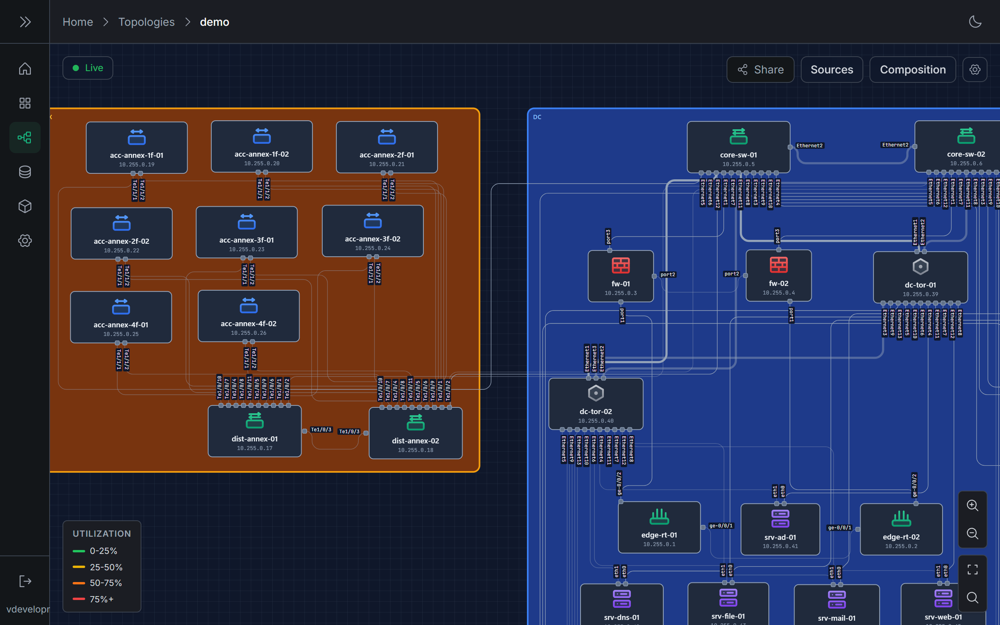
  

<!--
画像指示（表紙）: 題材＝トポロジーを主役に。左にブランド（ロゴ symbol＋Shumoku＋タグ）、
右に実トポロジー（images/topology.png）が画面右へ bleed する product-hero 構図。eyebrow なし。
-->

---

## 開発メンバー

### Project Lead

- 佐伯 明俊 / Akitoshi Saeki　@konoe-akitoshi（Shumoku 作者）

### Maintainers

- Joichiro Hayashi　@jo16oh
- Koichi Hirachi　@csenet
- 黒猫　@jg1vxg
- nullpo7z　@nullpo7z

### Contributors

コントリビューションは DCO 方式で受け付けています。

<figure class="members-photo">
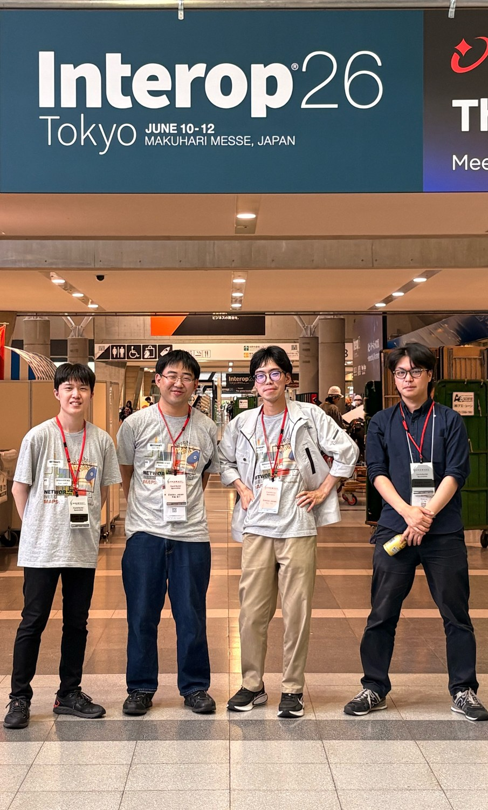
<figcaption>Interop 26 Tokyo（幕張メッセ）にて</figcaption>
</figure>

<!--
画像指示（開発メンバー）: 表紙直後。左=メンバーをリストで列挙（GOVERNANCE.md の公開情報）、右=チーム写真（Interop 26 Tokyo）。
写真は IMG_0305 を看板＋メンバーが入る構図でトリミング（images/member-interop.jpg）。
運営・ガバナンスの話は別途「OSS運営」スライドへ。個人名を伏せたい配布版では人数表記＋写真差し替え。
-->

---

## ネットワーク運用における課題

**情報は存在していても、運用に使える形で見えていない。**

  

    
Before

    
構成図の更新は手作業。監視アラートと実際の構成が結びつかず、障害時の影響範囲の把握や関係者への共有が、属人的になりやすい。

  

  
→

  

    
After

    
構成・状態・アラートを同じトポロジー上で把握でき、運用や関係者への共有に使える。

  

<!--
画像指示（課題）: Before=分断アイコン群（低彩度）/ After=収束トポロジー（緑アクセント）を各1点。
役割=1幕「なぜ（問題）」。ストーリー先頭。
-->

---

## ネットワークにも、地図が必要だ

**構成図を、描いて古くなる資料から、データに基づいて更新できる「運用の地図」へ。**

良い地図は、次の 3 つを満たします。

  
<h3>把握できる</h3>
全体像と接続関係が一目で読み取れる。

  
<h3>信頼できる</h3>
根拠となるデータソースが明確で、実態と照合できる。

  
<h3>更新できる</h3>
構成が変わったら、データから作り直せる。

ネットワークの構造をデータとして扱い、同じ入力から再現可能なトポロジーを生成します。

<!--
画像指示（地図）: 「同じ入力 → 同じ図が再生成」の小図 1 点（控えめ）。役割=1幕「気づき（あるべき姿）」。
技術語（NetworkGraph / diagram as code / SVG・HTML・PNG）は口頭 or 技術資料へ。
-->

---

## Shumoku とは

**ネットワーク情報を統合し、トポロジーとして可視化する OSS です。**

構成・監視・メトリクスなど、別々に存在する情報を解釈し、
機器・リンク・状態を、運用者が読みやすい一枚のトポロジーにまとめます。

  

    
情報源

    <small>構成情報 / 監視・メトリクス / インベントリ / カスタムデータ</small>
  

  
→

  
<b>Shumoku</b><small>統合・正規化・可視化</small>

  
→

  

    
運用ビュー

    <small>トポロジー / 状態表示 / アラート可視化 / 共有</small>
  

<!--
画像指示（とは）: この 3 段フロー図が主役 1 枚（CSS 内蔵済み）。
役割=2幕「解決（これが答え）」。問題→気づき の後の解決提示。立ち位置は次スライドが正本。
-->

---

## Shumoku が置き換えないもの

**Shumoku は、既存のネットワーク管理・監視システムを置き換えるものではありません。**

- IPAM / DCIM を置き換えない
- 監視システムを置き換えない
- ログ基盤を置き換えない
- ネットワーク自動化ツールを置き換えない

それらに蓄積された情報を **活用し**、運用者が理解しやすいトポロジービューとして
表示するための **可視化レイヤー** です。

<!--
画像指示（置き換えない）: レイヤー図（下:既存システム群 → 上:Shumoku 可視化レイヤーが半透明で乗る）を1点。
役割=2幕「立ち位置（何でないか）」。とは の直後で誤解を防ぐ。「置き換えない」はここが正本。
-->

---

## データからトポロジーができるまで

**外部データをそのまま描くのではなく、共通のトポロジーモデルに変換して可視化します。**

  

01

Collect

データソースから構成・状態情報を取得

  
→

  

02

Normalize

機器・ポート・リンク・グループを共通モデルへ

  
→

  

03

Map

複数ソースをノード・リンク・メトリクスに対応づけ

  
→

  

04

Layout

接続関係や階層をもとにトポロジーを生成

  
→

  

05

Visualize

状態・アラート・検索・共有を運用ビューに

複数のデータソースは同じモデル上で統合されます。拠点・WAN・階層を<strong>どう表すかは、元データのモデル化しだい</strong>です。

<!--
画像指示（できるまで）: 横 5 ステップのパイプライン（CSS 実装済み）。役割=2幕「どう図になるか」。
※ Server の使い方（操作）パイプラインとは別物。あちらは番号カード型で見た目を分けている。
-->

---

## ひとつのエンジン、複数のかたち

**Shumoku Core は、トポロジーを生成・描画する共通エンジン。その上に利用形態が乗ります。**

<table class="tbl">
  <thead><tr><th>利用形態</th><th>できること</th><th>主な用途</th></tr></thead>
  <tbody>
    <tr><td>Library / CLI</td><td>構造化データから図を生成</td><td>CI・ドキュメント生成・静的出力</td></tr>
    <tr><td>Editor</td><td>視覚的に構成を編集</td><td>図の作成・調整・部材整理</td></tr>
    <tr class="hot"><td>Server</td><td>状態・アラートを重ねて表示</td><td>運用ダッシュボード（<strong>運用の中心</strong>）</td></tr>
    <tr><td>Plugins / API</td><td>外部データと接続</td><td>既存システム連携・拡張</td></tr>
  </tbody>
</table>

いずれも同じ Core が土台。運用での利用では、主に <strong>Server</strong> が中心になります（次から）。

<!--
画像指示（エンジン）: スタック図（下:Core/Library+CLI を土台、上に Editor と Server、横に Plugin・API）推奨。
Server 行はハイライト済み。役割=2幕「複数の形」→ 次の Server へ橋渡し。
-->

---

<!-- _class: server -->

## Shumoku Server とは

**ネットワークの構成・状態・アラートを統合し、運用チームで共有できるライブトポロジーダッシュボードです。**

  

    
外部データソースから取得した構成・監視・メトリクス・アラートを、Core のエンジンが生成したトポロジーの上に重ねて表示します。

    
単なる静的な構成図ではなく、ネットワークの<strong>現在の状態</strong>を把握し、障害対応や情報共有に活用するための<strong>運用ビュー</strong>です。

  

  

    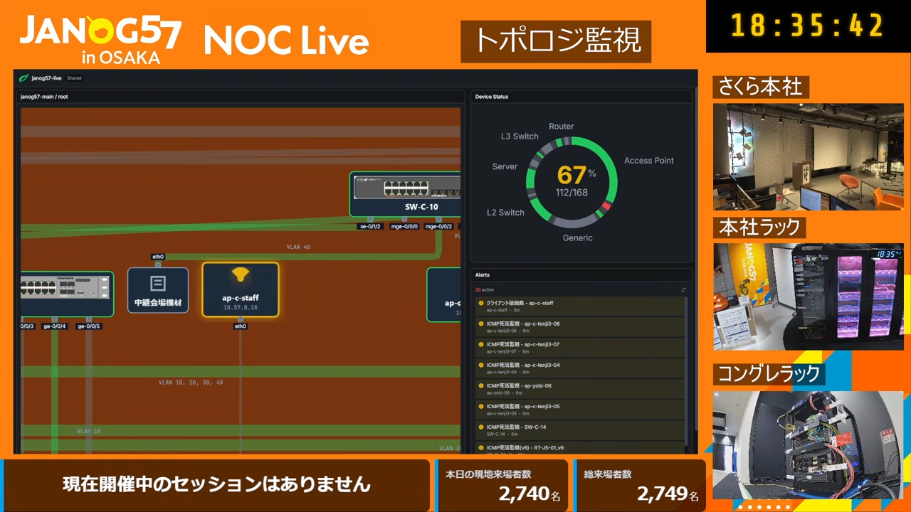
  

<!--
画像指示（Server とは）: 右に実 HP の運用ダッシュボード（images/dashboard.png＝NOC Live）。
左に説明。役割=3幕「生かす」の入口（法人価値の中心を宣言）。緑帯で Server セクションを示す。HP 公開済み画像。
-->

---

<!-- _class: server -->

## Server の基本的な使い方

**トポロジーを作って、データソースをつなぐだけ。数ステップで運用ビューになります。**

  

    <figure>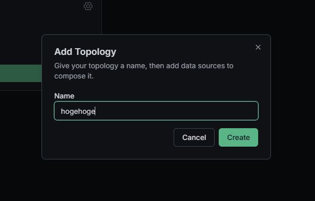<figcaption>① トポロジー作成</figcaption></figure>
    <figure>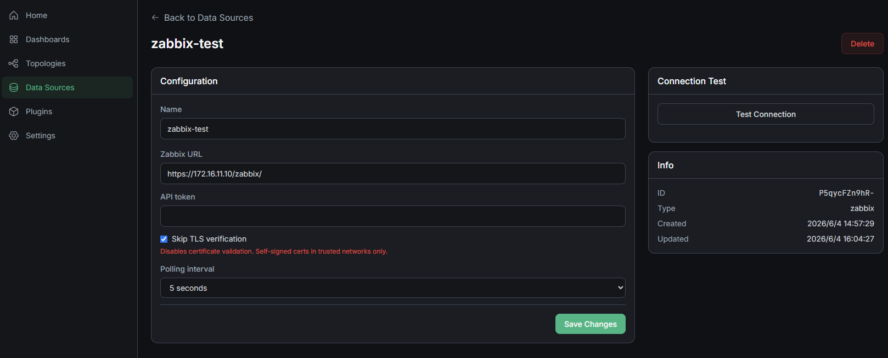<figcaption>② データソース登録</figcaption></figure>
    <figure>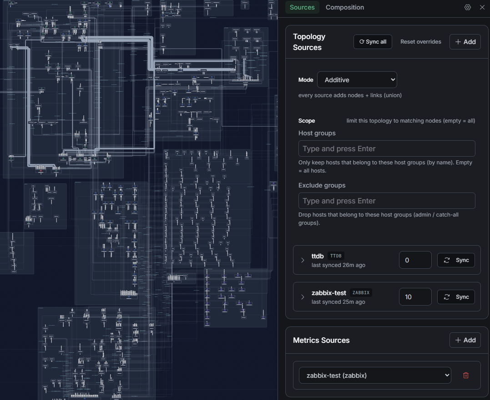<figcaption>③ ソースを追加</figcaption></figure>
    <figure>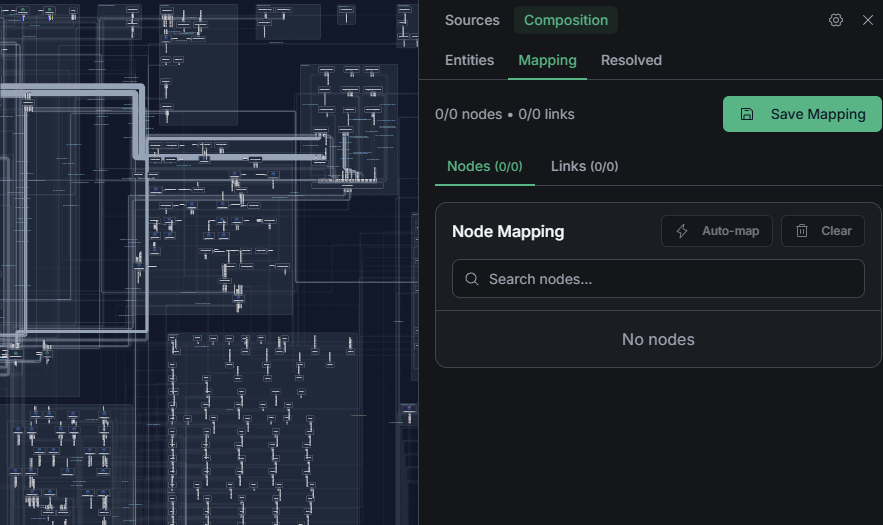<figcaption>④ Sync → マッピング</figcaption></figure>
  

  
→<small>運用へ</small>

  <figure class="result">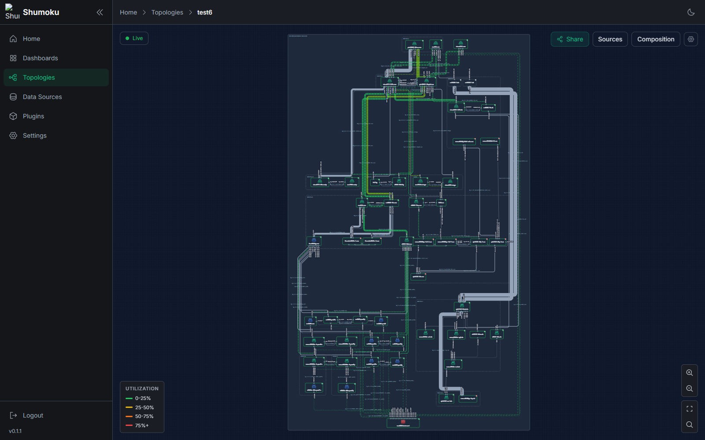<figcaption>⑤ 運用ビューが完成</figcaption></figure>

トポロジーを作成し、データソースを登録して追加。Sync で取り込み、マッピングすれば運用ビューになります。

<!--
画像指示（使い方）: 実画面フロー。順序は ①作成 ②登録 ③追加 →Sync→ ④マッピング ⑤完成。
①〜⑤ すべて実スクショ（images/ 配下: 00-create / 01-datasource / 02-add-source / 03-mapping / 04-result）。
④Sync は操作なので矢印ラベルで表現（写真不要）。トリミングは CSS の object-fit:cover ＋ object-position で非破壊。
役割=3幕「生かす＝使うのが楽」。すべて実機能。サンプルデータのみ。
-->

---

## トポロジー生成・可視化

**構造化データや外部データソースから、読みやすいネットワーク図を生成します。**

  

    <ul>
      <li>ノード・リンク・グループ構造で、ネットワーク全体を<strong>俯瞰</strong>できる</li>
      <li>手作業の構成図更新を減らし、データから<strong>繰り返し生成</strong>できる</li>
      <li>接続関係や階層構造をもとに、自動でレイアウトする</li>
      <li>900 種類以上のベンダーアイコンで、機器をひと目で見分けられる</li>
    </ul>
  

  

    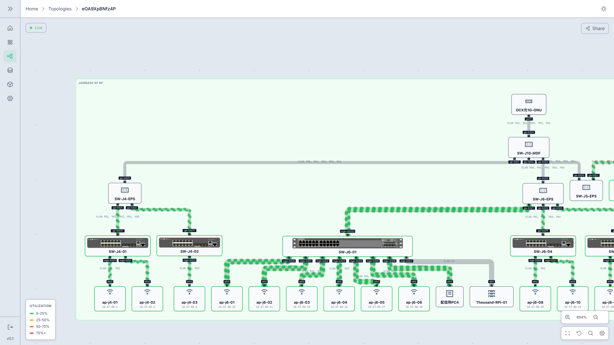
  

<!--
画像指示（トポロジー生成）: 右に実 HP ヒーロー（images/topology.png ＝ apps/docs/public/screenshots/
topology.png のコピー。4K・利用率ウェザーマップ込み）。左に要点。役割=4幕「機能ツアー」最初。
※旧 hero-diagram.png は未使用だったため不採用。自動レイアウトは「完璧」と言い切らない。
-->

---

## データソース連携・プラグイン

**特定のツールに閉じない、プラグインで広がる構造です。**

情報の取得元を「データソース」として扱い、プラグインを通じて同じトポロジーに接続します。

  Data Source Plugins 
  　├─ Topology　<small>構成・接続</small> 
  　├─ Inventory　<small>ホスト・機器</small> 
  　├─ Metrics　<small>流量・利用率</small> 
  　└─ Alerts　<small>アラート・状態</small>

連携先の種別: IPAM / DCIM、監視システム、メトリクス基盤、独自インベントリ、カスタム API。
具体的な対応ソフトと、扱える情報は付録の対応表に記載しています。

<!--
画像指示（データソース）: プラグイン構造（CSS ツリー）が主役。清書するなら横フロー
（左:各ソース → 中央:Plugins → 右:Core → トポロジー）。固有名は本文に出さず付録へ。役割=4幕。
-->

---

<!-- _class: server -->

## 構成・状態・アラートを結びつける

**構成情報と監視情報を、同じトポロジー上で扱います。**

  
<h3>構成</h3>
機器（ノード）/ ポート・インターフェース / リンク / 拠点・グループ

  
<h3>状態・メトリクス</h3>
ノード状態 / リンク状態 / 利用率（ノード・リンク単位）

  
<h3>アラート</h3>
主にホスト／ノード単位で、トポロジー上に位置づけ

どの粒度で紐づくかは、利用するデータソースの持ち方や運用設計に依存します。
監視システム固有の設定に踏み込まず、「アラートがネットワーク上のどこか」を見せることが狙いです。

<!--
画像指示（結びつける）: 構成（ノード/リンク/グループ）の上に状態色＋アラートマークが重なる小図。
役割=4幕（Server 文脈）。事実: alert は nodeId（ホスト/ノード）。IF/リンク/グループ単位は主張しない。
-->

---

<!-- _class: server -->

## 状態・アラート可視化

**監視・メトリクス・アラートをトポロジーに重ね、「どこで起きているか」を示します。**

  <figure>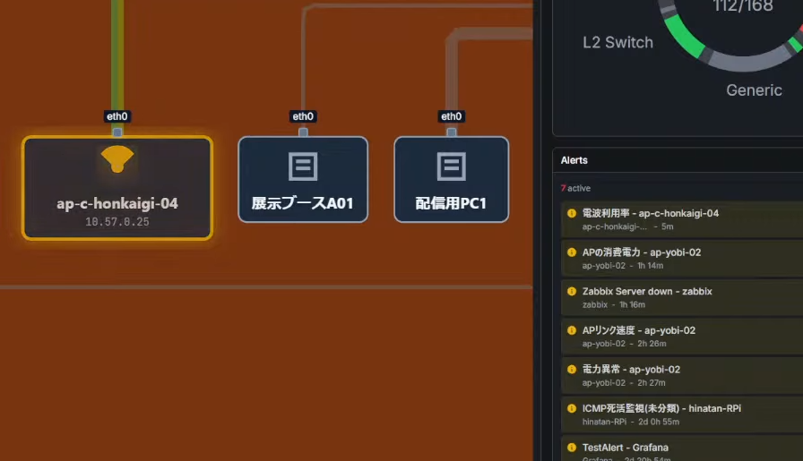<figcaption>アラート箇所をトポロジー上でハイライト</figcaption></figure>
  <figure>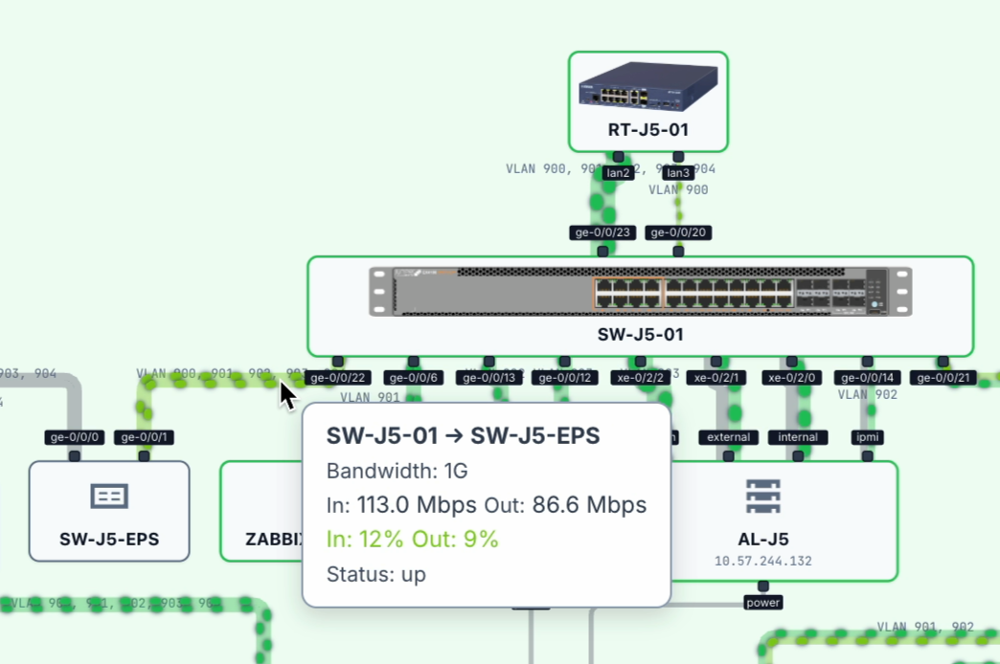<figcaption>リンク利用率を色分け（ウェザーマップ）</figcaption></figure>

アラート一覧では分かりにくい<strong>位置関係・影響範囲</strong>が見えます。状態は定期的またはリアルタイムに反映し、
障害時の初動や関係者への説明に使えます。

<!--
画像指示（Server 状態・アラート）: 実 HP 画像 2 枚（alert.png＝アラートハイライト＋一覧 /
weathermap.png＝利用率のツールチップ）。役割=4幕の山場。HP 公開済み画像。
-->

---

## 検索・探索と出力

**大規模ネットワークでも、目的の機器へ素早くたどり着き、図を持ち出せます。**

  

    <ul>
      <li><strong>検索・探索</strong> — 機器名・ラベルでノードを検索し、該当箇所と関連リンクをハイライト。パン・ズームで多層構成を探索でき、障害時の特定や画面共有での説明に役立つ。</li>
      <li><strong>出力</strong> — <strong>SVG / HTML / PNG</strong> で出力し、資料化・共有・Web ページへの組み込みに活用できる。</li>
    </ul>
  

  

    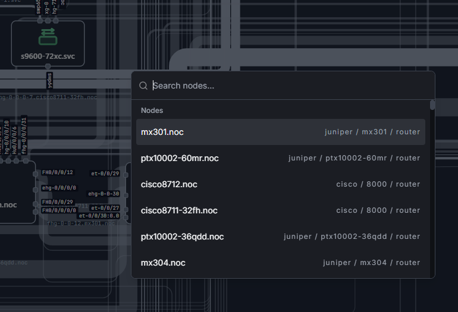
  

<!--
画像指示（検索・出力）: 右に検索パレットの実画面（images/search-crop.png＝search.png をトリミング）。左に要点。役割=4幕。
検索/ハイライト・出力ともに実装済み。※ホスト名が写る点は留意（公開可否は要判断）。
-->

---

## 想定ユーザーと使いどころ

**ネットワークの状態を、関係者が同じ画面で理解できるように。**

  
<h3>日常</h3>
全体像をいつでも把握し、チームで同じ地図を共有する。

  
<h3>障害時</h3>
影響範囲を素早くつかみ、初動と関係者への説明に使う。

  
<h3>変更時</h3>
構成変更の前後を確認し、関係者と認識を合わせる。

  
<h3>共有</h3>
経営層・他部署・拠点へ、読み取り専用で状況を伝える。

想定ユーザー: 情シス部門 / ネットワーク運用・NOC / 拠点ネットワークを管理する組織 /
イベントネットワーク運用 / OSS で可視化基盤を作りたい組織。

<strong>使用実績</strong>　JANOG57 NOC ・ 電気通信大学 情報基盤センター ・ JAWS DAYS 2026 NOC ・ Cloud Native Kaigi NOC

<!--
画像指示（使いどころ）: 各カードに小アイコン（日常=マップ/障害時=警告/変更時=差分/共有=リンク）。
役割=5幕（広がり）。機能の再掲ではなく「いつ・誰が」を見せる。
使用実績は専用スライドにせず、このスライドに 1 行で差し込む（社会的証明）。固有名は公開済みのもののみ。
「導入」だと製品配備・営業寄りになるため「使用」とする。
-->

---

## オープンソースとして開発・公開

**Shumoku は AGPL-3.0 の OSS として公開されています。**

継続的に開発・改善していくため、運営・セキュリティ・貢献の枠組みを整備しています。

  
<h3>運営の透明性</h3>
GOVERNANCE / SUPPORT / CONTRIBUTING / Code of Conduct / ROADMAP を公開。DCO 方式で貢献を受け入れ。

  
<h3>セキュリティ</h3>
SECURITY.md と非公開の報告窓口。CodeQL・Dependabot・Secret scanning を活用。

  <b>AGPL-3.0</b>
  <b>OpenSSF Best Practices</b> passing
  CodeQL
  Dependabot
  GitHub Discussions

運営方針・脆弱性報告・貢献ルール・サポート方針を公開し、継続的に開発・改善できる体制を整えています。

<!--
画像指示（OSS）: GitHub README 上部（バッジ列が見える範囲）のスクショ 1 枚を右側に。
役割=5幕「信頼」。Scorecard の数値（6.8）は公開資料には出さない。
-->

---

## 今後の方向性

**より柔軟で、運用に使いやすいネットワーク可視化基盤へ。**

  
<h3>Now</h3>
Server: ベータ提供中

トポロジー生成・可視化 データソース連携 CLI / Editor / Server OSS 運営整備

  
<h3>Next</h3>
Server 正式版 v1.0 を目指す 2026年9月目処（目標）

状態・アラート可視化の強化 レイアウト調整・保持 拠点・広域接続の表現 機器種別・ロールに応じた表現

  
<h3>Future</h3>
v1.0 以降

運用ダッシュボードの高度化 プラグイン API の安定化 長期運用に向けた保守体制

時期は目標であり、実装や提供を約束するものではありません（Planned / Under consideration）。最新は ROADMAP.md を参照。

<!--
画像指示（今後）: 3 列の上に左→右の進行タイムライン帯 1 本。役割=5幕。
特定顧客の懸念（手動レイアウト/アイコン/WAN）は Next にロール表現・広域表現として吸収。
-->

---

<!-- _class: lead close -->
<!-- _footer: "" -->

# ネットワークの“今”を、 共有できるトポロジーへ

分散したネットワーク情報を統合し、構成・状態・アラートをトポロジーとして可視化。 
既存システムを置き換えず活用する、AGPL-3.0 のオープンソース。

  
  

    github.com/konoe-akitoshi/shumoku
    contact@shumoku.dev
  

<!--
画像指示（まとめ）: 表紙と対のブックエンド。大見出し＋一文＋区切り線の下にワードマーク（左）と連絡先（右）。
ロゴは横長ワードマーク（logo-horizontal）を主役に。役割=回収。
-->

---

<!-- _class: appendix -->

## 付録 A ｜ 機能一覧と状態

<table class="tbl">
  <thead><tr><th>分類</th><th>機能</th><th>説明</th><th>状態</th></tr></thead>
  <tbody>
    <tr><td>可視化</td><td>トポロジー生成</td><td>ノード・リンク・グループを図として表示</td><td>利用可能</td></tr>
    <tr><td>可視化</td><td>自動レイアウト</td><td>接続関係に基づいて自動配置</td><td>改善中</td></tr>
    <tr><td>状態表示</td><td>メトリクス／ウェザーマップ</td><td>利用率などを地図に重ねて表示</td><td>利用可能</td></tr>
    <tr><td>状態表示</td><td>アラート可視化</td><td>異常箇所をトポロジー上でハイライト</td><td>利用可能（改善中）</td></tr>
    <tr><td>探索</td><td>検索・ハイライト</td><td>機器名やラベルで検索</td><td>利用可能</td></tr>
    <tr><td>連携</td><td>データソースプラグイン</td><td>外部システムから情報取得</td><td>一部利用可能</td></tr>
    <tr><td>出力</td><td>SVG / HTML / PNG 出力</td><td>図をファイル出力</td><td>利用可能</td></tr>
    <tr><td>共有</td><td>読み取り専用リンク（Server）</td><td>関係者へ共有</td><td>利用可能</td></tr>
    <tr><td>拡張</td><td>REST API</td><td>外部システム連携</td><td>利用可能</td></tr>
  </tbody>
</table>

凡例: 利用可能 改善中／一部 今後　（状態は時点情報。公開前に要確認）

<!--
画像指示（付録A）: 表が主役・画像なしで可（方針の例外）。
状態ラベルは公開前に確認・確定。特定顧客の懸念（手動レイアウト/アイコン/WAN/Zabbixアラート/操作感）は
盛りすぎず、必要なら「改善中／今後」に倒す。
-->

---

<!-- _class: appendix -->

## 付録 B ｜ データソース別の対応情報

| 連携例 | 構成 | ホスト | メトリクス | アラート | 状態 |
|---|:--:|:--:|:--:|:--:|---|
| NetBox（IPAM / DCIM） | ● | ● | | | 利用可能 |
| Zabbix（監視） | ● | ● | ● | ● | 利用可能 |
| Prometheus（メトリクス） | | ● | ● | ● | 実装による |
| Grafana | | | | ● | 実装による |
| Aruba Instant On | | ● | ● | ● | 実装による |
| ネットワーク探索（SNMP/LLDP） | ● | | | | 実装による |
| Custom Plugins | 個別 | 個別 | 個別 | 個別 | 個別対応 |

プラグインごとに扱える情報は異なります（種別を抽象化した概要）。「実装による」はプラグイン実装状況に依存（公開前に要確認）。
ネットワーク探索はインベントリ無しでも SNMP/LLDP のシード探索で構成を発見します。

<!--
画像指示（付録B）: 表が主役・画像なしで可（方針の例外）。技術者向け付録なので固有名を出してよい。
-->

---

<!-- _class: appendix -->

## 付録 C ｜ 説明者用メモ（個別質問 → 本編での扱い）

<table class="tbl">
  <thead><tr><th>個別の質問</th><th>本編での扱い（個別回答に寄せない）</th></tr></thead>
  <tbody>
    <tr><td>手動レイアウト調整</td><td>付録A で自動レイアウトを<strong>改善中</strong>と明示／「今後 — レイアウト調整・保持」</td></tr>
    <tr><td>同期時の再レイアウト</td><td>本編では触れず、「今後 — レイアウト調整・保持」＋付録Aで扱う</td></tr>
    <tr><td>デバイスアイコン</td><td>「今後 — 機器種別・ロールに応じた表現」として扱う</td></tr>
    <tr><td>WAN / 拠点間接続</td><td>「データからトポロジーができるまで（モデル化）」＋「今後 — 拠点・広域の表現」</td></tr>
    <tr><td>アラート表示</td><td>「構成・状態・アラートを結びつける」「状態・アラート可視化」で説明</td></tr>
    <tr><td>操作感</td><td>「検索・探索／パン・ズーム」で説明（操作性は改善中）</td></tr>
  </tbody>
</table>

個別機能の可否でなく「その質問をした理由＝何を確認すべきか」に答える方針。固有ツール名・SLA・価格は口頭/別資料へ。

<!--
画像指示（付録C）: 表が主役・画像なし。説明者（プレゼン側）向けの内部メモ。配布版では削除も可。
-->
