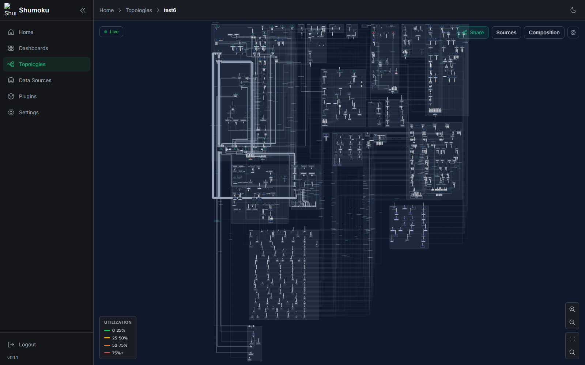
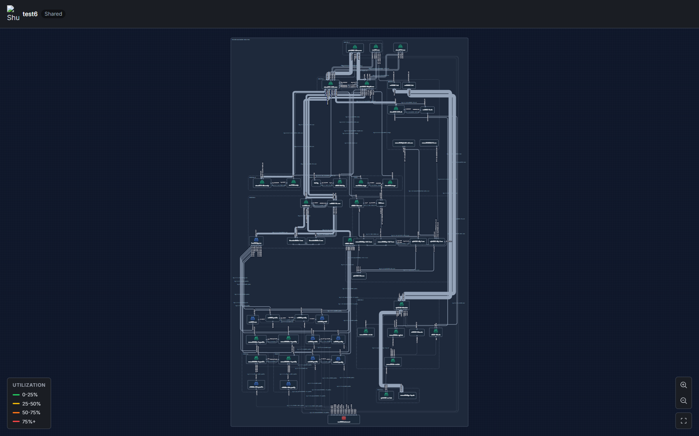

# Interop Tokyo / ShowNet 可視化 — 報告書

| 項目 | 内容 |
|---|---|
| 宛先 | ShowNet Zabbix 運用チーム |
| 作成日 | 2026-06-29 |
| 対象トポロジー | TTDB `FPHUYXQwwAn-`（ShowNet / Interop Tokyo）、サーバ表示名 "test2" |

---

## 0. サマリ

- ShowNet の構成 DB（TTDB）と Zabbix を取り込み、**数百ノード規模のトポロジーを 1 枚の図として自動レイアウト・描画**できることを実データで検証した（同期総数 約 776 ノード、うち実トポロジー 約 291 ノード / 約 429 リンク）。
- **Zabbix は LLDP-MIB / IF-MIB / sysmaps を介して有効に活用できた**。Zabbix がコレクタとして機能するため、Shumoku から各機器への直接 SNMP 到達は不要で、LLDP アイテムだけから node↔node リンクを復元できた。
- 一方で **会期中、Shumoku Server から ShowNet Zabbix の API（`/api_jsonrpc.php`）へ毎時 2〜5 万件の過大なアクセスを発生させ、運用チームより負荷の指摘をいただいた**。原因はコード調査により特定済みで、対策（購読スコープ化・周期見直し・バッチ化）も設計済み。詳細は §4.3 に記載する。本件についてはご迷惑をおかけしたことをお詫びする。
- 構成図の骨格は **リンク（LLDP / 配線）から導出可能でハードコード不要**であることを実データで確認した（`.noc` が接続次数 157・約 24Tbps の明確なハブとして自然に浮かぶ等、§5）。

---

## 1. 利用した総ノード数

| 区分 | 数 | 補足 |
|---|---|---|
| TTDB から同期した総ノード数 | **約 776 ノード** | ShowNet 機器インベントリ全体 |
| うち接続（リンク）を持つ実トポロジー | **約 291 ノード** | 実際に図の骨格を成す部分 |
| リンク数 | **約 429 本**（うち 428 本に帯域 `rateBps`） | LLDP / 配線から導出 |
| ドメイン被覆率 | 接続ノードの **95.5%** | `.noc` `.dc` `.svc` 等のホスト名サフィックス＝機能領域 |

- 残り（非接続の約 485 ノード）は **パッチパネル・TAP 専用機材などインベントリ上のプレースホルダ**で、人手の構成図にも描かれない種類のもの。
- デモ／検証用の "test2" は 5 ドメイン（dc / noc / 5g / svc / mgmt）に絞った表示とした。
- 規模感: 数百ノード規模のグラフを 1 枚のトポロジーとして自動レイアウト・描画できることを確認した。

---

## 2. 対応日数と工程

**期間: 2026/05/19 ごろ 〜 06/13–14（実 working 約 3.5 週間）**

| 時期 | 工程 | 主な内容 |
|---|---|---|
| 5/19–23 | データ取得基盤 | トポロジー Discovery 設計、Discovery タブ（機器を「掴む」UI）、SNMP/LLDP 探索 |
| 6/3 | プラグイン契約統一 | plugin-kit / plugin-sdk、registerDescriptor、共通化（Zabbix / NetBox / Prometheus 等） |
| 6/3–4 | 共有・大規模レイアウト | 共有リンクのトークンスコープ化、compound（コンテナ）レイアウト新規実装 |
| 6/5 | **Zabbix 取り込み** | sysmaps + hosts + LLDP neighbor → nodes/links、SNMP/LLDP でリンクのインターフェース解決 |
| 6/6–9 | 合成・範囲指定 | Composition store（メトリクス binding）、Scope（範囲）、Mode（合成モード） |
| 6/8–9 | 共有のセキュリティ | 共有リンクからのデータ漏洩 P0 修正、メトリクス projection |
| 6/9–12 | レイアウト品質 | v3 / composite zone / octilinear ルータ、ポート・ラベルを第一級幾何へ、comb バス配線（交差 156→97 等） |
| 6/11 | 性能・運用 | サーバ側レイアウト bake（Worker, stale-while-revalidate）、Sync-all ジョブ化（進捗モーダル） |
| 6/12 | 堅牢化 | レイアウト制約レジストリ、box 重なりを BLOCKING 化、signal streams M0 |
| （並行） | TTDB プラグイン | `shumoku-plugin-ttdb`（別リポジトリ）: TTDB DCIM → トポロジー変換、`rateBps` 付与 |

**工程をざっくり 4 段で:**

1. **データ取得**（TTDB / Zabbix 同期・掴む）
2. **合成**（複数ソース統合・Scope / Mode）
3. **レイアウト**（compound / composite・配線ルーティング）
4. **共有・運用ビュー**（share / weathermap / metrics）

---

## 3. 画面例（スクリーンショット）

> いずれも実機器名が写るため、**ShowNet / Interop チーム内向けは可、外部公開時はマスク**のこと。

**図 1. ShowNet 全体トポロジー（依存 tier の全体ビュー、6/12 時点の最新）**

**図 2. ゾーン別レイアウト＋利用率表示（composite zone + weathermap、Scope 枠つき）**

**図 3. 共有（read-only）ビュー**

> 上記のほか、6/9–12 の各レイアウト反復のスクショ（`tmp-test6-*`）が手元にある。必要であれば追加で提供可能。

---

## 4. Zabbix の利用内容と課題

**検証環境: ShowNet Zabbix 7.0.23（`zabbix-test`）**

### 4.1 利用した機能

- **LLDP-MIB**（`1.0.8802.1.1.2.*`）を SNMP walk で収集し、`lldp.rem.sysname` / `lldp.rem.port.id` / `lldp.rem.chassisid` 等の dependent item として保持。
  → **これだけで node↔node リンクを復元**できた。Zabbix がコレクタとして機能するため、Shumoku から各機器への直接 SNMP 到達は不要。
- **IF-MIB**（`ifSpeed` / `ifInOctets` / `ifOutOctets`）→ リンク帯域＋ライブ利用率（weathermap）。
- **Zabbix sysmaps**（`map.get`、標準機能）をトポロジーソースとして取り込み。
- host inventory（ホスト一覧）、host-group 名（Scope に利用）、メトリクス、アラート。

### 4.2 情報の不足点・課題

- **Zabbix にネイティブのトポロジー / リンクオブジェクトが無い** → LLDP アイテムから導出する必要がある（本対応で導出を実装）。
- **LLDP テンプレートのアイテムキー命名がベンダ系統ごとに不揃い**（ifName / ifIndex / マクロ混在）→ リンク結合に堅牢な戦略が必要。キー接頭辞を設定可能／自動検出にする方針。
- **TTDB（構成 DB）側のデータギャップ**（Zabbix ではなく上流データ起因だが、運用上の課題として併記）:
  - `.external` 層（最上位の IX: KDDI / JPIX / Optage 等）が **機材も配線も完全に不在**。
  - `.mon` / `.moip`（監視 TAP・メディアマルチキャスト）の **リンクが配線 DB に無い** → 図の下部に沈む。
  - 物理 location が **約 47% 空欄**、接続ノードの一部（13/291）はドメインサフィックス無し。
- **スケール課題**: 数百ノード規模でレイアウト計算が重い（最大 ~8 分）→ サーバ側 Worker bake + stale-while-revalidate で緩和。

### 4.3 【重要】Zabbix API への高負荷について

会期中に運用チームよりご指摘いただいた API 負荷について、事象・原因・対策を以下に報告する。**ご迷惑をおかけしたことをお詫びする。**

**事象**

会期中（6/4 18 時頃〜会期終了）、Shumoku Server（`172.16.11.17` / `zabbix-shumoku1.mon`）から ShowNet Zabbix への API アクセスが常時 **毎時 2〜5 万件** と過大になり、Zabbix 運用チームから負荷の指摘を受けた。

**原因**（コード調査で特定済み）

メトリクス取得ループが、次の 3 要素の掛け算で `/api_jsonrpc.php` への小さな JSON-RPC リクエストを大量・連続発生させていた。

1. **対象が無制限** — 閲覧中かどうかに関わらず全トポロジーを毎周期ポーリングしていた。
2. **周期が短い** — ポーリング周期の既定値が 5 秒。
3. **粒度が 1 件ずつ** — ノード死活は 1 ホストにつき 2 本（`item.get` + `host.get`）、リンク利用率は 1 リンクにつき 1〜2 本を個別発行しており、バッチ化していなかった。

→ 1 周期あたり概算 **2×ノード数 + 1〜2×リンク数** 本 × 全トポロジー × 周期。nginx アクセスログはこの 1 リクエスト＝1 カウントなので、観測値と整合する。

> 補足: Shumoku は Zabbix Web UI には一切アクセスしておらず、叩くのは `/api_jsonrpc.php` のみ。

**評価**

機能としては正しく動作したが、**大規模・常時運用での API 負荷設計が不足**していた。本件は既知の性能課題として設計ドキュメント（`apps/server/docs/design/performance-scaling.md`）に記録済み。

**対策（設計済み・実施予定）**

- 閲覧中トポロジーのみポーリング（WebSocket 購読スコープ化）— 最大効果・低リスク
- ポーリング周期の既定値見直し（5s → 30〜60s）
- API 呼び出しのバッチ化（`item.get hostids:[全マップ]` に集約、**2N 本 → 約 2 本**）

→ これらで API リクエスト数を **1〜2 桁削減**する見込み。

**次回運用への反映**

大規模環境では事前にポーリング周期・対象スコープを保守的に設定し、監視対象側（Zabbix）の負荷も観測しながら段階的に導入する。

---

## 5. その他・所見・残課題

- **構成図の骨格はリンクから導出可能（ハードコード不要）であることを実データで検証**した。`.noc` が「23 近隣ドメイン・接続次数 157・約 24Tbps」で明確なハブとして自然に浮かび、帯域勾配が人手 PDF の階層順をほぼ再現した。"all roads lead to NOC" がデータに表れている。
- 大規模・密結合グラフ向けに **新しい compound（コンテナ）レイアウトを実装**し、横長 strip 問題を解決した（幅 106k→17k、アスペクト 16→2、コアが上部に安定）。
- 副次的に、同期間に **OSS 整備**（プラグイン契約統一、共有リンクのデータ漏洩 P0 修正、signal streams 設計）も実施した。
- **残課題（運用最優先）**: メトリクスポーリングの API 負荷削減（§4.3。購読スコープ化＋周期見直し＋バッチ化）。
- **残課題（描画品質）**: 密コアの中央起点 / 放射状レイアウト（issue #345）、エッジルーティングの更なる洗練、TTDB / Zabbix のデータギャップ補完（外部 IX・監視 TAP の取り込み）。

---

## 付録 A. 数値の出どころ（検証メモ）

- ノード数・リンク数・ドメイン被覆率: 同期済みグラフに対する実測（作業期間中）。
- Zabbix 内訳: ShowNet Zabbix 7.0.23 に対する実検証（2026/06/05）。
- API 負荷の数値: 会期中の nginx アクセスログ（1 リクエスト＝1 カウント）に基づく実測。
- 工程・日付: git 履歴（PR #289〜#490 付近）に基づく。
